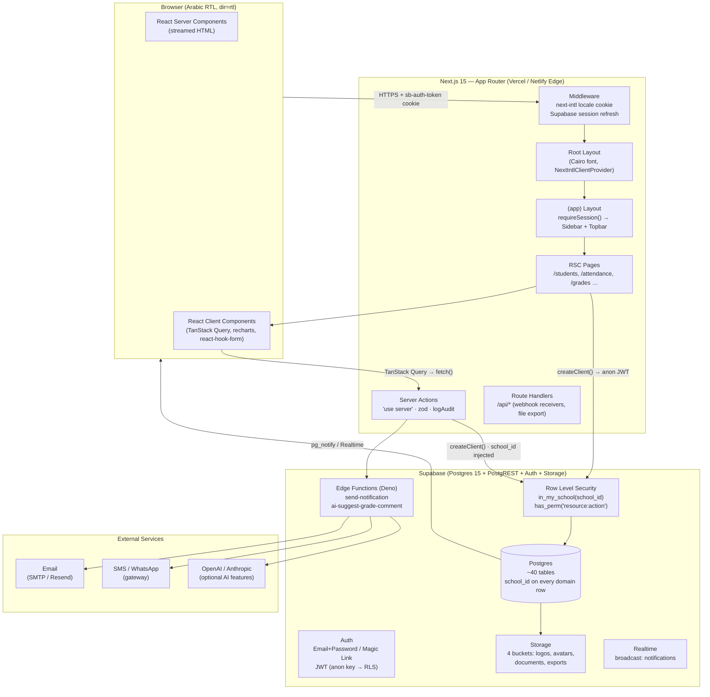
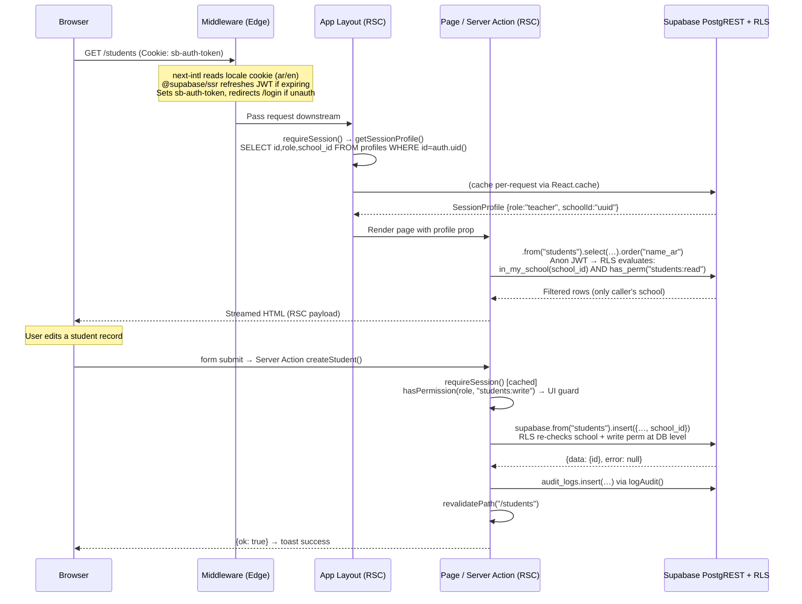
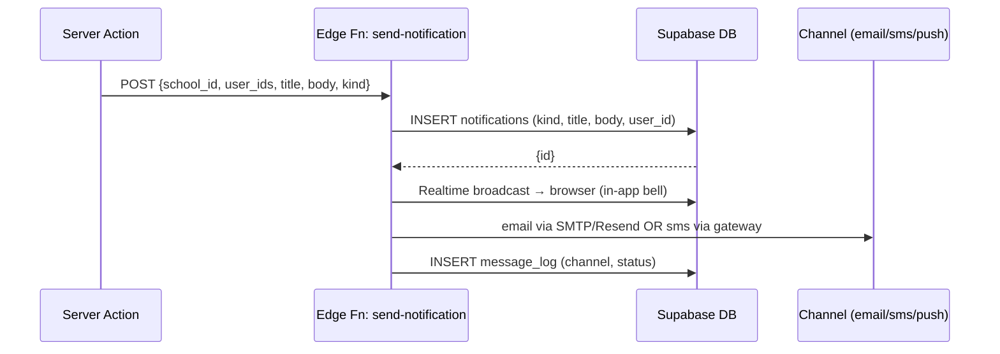
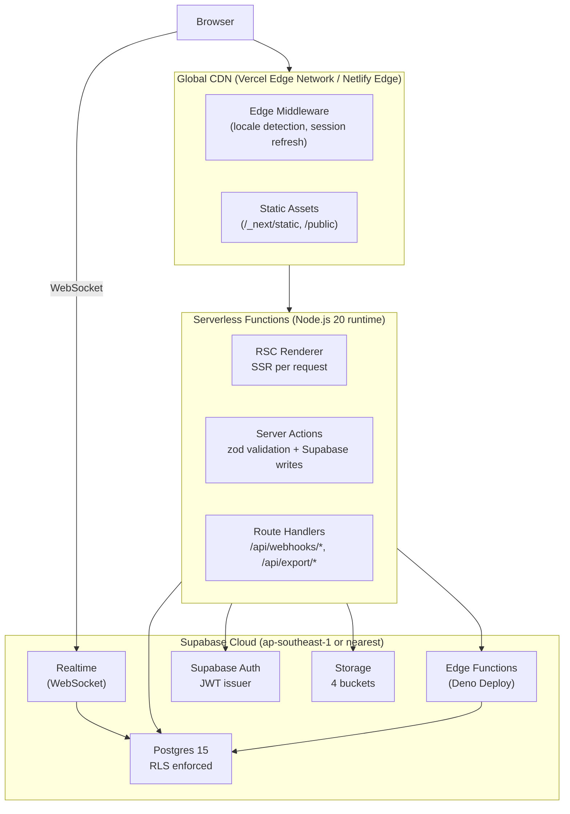

# Madrasati ERP — System Architecture

> **مدرستي** · Enterprise School ERP & Academic Management System  
> Arabic-first (RTL by default) · Multi-tenant SaaS · Next.js 15 + Supabase

---

## Table of Contents

1. [High-Level Component Diagram](#1-high-level-component-diagram)
2. [Request Lifecycle](#2-request-lifecycle)
3. [Technology Choices — Why Not NestJS?](#3-technology-choices--why-not-nestjs)
4. [Multi-Tenant Model](#4-multi-tenant-model)
5. [RBAC — Roles, Permissions, and the Dual-Layer Guard](#5-rbac--roles-permissions-and-the-dual-layer-guard)
6. [Database Schema Overview](#6-database-schema-overview)
7. [Storage Buckets](#7-storage-buckets)
8. [Edge Functions — Notifications & AI](#8-edge-functions--notifications--ai)
9. [Caching Strategy](#9-caching-strategy)
10. [Deployment Topology](#10-deployment-topology)
11. [Environment Matrix](#11-environment-matrix)
12. [Security Baseline](#12-security-baseline)
13. [Internationalisation & RTL](#13-internationalisation--rtl)

---

## 1. High-Level Component Diagram



---

## 2. Request Lifecycle

Every HTTP request follows this exact path through the stack:



### Key invariants

| Layer | What it enforces |
|---|---|
| Next.js Middleware | Session cookie refresh; locale selection; redirect unauthenticated to `/login` |
| `requireSession()` (`src/lib/auth.ts`) | Server-side identity; returns `SessionProfile` or `redirect("/login")` |
| `hasPermission()` (`src/lib/rbac.ts`) | TypeScript UI guard — hides actions the role cannot perform |
| Supabase RLS (`0005_rls_policies.sql`) | Database-level hard enforcement; cannot be bypassed by the application layer |
| `logAudit()` (`src/lib/audit.ts`) | Appends to `audit_logs`; best-effort, never blocks the user operation |

The double-check (TypeScript + RLS) is intentional: the TypeScript guard is a fast UI shortcut; the RLS policy is the security guarantee. Even a bug in application code cannot exfiltrate rows from another tenant.

---

## 3. Technology Choices — Why Not NestJS?

### The argument for Next.js 15 + Supabase

| Concern | NestJS + REST | Next.js 15 App Router + Supabase |
|---|---|---|
| **Server/client boundary** | Extra HTTP round-trip for every page load | RSC renders server data directly into HTML; zero client waterfall on cold load |
| **Auth & RLS** | Write and maintain middleware + guards in two places | Supabase JWT flows automatically into PostgREST; one `createClient()` call is the entire auth layer |
| **Type safety** | Manual DTOs, swagger codegen | `supabase gen types` (`npm run db:types`) produces `Database` types; all queries are end-to-end typed |
| **Server Actions** | Would need full REST endpoint, controller, DTO, service, repo | `"use server"` function + zod schema; co-located with the form it serves; no HTTP boilerplate |
| **Realtime** | Socket.io infra to run and scale | Supabase Realtime is hosted; subscribe with one import |
| **Arabic/RTL** | Framework-agnostic — no help | `next-intl` + `dir` on `<html>` + logical CSS; Cairo font (`next/font`) from Google with `subsets: ["arabic","latin"]` |
| **Deployment** | Requires running Node process, Docker | Next.js → Vercel/Netlify serverless; zero ops for a school system |
| **Operations footprint** | 2+ services (API server + frontend) | Single repo, single deployment target |

The main trade-off accepted: complex background jobs (bulk SMS, PDF generation) are offloaded to Supabase Edge Functions or scheduled cron jobs via Supabase's pg_cron extension rather than a persistent job queue.

---

## 4. Multi-Tenant Model

### Tenant root: `schools`

Every school is a row in `public.schools` (`id uuid`, `slug text unique`, `name_ar`, `name_en`, `theme jsonb`, …). The `slug` is used as a human-readable identifier; the `id` uuid is the foreign key propagated everywhere.

### Isolation pattern

Every domain table carries a non-nullable `school_id uuid` column that references `public.schools(id) ON DELETE CASCADE`. Examples:

```
students.school_id  → schools.id
staff.school_id     → schools.id
attendance_records.school_id → schools.id
audit_logs.school_id → schools.id   (nullable for system-level events)
```

This is not application-enforced partitioning — it is enforced at the RLS layer via the helper:

```sql
-- 0001_core_and_rbac.sql
create or replace function public.in_my_school(row_school uuid)
returns boolean language sql stable security definer as $$
  select public.is_super_admin() or row_school = public.current_school_id();
$$;
```

`current_school_id()` reads `profiles.school_id` for the authenticated JWT user. A user whose profile points to school A will never receive a row belonging to school B, regardless of what the application layer passes.

### Profiles and school binding

```
auth.users ──(trigger: on_auth_user_created)──► profiles
profiles.school_id → schools.id
profiles.role      → roles.key
```

The trigger `handle_new_user()` (migration 0001) auto-creates a `profiles` row from `raw_user_meta_data` at signup. Staff provisioned by an admin inherit the admin's `school_id`. A `super_admin` has `school_id = null` and the `is_super_admin()` function returns `true`, bypassing the school filter.

### Per-tenant branding

`schools.theme jsonb` stores a map of CSS custom property overrides (e.g. `{"--primary":"218 64% 23%"}`). `schools.logo_url`, `secondary_logo_url`, `stamp_url`, `signature_url`, and `login_bg_url` point to objects in the `logos` storage bucket. The `branding:write` permission controls who may modify these fields.

---

## 5. RBAC — Roles, Permissions, and the Dual-Layer Guard

### Roles (from `public.roles` / `src/lib/rbac.ts`)

| Key | Arabic | Typical grants |
|---|---|---|
| `super_admin` | مدير النظام | Wildcard `*` |
| `principal` | مدير المدرسة | All module reads + writes, `settings:write`, `users:manage` |
| `vice_principal` | وكيل المدرسة | Attendance write, observations write, no finance |
| `department_head` | رئيس قسم | Curriculum write, observations write, analytics read |
| `teacher` | معلم | Grades write, attendance write, curriculum write for own subjects |
| `activity_supervisor` | مشرف نشاط | Activities write, attendance write |
| `registrar` | مسؤول التسجيل | Students import/write/delete, classes write |
| `finance_officer` | مسؤول مالي | `finance:read`, `finance:write` |
| `auditor` | مدقق النظام | `audit:read`, `analytics:read`, `reports:read` |
| `student` | طالب | Read-only portal (grades, timetable, activities) |
| `parent` | ولي أمر | Read-only portal (grades, attendance, timetable, behavior) |

### Permission format

Permissions follow `resource:action` (e.g. `students:write`, `attendance:read`). The full list is defined identically in `public.permissions` (SQL) and `PERMISSIONS` array (`src/lib/rbac.ts`). The wildcard `*` granted to `super_admin` is checked as a string match.

### Guard flow

```mermaid
flowchart LR
    A[Request hits Server Action / Page] --> B{requireSession()}
    B -->|no session| C[redirect /login]
    B -->|SessionProfile| D{hasPermission\nTypeScript check}
    D -->|false| E[return {ok:false, error:'forbidden'}\nor redirect /dashboard]
    D -->|true| F[supabase.from...insert/select]
    F --> G{RLS policy\nin_my_school + has_perm}
    G -->|policy false| H[PostgREST returns 0 rows\nor policy error]
    G -->|policy true| I[Query executes]
```

The TypeScript `hasPermission()` in `src/lib/rbac.ts` is a performance optimization and UX signal (hides buttons). The Postgres `has_perm()` function in RLS is the authoritative security boundary.

---

## 6. Database Schema Overview

Applied in migration order under `supabase/migrations/`:

### 0001 — Core & RBAC

Establishes the multi-tenant foundation and all RBAC primitives:

- `schools` — tenant root; `theme jsonb`, `calendar text` (gregorian | hijri)
- `roles`, `permissions`, `role_permissions` — RBAC grant matrix
- `profiles` — one row per `auth.users`; `school_id`, `role`, `must_change_password`
- Helper functions: `current_school_id()`, `current_role()`, `is_super_admin()`, `has_perm(text)`, `in_my_school(uuid)`
- Trigger: `handle_new_user()` — auto-creates profile on signup

### 0002 — Academic Structure & People

The academic hierarchy and human entities:

```
schools
  └── academic_years  (unique index: only one is_current per school)
  └── school_stages   (مرحلة: Primary / Middle / High)
        └── grade_levels (صف)
              └── classes (فصل: capacity, class_teacher_id → staff)
                    └── students  (current_class_id → classes)
  └── departments → staff (head_id)
  └── subjects  (code unique per school, weekly_periods)
  └── teaching_assignments  (staff × subject × class × academic_year)
  └── guardians / student_guardians
  └── student_enrollments  (promotion history)
```

The `refresh_class_count()` trigger on `students` maintains `classes.student_count` automatically on `INSERT / UPDATE / DELETE`.

### 0003 — Daily Operations

- `attendance_records` — `unique(student_id, date)`; status: present | absent | excused | late | medical
- `grade_scales`, `assessment_types`, `assessments`, `grades` — layered grading model; `report_cards` stores frozen `data jsonb` snapshots
- `quran_surahs` (114 rows seed), `quran_memorization`, `quran_revisions` — Quran tracking with tajweed scores
- `curriculum_plans → curriculum_units → curriculum_lessons → curriculum_coverage`
- `behavior_records` — kind: positive | negative; points-based
- `rooms`, `periods`, `timetable_slots` — teacher conflict guard via unique index on `(staff_id, period_id, day_of_week)`
- `activities`, `activity_participants`, `activity_attendance` — summer clubs, camps, competitions
- `observations`, `observation_items` — pedagogical supervision workflow (draft → submitted → acknowledged)

### 0004 — Administration, Finance & Audit

- `report_templates` — JSON layout produced by the drag-and-drop designer; `kind`: report_card | certificate_quran | achievement | participation
- `announcements`, `notifications` (user-owned, streamed via Realtime), `message_log` (email | sms | whatsapp | push audit)
- Finance: `fee_structures → invoices → invoice_items`, `installments`, `payments` (method: cash | card | transfer | knet)
- `audit_logs` — `bigint identity` PK; indexed on `(school_id, created_at DESC)` and `(entity, entity_id)` for fast audit UI

### 0005 — RLS Policies

A single dynamic PL/pgSQL block iterates over 30+ tables and generates four policies per table (`_sel`, `_ins`, `_upd`, `_del`) using `in_my_school(school_id) AND has_perm('resource:action')`. Exceptions:

- `profiles` — own row OR same-school user with `users:manage`
- `notifications` — strictly `user_id = auth.uid()`
- `announcements` — all school members read; `communication:send` writes
- `audit_logs` — `audit:read` to select; any same-school user may append (insert)
- Child tables without `school_id` (e.g. `student_guardians`, `curriculum_units`) — scoped via a correlated subquery into the parent

---

## 7. Storage Buckets

Supabase Storage (S3-compatible) is used for all binary assets. Four buckets are planned:

| Bucket | Public? | Contents | RLS hint |
|---|---|---|---|
| `logos` | Yes (CDN) | `schools.logo_url`, `secondary_logo_url`, `stamp_url`, `signature_url`, `login_bg_url` | Read: public; Write: `branding:write` |
| `avatars` | Yes (CDN) | `profiles.avatar_url`, `students.photo_url` | Read: public; Write: own profile or `users:manage` |
| `documents` | No (signed URLs) | Uploaded worksheets, curriculum PDFs, observation attachments | School-scoped; signed URL generation requires authentication |
| `exports` | No (signed URLs) | Generated report PDFs, attendance exports (XLSX via `xlsx` package) | Ephemeral; pre-signed URL expires in 60 min |

Images served from `*.supabase.co` are whitelisted in `next.config.ts` via `images.remotePatterns` so `next/image` can optimize them.

---

## 8. Edge Functions — Notifications & AI

Supabase Edge Functions run on Deno Deploy at the edge, co-located with the database. They are invoked from Server Actions or by Postgres `pg_net` / `pg_cron` triggers.

### `send-notification`

**Trigger:** Called by Server Actions after events that require parent/staff notification (attendance recorded absent, grade below threshold, announcement published).

**Flow:**



The `notifications` table is user-owned (RLS: `user_id = auth.uid()`). Supabase Realtime pushes changes to the browser so the notification bell updates without polling.

The `message_log` table captures every outbound message (`channel`, `status`: queued | sent | failed, `error`) for school audit trails — readable by users with `reports:read`.

### `ai-suggest-grade-comment`

**Trigger:** Called on demand from the teacher's grade entry UI (optional feature).

**Flow:** Receives `{student_name, subject, scores, locale}` → calls OpenAI / Anthropic API → returns a suggested Arabic or English teacher comment for the `report_cards.comment` field. The teacher reviews before saving. No student PII leaves the server — only aggregate score data is sent to the AI provider.

---

## 9. Caching Strategy

### Per-request memoisation (React `cache`)

`getSessionProfile()` in `src/lib/auth.ts` is wrapped with `import { cache } from "react"`. Within a single render tree (a page + its nested layouts), the Supabase profile query runs exactly once and is shared across all components that call `requireSession()`.

### Next.js route caching

Pages that pull live operational data (attendance, grades) export `export const dynamic = "force-dynamic"` to opt out of the static cache. Reference data that rarely changes (academic_years, school_stages, grade_levels) can use the default Next.js 15 fetch cache with `revalidate: 3600`.

### TanStack Query (client-side)

Client components that need optimistic UI or frequent polling (e.g. the notification bell, real-time dashboards) use TanStack Query (`@tanstack/react-query ^5`). The `QueryClient` is configured in `src/components/providers.tsx`. Stale time defaults to 30 seconds for most resources.

### Supabase query optimisation

Performance-critical indexes already present in the migrations:

| Table | Index | Purpose |
|---|---|---|
| `attendance_records` | `(class_id, date)` | Daily attendance sheets |
| `attendance_records` | `(school_id, date)` | School-wide reports |
| `grades` | `(student_id)` | Student transcript |
| `audit_logs` | `(school_id, created_at DESC)` | Audit log pagination |
| `notifications` | `(user_id, read_at)` | Unread count badge |
| `students` | `(school_id)`, `(current_class_id)`, `(status)` | Filtered lists |

No separate Redis / Upstash layer is required at the current scale. If write throughput on `attendance_records` or `grades` grows (bulk batch entry for 1 000+ students), consider Postgres `COPY` via the service-role client (`createAdminClient()` in `src/lib/supabase/server.ts`) which bypasses RLS for trusted bulk operations.

---

## 10. Deployment Topology



### Vercel vs Netlify

Both are viable. Vercel has first-party Next.js support and is preferred for App Router edge middleware. Netlify is an acceptable alternative — the `@netlify/plugin-nextjs` adapter handles App Router. The choice does not affect Supabase integration.

**Recommended: Vercel** with the following configuration:

- Root directory: `/` (monorepo not used)
- Build command: `next build`
- Output: `.next` (auto-detected)
- Node.js version: 20.x
- Environment variables: see [Environment Matrix](#11-environment-matrix)

---

## 11. Environment Matrix

| Variable | dev | staging | prod | Notes |
|---|---|---|---|---|
| `NEXT_PUBLIC_SUPABASE_URL` | local Supabase (`localhost:54321`) | staging project | prod project | Set in `.env.local` for dev |
| `NEXT_PUBLIC_SUPABASE_ANON_KEY` | local anon key | staging anon key | prod anon key | Safe to expose; RLS enforces security |
| `SUPABASE_SERVICE_ROLE_KEY` | local service key | staging service key | prod service key | **Server-only.** Never expose to browser. Used in `createAdminClient()` for bulk import and user provisioning |
| `NEXT_PUBLIC_APP_URL` | `http://localhost:3000` | `https://staging.madrasati.app` | `https://madrasati.app` | Used for redirect URLs |
| `SMTP_HOST`, `SMTP_PORT`, `SMTP_USER`, `SMTP_PASS` | Mailpit (local) | Resend sandbox | Resend production | Consumed by the `send-notification` Edge Function |
| `OPENAI_API_KEY` (optional) | mock | real (low quota) | real | AI grade comment feature |

### Supabase project structure

| Project | Purpose |
|---|---|
| `madrasati-dev` (local CLI) | Developer machines; `supabase start` |
| `madrasati-staging` | Preview deployments; migrations tested here first |
| `madrasati-prod` | Production; migrations applied via `supabase db push --linked` after staging verification |

Migrations are applied in filename order (0001 → 0005) and are idempotent (`if not exists`, `on conflict do nothing`, `drop trigger if exists`). The `db:types` script regenerates `src/lib/database.types.ts` from the linked project after each migration.

---

## 12. Security Baseline

Security headers are set globally in `next.config.ts`:

```
X-Frame-Options: SAMEORIGIN
X-Content-Type-Options: nosniff
Referrer-Policy: strict-origin-when-cross-origin
Permissions-Policy: camera=(), microphone=(), geolocation=()
```

Additional hardening in place:

- **`SUPABASE_SERVICE_ROLE_KEY`** is only imported in `src/lib/supabase/server.ts → createAdminClient()` and must never be referenced in any `"use client"` file. The anon key is safe to expose (NEXT_PUBLIC_) because RLS limits what it can touch.
- **Server Actions** validate all input with zod (`studentSchema`, etc.) before touching the database. The RLS policy is a second independent validation at the DB layer.
- **`poweredByHeader: false`** in `next.config.ts` removes the `X-Powered-By: Next.js` header.
- **`serverActions.bodySizeLimit: "10mb"`** accommodates bulk Excel imports (processed by the `xlsx` package server-side) without allowing arbitrarily large payloads.
- **Audit trail** — every write Server Action calls `logAudit(action, entity, entityId, meta)`. The `audit_logs` table uses a `bigint generated always as identity` primary key (not UUID) so rows are append-only in insertion order and cannot be reordered.
- **`must_change_password` flag** on `profiles` — provisioned accounts are flagged; middleware redirects to a password-change screen on first login.

---

## 13. Internationalisation & RTL

### Setup

- `next-intl ^3` with `createNextIntlPlugin` in `next.config.ts`
- Locale is stored in a cookie (no locale path prefix — all routes are `/students`, not `/ar/students`)
- `src/i18n/request.ts` reads the cookie and returns the locale to the server
- Message catalogs: `src/messages/ar.json` (Arabic, default) and `src/messages/en.json`

### RTL rendering

```tsx
// src/app/layout.tsx
const dir = localeDir[locale] ?? "rtl";   // "rtl" for "ar", "ltr" for "en"
return <html lang={locale} dir={dir} …>
```

The Cairo font (`next/font/google`, subsets: `["arabic","latin"]`) is loaded once and applied via a CSS variable `--font-sans`.

Tailwind utility classes use **logical CSS** throughout the codebase:

- `ms-*` / `me-*` instead of `ml-*` / `mr-*`
- `ps-*` / `pe-*` instead of `pl-*` / `pr-*`
- `start-*` / `end-*` instead of `left-*` / `right-*`
- Toast position is `dir === "rtl" ? "bottom-left" : "bottom-right"` (`sonner` Toaster)

### Dates and calendar

`src/lib/dates.ts` provides `formatDate(date, locale, calendar)` using the native `Intl.DateTimeFormat` API. Schools that use the Hijri calendar set `schools.calendar = 'hijri'`; the formatter switches to `ar-SA-u-ca-islamic-umalqura` automatically. No external date library is required for calendar conversion.
