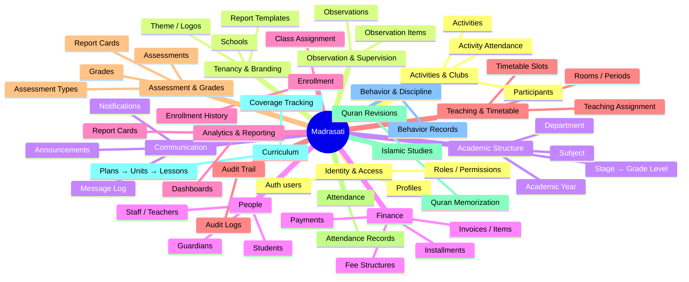

# Madrasati — Domain-Driven Design

> **Arabic name:** مدرستي &nbsp;|&nbsp; **Tagline:** نظام إدارة المدارس المتكامل  
> Document version: 2026-06-17 · applies to migrations 0001–0005

---

## Table of Contents

1. [Strategic Design — Bounded Contexts Overview](#1-strategic-design--bounded-contexts-overview)
2. [Context Map](#2-context-map)
3. [Bounded Contexts — Detailed Design](#3-bounded-contexts--detailed-design)
   - 3.1 [Identity & Access (IAM)](#31-identity--access-iam)
   - 3.2 [Tenancy & Branding](#32-tenancy--branding)
   - 3.3 [Academic Structure](#33-academic-structure)
   - 3.4 [People](#34-people)
   - 3.5 [Enrollment](#35-enrollment)
   - 3.6 [Teaching & Timetable](#36-teaching--timetable)
   - 3.7 [Assessment & Grades](#37-assessment--grades)
   - 3.8 [Attendance](#38-attendance)
   - 3.9 [Islamic Studies](#39-islamic-studies)
   - 3.10 [Curriculum](#310-curriculum)
   - 3.11 [Behavior & Discipline](#311-behavior--discipline)
   - 3.12 [Activities & Clubs](#312-activities--clubs)
   - 3.13 [Observation & Supervision](#313-observation--supervision)
   - 3.14 [Communication](#314-communication)
   - 3.15 [Finance](#315-finance)
   - 3.16 [Analytics & Reporting](#316-analytics--reporting)
   - 3.17 [Audit Trail](#317-audit-trail)
4. [Ubiquitous Language Glossary (Arabic ↔ English)](#4-ubiquitous-language-glossary-arabic--english)
5. [Cross-Cutting Concerns](#5-cross-cutting-concerns)

---

## 1. Strategic Design — Bounded Contexts Overview

Madrasati is a **multi-tenant** school ERP. The top-level tenant boundary is the **School** (`schools` table, `school_id` FK on every domain table). All domain behaviour is scoped within a school; a `super_admin` profile can cross school boundaries for platform administration.

The system is decomposed into **17 bounded contexts**. Each context owns its data, vocabulary, and invariants. Contexts communicate through shared identifiers (UUIDs) and, where ordering matters, through domain events or read-model projections.



---

## 2. Context Map

The diagram below shows how bounded contexts relate. Arrows indicate the direction of data flow / dependency. Relationship types follow DDD conventions: **OHS** = Open Host Service (shared DB read), **ACL** = Anti-Corruption Layer, **Shared Kernel** = tables referenced by multiple contexts, **Partnership** = coordinated release.

```mermaid
graph TD
    IAM["Identity & Access\n(IAM)"]
    TEN["Tenancy & Branding"]
    ACAD["Academic Structure"]
    PPL["People"]
    ENR["Enrollment"]
    TEACH["Teaching & Timetable"]
    ASSESS["Assessment & Grades"]
    ATT["Attendance"]
    ISL["Islamic Studies"]
    CUR["Curriculum"]
    BEH["Behavior & Discipline"]
    ACT["Activities & Clubs"]
    OBS["Observation & Supervision"]
    COM["Communication"]
    FIN["Finance"]
    ANA["Analytics & Reporting"]
    AUD["Audit Trail"]

    IAM -->|"provides auth.uid()\nShared Kernel: profiles"| TEN
    IAM -->|"Shared Kernel: profiles"| PPL
    IAM -->|"Shared Kernel: profiles"| ENR
    IAM -->|"recorded_by / created_by"| ASSESS
    IAM -->|"recorded_by"| ATT
    IAM -->|"assessed_by"| ISL
    IAM -->|"recorded_by"| CUR
    IAM -->|"recorded_by"| BEH
    IAM -->|"observer_id"| OBS
    IAM -->|"created_by"| COM
    IAM -->|"received_by"| FIN

    TEN -->|"school_id Shared Kernel"| ACAD
    TEN -->|"school_id Shared Kernel"| PPL
    TEN -->|"school_id Shared Kernel"| ENR
    TEN -->|"school_id Shared Kernel"| TEACH
    TEN -->|"school_id Shared Kernel"| ASSESS
    TEN -->|"school_id Shared Kernel"| ATT
    TEN -->|"school_id Shared Kernel"| ISL
    TEN -->|"school_id Shared Kernel"| CUR
    TEN -->|"school_id Shared Kernel"| BEH
    TEN -->|"school_id Shared Kernel"| ACT
    TEN -->|"school_id Shared Kernel"| OBS
    TEN -->|"school_id Shared Kernel"| COM
    TEN -->|"school_id Shared Kernel"| FIN

    ACAD -->|"grade_level_id, subject_id\ndepartment_id"| ENR
    ACAD -->|"subject_id, grade_level_id"| TEACH
    ACAD -->|"subject_id"| ASSESS
    ACAD -->|"grade_level_id"| FIN
    ACAD -->|"subject_id, grade_level_id"| CUR

    PPL -->|"student_id"| ENR
    PPL -->|"staff_id"| TEACH
    PPL -->|"student_id"| ASSESS
    PPL -->|"student_id"| ATT
    PPL -->|"student_id"| ISL
    PPL -->|"student_id"| BEH
    PPL -->|"student_id"| ACT
    PPL -->|"staff_id"| OBS
    PPL -->|"student_id"| FIN

    ENR -->|"class_id"| TEACH
    ENR -->|"class_id"| ATT
    ENR -->|"class_id"| ASSESS

    ASSESS -->|"gpa / average OHS"| ANA
    ATT -->|"attendance stats OHS"| ANA
    BEH -->|"points OHS"| ANA
    ISL -->|"memorization progress OHS"| ANA
    FIN -->|"payment stats OHS"| ANA
    OBS -->|"scores OHS"| ANA
    CUR -->|"coverage % OHS"| ANA

    ASSESS -->|"event: grade entered"| COM
    ATT -->|"event: absent"| COM
    BEH -->|"event: incident"| COM
    FIN -->|"event: invoice due"| COM

    AUD -.->|"append-only ACL"| IAM
    AUD -.->|"append-only ACL"| ASSESS
    AUD -.->|"append-only ACL"| ENR
    AUD -.->|"append-only ACL"| FIN
```



**Key relationships to call out:**

| Upstream | Downstream | Nature | Concrete linkage |
|---|---|---|---|
| Identity & Access | Every other context | Shared Kernel | `profiles.id` used as `recorded_by`, `created_by`, `observer_id`, `received_by` throughout all migrations |
| Tenancy & Branding | Every domain context | Shared Kernel | `schools.id` → `school_id` FK on every domain table; `in_my_school(school_id)` RLS helper |
| Academic Structure | Enrollment, Teaching, Assessment | OHS | `grade_levels.id`, `subjects.id`, `departments.id` referenced as stable identifiers |
| Enrollment | Teaching, Attendance, Assessment | OHS | `classes.id` is the operational unit that groups students, slots, and grading |
| Assessment & Grades | Analytics | OHS read-model | `report_cards` is a frozen snapshot consumed by Analytics without touching live grades |
| All operational contexts | Communication | Domain Events | Absence, grade entry, and behavior incidents trigger notifications |
| All contexts | Audit Trail | ACL (append-only) | `logAudit()` in `src/lib/audit.ts` is called from every server action; the Audit context never writes back |

---

## 3. Bounded Contexts — Detailed Design

### 3.1 Identity & Access (IAM)

**Purpose:** Authenticate users and enforce role-based access control. This is the cross-cutting security kernel — every other context trusts it.

**Aggregate: User Account**

| Element | Type | DB object | Notes |
|---|---|---|---|
| `UserAccount` | Aggregate Root | `auth.users` (Supabase managed) | UUID primary key = `profiles.id` |
| `Profile` | Entity | `public.profiles` | `id`, `school_id`, `email` (citext), `full_name`, `role`, `avatar_url`, `must_change_password` |
| `Role` | Value Object | `public.roles` | `key` (text PK): `super_admin`, `principal`, `vice_principal`, `department_head`, `teacher`, `activity_supervisor`, `registrar`, `finance_officer`, `auditor`, `student`, `parent` |
| `Permission` | Value Object | `public.permissions` | `key` format `resource:action` e.g. `students:write`, `*` wildcard for `super_admin` |
| `RolePermission` | Value Object | `public.role_permissions` | Junction (`role_key`, `permission_key`); the customizable grant matrix |

**Invariants:**
- A `Profile` must reference a valid `auth.users` row (FK with cascade delete).
- `role` is non-null and defaults to `'teacher'` on auto-creation via the `handle_new_user()` trigger.
- `must_change_password = true` is set when an admin creates an account; the UI gates the app until it is cleared.
- The `super_admin` role has a single `*` permission entry — `has_perm()` checks for either the exact permission or `*`.

**Domain Services (DB functions):**

```sql
public.current_school_id() → uuid      -- resolves caller's school from profiles
public.current_role()       → text     -- resolves caller's role
public.is_super_admin()     → boolean  -- true iff role = 'super_admin'
public.has_perm(perm text)  → boolean  -- checks role_permissions matrix
public.in_my_school(row_school uuid) → boolean  -- tenant isolation guard
```

All four are `SECURITY DEFINER` to prevent RLS recursion when policies call them.

**Application services:** `src/lib/auth.ts` — `getSessionProfile()` (cached per request), `requireSession()` (redirect-or-return). `src/lib/rbac.ts` — `hasPermission(role, perm)` for UI gating (never relied upon alone; DB enforces via RLS).

---

### 3.2 Tenancy & Branding

**Purpose:** Model each school as a fully isolated tenant with its own visual identity, calendar preference, and document templates.

**Aggregate: School**

| Element | Type | DB object | Notes |
|---|---|---|---|
| `School` | Aggregate Root | `public.schools` | UUID PK, `slug` (unique), `name_ar`, `name_en` |
| `BrandingAssets` | Value Object (embedded) | columns on `schools` | `logo_url`, `secondary_logo_url`, `stamp_url`, `signature_url`, `login_bg_url`, `banner_url`, `slogan_ar`, `slogan_en` |
| `Theme` | Value Object (embedded) | `schools.theme` (jsonb) | CSS custom-property map e.g. `{"--primary":"218 64% 23%"}` applied at login |
| `ContactInfo` | Value Object (embedded) | `schools` | `address`, `phone`, `email`, `website`, `principal_name` |
| `CalendarPreference` | Value Object | `schools.calendar` | `'gregorian'` or `'hijri'`; drives date formatting throughout `src/lib/dates.ts` |
| `ReportTemplate` | Entity | `public.report_templates` | `kind` ∈ `{report_card, attendance, certificate_quran, achievement, participation}`; `layout` jsonb drag-and-drop definition |

**Invariants:**
- `slug` is unique across all schools; used in tenant-routing and URL generation.
- Only one `ReportTemplate` per `(school_id, kind)` may have `is_default = true`.
- `is_active = false` schools block login (checked in middleware) without destroying data.
- `super_admin` alone may INSERT a school (`schools_ins` RLS policy).

**RLS surface:** `schools_sel` — authenticated user sees only their own school (or all if `super_admin`). `schools_upd` — requires `settings:write` or `branding:write`.

---

### 3.3 Academic Structure

**Purpose:** Define the time-bound, hierarchical organisational skeleton of a school year: years → stages → grade levels → departments → subjects. This is a **supporting domain** that other contexts reference but rarely modify.

**Aggregates:**

#### Academic Year (`academic_years`)
| Element | Type | Column(s) |
|---|---|---|
| `AcademicYear` | Aggregate Root | `id`, `school_id`, `name` (e.g. `2025/2026`), `start_date`, `end_date`, `is_current` |

Invariant: a partial unique index `academic_years_current_uq` on `(school_id) WHERE is_current` ensures at most one current year per school.

#### Stage & Grade Level
```
school_stages
  └── grade_levels (stage_id FK, sort_order)
```

| Element | Type | Column(s) |
|---|---|---|
| `SchoolStage` | Entity | `id`, `school_id`, `name_ar`, `name_en`, `sort_order` — e.g. ابتدائي / متوسط / ثانوي |
| `GradeLevel` | Entity | `id`, `stage_id`, `name_ar`, `name_en`, `sort_order` — e.g. الصف الأول / Grade 1 |

#### Department (`departments`)
| Element | Type | Column(s) |
|---|---|---|
| `Department` | Aggregate Root | `id`, `school_id`, `name_ar`, `name_en` |
| `DepartmentHead` | Role reference | `head_id → staff.id` (set after staff exists; deferred FK) |

#### Subject (`subjects`)
| Element | Type | Column(s) |
|---|---|---|
| `Subject` | Entity | `id`, `school_id`, `department_id`, `name_ar`, `name_en`, `code` (unique per school), `weekly_periods` |

Invariant: `subjects_code_uq` unique index on `(school_id, code)`.

---

### 3.4 People

**Purpose:** Maintain the identity and profile records for the human actors: staff (teachers and other roles), students, and guardians.

**Aggregate: Staff**

| Element | Type | DB | Notes |
|---|---|---|---|
| `Staff` | Aggregate Root | `public.staff` | `id`, `school_id`, `profile_id → profiles.id`, `employee_no`, `civil_id`, `name_ar`, `name_en`, `department_id`, `position`, `qualifications`, `experience_years`, `email`, `mobile`, `hire_date`, `status` ∈ `{active,inactive,archived}` |

`profile_id` links to the IAM context for login; a staff member may exist without a system login (set `profile_id = null`).

**Aggregate: Student**

| Element | Type | DB | Notes |
|---|---|---|---|
| `Student` | Aggregate Root | `public.students` | `id`, `school_id`, `student_no`, `ministry_no` (unique per school when set), `civil_id`, `name_ar`, `name_en`, `gender` ∈ `{male,female}`, `dob`, `nationality`, `religion`, `address`, `medical_notes`, `enrollment_date`, `status` ∈ `{enrolled,transferred,withdrawn,graduated,archived}`, `emergency_contact`, `current_class_id → classes.id` |
| `GuardianInfo` | Value Object (embedded) | columns on `students` | `father_name`, `mother_name`, `guardian_name`, `guardian_mobile`, `guardian_email`, `guardian_occupation` — denormalised fast access for class teachers |
| `Photo` | Value Object | `students.photo_url` | Supabase Storage URL |

Invariant: `students_ministry_uq` partial unique index on `(school_id, ministry_no) WHERE ministry_no IS NOT NULL` prevents duplicate ministry numbers within a school.

Trigger: `trg_student_class_count` (after INSERT/UPDATE/DELETE on `students`) calls `refresh_class_count()` to keep `classes.student_count` accurate without an extra query.

**Aggregate: Guardian**

| Element | Type | DB | Notes |
|---|---|---|---|
| `Guardian` | Entity | `public.guardians` | `id`, `school_id`, `profile_id → profiles.id`, `name`, `mobile`, `email`, `occupation` |
| `StudentGuardian` | Association | `public.student_guardians` | `(student_id, guardian_id)` PK, `relation` ∈ `{father,mother,guardian}`, `is_primary` |

A guardian may be linked to multiple students (siblings) and have a portal login via `profile_id`.

---

### 3.5 Enrollment

**Purpose:** Record and track which class a student belongs to in a given academic year, and maintain the full history of class assignments, promotions, and transfers.

**Aggregate: Enrollment**

| Element | Type | DB | Notes |
|---|---|---|---|
| `Enrollment` | Aggregate Root | `public.student_enrollments` | `id`, `school_id`, `student_id`, `class_id`, `academic_year_id`, `status`, `note`, `created_at` |
| `Class` | Entity (owned by this context) | `public.classes` | `id`, `school_id`, `academic_year_id`, `grade_level_id`, `name`, `capacity`, `class_teacher_id → staff.id`, `student_count` (computed), `status` ∈ `{active,archived}` |

**Class** acts as the operational container: it links an academic year, a grade level, a physical group of students, and an assigned teacher. It is the primary context for most daily-operations joins.

Invariant: `student_count ≤ capacity` is enforced at the application layer (the DB stores the current count via trigger; the form validates against it).

`students.current_class_id` is a **denormalised shortcut** to the active class for performance — it is kept consistent with the latest enrollment row by the registrar workflow.

---

### 3.6 Teaching & Timetable

**Purpose:** Assign teachers to (subject × class) combinations for an academic year, and lay out the weekly timetable of periods across rooms.

**Aggregate: TeachingAssignment**

| Element | Type | DB | Notes |
|---|---|---|---|
| `TeachingAssignment` | Aggregate Root | `public.teaching_assignments` | `(staff_id, subject_id, class_id, academic_year_id)` unique; `weekly_periods` |

**Aggregate: Timetable**

| Element | Type | DB | Notes |
|---|---|---|---|
| `TimetableSlot` | Entity | `public.timetable_slots` | `(class_id, period_id, day_of_week)` unique; `staff_id`, `subject_id`, `room_id` |
| `Period` | Value Object | `public.periods` | `label`, `start_time`, `end_time`, `sort_order` |
| `Room` | Entity | `public.rooms` | `name`, `capacity` |

Invariants:
- `timetable_teacher_uq` unique index on `(staff_id, period_id, day_of_week)` — a teacher cannot be scheduled in two rooms simultaneously.
- `(class_id, period_id, day_of_week)` unique — a class cannot have two subjects at the same slot.
- `day_of_week` is `0–6` (Sunday = 0) to accommodate the Arabic school week (Sun–Thu).

---

### 3.7 Assessment & Grades

**Purpose:** Define graded assessment items at the (class × subject × term) level, record individual student scores, map scores to letter grades via a configurable scale, and produce frozen report-card snapshots.

**Aggregates:**

#### GradeScale
| Element | Type | DB | Notes |
|---|---|---|---|
| `GradeScale` | Entity | `public.grade_scales` | `school_id`, `min_pct`, `max_pct`, `letter`, `gpa`, `label_ar` |

Per-school, fully customisable (e.g. 90–100 → A → 4.0 / ممتاز).

#### AssessmentType
| Element | Type | DB | Notes |
|---|---|---|---|
| `AssessmentType` | Entity | `public.assessment_types` | `name_ar`, `name_en`, `weight` (% contribution), `max_score`, `sort_order` |

Defines the weighting model: e.g. واجبات (15%), اختبار شفهي (10%), اختبار كتابي (75%).

#### Assessment
| Element | Type | DB | Notes |
|---|---|---|---|
| `Assessment` | Aggregate Root | `public.assessments` | `class_id`, `subject_id`, `assessment_type_id`, `term` (1–n), `title`, `max_score`, `date`, `created_by` |
| `Grade` | Entity | `public.grades` | `assessment_id`, `student_id`, `score`, `note`; unique per `(assessment_id, student_id)` |

#### ReportCard (snapshot)
| Element | Type | DB | Notes |
|---|---|---|---|
| `ReportCard` | Entity | `public.report_cards` | `student_id`, `academic_year_id`, `term`, `gpa`, `average`, `rank`, `comment`, `data` (jsonb frozen per-subject breakdown) |

`ReportCard.data` is an immutable snapshot produced at term-end by a server action that reads live grades, applies `grade_scales`, and serialises the result. Downstream analytics read `report_cards` rather than joining through `grades`, avoiding re-computation and protecting against retroactive edits.

---

### 3.8 Attendance

**Purpose:** Record daily presence or absence for every student in a class, with statuses covering common school scenarios.

**Aggregate: AttendanceRecord**

| Element | Type | DB | Notes |
|---|---|---|---|
| `AttendanceRecord` | Aggregate Root | `public.attendance_records` | `school_id`, `student_id`, `class_id`, `date`, `status` ∈ `{present,absent,excused,late,medical}`, `note`, `recorded_by → profiles.id` |

Invariant: `unique(student_id, date)` — one record per student per day; attempting to re-record replaces (upsert pattern in the server action).

Indexes: `att_class_date_idx` on `(class_id, date)` supports the primary use-case (view whole class on a day); `att_school_date_idx` on `(school_id, date)` supports school-wide dashboards.

Activity attendance (for extracurricular activities) is separate — see §3.12.

---

### 3.9 Islamic Studies

**Purpose:** Track Quranic memorisation progress and periodic revision sessions for each student — a domain specific to Islamic schools and an explicit design requirement of Madrasati.

**Aggregates:**

#### QuranMemorization
| Element | Type | DB | Notes |
|---|---|---|---|
| `QuranMemorization` | Aggregate Root | `public.quran_memorization` | `student_id`, `surah_number → quran_surahs.number`, `from_ayah`, `to_ayah`, `status` ∈ `{not_started,in_progress,memorized}`, `score`, `tajweed_score`, `assessed_by`, `assessed_at` |
| `QuranSurah` | Reference Entity | `public.quran_surahs` | `number` (1–114, PK), `name_ar`, `ayah_count` — seed data, immutable |

`tajweed_score` tracks recitation quality (التجويد) independently from mere memorisation — important for Islamic school evaluation rubrics.

#### QuranRevision
| Element | Type | DB | Notes |
|---|---|---|---|
| `QuranRevision` | Entity | `public.quran_revisions` | `student_id`, `surah_number`, `date`, `quality` ∈ `{excellent,good,fair,weak}`, `note` |

Revisions form a longitudinal log of retention sessions, distinct from initial memorisation assessments.

---

### 3.10 Curriculum

**Purpose:** Plan the teaching content (units and lessons) for each subject/grade/year, and track real coverage per class — enabling administrators to monitor whether the curriculum is on pace.

**Aggregate: CurriculumPlan**

```
curriculum_plans (subject × grade_level × academic_year)
  └── curriculum_units (sort_order)
        └── curriculum_lessons (outcomes, planned_date, sort_order)
              └── curriculum_coverage (class_id, status, covered_on)
```

| Element | Type | DB | Notes |
|---|---|---|---|
| `CurriculumPlan` | Aggregate Root | `public.curriculum_plans` | `subject_id`, `grade_level_id`, `academic_year_id`, `title` |
| `CurriculumUnit` | Entity | `public.curriculum_units` | `plan_id`, `title`, `sort_order` |
| `CurriculumLesson` | Entity | `public.curriculum_lessons` | `unit_id`, `title`, `outcomes`, `planned_date`, `sort_order` |
| `CurriculumCoverage` | Entity | `public.curriculum_coverage` | `lesson_id`, `class_id`, `status` ∈ `{not_started,in_progress,completed}`, `covered_on`, `recorded_by` |

Invariant: `unique(lesson_id, class_id)` — one coverage record per lesson per class; coverage is updated (not appended) as the teacher progresses.

The coverage percentage metric (`completed / total lessons`) is the primary KPI consumed by the Analytics context.

---

### 3.11 Behavior & Discipline

**Purpose:** Log positive reinforcement (awards, praise) and disciplinary incidents (warnings, suspensions) for students, building a longitudinal behavioural profile.

**Aggregate: BehaviorRecord**

| Element | Type | DB | Notes |
|---|---|---|---|
| `BehaviorRecord` | Aggregate Root | `public.behavior_records` | `school_id`, `student_id`, `kind` ∈ `{positive,negative}`, `category` (free-text — e.g. `award/leadership`, `warning/misconduct/suspension`), `description`, `action_taken`, `points`, `recorded_by`, `date` |

`points` enables a merit/demerit point system: positive records add points, negative records subtract. The aggregate balance drives behaviour dashboards.

A `BehaviorRecord` triggers a `Communication` event when `kind = 'negative'` and severity warrants parental notification.

---

### 3.12 Activities & Clubs

**Purpose:** Manage extracurricular activities (summer clubs, competitions, sports, trips) including enrolment, fees, and daily attendance.

**Aggregate: Activity**

| Element | Type | DB | Notes |
|---|---|---|---|
| `Activity` | Aggregate Root | `public.activities` | `school_id`, `name`, `kind` ∈ `{summer_club,camp,competition,sport,trip}`, `description`, `supervisor_id → staff.id`, `start_date`, `end_date`, `fee`, `capacity` |
| `ActivityParticipant` | Entity | `public.activity_participants` | `(activity_id, student_id)` PK, `enrolled_at`, `fee_paid` |
| `ActivityAttendance` | Entity | `public.activity_attendance` | `activity_id`, `student_id`, `date`, `present` |

Invariant: `capacity` — the application checks `COUNT(participants) < activity.capacity` before enrolment.

`fee_paid` on `ActivityParticipant` is a simple boolean flag. Detailed payment tracking delegates to the Finance context (an invoice line can reference the activity participation fee).

---

### 3.13 Observation & Supervision

**Purpose:** Record structured classroom observation evaluations of teachers by principals, vice-principals, and department heads — supporting professional development.

**Aggregate: Observation**

| Element | Type | DB | Notes |
|---|---|---|---|
| `Observation` | Aggregate Root | `public.observations` | `school_id`, `staff_id` (teacher observed), `observer_id → profiles.id`, `class_id`, `subject_id`, `date`, `overall_score`, `strengths`, `improvements`, `development_plan`, `status` ∈ `{draft,submitted,acknowledged}` |
| `ObservationItem` | Entity | `public.observation_items` | `observation_id`, `criterion` (text rubric item), `score`, `note` |

Lifecycle: `draft → submitted → acknowledged`. A teacher acknowledges the observation (flipping status to `acknowledged`) which constitutes a digital signature. The `development_plan` field links observations to professional development goals.

---

### 3.14 Communication

**Purpose:** Deliver school-to-stakeholder messages across multiple channels (in-app, email, SMS, WhatsApp, push), maintain an audit log of outbound messages, and push targeted announcements.

**Aggregates:**

#### Announcement
| Element | Type | DB | Notes |
|---|---|---|---|
| `Announcement` | Aggregate Root | `public.announcements` | `school_id`, `title`, `body`, `audience` (free-text with convention: `all`, `teachers`, `parents`, `students`, `class:<uuid>`), `published_at`, `created_by` |

**Audience selector convention:** the `audience` column encodes a discriminated union — either a named segment string or `class:<uuid>` for class-specific notifications. Application code parses this to fan-out to the relevant `user_id` set.

#### Notification (user inbox)
| Element | Type | DB | Notes |
|---|---|---|---|
| `Notification` | Entity | `public.notifications` | `user_id → profiles.id`, `title`, `body`, `kind` ∈ `{attendance,grade,announcement,event}`, `read_at` (null = unread) |

**RLS:** `notif_sel` policy — `user_id = auth.uid()`. A user sees only their own notifications.

#### MessageLog (outbound audit)
| Element | Type | DB | Notes |
|---|---|---|---|
| `MessageLog` | Entity | `public.message_log` | `channel` ∈ `{email,sms,whatsapp,push}`, `recipient`, `template`, `payload` (jsonb), `status` ∈ `{queued,sent,failed}`, `error` |

`MessageLog` is append-only — failed messages record the error for retry or manual follow-up.

---

### 3.15 Finance

**Purpose:** Manage school fee structures, generate student invoices, track instalments, and record payments. Designed now, UI activated later — schema is production-ready.

**Aggregates:**

#### FeeStructure
| Element | Type | DB | Notes |
|---|---|---|---|
| `FeeStructure` | Entity | `public.fee_structures` | `school_id`, `name`, `grade_level_id`, `academic_year_id`, `amount` |

Defines the tuition amount per grade per year. Activity fees are tracked separately on `activities.fee`.

#### Invoice
| Element | Type | DB | Notes |
|---|---|---|---|
| `Invoice` | Aggregate Root | `public.invoices` | `school_id`, `student_id`, `academic_year_id`, `number`, `total`, `discount`, `status` ∈ `{unpaid,partial,paid,void}`, `due_date` |
| `InvoiceItem` | Entity | `public.invoice_items` | `invoice_id`, `description`, `amount` |
| `Installment` | Entity | `public.installments` | `invoice_id`, `due_date`, `amount`, `paid` (boolean) |
| `Payment` | Entity | `public.payments` | `invoice_id`, `amount`, `method` ∈ `{cash,card,transfer,knet}`, `paid_at`, `received_by → profiles.id` |

Invariant: `Invoice.status` is derived from payment coverage: `unpaid → partial → paid`. `void` is a manual override. The `knet` payment method is included explicitly as it is the dominant electronic payment channel in Kuwait and the GCC.

---

### 3.16 Analytics & Reporting

**Purpose:** Aggregate metrics across contexts into dashboards and exportable reports. This context is **read-only** — it never writes domain state. It consumes frozen snapshots (`report_cards`) and live aggregations via SQL views/queries.

**Key read models consumed:**

| Metric | Source table(s) | Permission |
|---|---|---|
| Student GPA / average per term | `report_cards` | `reports:read` |
| Class attendance rate | `attendance_records` | `attendance:read` |
| Curriculum coverage % | `curriculum_coverage`, `curriculum_lessons` | `curriculum:read` |
| Quran memorisation progress | `quran_memorization` | `islamic:read` |
| Behaviour points balance | `behavior_records` | `behavior:read` |
| Teacher observation scores | `observations` | `observations:read` |
| Finance collection rate | `invoices`, `payments` | `finance:read` |

Report templates (`report_templates`) live in the Tenancy & Branding context; the Analytics context uses them as rendering instructions to produce PDFs via the server.

**Permission guard:** `analytics:read` controls the analytics dashboard; `reports:read` controls per-context report pages (every operational context exposes its own report view).

---

### 3.17 Audit Trail

**Purpose:** Maintain an immutable, append-only log of significant domain events for compliance, security, and debugging.

**Aggregate: AuditLog**

| Element | Type | DB | Notes |
|---|---|---|---|
| `AuditLog` | Entity | `public.audit_logs` | `id` (bigint identity — not UUID, for ordering), `school_id`, `user_id`, `user_email` (denormalised — preserved if user deleted), `action` (free-text verb), `entity`, `entity_id`, `meta` (jsonb), `created_at` |

`user_email` is intentionally denormalised: if a profile is deleted, the audit record still shows who performed the action.

**Application service:** `src/lib/audit.ts` — `logAudit(action, entity?, entityId?, meta?)`. It is best-effort (swallows errors) and non-blocking. Called from every server action immediately after a successful mutation.

**RLS:** `audit_sel` — `in_my_school(school_id) AND has_perm('audit:read')`. `audit_ins` — any same-school authenticated user may append (the service function runs as the session user). No UPDATE or DELETE policies exist — the log is immutable by policy.

Indexes: `audit_school_time_idx` on `(school_id, created_at DESC)` for the audit timeline view; `audit_entity_idx` on `(entity, entity_id)` for entity-scoped history lookups.

---

## 4. Ubiquitous Language Glossary (Arabic ↔ English)

All terms below are used consistently in code identifiers, DB column names, and UI strings. When the Arabic term appears in the UI, the English key appears in server actions and TypeScript types.

| English Term | Arabic Term | Context | Definition |
|---|---|---|---|
| School / Tenant | مدرسة / مستأجر | IAM, Tenancy | The top-level organisational unit; every domain row carries `school_id` |
| Slug | المعرّف النصي | Tenancy | URL-safe unique identifier for the school |
| Profile | الملف الشخصي | IAM | System user record linked to `auth.users`; carries role and school binding |
| Role | الدور | IAM | Named set of permissions (e.g. `teacher` / معلم) |
| Permission | الصلاحية | IAM | `resource:action` string e.g. `students:write` |
| Super Admin | مدير النظام | IAM | Platform-level admin; sees all schools; permission wildcard `*` |
| Principal | مدير المدرسة | IAM | School's highest authority in the system |
| Vice Principal | وكيل المدرسة | IAM | Delegates most principal permissions |
| Department Head | رئيس القسم | IAM | Manages a department's teachers and curriculum |
| Registrar | مسؤول التسجيل | IAM | Manages student records and class assignment |
| Finance Officer | مسؤول مالي | IAM | Manages invoices, payments |
| Auditor | مدقق النظام | IAM | Read-only access to analytics and audit log |
| Academic Year | السنة الدراسية | Academic Structure | Time-bound school year (e.g. 2025/2026); `is_current` marks the active one |
| Stage | المرحلة | Academic Structure | High-level school division (ابتدائي / متوسط / ثانوي) |
| Grade Level | الصف | Academic Structure | Specific grade within a stage (الصف الأول, etc.) |
| Department | القسم | Academic Structure | Organisational group of subjects/teachers |
| Subject | المادة | Academic Structure | Taught course; has a unique `code` per school |
| Class | الفصل | Enrollment | An instance of a grade level in an academic year with enrolled students |
| Class Teacher | معلم الفصل | Enrollment | The homeroom/form teacher (`class_teacher_id`) |
| Student Count | عدد الطلاب | Enrollment | Denormalised count maintained by DB trigger |
| Staff | الكادر / الموظف | People | Any school employee; linked optionally to a login profile |
| Student | الطالب | People | Learner enrolled at the school |
| Guardian | ولي الأمر | People | Parent or legal guardian; may have portal login |
| Ministry Number | الرقم الوزاري | People | Government-assigned student identifier; unique per school |
| Civil ID | الرقم المدني | People | National identity number |
| Teaching Assignment | التكليف التدريسي | Teaching | Binds a teacher to a subject+class for a year |
| Timetable Slot | حصة الجدول | Teaching | A specific (day × period × class × subject × teacher × room) cell |
| Period | الحصة | Teaching | Named time block with `start_time`/`end_time` |
| Room | القاعة / الفصل | Teaching | Physical teaching space |
| Assessment Type | نوع التقييم | Assessment | Weighted category (واجبات، اختبار، مشروع…) |
| Assessment | التقييم | Assessment | A graded item for a class/subject/term |
| Grade / Score | الدرجة | Assessment | A student's numeric score on an assessment |
| Report Card | كشف الدرجات / بطاقة التقرير | Assessment | Frozen end-of-term summary with GPA, average, rank |
| Grade Scale | سلّم الدرجات | Assessment | Maps percentage ranges to letters and GPA values |
| Term | الفصل الدراسي | Assessment | Division of the academic year (1, 2, …) |
| GPA | المعدل التراكمي | Assessment | Grade Point Average derived from letter grade mapping |
| Attendance | الحضور والغياب | Attendance | Daily presence status per student |
| Present | حاضر | Attendance | Student attended |
| Absent | غائب | Attendance | Unjustified absence |
| Excused | غياب بعذر | Attendance | Absence with accepted justification |
| Late | متأخر | Attendance | Student arrived after start of class |
| Medical | إجازة مرضية | Attendance | Medical leave |
| Surah | سورة | Islamic Studies | A chapter of the Quran (1–114) |
| Ayah | آية | Islamic Studies | A verse within a Surah |
| Memorization | التحفيظ | Islamic Studies | Student's progress in committing Quranic text to memory |
| Tajweed | التجويد | Islamic Studies | Rules of Quranic recitation; tracked as a separate score |
| Revision | المراجعة | Islamic Studies | Periodic recall session to maintain memorised content |
| Curriculum Plan | خطة المنهج | Curriculum | Structured plan of units and lessons for subject/grade/year |
| Unit | الوحدة | Curriculum | A thematic grouping of lessons within a plan |
| Lesson | الدرس | Curriculum | Atomic teachable item with outcomes and planned date |
| Coverage | التغطية | Curriculum | Whether a lesson has been taught to a specific class |
| Behavior Record | سجل السلوك | Behavior | A positive or negative conduct entry for a student |
| Points | النقاط | Behavior | Merit/demerit units accumulated from behavior records |
| Activity | النشاط | Activities | Extracurricular event or club |
| Participant | المشارك | Activities | Student enrolled in an activity |
| Observation | الملاحظة الصفية | Observation | Formal classroom observation by an evaluator |
| Observer | المشرف / المراقب | Observation | The evaluator conducting the observation |
| Criterion | المعيار | Observation | A single rubric item scored during an observation |
| Development Plan | خطة التطوير | Observation | Professional growth actions agreed post-observation |
| Announcement | الإعلان | Communication | Broadcast message to an audience segment |
| Notification | الإشعار | Communication | Personal in-app alert for a specific user |
| Message Log | سجل الرسائل | Communication | Outbound delivery audit record |
| Fee Structure | هيكل الرسوم | Finance | Grade-level tuition schedule for an academic year |
| Invoice | الفاتورة | Finance | Student billing document |
| Installment | القسط | Finance | Scheduled partial payment on an invoice |
| Payment | الدفعة | Finance | Actual money received against an invoice |
| KNet | كي-نت | Finance | Kuwaiti national debit/payment network |
| Report Template | قالب التقرير | Tenancy | JSON layout definition for PDF generation |
| Branding | الهوية البصرية | Tenancy | Logo, colours, stamps, signatures applied school-wide |
| Theme | السمة | Tenancy | CSS custom-property map stored in `schools.theme` (jsonb) |
| Audit Log | سجل التدقيق | Audit | Immutable chronological record of significant system actions |
| RLS | أمان مستوى الصف | Cross-cutting | Row Level Security — Postgres policy that enforces tenant isolation |
| `in_my_school` | داخل مدرستي | Cross-cutting | DB helper function: `is_super_admin() OR school_id = current_school_id()` |
| `has_perm` | لديه صلاحية | Cross-cutting | DB helper function: checks role's permission in `role_permissions` |

---

## 5. Cross-Cutting Concerns

### 5.1 Multi-Tenancy

Every domain table carries `school_id uuid NOT NULL REFERENCES public.schools(id) ON DELETE CASCADE`. Child tables without their own `school_id` (e.g. `curriculum_units`, `invoice_items`) are scoped through their parent via RLS join subqueries (see migration `0005_rls_policies.sql`).

The three-function pattern (`current_school_id()`, `in_my_school()`, `has_perm()`) is declared `SECURITY DEFINER` so they execute under the function owner's privileges, bypassing the calling policy's RLS and preventing infinite recursion.

### 5.2 Authorisation Layers

Madrasati enforces a **dual-layer** authorisation model:

```
┌─────────────────────────────────────┐
│  UI Layer (client-side)             │
│  hasPermission(role, perm)          │  → show/hide menu items, buttons
│  src/lib/rbac.ts                    │
├─────────────────────────────────────┤
│  Application Layer (server actions) │
│  requireSession() + hasPermission() │  → 401/403 before executing logic
│  src/lib/auth.ts                    │
├─────────────────────────────────────┤
│  Database Layer (Postgres RLS)      │
│  in_my_school() + has_perm()        │  → data never leaves the tenant;
│  0005_rls_policies.sql              │     enforced even on direct DB access
└─────────────────────────────────────┘
```

The UI layer is **convenience only** — it must never be trusted for security. The database layer is the authoritative enforcement point.

### 5.3 Timestamps & Soft Deletes

- All aggregate root tables carry `created_at timestamptz DEFAULT now()` and `updated_at timestamptz DEFAULT now()`, maintained by the `set_updated_at()` trigger.
- Soft delete is modelled via `status` enums (`archived`, `withdrawn`, `void`) rather than a `deleted_at` column — status provides richer semantics and avoids nullability complexity in queries.

### 5.4 Arabic-First i18n

- All user-facing text flows through `next-intl`; source keys are in `src/messages/ar.json` (Arabic default) and `src/messages/en.json`.
- Bilingual columns (`name_ar` / `name_en`) exist on all People and Structure tables. The UI always renders `name_ar` as primary; `name_en` is optional.
- The `calendar` field on `schools` (`gregorian` | `hijri`) drives date formatting in `src/lib/dates.ts` — all date display throughout the UI respects this setting.
- CSS uses **logical properties** (`margin-inline-start`, `padding-inline-end`) and Tailwind `ms-`/`me-`/`start`/`end` utilities; physical `left`/`right` are prohibited.

### 5.5 Audit-by-Default

Every server action that mutates data calls `logAudit(action, entity, entityId, meta)` from `src/lib/audit.ts`. The function is best-effort (errors are swallowed) to prevent audit failures from blocking user operations. The `audit_logs` table itself has no DELETE RLS policy — records cannot be removed through the application.

### 5.6 Unique Index Strategy

Key uniqueness constraints are expressed as **partial unique indexes** rather than table constraints where NULLs need special handling:

| Index | Purpose |
|---|---|
| `academic_years_current_uq ON academic_years(school_id) WHERE is_current` | At most one current year per school |
| `students_ministry_uq ON students(school_id, ministry_no) WHERE ministry_no IS NOT NULL` | No duplicate ministry numbers, allowing null |
| `subjects_code_uq ON subjects(school_id, code)` | Unique subject codes within a school |
| `timetable_teacher_uq ON timetable_slots(staff_id, period_id, day_of_week) WHERE staff_id IS NOT NULL` | No double-booking of teachers |

---

*End of document. For the data model ERD, see `docs/03-entity-relationship-diagram.md` (forthcoming). For API conventions and server action patterns, see `docs/04-application-layer.md` (forthcoming).*
