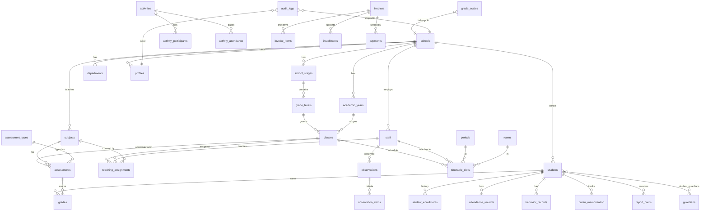

# Madrasati ERP — Database Design

> **Source migrations:** `supabase/migrations/0001_core_and_rbac.sql` through `0005_rls_policies.sql`
> **Application helpers:** `src/lib/auth.ts`, `src/lib/rbac.ts`, `src/lib/audit.ts`

---

## 1. Design Principles

The schema is built around five governing ideas that permeate every table:

| Principle | Manifestation |
|-----------|---------------|
| **Multi-tenancy first** | Every domain table carries `school_id uuid NOT NULL`. No cross-tenant data leak is possible at the query level. |
| **RLS as the enforcement layer** | Row Level Security is enabled on every table. The application layer performs permission checks for UX feedback; the database enforces them regardless. |
| **Soft-state over hard deletes** | Operational records (students, staff, classes) use a `status` column (`active / inactive / archived / withdrawn / …`) rather than `DELETE`. History is never destroyed. |
| **Immutable audit trail** | Every mutation goes through `src/lib/audit.ts → audit_logs`, and the table is append-only (no `UPDATE` or `DELETE` RLS policy). |
| **Arabic-first naming** | Bilingual columns follow the `name_ar` (required) / `name_en` (optional) pattern. The `schools.calendar` column allows toggling between `gregorian` and `hijri`. |

---

## 2. Multi-tenancy via `school_id`

### Tenant root

`public.schools` is the tenant root. Every other domain object (except the global RBAC catalog and `quran_surahs`) carries a foreign key to it:

```
schools ──< academic_years
         ──< school_stages ──< grade_levels ──< classes
         ──< departments   ──< staff
         ──< students
         ──< subjects
         ──< attendance_records
         ──< grades / assessments / report_cards
         ──< behavior_records
         ──< observations
         ──< invoices / payments
         ──< audit_logs
         …
```

The `schools` table holds all per-tenant branding: `logo_url`, `secondary_logo_url`, `stamp_url`, `signature_url`, `login_bg_url`, `banner_url`, `slogan_ar/en`, and a `theme jsonb` map of CSS variable overrides (e.g. `{"--primary": "218 64% 23%"}`).

### Cascade strategy

| Parent deleted | Child rows |
|----------------|-----------|
| `schools` | `ON DELETE CASCADE` on all domain tables — removing a school purges all its data |
| `academic_years` | `classes ON DELETE CASCADE`; `student_enrollments ON DELETE CASCADE` |
| `grade_levels` | `classes ON DELETE RESTRICT` (cannot delete a grade that still has classes) |
| `staff` | Soft-referenced: `class_teacher_id`, `department.head_id` → `ON DELETE SET NULL` |
| `students` | `attendance_records`, `grades`, `behavior_records` → `CASCADE` |

### Helper functions (defined in `0001_core_and_rbac.sql`)

All helper functions run as `SECURITY DEFINER` and set `search_path = public` to prevent search-path injection. They are stable (not volatile), which lets Postgres cache the result within a query.

```sql
-- Returns the school_id of the currently authenticated user.
public.current_school_id() → uuid

-- Returns the role key of the currently authenticated user.
public.current_role() → text

-- True if the current user's role = 'super_admin'.
public.is_super_admin() → boolean

-- True if the current user's role_permissions include `perm` or '*'.
public.has_perm(perm text) → boolean

-- True if row_school matches the caller's school, OR caller is super_admin.
-- This is the gate used in 95% of RLS policies.
public.in_my_school(row_school uuid) → boolean
```

`super_admin` is the only cross-tenant role. `in_my_school` short-circuits to `true` for `super_admin`, giving that role visibility across all tenant data.

---

## 3. Row Level Security (RLS)

All 40+ tables have RLS enabled. Policies are defined in `0005_rls_policies.sql`.

### Standard pattern (school-scoped tables)

Most tables follow an identical four-policy pattern generated by the loop in `0005`:

```sql
-- SELECT: must be in the caller's school AND have the read permission
POLICY <table>_sel FOR SELECT
  USING (in_my_school(school_id) AND has_perm('<read_perm>'))

-- INSERT: same school AND write permission
POLICY <table>_ins FOR INSERT
  WITH CHECK (in_my_school(school_id) AND has_perm('<write_perm>'))

-- UPDATE: same school AND write permission (both USING and WITH CHECK)
POLICY <table>_upd FOR UPDATE
  USING (in_my_school(school_id) AND has_perm('<write_perm>'))
  WITH CHECK (in_my_school(school_id) AND has_perm('<write_perm>'))

-- DELETE: same school AND write permission
POLICY <table>_del FOR DELETE
  USING (in_my_school(school_id) AND has_perm('<write_perm>'))
```

The table → permission mapping (excerpt):

| Table | Read permission | Write permission |
|-------|----------------|-----------------|
| `students` | `students:read` | `students:write` |
| `staff` | `teachers:read` | `teachers:write` |
| `attendance_records` | `attendance:read` | `attendance:write` |
| `grades` | `grades:read` | `grades:write` |
| `invoices` | `finance:read` | `finance:write` |
| `audit_logs` | `audit:read` | (INSERT only, see below) |
| `classes` | `classes:read` | `classes:write` |
| `timetable_slots` | `timetable:read` | `timetable:write` |
| `behavior_records` | `behavior:read` | `behavior:write` |
| `quran_memorization` | `islamic:read` | `islamic:write` |
| `curriculum_plans` | `curriculum:read` | `curriculum:write` |
| `observations` | `observations:read` | `observations:write` |
| `report_templates` | `reports:read` | `branding:write` |
| `fee_structures` | `finance:read` | `finance:write` |

### Special-case policies

**`schools`** — a user can only SELECT their own school (`id = current_school_id()`), or all schools if they are `super_admin`. INSERT requires `is_super_admin()`. UPDATE requires `settings:write` or `branding:write`.

**`profiles`** — a user can read/update their own row (`id = auth.uid()`), or any profile in their school if they hold `users:manage`. `super_admin` can read/update all.

**`notifications`** — strictly user-owned: `user_id = auth.uid()`. No cross-user reads.

**`announcements`** — all authenticated users in the school can SELECT (no permission required beyond school membership). INSERT/UPDATE/DELETE require `communication:send`.

**`audit_logs`** — SELECT requires `audit:read`. INSERT is allowed for any authenticated, same-school user (so application code can always log). No UPDATE or DELETE policy exists; rows are effectively immutable.

**Child tables** (no direct `school_id`): `student_guardians`, `curriculum_units`, `curriculum_lessons`, `observation_items`, `activity_participants`, `invoice_items`, `installments` — policies use an `EXISTS (SELECT 1 FROM <parent> WHERE …)` subquery to verify school scope via the parent.

---

## 4. RBAC (Role-Based Access Control)

### Architecture

The RBAC model uses three tables:

```
roles (key PK, name_ar, name_en, is_system)
  └──< role_permissions (role_key FK, permission_key FK) >──┐
                                                             permissions (key PK)
```

`profiles.role` is a FK to `roles.key`. At runtime, `has_perm(perm)` joins `role_permissions` against `auth.uid()` — no session variables required.

The TypeScript mirror in `src/lib/rbac.ts` defines `ROLES`, `PERMISSIONS`, `ROLE_LABELS`, `ROLE_PERMISSIONS`, and the client-side helper `hasPermission(role, perm)`. This is used exclusively for UI show/hide decisions. The DB always re-checks.

### Roles

| Key | Arabic | Scope |
|-----|--------|-------|
| `super_admin` | مدير النظام | Cross-tenant; wildcard `*` permission |
| `principal` | مدير المدرسة | Full school authority |
| `vice_principal` | وكيل المدرسة | Operational + academic |
| `department_head` | رئيس قسم | Department-scoped management |
| `teacher` | معلم | Classroom operations |
| `activity_supervisor` | مشرف نشاط | Activities and attendance |
| `registrar` | مسؤول التسجيل | Enrollment, student records |
| `finance_officer` | مسؤول مالي | Finance module |
| `auditor` | مدقق النظام | Read-only audit/analytics |
| `student` | طالب | Read-only portal |
| `parent` | ولي أمر | Read-only portal |

### Permission taxonomy

Permissions follow the pattern `resource:action`. Current set (33 keys):

```
students:read  students:write  students:delete  students:import
teachers:read  teachers:write
classes:read   classes:write
subjects:read  subjects:write
departments:read  departments:write
attendance:read   attendance:write
grades:read       grades:write
timetable:read    timetable:write
curriculum:read   curriculum:write
islamic:read      islamic:write
behavior:read     behavior:write
observations:read observations:write
activities:read   activities:write
reports:read
communication:send
analytics:read
finance:read  finance:write
settings:write  branding:write  users:manage  audit:read
```

`*` (wildcard) is granted only to `super_admin` and matches any permission key.

---

## 5. Naming Conventions

| Convention | Rule | Example |
|------------|------|---------|
| Primary keys | `id uuid` generated with `gen_random_uuid()` | `students.id` |
| Tenant key | `school_id uuid NOT NULL` | present on every domain table |
| Bilingual text | `name_ar text NOT NULL`, `name_en text` | `subjects.name_ar` |
| Timestamps | `created_at timestamptz NOT NULL DEFAULT now()`, `updated_at timestamptz NOT NULL DEFAULT now()` | maintained by trigger |
| Status enum | `status text CHECK (status IN (…))` | `students.status`, `staff.status` |
| Sort order | `sort_order int NOT NULL DEFAULT 0` | `school_stages.sort_order`, `periods.sort_order` |
| Foreign keys | `<entity>_id uuid REFERENCES public.<entity>(id)` | `class_teacher_id`, `academic_year_id` |
| Junction tables | `<a>_<b>s` | `student_guardians`, `role_permissions`, `activity_participants` |
| Trigger names | `trg_<table>_<purpose>` | `trg_students_updated`, `trg_student_class_count` |
| Index names | `<table|abbreviation>_<column>_idx` or `_uq` | `students_school_idx`, `subjects_code_uq` |
| Actor columns | `recorded_by`, `created_by`, `received_by` → `uuid REFERENCES profiles(id) ON DELETE SET NULL` | attendance, grades, payments |

`citext` (case-insensitive text, from the `citext` extension) is used for email columns (`profiles.email`, `staff.email`, `students.guardian_email`, `guardians.email`) so that email lookups are automatically case-insensitive.

---

## 6. Soft-Delete / Archive Strategy

Hard `DELETE` is avoided for all records that have historical significance. Instead, a `status` column tracks lifecycle state.

### `students.status`

```
enrolled → transferred
         → withdrawn
         → graduated
         → archived
```

The application archives rather than deletes: `UPDATE students SET status = 'archived'` (see `archiveStudent` in `src/features/students/actions.ts`). RLS policies do not filter on `status`, so archived students are still visible to users with `students:read` but are excluded from enrollment counts via the `refresh_class_count` trigger condition (`s.status = 'enrolled'`).

### `staff.status`

```
active → inactive → archived
```

### `classes.status`

```
active → archived
```

`academic_years.is_current` uses a partial unique index to enforce a single current year per school:

```sql
CREATE UNIQUE INDEX academic_years_current_uq
  ON public.academic_years(school_id) WHERE is_current;
```

### What gets hard-deleted

- Timetable slots, curriculum coverage entries, activity participants: these are operational/positional records with no independent historical value — they can be regenerated or re-entered.
- `audit_logs` themselves are never deleted (no DELETE policy in RLS).

---

## 7. Audit Strategy

### Application-level audit (`audit_logs`)

Every mutating Server Action calls `logAudit()` from `src/lib/audit.ts`:

```typescript
// signature
logAudit(action: string, entity?: string, entityId?: string | null, meta?: Record<string, unknown>): Promise<void>
```

The function is **non-blocking** (`try/catch` that swallows errors) — an audit failure never surfaces to the user or rolls back a transaction.

The `audit_logs` table structure:

```sql
audit_logs (
  id         bigint GENERATED ALWAYS AS IDENTITY PRIMARY KEY,
  school_id  uuid REFERENCES schools(id) ON DELETE SET NULL,
  user_id    uuid REFERENCES profiles(id) ON DELETE SET NULL,
  user_email text,       -- denormalized for permanence (user may be deleted later)
  action     text,       -- e.g. 'student.create', 'student.archive'
  entity     text,       -- table name, e.g. 'students'
  entity_id  text,       -- stringified uuid/id
  meta       jsonb,      -- arbitrary extra context (name, amount, etc.)
  created_at timestamptz NOT NULL DEFAULT now()
)
```

`user_email` is deliberately denormalized so that audit records remain meaningful even if the profile row is later deleted.

The RLS policy allows any authenticated, same-school user to INSERT into `audit_logs`. SELECT requires `audit:read` (only `principal`, `super_admin`, and `auditor` hold this permission). There is no UPDATE or DELETE RLS policy, making the table effectively append-only from within the application.

### Action naming convention

```
<entity>.<verb>   →   student.create / student.update / student.archive
```

### Indexes

```sql
audit_school_time_idx  ON audit_logs(school_id, created_at DESC)  -- paginated audit viewer
audit_entity_idx       ON audit_logs(entity, entity_id)           -- "history of this record"
```

---

## 8. Indexing Strategy

### General rules

1. Every `school_id` column on a domain table gets a `_school_idx` index — the most common filter in every query.
2. Composite indexes are created where the most common query pattern is (`class_id`, `date`) or (`staff_id`, `subject_id`).
3. Unique indexes enforce business rules that `CHECK` constraints cannot (e.g. "one current academic year per school", "unique ministry number per school").
4. Partial unique indexes are used where the constraint applies only to a subset of rows.

### Index catalog

| Index | Table | Columns | Purpose |
|-------|-------|---------|---------|
| `profiles_school_idx` | `profiles` | `school_id` | User lookups per school |
| `grade_levels_stage_idx` | `grade_levels` | `stage_id` | Levels under a stage |
| `staff_school_idx` | `staff` | `school_id` | Staff list |
| `staff_dept_idx` | `staff` | `department_id` | Department roster |
| `classes_year_idx` | `classes` | `academic_year_id` | Classes for the current year |
| `classes_grade_idx` | `classes` | `grade_level_id` | Classes at a grade |
| `subjects_code_uq` | `subjects` | `(school_id, code)` | Unique subject code per school |
| `ta_class_idx` | `teaching_assignments` | `class_id` | Assignments for a class |
| `ta_staff_idx` | `teaching_assignments` | `staff_id` | Assignments for a teacher |
| `students_school_idx` | `students` | `school_id` | Student list |
| `students_class_idx` | `students` | `current_class_id` | Students in a class |
| `students_status_idx` | `students` | `status` | Filter enrolled/archived |
| `students_ministry_uq` | `students` | `(school_id, ministry_no)` WHERE NOT NULL | Ministry ID uniqueness |
| `enroll_student_idx` | `student_enrollments` | `student_id` | Enrollment history |
| `att_class_date_idx` | `attendance_records` | `(class_id, date)` | Daily class register |
| `att_school_date_idx` | `attendance_records` | `(school_id, date)` | School-wide daily report |
| `assess_class_subject_idx` | `assessments` | `(class_id, subject_id)` | Grade entry grid |
| `grades_student_idx` | `grades` | `student_id` | Student transcript |
| `quran_student_idx` | `quran_memorization` | `student_id` | Memorization progress |
| `behavior_student_idx` | `behavior_records` | `student_id` | Student behavior history |
| `timetable_teacher_uq` | `timetable_slots` | `(staff_id, period_id, day_of_week)` WHERE NOT NULL | Teacher double-booking guard |
| `notif_user_idx` | `notifications` | `(user_id, read_at)` | Unread notifications |
| `audit_school_time_idx` | `audit_logs` | `(school_id, created_at DESC)` | Audit log viewer |
| `audit_entity_idx` | `audit_logs` | `(entity, entity_id)` | Record history |
| `academic_years_current_uq` | `academic_years` | `school_id` WHERE `is_current` | Single current year |

---

## 9. GPA and Percentage Computation

### Data model

Grading works in three layers:

```
assessment_types  (weight, max_score)  — e.g. "Quiz 20%, Exam 80%"
    └──< assessments (class × subject × term × date × max_score)
              └──< grades (student × score)
```

`grade_scales` maps percentage ranges to letter grades and GPA points, configured per school:

```sql
grade_scales (
  school_id,
  min_pct   numeric(5,2),
  max_pct   numeric(5,2),
  letter    text,      -- A+, A, B+, …
  gpa       numeric(3,2),  -- 4.00, 3.75, …
  label_ar  text       -- ممتاز، جيد جداً، …
)
```

### Percentage formula

For a given student, subject, and term:

```
weighted_score =
  Σ( (grade.score / assessment.max_score) × assessment_type.weight )
  ÷ Σ( assessment_type.weight )
  × 100
```

This is computed in the application layer (not via a stored function) when generating a `report_cards` snapshot.

### GPA lookup

```sql
SELECT letter, gpa, label_ar
FROM grade_scales
WHERE school_id = $school_id
  AND $percentage BETWEEN min_pct AND max_pct
LIMIT 1;
```

### `report_cards` — the frozen snapshot

When a term is closed, the application inserts a row into `report_cards`:

```sql
report_cards (
  student_id, academic_year_id, term,
  gpa       numeric(3,2),    -- term GPA
  average   numeric(5,2),    -- percentage average across subjects
  rank      int,             -- class rank
  comment   text,
  data      jsonb            -- frozen per-subject breakdown for PDF rendering
)
```

`data` is a JSON snapshot of all subject scores, letter grades, attendance counts, and teacher comments at the moment of issuance. This ensures that a printed report card never changes retroactively even if grades are later corrected.

### Islamic studies (Quran)

`quran_memorization` stores per-surah scores (`score`, `tajweed_score`, both `numeric(5,2)`). Aggregation into a student's Islamic Studies grade is performed in the application layer using the same weighted formula above, treating memorization assessments as a special `assessment_type`.

---

## 10. Schema Overview Diagram



---

## 11. Migration Order

The migrations must be applied in filename order — each depends on the previous:

| File | Establishes |
|------|-------------|
| `0001_core_and_rbac.sql` | Extensions, `set_updated_at()`, `schools`, RBAC catalog, `profiles`, helper functions (`current_school_id`, `has_perm`, `in_my_school`, …), `handle_new_user` trigger |
| `0002_academic_and_people.sql` | `academic_years`, `school_stages`, `grade_levels`, `departments`, `staff`, `classes`, `subjects`, `teaching_assignments`, `students`, `guardians`, `student_enrollments`, `refresh_class_count` trigger |
| `0003_operations.sql` | `attendance_records`, `grade_scales`, `assessment_types`, `assessments`, `grades`, `report_cards`, `quran_surahs`, `quran_memorization`, `quran_revisions`, `curriculum_*`, `behavior_records`, `rooms`, `periods`, `timetable_slots`, `activities`, `activity_participants`, `activity_attendance`, `observations`, `observation_items` |
| `0004_admin_finance_audit.sql` | `report_templates`, `announcements`, `notifications`, `message_log`, `fee_structures`, `invoices`, `invoice_items`, `installments`, `payments`, `audit_logs` |
| `0005_rls_policies.sql` | RLS `ENABLE` + all policies; depends on all prior tables and all helper functions |

Running `0005` before any earlier file will fail because the tables it references do not yet exist.

---

## 12. Trigger Inventory

| Trigger | Table | Function | Purpose |
|---------|-------|----------|---------|
| `trg_schools_updated` | `schools` | `set_updated_at()` | Auto-maintain `updated_at` |
| `trg_profiles_updated` | `profiles` | `set_updated_at()` | Auto-maintain `updated_at` |
| `trg_staff_updated` | `staff` | `set_updated_at()` | Auto-maintain `updated_at` |
| `trg_classes_updated` | `classes` | `set_updated_at()` | Auto-maintain `updated_at` |
| `trg_grades_updated` | `grades` | `set_updated_at()` | Auto-maintain `updated_at` |
| `trg_templates_updated` | `report_templates` | `set_updated_at()` | Auto-maintain `updated_at` |
| `on_auth_user_created` | `auth.users` | `handle_new_user()` | Create `profiles` row on Supabase Auth signup |
| `trg_student_class_count` | `students` | `refresh_class_count()` | Keep `classes.student_count` accurate on INSERT/UPDATE/DELETE |

`refresh_class_count` fires `AFTER INSERT OR UPDATE OF current_class_id, status OR DELETE`. It re-counts enrolled students for both the new and old `current_class_id` values to handle class transfers correctly.

---

## 13. Key Design Decisions & Rationale

### Why `SECURITY DEFINER` on helper functions?

Without `SECURITY DEFINER`, calling `current_school_id()` inside an RLS policy would recursively trigger the RLS on `profiles` to evaluate, creating an infinite loop. The `SECURITY DEFINER` + `set search_path = public` combination bypasses the caller's RLS when reading `profiles`, breaking the cycle safely.

### Why denormalize `user_email` in `audit_logs`?

Foreign keys to `profiles` are `ON DELETE SET NULL`. If a user account is deleted, `user_id` becomes NULL — losing the identity of who performed the action. Storing `user_email` as a text column preserves the attribution permanently.

### Why `citext` for email columns?

MySQL-style case-insensitive collations do not exist in Postgres by default. `citext` makes email comparisons case-insensitive at the column level without requiring `LOWER()` wrappers on every query.

### Why a partial unique index for `academic_years.is_current`?

A standard unique index on `(school_id, is_current)` would allow only one `false` row per school. The partial index `WHERE is_current` constrains only the `true` rows, correctly enforcing "at most one current year per school" while allowing multiple past years.

### Why a denormalized `student_count` on `classes`?

Counting active students per class is a hot read path (visible on every class list). The `refresh_class_count` trigger keeps the counter accurate so that no `COUNT(*)` subquery is needed on list pages. The tradeoff is write amplification on student status changes — acceptable because student updates are infrequent compared to class list reads.

### Finance tables — designed but gated

`fee_structures`, `invoices`, `invoice_items`, `installments`, and `payments` are fully defined and have RLS policies. The UI module is not yet activated. This allows the schema to evolve independently of the UI release schedule and lets `finance_officer` accounts be provisioned before the feature is launched.
