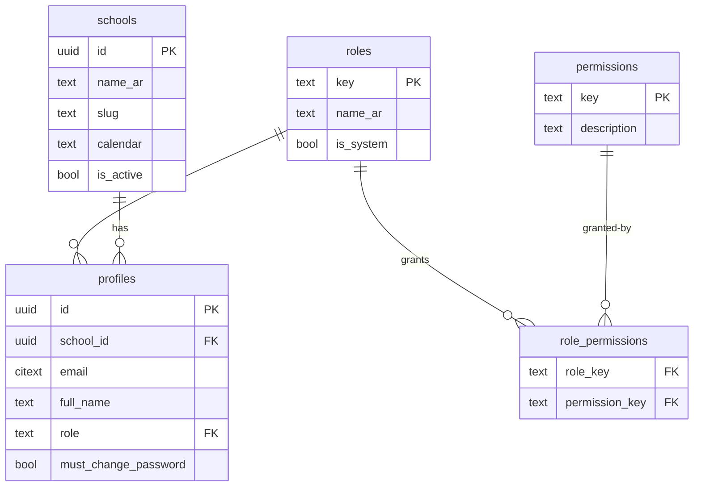
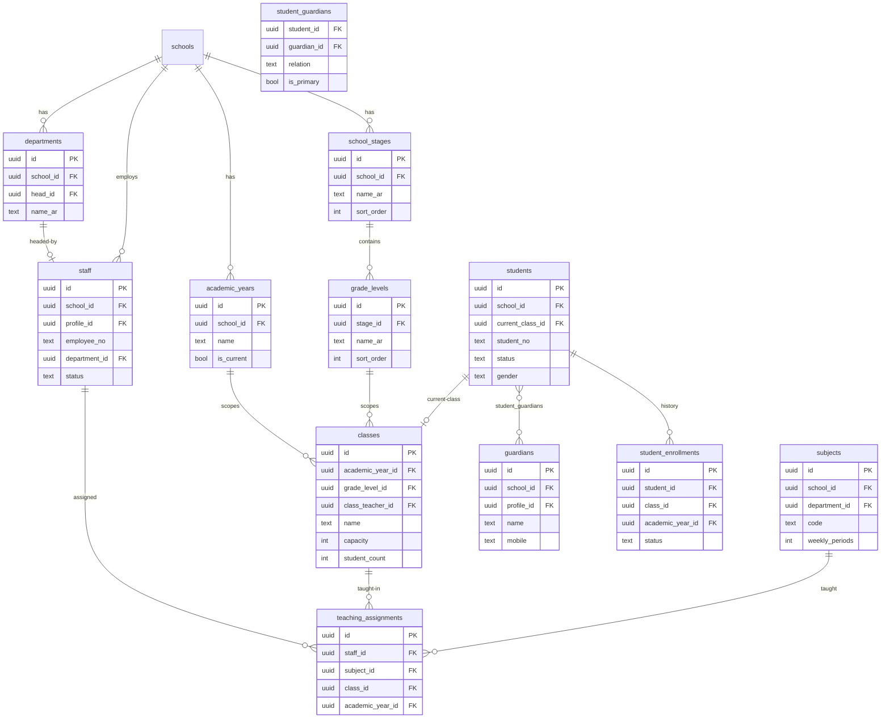
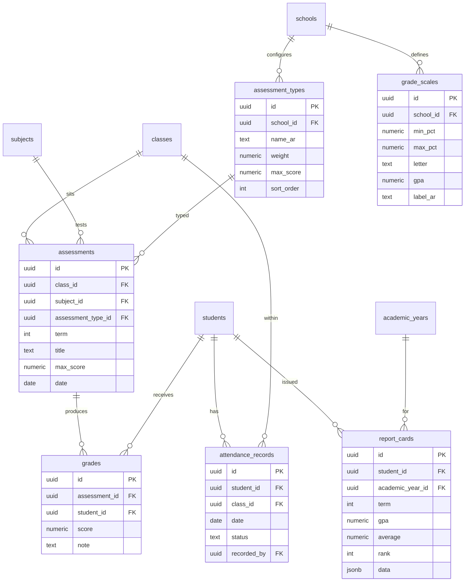
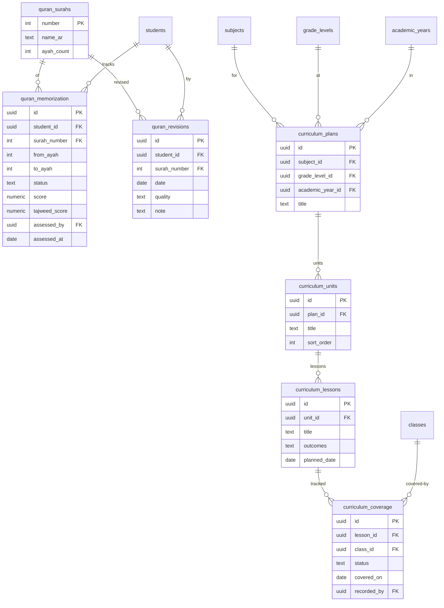
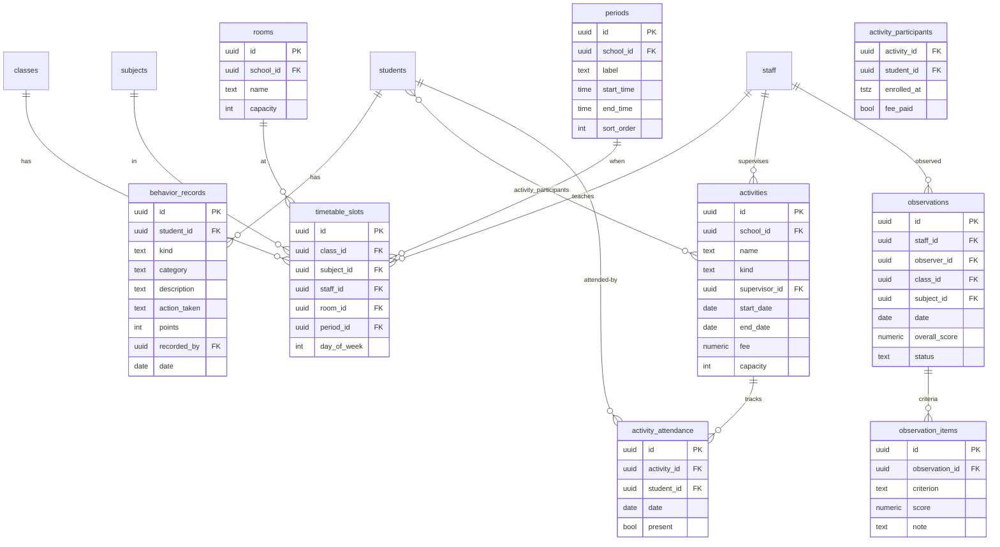
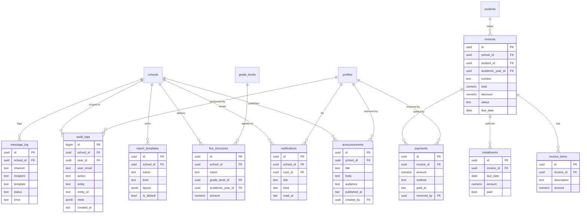

# Madrasati ERP — Entity-Relationship Diagram

> **Source of truth:** `supabase/migrations/0001_core_and_rbac.sql` through `0004_admin_finance_audit.sql`.
> This document is generated from the actual migration DDL — every column name, type, and FK constraint is transcribed directly. RLS policies are in `0005_rls_policies.sql` and do not affect the schema shape.

---

## Table of Contents

1. [Domain Overview](#1-domain-overview)
2. [Migration Provenance](#2-migration-provenance)
3. [Full ER Diagram (Mermaid)](#3-full-er-diagram-mermaid)
4. [Domain-Level Sub-Diagrams](#4-domain-level-sub-diagrams)
   - 4.1 [Core & RBAC](#41-core--rbac)
   - 4.2 [Academic Structure & People](#42-academic-structure--people)
   - 4.3 [Daily Operations — Attendance & Grades](#43-daily-operations--attendance--grades)
   - 4.4 [Islamic Studies & Curriculum](#44-islamic-studies--curriculum)
   - 4.5 [Behavior, Timetable & Activities](#45-behavior-timetable--activities)
   - 4.6 [Observations, Communication & Finance](#46-observations-communication--finance)
5. [Key Design Decisions](#5-key-design-decisions)
6. [Column Reference by Table](#6-column-reference-by-table)

---

## 1. Domain Overview

Madrasati is a **multi-tenant** school ERP. Every domain table carries a `school_id` UUID foreign-keyed to `schools(id)`. Access control is enforced by Postgres RLS using four SECURITY DEFINER helper functions:

| Helper | Purpose |
|--------|---------|
| `current_school_id()` | Returns `profiles.school_id` for the authenticated user |
| `current_role()` | Returns `profiles.role` |
| `is_super_admin()` | True when role = `super_admin` |
| `has_perm(text)` | Checks `role_permissions` for a `resource:action` string |
| `in_my_school(uuid)` | True when the row's `school_id` matches the caller's, or caller is super_admin |

The schema spans **47 tables** across 6 functional domains:

| # | Domain | Core Tables |
|---|--------|------------|
| 1 | **Core & RBAC** | schools, profiles, roles, permissions, role_permissions |
| 2 | **Academic Structure & People** | academic_years, school_stages, grade_levels, departments, staff, classes, subjects, teaching_assignments, students, guardians, student_guardians, student_enrollments |
| 3 | **Daily Operations** | attendance_records, grade_scales, assessment_types, assessments, grades, report_cards |
| 4 | **Islamic Studies & Curriculum** | quran_surahs, quran_memorization, quran_revisions, curriculum_plans, curriculum_units, curriculum_lessons, curriculum_coverage |
| 5 | **Behavior, Timetable & Activities** | behavior_records, rooms, periods, timetable_slots, activities, activity_participants, activity_attendance, observations, observation_items |
| 6 | **Admin, Finance & Audit** | report_templates, announcements, notifications, message_log, fee_structures, invoices, invoice_items, installments, payments, audit_logs |

---

## 2. Migration Provenance

| File | Contents |
|------|----------|
| `0001_core_and_rbac.sql` | schools, roles, permissions, role_permissions, profiles; RBAC functions; `handle_new_user` trigger |
| `0002_academic_and_people.sql` | academic_years, school_stages, grade_levels, departments, staff, classes, subjects, teaching_assignments, students, guardians, student_guardians, student_enrollments; `refresh_class_count` trigger |
| `0003_operations.sql` | attendance_records, grade_scales, assessment_types, assessments, grades, report_cards, quran_surahs, quran_memorization, quran_revisions, curriculum_plans/units/lessons/coverage, behavior_records, rooms, periods, timetable_slots, activities, activity_participants, activity_attendance, observations, observation_items |
| `0004_admin_finance_audit.sql` | report_templates, announcements, notifications, message_log, fee_structures, invoices, invoice_items, installments, payments, audit_logs |
| `0005_rls_policies.sql` | RLS policies only (no new tables) |

---

## 3. Full ER Diagram (Mermaid)

The diagram uses Mermaid `erDiagram` syntax. PK columns are marked `PK`, FK columns `FK`. `||--o{` = one-to-many, `}o--o{` = many-to-many (through a junction table).

```mermaid
erDiagram

  %% ─────────────────────────────────────────────
  %%  DOMAIN 1 · CORE & RBAC
  %% ─────────────────────────────────────────────

  schools {
    uuid    id              PK
    text    name_ar
    text    name_en
    text    slug
    text    logo_url
    text    secondary_logo_url
    text    stamp_url
    text    signature_url
    text    login_bg_url
    text    banner_url
    text    slogan_ar
    text    slogan_en
    text    address
    text    phone
    text    email
    text    website
    text    principal_name
    jsonb   theme
    text    calendar
    bool    is_active
    tstz    created_at
    tstz    updated_at
  }

  roles {
    text    key             PK
    text    name_ar
    text    name_en
    bool    is_system
  }

  permissions {
    text    key             PK
    text    description
  }

  role_permissions {
    text    role_key        FK
    text    permission_key  FK
  }

  profiles {
    uuid    id              PK
    uuid    school_id       FK
    citext  email
    text    full_name
    text    role            FK
    text    avatar_url
    bool    must_change_password
    tstz    created_at
    tstz    updated_at
  }

  roles ||--o{ role_permissions   : "grants"
  permissions ||--o{ role_permissions : "granted-by"
  roles ||--o{ profiles           : "assigned-to"
  schools ||--o{ profiles         : "belongs-to"

  %% ─────────────────────────────────────────────
  %%  DOMAIN 2 · ACADEMIC STRUCTURE & PEOPLE
  %% ─────────────────────────────────────────────

  academic_years {
    uuid    id              PK
    uuid    school_id       FK
    text    name
    date    start_date
    date    end_date
    bool    is_current
    tstz    created_at
  }

  school_stages {
    uuid    id              PK
    uuid    school_id       FK
    text    name_ar
    text    name_en
    int     sort_order
  }

  grade_levels {
    uuid    id              PK
    uuid    school_id       FK
    uuid    stage_id        FK
    text    name_ar
    text    name_en
    int     sort_order
  }

  departments {
    uuid    id              PK
    uuid    school_id       FK
    text    name_ar
    text    name_en
    uuid    head_id         FK
    tstz    created_at
  }

  staff {
    uuid    id              PK
    uuid    school_id       FK
    uuid    profile_id      FK
    text    employee_no
    text    civil_id
    text    name_ar
    text    name_en
    uuid    department_id   FK
    text    position
    text    qualifications
    int     experience_years
    citext  email
    text    mobile
    date    hire_date
    text    status
    tstz    created_at
    tstz    updated_at
  }

  classes {
    uuid    id              PK
    uuid    school_id       FK
    uuid    academic_year_id FK
    uuid    grade_level_id  FK
    text    name
    int     capacity
    uuid    class_teacher_id FK
    int     student_count
    text    status
    tstz    created_at
    tstz    updated_at
  }

  subjects {
    uuid    id              PK
    uuid    school_id       FK
    uuid    department_id   FK
    text    name_ar
    text    name_en
    text    code
    int     weekly_periods
    tstz    created_at
  }

  teaching_assignments {
    uuid    id              PK
    uuid    school_id       FK
    uuid    staff_id        FK
    uuid    subject_id      FK
    uuid    class_id        FK
    uuid    academic_year_id FK
    int     weekly_periods
  }

  students {
    uuid    id              PK
    uuid    school_id       FK
    text    student_no
    text    ministry_no
    text    civil_id
    text    name_ar
    text    name_en
    text    gender
    date    dob
    text    nationality
    text    religion
    text    address
    text    medical_notes
    date    enrollment_date
    text    status
    text    emergency_contact
    text    father_name
    text    mother_name
    text    guardian_name
    text    guardian_mobile
    citext  guardian_email
    text    guardian_occupation
    uuid    current_class_id FK
    text    photo_url
    tstz    created_at
    tstz    updated_at
  }

  guardians {
    uuid    id              PK
    uuid    school_id       FK
    uuid    profile_id      FK
    text    name
    text    mobile
    citext  email
    text    occupation
    tstz    created_at
  }

  student_guardians {
    uuid    student_id      FK
    uuid    guardian_id     FK
    text    relation
    bool    is_primary
  }

  student_enrollments {
    uuid    id              PK
    uuid    school_id       FK
    uuid    student_id      FK
    uuid    class_id        FK
    uuid    academic_year_id FK
    text    status
    text    note
    tstz    created_at
  }

  schools ||--o{ academic_years    : "has"
  schools ||--o{ school_stages     : "has"
  school_stages ||--o{ grade_levels : "contains"
  schools ||--o{ grade_levels      : "scopes"
  schools ||--o{ departments       : "has"
  schools ||--o{ staff             : "employs"
  schools ||--o{ classes           : "runs"
  schools ||--o{ subjects          : "offers"
  schools ||--o{ students          : "enrolls"
  schools ||--o{ guardians         : "registers"
  schools ||--o{ student_enrollments : "records"

  profiles ||--o{ staff            : "linked-to"
  profiles ||--o{ guardians        : "linked-to"
  departments ||--o{ staff         : "contains"
  staff ||--o| departments         : "heads"
  academic_years ||--o{ classes    : "scopes"
  grade_levels ||--o{ classes      : "scopes"
  staff ||--o{ classes             : "class-teacher"
  departments ||--o{ subjects      : "owns"
  staff ||--o{ teaching_assignments : "assigned-to"
  subjects ||--o{ teaching_assignments : "assigned-in"
  classes ||--o{ teaching_assignments : "has"
  academic_years ||--o{ teaching_assignments : "scopes"
  students ||--o| classes          : "current-class"
  students }o--o{ guardians        : "student_guardians"
  students ||--o{ student_enrollments : "has"
  classes ||--o{ student_enrollments : "hosts"
  academic_years ||--o{ student_enrollments : "scopes"

  %% ─────────────────────────────────────────────
  %%  DOMAIN 3 · DAILY OPERATIONS
  %% ─────────────────────────────────────────────

  attendance_records {
    uuid    id              PK
    uuid    school_id       FK
    uuid    student_id      FK
    uuid    class_id        FK
    date    date
    text    status
    text    note
    uuid    recorded_by     FK
    tstz    created_at
  }

  grade_scales {
    uuid    id              PK
    uuid    school_id       FK
    numeric min_pct
    numeric max_pct
    text    letter
    numeric gpa
    text    label_ar
  }

  assessment_types {
    uuid    id              PK
    uuid    school_id       FK
    text    name_ar
    text    name_en
    numeric weight
    numeric max_score
    int     sort_order
  }

  assessments {
    uuid    id              PK
    uuid    school_id       FK
    uuid    class_id        FK
    uuid    subject_id      FK
    uuid    assessment_type_id FK
    int     term
    text    title
    numeric max_score
    date    date
    uuid    created_by      FK
    tstz    created_at
  }

  grades {
    uuid    id              PK
    uuid    school_id       FK
    uuid    assessment_id   FK
    uuid    student_id      FK
    numeric score
    text    note
    tstz    updated_at
  }

  report_cards {
    uuid    id              PK
    uuid    school_id       FK
    uuid    student_id      FK
    uuid    academic_year_id FK
    int     term
    numeric gpa
    numeric average
    int     rank
    text    comment
    jsonb   data
    tstz    issued_at
  }

  students ||--o{ attendance_records  : "has"
  classes ||--o{ attendance_records   : "within"
  profiles ||--o{ attendance_records  : "recorded-by"
  schools ||--o{ grade_scales         : "defines"
  schools ||--o{ assessment_types     : "defines"
  classes ||--o{ assessments          : "contains"
  subjects ||--o{ assessments         : "tests"
  assessment_types ||--o{ assessments : "typed-as"
  profiles ||--o{ assessments         : "created-by"
  assessments ||--o{ grades           : "scored-in"
  students ||--o{ grades              : "has"
  students ||--o{ report_cards        : "issued"
  academic_years ||--o{ report_cards  : "for"

  %% ─────────────────────────────────────────────
  %%  DOMAIN 4 · ISLAMIC STUDIES & CURRICULUM
  %% ─────────────────────────────────────────────

  quran_surahs {
    int     number          PK
    text    name_ar
    int     ayah_count
  }

  quran_memorization {
    uuid    id              PK
    uuid    school_id       FK
    uuid    student_id      FK
    int     surah_number    FK
    int     from_ayah
    int     to_ayah
    text    status
    numeric score
    numeric tajweed_score
    uuid    assessed_by     FK
    date    assessed_at
    tstz    created_at
  }

  quran_revisions {
    uuid    id              PK
    uuid    school_id       FK
    uuid    student_id      FK
    int     surah_number    FK
    date    date
    text    quality
    text    note
  }

  curriculum_plans {
    uuid    id              PK
    uuid    school_id       FK
    uuid    subject_id      FK
    uuid    grade_level_id  FK
    uuid    academic_year_id FK
    text    title
  }

  curriculum_units {
    uuid    id              PK
    uuid    plan_id         FK
    text    title
    int     sort_order
  }

  curriculum_lessons {
    uuid    id              PK
    uuid    unit_id         FK
    text    title
    text    outcomes
    date    planned_date
    int     sort_order
  }

  curriculum_coverage {
    uuid    id              PK
    uuid    school_id       FK
    uuid    lesson_id       FK
    uuid    class_id        FK
    text    status
    date    covered_on
    uuid    recorded_by     FK
  }

  students ||--o{ quran_memorization  : "tracks"
  quran_surahs ||--o{ quran_memorization : "of"
  profiles ||--o{ quran_memorization  : "assessed-by"
  students ||--o{ quran_revisions     : "revises"
  quran_surahs ||--o{ quran_revisions : "of"
  subjects ||--o{ curriculum_plans    : "planned-in"
  grade_levels ||--o{ curriculum_plans : "for"
  academic_years ||--o{ curriculum_plans : "in"
  curriculum_plans ||--o{ curriculum_units : "has"
  curriculum_units ||--o{ curriculum_lessons : "has"
  curriculum_lessons ||--o{ curriculum_coverage : "tracked-by"
  classes ||--o{ curriculum_coverage  : "covers"
  profiles ||--o{ curriculum_coverage : "recorded-by"

  %% ─────────────────────────────────────────────
  %%  DOMAIN 5 · BEHAVIOR, TIMETABLE & ACTIVITIES
  %% ─────────────────────────────────────────────

  behavior_records {
    uuid    id              PK
    uuid    school_id       FK
    uuid    student_id      FK
    text    kind
    text    category
    text    description
    text    action_taken
    int     points
    uuid    recorded_by     FK
    date    date
    tstz    created_at
  }

  rooms {
    uuid    id              PK
    uuid    school_id       FK
    text    name
    int     capacity
  }

  periods {
    uuid    id              PK
    uuid    school_id       FK
    text    label
    time    start_time
    time    end_time
    int     sort_order
  }

  timetable_slots {
    uuid    id              PK
    uuid    school_id       FK
    uuid    class_id        FK
    uuid    subject_id      FK
    uuid    staff_id        FK
    uuid    room_id         FK
    uuid    period_id       FK
    int     day_of_week
  }

  activities {
    uuid    id              PK
    uuid    school_id       FK
    text    name
    text    kind
    text    description
    uuid    supervisor_id   FK
    date    start_date
    date    end_date
    numeric fee
    int     capacity
    tstz    created_at
  }

  activity_participants {
    uuid    activity_id     FK
    uuid    student_id      FK
    tstz    enrolled_at
    bool    fee_paid
  }

  activity_attendance {
    uuid    id              PK
    uuid    activity_id     FK
    uuid    student_id      FK
    date    date
    bool    present
  }

  observations {
    uuid    id              PK
    uuid    school_id       FK
    uuid    staff_id        FK
    uuid    observer_id     FK
    uuid    class_id        FK
    uuid    subject_id      FK
    date    date
    numeric overall_score
    text    strengths
    text    improvements
    text    development_plan
    text    status
    tstz    created_at
  }

  observation_items {
    uuid    id              PK
    uuid    observation_id  FK
    text    criterion
    numeric score
    text    note
  }

  students ||--o{ behavior_records    : "has"
  profiles ||--o{ behavior_records    : "recorded-by"
  classes ||--o{ timetable_slots      : "has"
  subjects ||--o{ timetable_slots     : "taught-in"
  staff ||--o{ timetable_slots        : "teaches"
  rooms ||--o{ timetable_slots        : "used-in"
  periods ||--o{ timetable_slots      : "at"
  staff ||--o{ activities             : "supervises"
  students }o--o{ activities          : "activity_participants"
  activities ||--o{ activity_attendance : "tracks"
  students ||--o{ activity_attendance : "attended-by"
  staff ||--o{ observations           : "observed"
  profiles ||--o{ observations        : "observer"
  classes ||--o{ observations         : "in"
  subjects ||--o{ observations        : "on"
  observations ||--o{ observation_items : "has"

  %% ─────────────────────────────────────────────
  %%  DOMAIN 6 · ADMIN, COMMUNICATION & FINANCE
  %% ─────────────────────────────────────────────

  report_templates {
    uuid    id              PK
    uuid    school_id       FK
    text    name
    text    kind
    jsonb   layout
    bool    is_default
    tstz    created_at
    tstz    updated_at
  }

  announcements {
    uuid    id              PK
    uuid    school_id       FK
    text    title
    text    body
    text    audience
    tstz    published_at
    uuid    created_by      FK
    tstz    created_at
  }

  notifications {
    uuid    id              PK
    uuid    school_id       FK
    uuid    user_id         FK
    text    title
    text    body
    text    kind
    tstz    read_at
    tstz    created_at
  }

  message_log {
    uuid    id              PK
    uuid    school_id       FK
    text    channel
    text    recipient
    text    template
    jsonb   payload
    text    status
    text    error
    tstz    created_at
  }

  fee_structures {
    uuid    id              PK
    uuid    school_id       FK
    text    name
    uuid    grade_level_id  FK
    uuid    academic_year_id FK
    numeric amount
    tstz    created_at
  }

  invoices {
    uuid    id              PK
    uuid    school_id       FK
    uuid    student_id      FK
    uuid    academic_year_id FK
    text    number
    numeric total
    numeric discount
    text    status
    date    due_date
    tstz    created_at
  }

  invoice_items {
    uuid    id              PK
    uuid    invoice_id      FK
    text    description
    numeric amount
  }

  installments {
    uuid    id              PK
    uuid    invoice_id      FK
    date    due_date
    numeric amount
    bool    paid
  }

  payments {
    uuid    id              PK
    uuid    school_id       FK
    uuid    invoice_id      FK
    numeric amount
    text    method
    tstz    paid_at
    uuid    received_by     FK
  }

  audit_logs {
    bigint  id              PK
    uuid    school_id       FK
    uuid    user_id         FK
    text    user_email
    text    action
    text    entity
    text    entity_id
    jsonb   meta
    tstz    created_at
  }

  schools ||--o{ report_templates   : "owns"
  schools ||--o{ announcements      : "publishes"
  profiles ||--o{ announcements     : "created-by"
  schools ||--o{ notifications      : "sends"
  profiles ||--o{ notifications     : "for"
  schools ||--o{ message_log        : "logs"
  schools ||--o{ fee_structures     : "defines"
  grade_levels ||--o{ fee_structures : "applies-to"
  academic_years ||--o{ fee_structures : "in"
  students ||--o{ invoices          : "billed"
  academic_years ||--o{ invoices    : "in"
  invoices ||--o{ invoice_items     : "has"
  invoices ||--o{ installments      : "split-into"
  invoices ||--o{ payments          : "settled-by"
  profiles ||--o{ payments          : "received-by"
  schools ||--o{ audit_logs         : "scoped-to"
  profiles ||--o{ audit_logs        : "performed-by"
```

---

## 4. Domain-Level Sub-Diagrams

### 4.1 Core & RBAC

**Notes:**
- `roles.key` is a text PK (not UUID), seeded with 11 built-in roles: `super_admin`, `principal`, `vice_principal`, `department_head`, `teacher`, `activity_supervisor`, `registrar`, `finance_officer`, `auditor`, `student`, `parent`.
- `permissions.key` follows `resource:action` pattern (e.g. `students:write`). The wildcard `*` is held by `super_admin`.
- `profiles.id` is a 1:1 mirror of `auth.users(id)`, created automatically by the `handle_new_user` trigger.
- `profiles.must_change_password` is set by admins when issuing temporary credentials.

---

### 4.2 Academic Structure & People

**Key constraints:**
- `academic_years` has a partial unique index `(school_id) WHERE is_current` — only one current year per school.
- `students(school_id, ministry_no) WHERE ministry_no IS NOT NULL` — ministry numbers must be unique within a school.
- `subjects(school_id, code)` — subject codes are unique per school.
- `teaching_assignments(staff_id, subject_id, class_id, academic_year_id)` — composite unique prevents duplicate assignments.
- `classes.student_count` is maintained automatically by the `refresh_class_count` trigger on `students`.

---

### 4.3 Daily Operations — Attendance & Grades

**Notes:**
- `attendance_records(student_id, date)` is unique — one record per student per day.
- `grades(assessment_id, student_id)` is unique — one score per student per assessment.
- `report_cards.data` (jsonb) stores a frozen per-subject breakdown at the time of issuance; this avoids retroactive grade changes affecting archived cards.
- `grade_scales` maps percentage ranges to letters and GPA points. Schools configure their own scale.
- `assessment_types.weight` is the contribution percentage toward the subject total.

---

### 4.4 Islamic Studies & Curriculum

**Notes:**
- `quran_surahs` is a static lookup table (114 rows, PK = surah number 1..114).
- `quran_memorization.status` ∈ `{not_started, in_progress, memorized}`. Both `score` and `tajweed_score` are tracked separately.
- `quran_revisions.quality` ∈ `{excellent, good, fair, weak}`.
- `curriculum_coverage(lesson_id, class_id)` is unique — one coverage record per lesson per class.
- `curriculum_coverage.status` ∈ `{not_started, in_progress, completed}`.

---

### 4.5 Behavior, Timetable & Activities

**Key constraints:**
- `timetable_slots(class_id, period_id, day_of_week)` — a class can have only one slot per period per day.
- `timetable_slots(staff_id, period_id, day_of_week) WHERE staff_id IS NOT NULL` — unique partial index prevents teacher double-booking.
- `behavior_records.kind` ∈ `{positive, negative}`.
- `activity_participants` is a junction table with composite PK `(activity_id, student_id)`.
- `observations.status` ∈ `{draft, submitted, acknowledged}`.

---

### 4.6 Observations, Communication & Finance

**Notes:**
- `report_templates.kind` ∈ `{report_card, attendance, certificate_quran, achievement, participation}`. `layout` is a JSON description of the drag-and-drop designer output, rendered to PDF on demand.
- `announcements.audience` is free-text but follows conventions: `all`, `teachers`, `parents`, `students`, `class:<uuid>`.
- `message_log.channel` ∈ `{email, sms, whatsapp, push}`. This table is an outbound audit trail only.
- `invoices.status` ∈ `{unpaid, partial, paid, void}`.
- `payments.method` is free-text but expected values: `cash`, `card`, `transfer`, `knet`.
- `audit_logs.id` is a `bigint GENERATED ALWAYS AS IDENTITY` (not UUID) for high-volume append performance. It is the only table in the schema with this PK type.

---

## 5. Key Design Decisions

### 5.1 Multi-Tenancy via school_id

Every domain table includes `school_id uuid NOT NULL REFERENCES schools(id) ON DELETE CASCADE`. RLS policies (in `0005_rls_policies.sql`) universally filter rows through `in_my_school(school_id)`. The `super_admin` role bypasses this via `is_super_admin()`.

### 5.2 Soft FKs on departments.head_id

`departments.head_id → staff.id` was added in a deferred `ALTER TABLE` statement after `staff` was created, breaking the circular dependency (`staff.department_id → departments`, `departments.head_id → staff`). Both FKs are `ON DELETE SET NULL` to allow removal of either side without cascading deletions.

### 5.3 Denormalized student_count

`classes.student_count` is a denormalized integer maintained by the `refresh_class_count()` trigger (fires on `INSERT/UPDATE/DELETE` on `students`). This trades write overhead for fast class-list queries without aggregation.

### 5.4 Frozen Report Card Data

`report_cards.data` (jsonb) stores a snapshot of per-subject scores at the time the card is generated. This means retroactive grade edits do not alter already-issued cards, which is a legal requirement in most school systems.

### 5.5 Timetable Conflict Guard

Two unique indexes on `timetable_slots` protect scheduling integrity:
- `(class_id, period_id, day_of_week)` — a class cannot have two subjects in the same slot.
- `(staff_id, period_id, day_of_week) WHERE staff_id IS NOT NULL` — a teacher cannot be double-booked.

### 5.6 Finance Tables are Schema-Ready, UI-Deferred

The finance domain (`fee_structures`, `invoices`, `invoice_items`, `installments`, `payments`) was scaffolded in migration `0004` but the front-end UI is deliberately deferred. The schema is complete enough to activate without another migration.

### 5.7 Audit Log uses BIGINT PK

`audit_logs.id` uses `bigint GENERATED ALWAYS AS IDENTITY` rather than UUID. This gives monotonic ordering by default and is more efficient for high-volume append workloads where natural sort order matters.

### 5.8 citext Extension for Emails

`profiles.email`, `students.guardian_email`, `staff.email`, and `guardians.email` all use the `citext` type (case-insensitive text) from the `citext` extension loaded in `0001`. This prevents duplicate registrations caused by email casing differences.

---

## 6. Column Reference by Table

Quick lookup table for every column mentioned in migrations (data types abbreviated: `uuid`, `text`, `int`, `bool`, `date`, `tstz` = timestamptz, `numeric`, `jsonb`, `bigint`, `citext`, `time`).

| Table | Column | Type | Notes |
|-------|--------|------|-------|
| **schools** | id | uuid PK | |
| | name_ar | text | required |
| | name_en | text | optional |
| | slug | text | unique |
| | logo_url / secondary_logo_url / stamp_url / signature_url / login_bg_url / banner_url | text | media assets |
| | slogan_ar / slogan_en | text | |
| | address / phone / email / website | text | |
| | principal_name | text | |
| | theme | jsonb | CSS variable overrides |
| | calendar | text | `gregorian` \| `hijri` |
| | is_active | bool | default true |
| | created_at / updated_at | tstz | |
| **roles** | key | text PK | |
| | name_ar / name_en | text | |
| | is_system | bool | |
| **permissions** | key | text PK | resource:action |
| | description | text | |
| **role_permissions** | role_key | text FK | composite PK |
| | permission_key | text FK | composite PK |
| **profiles** | id | uuid PK | → auth.users |
| | school_id | uuid FK | |
| | email | citext | |
| | full_name | text | |
| | role | text FK | → roles.key |
| | avatar_url | text | |
| | must_change_password | bool | |
| | created_at / updated_at | tstz | |
| **academic_years** | id | uuid PK | |
| | school_id | uuid FK | |
| | name | text | e.g. 2025/2026 |
| | start_date / end_date | date | |
| | is_current | bool | partial unique per school |
| | created_at | tstz | |
| **school_stages** | id | uuid PK | |
| | school_id | uuid FK | |
| | name_ar / name_en | text | |
| | sort_order | int | |
| **grade_levels** | id | uuid PK | |
| | school_id | uuid FK | |
| | stage_id | uuid FK | |
| | name_ar / name_en | text | |
| | sort_order | int | |
| **departments** | id | uuid PK | |
| | school_id | uuid FK | |
| | name_ar / name_en | text | |
| | head_id | uuid FK | → staff, deferred FK |
| | created_at | tstz | |
| **staff** | id | uuid PK | |
| | school_id | uuid FK | |
| | profile_id | uuid FK | → profiles, nullable |
| | employee_no / civil_id | text | |
| | name_ar / name_en | text | |
| | department_id | uuid FK | |
| | position / qualifications | text | |
| | experience_years | int | |
| | email | citext | |
| | mobile | text | |
| | hire_date | date | |
| | status | text | `active` \| `inactive` \| `archived` |
| | created_at / updated_at | tstz | |
| **classes** | id | uuid PK | |
| | school_id | uuid FK | |
| | academic_year_id | uuid FK | |
| | grade_level_id | uuid FK | |
| | name | text | |
| | capacity | int | default 42 |
| | class_teacher_id | uuid FK | → staff |
| | student_count | int | maintained by trigger |
| | status | text | `active` \| `archived` |
| | created_at / updated_at | tstz | |
| **subjects** | id | uuid PK | |
| | school_id | uuid FK | |
| | department_id | uuid FK | |
| | name_ar / name_en | text | |
| | code | text | unique per school |
| | weekly_periods | int | |
| | created_at | tstz | |
| **teaching_assignments** | id | uuid PK | |
| | school_id / staff_id / subject_id / class_id / academic_year_id | uuid FK | composite unique on last 4 |
| | weekly_periods | int | |
| **students** | id | uuid PK | |
| | school_id | uuid FK | |
| | student_no / ministry_no / civil_id | text | ministry_no unique per school |
| | name_ar / name_en | text | |
| | gender | text | `male` \| `female` |
| | dob | date | |
| | nationality / religion / address | text | |
| | medical_notes | text | |
| | enrollment_date | date | |
| | status | text | enrolled/transferred/withdrawn/graduated/archived |
| | emergency_contact / father_name / mother_name / guardian_name / guardian_mobile | text | |
| | guardian_email | citext | |
| | guardian_occupation | text | |
| | current_class_id | uuid FK | |
| | photo_url | text | |
| | created_at / updated_at | tstz | |
| **guardians** | id | uuid PK | |
| | school_id | uuid FK | |
| | profile_id | uuid FK | → profiles |
| | name / mobile | text | |
| | email | citext | |
| | occupation | text | |
| | created_at | tstz | |
| **student_guardians** | student_id | uuid FK | composite PK |
| | guardian_id | uuid FK | composite PK |
| | relation | text | father/mother/guardian |
| | is_primary | bool | |
| **student_enrollments** | id | uuid PK | |
| | school_id / student_id / class_id / academic_year_id | uuid FK | |
| | status | text | |
| | note | text | |
| | created_at | tstz | |
| **attendance_records** | id | uuid PK | |
| | school_id / student_id / class_id | uuid FK | |
| | date | date | unique with student_id |
| | status | text | present/absent/excused/late/medical |
| | note | text | |
| | recorded_by | uuid FK | → profiles |
| | created_at | tstz | |
| **grade_scales** | id | uuid PK | |
| | school_id | uuid FK | |
| | min_pct / max_pct | numeric(5,2) | |
| | letter | text | |
| | gpa | numeric(3,2) | |
| | label_ar | text | |
| **assessment_types** | id | uuid PK | |
| | school_id | uuid FK | |
| | name_ar / name_en | text | |
| | weight | numeric(5,2) | |
| | max_score | numeric(6,2) | |
| | sort_order | int | |
| **assessments** | id | uuid PK | |
| | school_id / class_id / subject_id | uuid FK | |
| | assessment_type_id | uuid FK | |
| | term | int | |
| | title | text | |
| | max_score | numeric(6,2) | |
| | date | date | |
| | created_by | uuid FK | → profiles |
| | created_at | tstz | |
| **grades** | id | uuid PK | |
| | school_id / assessment_id / student_id | uuid FK | unique on (assessment_id, student_id) |
| | score | numeric(6,2) | |
| | note | text | |
| | updated_at | tstz | |
| **report_cards** | id | uuid PK | |
| | school_id / student_id / academic_year_id | uuid FK | |
| | term | int | |
| | gpa | numeric(3,2) | |
| | average | numeric(5,2) | |
| | rank | int | |
| | comment | text | |
| | data | jsonb | frozen snapshot |
| | issued_at | tstz | |
| **quran_surahs** | number | int PK | 1..114 |
| | name_ar | text | |
| | ayah_count | int | |
| **quran_memorization** | id | uuid PK | |
| | school_id / student_id | uuid FK | |
| | surah_number | int FK | |
| | from_ayah / to_ayah | int | |
| | status | text | not_started/in_progress/memorized |
| | score / tajweed_score | numeric(5,2) | |
| | assessed_by | uuid FK | → profiles |
| | assessed_at | date | |
| | created_at | tstz | |
| **quran_revisions** | id | uuid PK | |
| | school_id / student_id | uuid FK | |
| | surah_number | int FK | |
| | date | date | |
| | quality | text | excellent/good/fair/weak |
| | note | text | |
| **curriculum_plans** | id | uuid PK | |
| | school_id / subject_id / grade_level_id / academic_year_id | uuid FK | |
| | title | text | |
| **curriculum_units** | id | uuid PK | |
| | plan_id | uuid FK | |
| | title | text | |
| | sort_order | int | |
| **curriculum_lessons** | id | uuid PK | |
| | unit_id | uuid FK | |
| | title | text | |
| | outcomes | text | |
| | planned_date | date | |
| | sort_order | int | |
| **curriculum_coverage** | id | uuid PK | |
| | school_id / lesson_id / class_id | uuid FK | unique on (lesson_id, class_id) |
| | status | text | not_started/in_progress/completed |
| | covered_on | date | |
| | recorded_by | uuid FK | → profiles |
| **behavior_records** | id | uuid PK | |
| | school_id / student_id | uuid FK | |
| | kind | text | positive \| negative |
| | category / description / action_taken | text | |
| | points | int | |
| | recorded_by | uuid FK | → profiles |
| | date | date | |
| | created_at | tstz | |
| **rooms** | id | uuid PK | |
| | school_id | uuid FK | |
| | name | text | |
| | capacity | int | |
| **periods** | id | uuid PK | |
| | school_id | uuid FK | |
| | label | text | |
| | start_time / end_time | time | |
| | sort_order | int | |
| **timetable_slots** | id | uuid PK | |
| | school_id / class_id | uuid FK | |
| | subject_id / staff_id / room_id | uuid FK | nullable |
| | period_id | uuid FK | |
| | day_of_week | int | 0=Sunday..6 |
| **activities** | id | uuid PK | |
| | school_id | uuid FK | |
| | name / kind / description | text | |
| | supervisor_id | uuid FK | → staff |
| | start_date / end_date | date | |
| | fee | numeric(10,2) | |
| | capacity | int | |
| | created_at | tstz | |
| **activity_participants** | activity_id | uuid FK | composite PK |
| | student_id | uuid FK | composite PK |
| | enrolled_at | tstz | |
| | fee_paid | bool | |
| **activity_attendance** | id | uuid PK | |
| | activity_id / student_id | uuid FK | |
| | date | date | |
| | present | bool | |
| **observations** | id | uuid PK | |
| | school_id / staff_id | uuid FK | |
| | observer_id | uuid FK | → profiles |
| | class_id / subject_id | uuid FK | |
| | date | date | |
| | overall_score | numeric(5,2) | |
| | strengths / improvements / development_plan | text | |
| | status | text | draft/submitted/acknowledged |
| | created_at | tstz | |
| **observation_items** | id | uuid PK | |
| | observation_id | uuid FK | |
| | criterion | text | |
| | score | numeric(5,2) | |
| | note | text | |
| **report_templates** | id | uuid PK | |
| | school_id | uuid FK | |
| | name | text | |
| | kind | text | report_card/attendance/certificate_quran/achievement/participation |
| | layout | jsonb | designer output |
| | is_default | bool | |
| | created_at / updated_at | tstz | |
| **announcements** | id | uuid PK | |
| | school_id | uuid FK | |
| | title / body | text | |
| | audience | text | all/teachers/parents/students/class:\<id\> |
| | published_at | tstz | |
| | created_by | uuid FK | → profiles |
| | created_at | tstz | |
| **notifications** | id | uuid PK | |
| | school_id / user_id | uuid FK | |
| | title / body | text | |
| | kind | text | attendance/grade/announcement/event |
| | read_at | tstz | nullable |
| | created_at | tstz | |
| **message_log** | id | uuid PK | |
| | school_id | uuid FK | |
| | channel | text | email/sms/whatsapp/push |
| | recipient / template | text | |
| | payload | jsonb | |
| | status | text | queued/sent/failed |
| | error | text | |
| | created_at | tstz | |
| **fee_structures** | id | uuid PK | |
| | school_id / grade_level_id / academic_year_id | uuid FK | |
| | name | text | |
| | amount | numeric(10,2) | |
| | created_at | tstz | |
| **invoices** | id | uuid PK | |
| | school_id / student_id / academic_year_id | uuid FK | |
| | number | text | |
| | total / discount | numeric(10,2) | |
| | status | text | unpaid/partial/paid/void |
| | due_date | date | |
| | created_at | tstz | |
| **invoice_items** | id | uuid PK | |
| | invoice_id | uuid FK | |
| | description | text | |
| | amount | numeric(10,2) | |
| **installments** | id | uuid PK | |
| | invoice_id | uuid FK | |
| | due_date | date | |
| | amount | numeric(10,2) | |
| | paid | bool | |
| **payments** | id | uuid PK | |
| | school_id / invoice_id | uuid FK | |
| | amount | numeric(10,2) | |
| | method | text | cash/card/transfer/knet |
| | paid_at | tstz | |
| | received_by | uuid FK | → profiles |
| **audit_logs** | id | bigint PK | GENERATED ALWAYS AS IDENTITY |
| | school_id / user_id | uuid FK | ON DELETE SET NULL |
| | user_email | text | denormalized for deleted users |
| | action / entity / entity_id | text | e.g. INSERT / students / \<uuid\> |
| | meta | jsonb | arbitrary diff/context |
| | created_at | tstz | |
