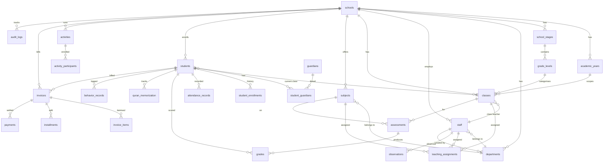

# 05 — Database Tables Reference

**Madrasati ERP** — complete column-by-column reference for every table in the Supabase Postgres schema.  
Migration files live in `supabase/migrations/` and must be applied in filename order (`0001` → `0005`).

> **Multi-tenancy:** nearly every domain table carries `school_id uuid not null` and is isolated by RLS policies that call `in_my_school(school_id)`. Exceptions (child tables without a direct `school_id`) are scoped through their parent row — see [Row-Level Security](#row-level-security) at the end.

---

## Entity-Relationship Overview

---

## Migration 0001 — Core & RBAC

Source: `supabase/migrations/0001_core_and_rbac.sql`

### `public.schools` — Tenant Root

Every domain row in the system carries `school_id` pointing here.

| Column | Type | Constraints | Description |
|---|---|---|---|
| `id` | `uuid` | PK, default `gen_random_uuid()` | Tenant identifier |
| `name_ar` | `text` | NOT NULL | School name in Arabic (اسم المدرسة) |
| `name_en` | `text` | — | School name in English |
| `slug` | `text` | UNIQUE NOT NULL | URL-safe identifier used in routing |
| `logo_url` | `text` | — | Primary logo (Supabase Storage URL) |
| `secondary_logo_url` | `text` | — | Secondary / ministry logo |
| `stamp_url` | `text` | — | Official stamp image for printed documents |
| `signature_url` | `text` | — | Principal's signature image |
| `login_bg_url` | `text` | — | Login page background image |
| `banner_url` | `text` | — | Portal banner image |
| `slogan_ar` | `text` | — | School slogan in Arabic |
| `slogan_en` | `text` | — | School slogan in English |
| `address` | `text` | — | Physical address |
| `phone` | `text` | — | Main contact phone |
| `email` | `text` | — | Main contact email |
| `website` | `text` | — | School website URL |
| `principal_name` | `text` | — | Full name of the current principal |
| `theme` | `jsonb` | — | CSS custom-property overrides, e.g. `{"--primary": "218 64% 23%"}` |
| `calendar` | `text` | NOT NULL, default `'gregorian'`, CHECK IN `('gregorian','hijri')` | Preferred calendar system |
| `is_active` | `boolean` | NOT NULL, default `true` | Soft-disable a tenant without deleting data |
| `created_at` | `timestamptz` | NOT NULL, default `now()` | Record creation timestamp |
| `updated_at` | `timestamptz` | NOT NULL, default `now()` | Auto-updated by `trg_schools_updated` trigger |

---

### `public.roles` — RBAC Role Registry

Pre-seeded system roles; keyed by short text identifier.

| Column | Type | Constraints | Description |
|---|---|---|---|
| `key` | `text` | PK | Role identifier, e.g. `'teacher'`, `'principal'` |
| `name_ar` | `text` | NOT NULL | Arabic display name |
| `name_en` | `text` | NOT NULL | English display name |
| `is_system` | `boolean` | NOT NULL, default `true` | System roles cannot be deleted via UI |

**Seeded roles:**

| `key` | `name_ar` | `name_en` |
|---|---|---|
| `super_admin` | مدير النظام | Super Administrator |
| `principal` | مدير المدرسة | Principal |
| `vice_principal` | وكيل المدرسة | Vice Principal |
| `department_head` | رئيس قسم | Department Head |
| `teacher` | معلم | Teacher |
| `activity_supervisor` | مشرف نشاط | Activity Supervisor |
| `registrar` | مسؤول التسجيل | Registrar |
| `finance_officer` | مسؤول مالي | Finance Officer |
| `auditor` | مدقق النظام | System Auditor |
| `student` | طالب | Student |
| `parent` | ولي أمر | Parent |

---

### `public.permissions` — Permission Catalogue

| Column | Type | Constraints | Description |
|---|---|---|---|
| `key` | `text` | PK | Permission string in `resource:action` format |
| `description` | `text` | — | Human-readable description |

**All defined permissions:**

| Permission | Scope |
|---|---|
| `*` | Wildcard — grants everything (super_admin only) |
| `students:read` / `students:write` / `students:delete` / `students:import` | Student records |
| `teachers:read` / `teachers:write` | Staff records |
| `classes:read` / `classes:write` | Class management |
| `subjects:read` / `subjects:write` | Subject catalogue |
| `departments:read` / `departments:write` | Department management |
| `attendance:read` / `attendance:write` | Daily attendance |
| `grades:read` / `grades:write` | Assessments & grades |
| `timetable:read` / `timetable:write` | Timetable slots |
| `curriculum:read` / `curriculum:write` | Curriculum plans & coverage |
| `islamic:read` / `islamic:write` | Quran memorisation records |
| `behavior:read` / `behavior:write` | Behavior & discipline logs |
| `observations:read` / `observations:write` | Teacher observation reports |
| `activities:read` / `activities:write` | Activities & clubs |
| `reports:read` | Report & certificate access |
| `communication:send` | Announcements & messages |
| `analytics:read` | Dashboard analytics |
| `finance:read` / `finance:write` | Fee structures, invoices, payments |
| `settings:write` | School settings |
| `branding:write` | Logos, templates, theme |
| `users:manage` | Invite/edit staff accounts |
| `audit:read` | View audit trail |

---

### `public.role_permissions` — Grant Matrix

Junction table linking roles to their permitted actions.

| Column | Type | Constraints | Description |
|---|---|---|---|
| `role_key` | `text` | PK (composite), FK → `roles(key)` CASCADE | The role being granted |
| `permission_key` | `text` | PK (composite), FK → `permissions(key)` CASCADE | The permission being granted |

---

### `public.profiles` — User Profiles

One row per `auth.users` entry. Holds role and tenant binding.

| Column | Type | Constraints | Description |
|---|---|---|---|
| `id` | `uuid` | PK, FK → `auth.users(id)` CASCADE | Matches Supabase Auth user id |
| `school_id` | `uuid` | FK → `schools(id)` ON DELETE SET NULL | The tenant this user belongs to |
| `email` | `citext` | — | Case-insensitive email mirror from auth |
| `full_name` | `text` | — | Display name |
| `role` | `text` | NOT NULL, default `'teacher'`, FK → `roles(key)` | User's primary RBAC role |
| `avatar_url` | `text` | — | Profile photo URL |
| `must_change_password` | `boolean` | NOT NULL, default `false` | Forces password reset on next login |
| `created_at` | `timestamptz` | NOT NULL, default `now()` | Creation timestamp |
| `updated_at` | `timestamptz` | NOT NULL, default `now()` | Auto-updated by trigger |

**Indexes:** `profiles_school_idx` on `(school_id)`.

**Auto-create trigger:** `on_auth_user_created` fires `handle_new_user()` — inserts a profile row on every new Supabase Auth signup, reading `full_name`, `role`, and `school_id` from `raw_user_meta_data`.

---

## Migration 0002 — Academic Structure & People

Source: `supabase/migrations/0002_academic_and_people.sql`

### `public.academic_years`

| Column | Type | Constraints | Description |
|---|---|---|---|
| `id` | `uuid` | PK | — |
| `school_id` | `uuid` | NOT NULL, FK → `schools` CASCADE | Tenant |
| `name` | `text` | NOT NULL | Display label, e.g. `"2025/2026"` |
| `start_date` | `date` | NOT NULL | First day of the academic year |
| `end_date` | `date` | NOT NULL | Last day of the academic year |
| `is_current` | `boolean` | NOT NULL, default `false` | At most one row per school can be `true` (partial unique index) |
| `created_at` | `timestamptz` | NOT NULL, default `now()` | — |

**Unique index:** `academic_years_current_uq` on `(school_id) WHERE is_current` — enforces a single active year per tenant.

---

### `public.school_stages`

Educational stages (المرحلة), e.g. ابتدائي / متوسط / ثانوي.

| Column | Type | Constraints | Description |
|---|---|---|---|
| `id` | `uuid` | PK | — |
| `school_id` | `uuid` | NOT NULL, FK → `schools` CASCADE | Tenant |
| `name_ar` | `text` | NOT NULL | Arabic stage name |
| `name_en` | `text` | — | English stage name |
| `sort_order` | `int` | NOT NULL, default `0` | Display ordering |

---

### `public.grade_levels`

Individual grade levels (الصف) within a stage.

| Column | Type | Constraints | Description |
|---|---|---|---|
| `id` | `uuid` | PK | — |
| `school_id` | `uuid` | NOT NULL, FK → `schools` CASCADE | Tenant |
| `stage_id` | `uuid` | NOT NULL, FK → `school_stages` CASCADE | Parent stage |
| `name_ar` | `text` | NOT NULL | Arabic grade name, e.g. `"الصف الأول"` |
| `name_en` | `text` | — | English grade name |
| `sort_order` | `int` | NOT NULL, default `0` | Display ordering |

**Indexes:** `grade_levels_stage_idx` on `(stage_id)`.

---

### `public.departments`

Academic or administrative departments (الأقسام).

| Column | Type | Constraints | Description |
|---|---|---|---|
| `id` | `uuid` | PK | — |
| `school_id` | `uuid` | NOT NULL, FK → `schools` CASCADE | Tenant |
| `name_ar` | `text` | NOT NULL | Arabic department name |
| `name_en` | `text` | — | English department name |
| `head_id` | `uuid` | FK → `staff(id)` ON DELETE SET NULL | Department head (رئيس القسم); set after staff table exists |
| `created_at` | `timestamptz` | NOT NULL, default `now()` | — |

---

### `public.staff`

All school staff members including teachers and administrators (الموظفون).

| Column | Type | Constraints | Description |
|---|---|---|---|
| `id` | `uuid` | PK | — |
| `school_id` | `uuid` | NOT NULL, FK → `schools` CASCADE | Tenant |
| `profile_id` | `uuid` | FK → `profiles(id)` ON DELETE SET NULL | Linked system login account (optional) |
| `employee_no` | `text` | — | Internal employee number (رقم الموظف) |
| `civil_id` | `text` | — | National civil ID number (الرقم المدني) |
| `name_ar` | `text` | NOT NULL | Arabic full name |
| `name_en` | `text` | — | English full name |
| `department_id` | `uuid` | FK → `departments(id)` ON DELETE SET NULL | Assigned department |
| `position` | `text` | — | Job title / position |
| `qualifications` | `text` | — | Academic qualifications |
| `experience_years` | `int` | — | Years of teaching/work experience |
| `email` | `citext` | — | Work email address |
| `mobile` | `text` | — | Mobile phone number |
| `hire_date` | `date` | — | Date of joining (تاريخ التعيين) |
| `status` | `text` | NOT NULL, default `'active'`, CHECK IN `('active','inactive','archived')` | Employment status |
| `created_at` | `timestamptz` | NOT NULL, default `now()` | — |
| `updated_at` | `timestamptz` | NOT NULL, default `now()` | Auto-updated by trigger |

**Indexes:** `staff_school_idx` on `(school_id)`, `staff_dept_idx` on `(department_id)`.

---

### `public.classes`

A class / section (الفصل الدراسي) within an academic year.

| Column | Type | Constraints | Description |
|---|---|---|---|
| `id` | `uuid` | PK | — |
| `school_id` | `uuid` | NOT NULL, FK → `schools` CASCADE | Tenant |
| `academic_year_id` | `uuid` | NOT NULL, FK → `academic_years` CASCADE | Which year this class belongs to |
| `grade_level_id` | `uuid` | NOT NULL, FK → `grade_levels` RESTRICT | Grade level (cannot delete a grade while classes exist) |
| `name` | `text` | NOT NULL | Section name, e.g. `"أ"` or `"1A"` |
| `capacity` | `int` | NOT NULL, default `42` | Maximum student count |
| `class_teacher_id` | `uuid` | FK → `staff(id)` ON DELETE SET NULL | Homeroom / class teacher |
| `student_count` | `int` | NOT NULL, default `0` | Auto-maintained by `trg_student_class_count` trigger |
| `status` | `text` | NOT NULL, default `'active'`, CHECK IN `('active','archived')` | Archive without deleting history |
| `created_at` | `timestamptz` | NOT NULL, default `now()` | — |
| `updated_at` | `timestamptz` | NOT NULL, default `now()` | Auto-updated by trigger |

**Indexes:** `classes_year_idx` on `(academic_year_id)`, `classes_grade_idx` on `(grade_level_id)`.

> `student_count` is automatically recalculated whenever a student's `current_class_id` or `status` changes, via the `refresh_class_count()` trigger function.

---

### `public.subjects`

Subject catalogue (المواد الدراسية).

| Column | Type | Constraints | Description |
|---|---|---|---|
| `id` | `uuid` | PK | — |
| `school_id` | `uuid` | NOT NULL, FK → `schools` CASCADE | Tenant |
| `department_id` | `uuid` | FK → `departments(id)` ON DELETE SET NULL | Owning department |
| `name_ar` | `text` | NOT NULL | Arabic subject name |
| `name_en` | `text` | — | English subject name |
| `code` | `text` | NOT NULL, UNIQUE per school | Short subject code, e.g. `"MATH"`, `"QRN"` |
| `weekly_periods` | `int` | NOT NULL, default `1` | Default weekly period count |
| `created_at` | `timestamptz` | NOT NULL, default `now()` | — |

**Unique index:** `subjects_code_uq` on `(school_id, code)`.

---

### `public.teaching_assignments`

Maps a staff member to a subject and class for a given year (جدول التدريس).

| Column | Type | Constraints | Description |
|---|---|---|---|
| `id` | `uuid` | PK | — |
| `school_id` | `uuid` | NOT NULL, FK → `schools` CASCADE | Tenant |
| `staff_id` | `uuid` | NOT NULL, FK → `staff` CASCADE | The teacher |
| `subject_id` | `uuid` | NOT NULL, FK → `subjects` CASCADE | The subject |
| `class_id` | `uuid` | NOT NULL, FK → `classes` CASCADE | The class section |
| `academic_year_id` | `uuid` | NOT NULL, FK → `academic_years` CASCADE | The academic year |
| `weekly_periods` | `int` | NOT NULL, default `0` | Actual periods assigned for this combination |

**Unique constraint** on `(staff_id, subject_id, class_id, academic_year_id)` — prevents duplicate assignments.  
**Indexes:** `ta_class_idx` on `(class_id)`, `ta_staff_idx` on `(staff_id)`.

---

### `public.students`

Student registry (سجل الطلاب).

| Column | Type | Constraints | Description |
|---|---|---|---|
| `id` | `uuid` | PK | — |
| `school_id` | `uuid` | NOT NULL, FK → `schools` CASCADE | Tenant |
| `student_no` | `text` | — | Internal student number (رقم الطالب) |
| `ministry_no` | `text` | — | Ministry registration number; UNIQUE per school when not null |
| `civil_id` | `text` | — | National civil ID |
| `name_ar` | `text` | NOT NULL | Arabic full name |
| `name_en` | `text` | — | English full name |
| `gender` | `text` | NOT NULL, default `'male'`, CHECK IN `('male','female')` | Student gender |
| `dob` | `date` | — | Date of birth (تاريخ الميلاد) |
| `nationality` | `text` | — | Nationality / جنسية |
| `religion` | `text` | — | Religion |
| `address` | `text` | — | Home address |
| `medical_notes` | `text` | — | Health / medical notes (ملاحظات طبية) |
| `enrollment_date` | `date` | — | Date of first enrollment |
| `status` | `text` | NOT NULL, default `'enrolled'`, CHECK IN `('enrolled','transferred','withdrawn','graduated','archived')` | Current status |
| `emergency_contact` | `text` | — | Emergency contact phone / name |
| `father_name` | `text` | — | Father's name (اسم الأب) |
| `mother_name` | `text` | — | Mother's name (اسم الأم) |
| `guardian_name` | `text` | — | Primary guardian name (ولي الأمر) |
| `guardian_mobile` | `text` | — | Guardian mobile phone |
| `guardian_email` | `citext` | — | Guardian email (case-insensitive) |
| `guardian_occupation` | `text` | — | Guardian occupation |
| `current_class_id` | `uuid` | FK → `classes(id)` ON DELETE SET NULL | Current enrolled class; triggers `student_count` refresh |
| `photo_url` | `text` | — | Student photo (Supabase Storage) |
| `created_at` | `timestamptz` | NOT NULL, default `now()` | — |
| `updated_at` | `timestamptz` | NOT NULL, default `now()` | Auto-updated by trigger |

**Indexes:** `students_school_idx`, `students_class_idx`, `students_status_idx`.  
**Unique index:** `students_ministry_uq` on `(school_id, ministry_no) WHERE ministry_no IS NOT NULL`.

---

### `public.guardians`

Parent / guardian accounts for the parent portal (حسابات أولياء الأمور).

| Column | Type | Constraints | Description |
|---|---|---|---|
| `id` | `uuid` | PK | — |
| `school_id` | `uuid` | NOT NULL, FK → `schools` CASCADE | Tenant |
| `profile_id` | `uuid` | FK → `profiles(id)` ON DELETE SET NULL | Linked login account |
| `name` | `text` | NOT NULL | Guardian full name |
| `mobile` | `text` | — | Mobile phone |
| `email` | `citext` | — | Email address |
| `occupation` | `text` | — | Occupation |
| `created_at` | `timestamptz` | NOT NULL, default `now()` | — |

---

### `public.student_guardians`

Junction: links students to their guardians (ربط الطالب بولي أمره).

| Column | Type | Constraints | Description |
|---|---|---|---|
| `student_id` | `uuid` | PK (composite), FK → `students` CASCADE | Student |
| `guardian_id` | `uuid` | PK (composite), FK → `guardians` CASCADE | Guardian |
| `relation` | `text` | — | Relationship type: `father` / `mother` / `guardian` |
| `is_primary` | `boolean` | NOT NULL, default `false` | Marks the primary contact |

---

### `public.student_enrollments`

Historical enrollment record per academic year — tracks promotions and transfers (سجل القيد).

| Column | Type | Constraints | Description |
|---|---|---|---|
| `id` | `uuid` | PK | — |
| `school_id` | `uuid` | NOT NULL, FK → `schools` CASCADE | Tenant |
| `student_id` | `uuid` | NOT NULL, FK → `students` CASCADE | Student |
| `class_id` | `uuid` | FK → `classes(id)` ON DELETE SET NULL | Class at the time of enrollment |
| `academic_year_id` | `uuid` | NOT NULL, FK → `academic_years` CASCADE | The year this record covers |
| `status` | `text` | NOT NULL, default `'enrolled'` | Enrollment status at that point in time |
| `note` | `text` | — | Transfer note or comment |
| `created_at` | `timestamptz` | NOT NULL, default `now()` | When this history row was created |

**Index:** `enroll_student_idx` on `(student_id)`.

---

## Migration 0003 — Daily Operations

Source: `supabase/migrations/0003_operations.sql`

### `public.attendance_records`

Daily attendance per student (سجل الحضور والغياب).

| Column | Type | Constraints | Description |
|---|---|---|---|
| `id` | `uuid` | PK | — |
| `school_id` | `uuid` | NOT NULL, FK → `schools` CASCADE | Tenant |
| `student_id` | `uuid` | NOT NULL, FK → `students` CASCADE | The student |
| `class_id` | `uuid` | NOT NULL, FK → `classes` CASCADE | Class on that date |
| `date` | `date` | NOT NULL | Attendance date |
| `status` | `text` | NOT NULL, CHECK IN `('present','absent','excused','late','medical')` | Attendance status |
| `note` | `text` | — | Optional note (e.g. excuse reason) |
| `recorded_by` | `uuid` | FK → `profiles(id)` ON DELETE SET NULL | Staff member who recorded attendance |
| `created_at` | `timestamptz` | NOT NULL, default `now()` | — |

**Unique constraint** on `(student_id, date)` — one record per student per day.  
**Indexes:** `att_class_date_idx` on `(class_id, date)`, `att_school_date_idx` on `(school_id, date)`.

---

### `public.grade_scales`

Maps score percentages to letter grades and GPA values (سلم الدرجات).

| Column | Type | Constraints | Description |
|---|---|---|---|
| `id` | `uuid` | PK | — |
| `school_id` | `uuid` | NOT NULL, FK → `schools` CASCADE | Tenant |
| `min_pct` | `numeric(5,2)` | NOT NULL | Minimum percentage for this band |
| `max_pct` | `numeric(5,2)` | NOT NULL | Maximum percentage for this band |
| `letter` | `text` | NOT NULL | Letter grade, e.g. `"A+"`, `"B"` |
| `gpa` | `numeric(3,2)` | NOT NULL | GPA equivalent |
| `label_ar` | `text` | — | Arabic label, e.g. `"ممتاز"` |

---

### `public.assessment_types`

Assessment type definitions with weights (أنواع التقييمات).

| Column | Type | Constraints | Description |
|---|---|---|---|
| `id` | `uuid` | PK | — |
| `school_id` | `uuid` | NOT NULL, FK → `schools` CASCADE | Tenant |
| `name_ar` | `text` | NOT NULL | Arabic type name, e.g. `"اختبار فصلي"` |
| `name_en` | `text` | — | English type name |
| `weight` | `numeric(5,2)` | NOT NULL, default `0` | Percentage contribution to the subject total |
| `max_score` | `numeric(6,2)` | NOT NULL, default `100` | Maximum raw score for this type |
| `sort_order` | `int` | NOT NULL, default `0` | Display ordering |

---

### `public.assessments`

An individual graded item assigned to a class/subject (امتحان أو تقييم).

| Column | Type | Constraints | Description |
|---|---|---|---|
| `id` | `uuid` | PK | — |
| `school_id` | `uuid` | NOT NULL, FK → `schools` CASCADE | Tenant |
| `class_id` | `uuid` | NOT NULL, FK → `classes` CASCADE | Target class |
| `subject_id` | `uuid` | NOT NULL, FK → `subjects` CASCADE | Subject being assessed |
| `assessment_type_id` | `uuid` | FK → `assessment_types(id)` ON DELETE SET NULL | Assessment type / category |
| `term` | `int` | NOT NULL, default `1` | Academic term number (e.g. 1 or 2) |
| `title` | `text` | NOT NULL | Assessment title |
| `max_score` | `numeric(6,2)` | NOT NULL, default `100` | Maximum possible score |
| `date` | `date` | — | Scheduled date |
| `created_by` | `uuid` | FK → `profiles(id)` ON DELETE SET NULL | Staff who created the assessment |
| `created_at` | `timestamptz` | NOT NULL, default `now()` | — |

**Index:** `assess_class_subject_idx` on `(class_id, subject_id)`.

---

### `public.grades`

A student's score on a specific assessment (درجة الطالب).

| Column | Type | Constraints | Description |
|---|---|---|---|
| `id` | `uuid` | PK | — |
| `school_id` | `uuid` | NOT NULL, FK → `schools` CASCADE | Tenant |
| `assessment_id` | `uuid` | NOT NULL, FK → `assessments` CASCADE | Parent assessment |
| `student_id` | `uuid` | NOT NULL, FK → `students` CASCADE | The student |
| `score` | `numeric(6,2)` | — | Raw score (null = not yet graded) |
| `note` | `text` | — | Teacher note |
| `updated_at` | `timestamptz` | NOT NULL, default `now()` | Auto-updated by trigger |

**Unique constraint** on `(assessment_id, student_id)`.  
**Index:** `grades_student_idx` on `(student_id)`.

---

### `public.report_cards`

Frozen end-of-term report card snapshots (الكشوف الشهرية والفصلية).

| Column | Type | Constraints | Description |
|---|---|---|---|
| `id` | `uuid` | PK | — |
| `school_id` | `uuid` | NOT NULL, FK → `schools` CASCADE | Tenant |
| `student_id` | `uuid` | NOT NULL, FK → `students` CASCADE | The student |
| `academic_year_id` | `uuid` | NOT NULL, FK → `academic_years` CASCADE | Academic year |
| `term` | `int` | NOT NULL | Term number |
| `gpa` | `numeric(3,2)` | — | Calculated GPA |
| `average` | `numeric(5,2)` | — | Overall percentage average |
| `rank` | `int` | — | Class rank at the time of generation |
| `comment` | `text` | — | Teacher or principal's comment |
| `data` | `jsonb` | — | Frozen per-subject breakdown (subject name, score, grade letter, etc.) |
| `issued_at` | `timestamptz` | NOT NULL, default `now()` | Generation timestamp |

---

### `public.quran_surahs`

Reference table for Quran surahs — static data (فهرس السور).

| Column | Type | Constraints | Description |
|---|---|---|---|
| `number` | `int` | PK | Surah number (1–114) |
| `name_ar` | `text` | NOT NULL | Arabic surah name |
| `ayah_count` | `int` | NOT NULL | Number of verses in the surah |

---

### `public.quran_memorization`

Tracks a student's Quran memorisation progress per surah (تسميع القرآن الكريم).

| Column | Type | Constraints | Description |
|---|---|---|---|
| `id` | `uuid` | PK | — |
| `school_id` | `uuid` | NOT NULL, FK → `schools` CASCADE | Tenant |
| `student_id` | `uuid` | NOT NULL, FK → `students` CASCADE | The student |
| `surah_number` | `int` | NOT NULL, FK → `quran_surahs(number)` | Surah being tracked |
| `from_ayah` | `int` | — | Starting verse number |
| `to_ayah` | `int` | — | Ending verse number |
| `status` | `text` | NOT NULL, default `'in_progress'`, CHECK IN `('not_started','in_progress','memorized')` | Memorisation status |
| `score` | `numeric(5,2)` | — | Recitation score |
| `tajweed_score` | `numeric(5,2)` | — | Tajweed (تجويد) quality score |
| `assessed_by` | `uuid` | FK → `profiles(id)` ON DELETE SET NULL | Teacher who conducted the assessment |
| `assessed_at` | `date` | — | Date of assessment |
| `created_at` | `timestamptz` | NOT NULL, default `now()` | — |

**Index:** `quran_student_idx` on `(student_id)`.

---

### `public.quran_revisions`

Daily revision sessions log (مراجعة الحفظ).

| Column | Type | Constraints | Description |
|---|---|---|---|
| `id` | `uuid` | PK | — |
| `school_id` | `uuid` | NOT NULL, FK → `schools` CASCADE | Tenant |
| `student_id` | `uuid` | NOT NULL, FK → `students` CASCADE | The student |
| `surah_number` | `int` | FK → `quran_surahs(number)` | Surah revised |
| `date` | `date` | NOT NULL | Revision date |
| `quality` | `text` | CHECK IN `('excellent','good','fair','weak')` | Quality assessment |
| `note` | `text` | — | Teacher's note |

---

### `public.curriculum_plans`

Top-level curriculum plan for a subject/grade/year (خطة المنهج).

| Column | Type | Constraints | Description |
|---|---|---|---|
| `id` | `uuid` | PK | — |
| `school_id` | `uuid` | NOT NULL, FK → `schools` CASCADE | Tenant |
| `subject_id` | `uuid` | NOT NULL, FK → `subjects` CASCADE | Subject this plan covers |
| `grade_level_id` | `uuid` | FK → `grade_levels(id)` ON DELETE SET NULL | Target grade level |
| `academic_year_id` | `uuid` | FK → `academic_years(id)` ON DELETE CASCADE | Academic year |
| `title` | `text` | NOT NULL | Plan title |

---

### `public.curriculum_units`

Unit within a curriculum plan (وحدة دراسية). Scoped via parent plan for RLS.

| Column | Type | Constraints | Description |
|---|---|---|---|
| `id` | `uuid` | PK | — |
| `plan_id` | `uuid` | NOT NULL, FK → `curriculum_plans` CASCADE | Parent plan |
| `title` | `text` | NOT NULL | Unit title |
| `sort_order` | `int` | NOT NULL, default `0` | Display ordering |

---

### `public.curriculum_lessons`

Individual lesson within a unit (درس). Scoped via unit → plan for RLS.

| Column | Type | Constraints | Description |
|---|---|---|---|
| `id` | `uuid` | PK | — |
| `unit_id` | `uuid` | NOT NULL, FK → `curriculum_units` CASCADE | Parent unit |
| `title` | `text` | NOT NULL | Lesson title |
| `outcomes` | `text` | — | Learning outcomes (مخرجات التعلم) |
| `planned_date` | `date` | — | Intended teaching date |
| `sort_order` | `int` | NOT NULL, default `0` | Display ordering |

---

### `public.curriculum_coverage`

Actual coverage record — marks whether a lesson has been taught to a class (التغطية الفعلية).

| Column | Type | Constraints | Description |
|---|---|---|---|
| `id` | `uuid` | PK | — |
| `school_id` | `uuid` | NOT NULL, FK → `schools` CASCADE | Tenant |
| `lesson_id` | `uuid` | NOT NULL, FK → `curriculum_lessons` CASCADE | Lesson being covered |
| `class_id` | `uuid` | NOT NULL, FK → `classes` CASCADE | Class it was taught to |
| `status` | `text` | NOT NULL, default `'not_started'`, CHECK IN `('not_started','in_progress','completed')` | Coverage status |
| `covered_on` | `date` | — | Date lesson was completed |
| `recorded_by` | `uuid` | FK → `profiles(id)` ON DELETE SET NULL | Staff who marked coverage |

**Unique constraint** on `(lesson_id, class_id)`.

---

### `public.behavior_records`

Positive and negative behavior / discipline events (سجل السلوك والانضباط).

| Column | Type | Constraints | Description |
|---|---|---|---|
| `id` | `uuid` | PK | — |
| `school_id` | `uuid` | NOT NULL, FK → `schools` CASCADE | Tenant |
| `student_id` | `uuid` | NOT NULL, FK → `students` CASCADE | The student |
| `kind` | `text` | NOT NULL, CHECK IN `('positive','negative')` | Event polarity |
| `category` | `text` | NOT NULL | Sub-category: `award` / `leadership` for positive; `warning` / `misconduct` / `suspension` for negative |
| `description` | `text` | — | Details of the incident or achievement |
| `action_taken` | `text` | — | Disciplinary action or reward given |
| `points` | `int` | default `0` | Behavior points awarded / deducted |
| `recorded_by` | `uuid` | FK → `profiles(id)` ON DELETE SET NULL | Recording staff member |
| `date` | `date` | NOT NULL, default `current_date` | Date of event |
| `created_at` | `timestamptz` | NOT NULL, default `now()` | — |

**Index:** `behavior_student_idx` on `(student_id)`.

---

### `public.rooms`

Physical classroom/lab rooms available for scheduling (القاعات والمختبرات).

| Column | Type | Constraints | Description |
|---|---|---|---|
| `id` | `uuid` | PK | — |
| `school_id` | `uuid` | NOT NULL, FK → `schools` CASCADE | Tenant |
| `name` | `text` | NOT NULL | Room name / label |
| `capacity` | `int` | — | Seating capacity |

---

### `public.periods`

School day period definitions (الحصص الدراسية).

| Column | Type | Constraints | Description |
|---|---|---|---|
| `id` | `uuid` | PK | — |
| `school_id` | `uuid` | NOT NULL, FK → `schools` CASCADE | Tenant |
| `label` | `text` | NOT NULL | Period label, e.g. `"الحصة الأولى"` |
| `start_time` | `time` | NOT NULL | Period start time |
| `end_time` | `time` | NOT NULL | Period end time |
| `sort_order` | `int` | NOT NULL, default `0` | Display ordering |

---

### `public.timetable_slots`

Weekly timetable — one slot per class × period × day (الجدول الأسبوعي).

| Column | Type | Constraints | Description |
|---|---|---|---|
| `id` | `uuid` | PK | — |
| `school_id` | `uuid` | NOT NULL, FK → `schools` CASCADE | Tenant |
| `class_id` | `uuid` | NOT NULL, FK → `classes` CASCADE | The class |
| `subject_id` | `uuid` | FK → `subjects(id)` ON DELETE SET NULL | Subject taught in this slot |
| `staff_id` | `uuid` | FK → `staff(id)` ON DELETE SET NULL | Teaching staff member |
| `room_id` | `uuid` | FK → `rooms(id)` ON DELETE SET NULL | Assigned room |
| `period_id` | `uuid` | NOT NULL, FK → `periods` CASCADE | Period within the day |
| `day_of_week` | `int` | NOT NULL, CHECK BETWEEN `0` AND `6` | Day (0 = Sunday … 6 = Saturday) |

**Unique constraint** on `(class_id, period_id, day_of_week)` — a class can only have one subject per slot.  
**Unique index** `timetable_teacher_uq` on `(staff_id, period_id, day_of_week) WHERE staff_id IS NOT NULL` — prevents a teacher double-booking.

---

### `public.activities`

Extra-curricular activities, summer clubs, and trips (الأنشطة والنوادي).

| Column | Type | Constraints | Description |
|---|---|---|---|
| `id` | `uuid` | PK | — |
| `school_id` | `uuid` | NOT NULL, FK → `schools` CASCADE | Tenant |
| `name` | `text` | NOT NULL | Activity name |
| `kind` | `text` | — | Category: `summer_club` / `camp` / `competition` / `sport` / `trip` |
| `description` | `text` | — | Full description |
| `supervisor_id` | `uuid` | FK → `staff(id)` ON DELETE SET NULL | Supervising staff member |
| `start_date` | `date` | — | Activity start date |
| `end_date` | `date` | — | Activity end date |
| `fee` | `numeric(10,2)` | default `0` | Participation fee |
| `capacity` | `int` | — | Maximum participants |
| `created_at` | `timestamptz` | NOT NULL, default `now()` | — |

---

### `public.activity_participants`

Students enrolled in an activity (المشاركون في النشاط). Scoped via parent activity for RLS.

| Column | Type | Constraints | Description |
|---|---|---|---|
| `activity_id` | `uuid` | PK (composite), FK → `activities` CASCADE | Activity |
| `student_id` | `uuid` | PK (composite), FK → `students` CASCADE | Student |
| `enrolled_at` | `timestamptz` | NOT NULL, default `now()` | Enrollment timestamp |
| `fee_paid` | `boolean` | NOT NULL, default `false` | Whether the activity fee has been paid |

---

### `public.activity_attendance`

Daily attendance log for activity sessions (حضور النشاط).

| Column | Type | Constraints | Description |
|---|---|---|---|
| `id` | `uuid` | PK | — |
| `activity_id` | `uuid` | NOT NULL, FK → `activities` CASCADE | Activity |
| `student_id` | `uuid` | NOT NULL, FK → `students` CASCADE | Student |
| `date` | `date` | NOT NULL | Session date |
| `present` | `boolean` | NOT NULL, default `true` | Whether student attended |

---

### `public.observations`

Formal teacher observation / supervision reports (ملاحظات الإشراف التربوي).

| Column | Type | Constraints | Description |
|---|---|---|---|
| `id` | `uuid` | PK | — |
| `school_id` | `uuid` | NOT NULL, FK → `schools` CASCADE | Tenant |
| `staff_id` | `uuid` | NOT NULL, FK → `staff` CASCADE | The observed teacher |
| `observer_id` | `uuid` | FK → `profiles(id)` ON DELETE SET NULL | The observer (e.g. vice principal) |
| `class_id` | `uuid` | FK → `classes(id)` ON DELETE SET NULL | Class that was observed |
| `subject_id` | `uuid` | FK → `subjects(id)` ON DELETE SET NULL | Subject during the observation |
| `date` | `date` | NOT NULL, default `current_date` | Observation date |
| `overall_score` | `numeric(5,2)` | — | Composite score across all criteria |
| `strengths` | `text` | — | Narrative: observed strengths |
| `improvements` | `text` | — | Narrative: areas for improvement |
| `development_plan` | `text` | — | Agreed development plan |
| `status` | `text` | NOT NULL, default `'draft'`, CHECK IN `('draft','submitted','acknowledged')` | Workflow status |
| `created_at` | `timestamptz` | NOT NULL, default `now()` | — |

---

### `public.observation_items`

Individual scored criteria within an observation report (بنود الملاحظة). Scoped via parent observation for RLS.

| Column | Type | Constraints | Description |
|---|---|---|---|
| `id` | `uuid` | PK | — |
| `observation_id` | `uuid` | NOT NULL, FK → `observations` CASCADE | Parent observation |
| `criterion` | `text` | NOT NULL | Criterion description |
| `score` | `numeric(5,2)` | — | Score for this criterion |
| `note` | `text` | — | Detailed note |

---

## Migration 0004 — Administration, Finance & Audit

Source: `supabase/migrations/0004_admin_finance_audit.sql`

### `public.report_templates`

Drag-and-drop designer templates for report cards, certificates, and attendance sheets (قوالب التقارير).

| Column | Type | Constraints | Description |
|---|---|---|---|
| `id` | `uuid` | PK | — |
| `school_id` | `uuid` | NOT NULL, FK → `schools` CASCADE | Tenant |
| `name` | `text` | NOT NULL | Template name |
| `kind` | `text` | NOT NULL | Template kind: `report_card` / `attendance` / `certificate_quran` / `achievement` / `participation` |
| `layout` | `jsonb` | NOT NULL, default `'{}'` | Full drag-and-drop layout definition (header, footer, blocks, QR config) |
| `is_default` | `boolean` | NOT NULL, default `false` | Whether this is the default template for its kind |
| `created_at` | `timestamptz` | NOT NULL, default `now()` | — |
| `updated_at` | `timestamptz` | NOT NULL, default `now()` | Auto-updated by trigger |

---

### `public.announcements`

School-wide or targeted announcements (الإعلانات والنشرات).

| Column | Type | Constraints | Description |
|---|---|---|---|
| `id` | `uuid` | PK | — |
| `school_id` | `uuid` | NOT NULL, FK → `schools` CASCADE | Tenant |
| `title` | `text` | NOT NULL | Announcement title |
| `body` | `text` | — | Full announcement body |
| `audience` | `text` | NOT NULL, default `'all'` | Target audience: `all` / `teachers` / `parents` / `students` / `class:<uuid>` |
| `published_at` | `timestamptz` | — | Scheduled publish time (null = draft) |
| `created_by` | `uuid` | FK → `profiles(id)` ON DELETE SET NULL | Author |
| `created_at` | `timestamptz` | NOT NULL, default `now()` | — |

---

### `public.notifications`

In-app notification per user (الإشعارات الداخلية).

| Column | Type | Constraints | Description |
|---|---|---|---|
| `id` | `uuid` | PK | — |
| `school_id` | `uuid` | NOT NULL, FK → `schools` CASCADE | Tenant |
| `user_id` | `uuid` | FK → `profiles(id)` ON DELETE CASCADE | Recipient user |
| `title` | `text` | NOT NULL | Short notification title |
| `body` | `text` | — | Notification body text |
| `kind` | `text` | — | Category: `attendance` / `grade` / `announcement` / `event` |
| `read_at` | `timestamptz` | — | Null = unread; set when user dismisses |
| `created_at` | `timestamptz` | NOT NULL, default `now()` | — |

**Index:** `notif_user_idx` on `(user_id, read_at)` — fast unread count queries.  
**RLS:** strictly user-owned; only the recipient can read/update their own notifications.

---

### `public.message_log`

Outbound messaging audit trail for all channels (سجل الرسائل الصادرة).

| Column | Type | Constraints | Description |
|---|---|---|---|
| `id` | `uuid` | PK | — |
| `school_id` | `uuid` | NOT NULL, FK → `schools` CASCADE | Tenant |
| `channel` | `text` | NOT NULL, CHECK IN `('email','sms','whatsapp','push')` | Delivery channel |
| `recipient` | `text` | NOT NULL | Recipient address (email / phone) |
| `template` | `text` | — | Template name used |
| `payload` | `jsonb` | — | Message variables / content snapshot |
| `status` | `text` | NOT NULL, default `'queued'`, CHECK IN `('queued','sent','failed')` | Delivery status |
| `error` | `text` | — | Error details if `status = 'failed'` |
| `created_at` | `timestamptz` | NOT NULL, default `now()` | — |

---

### `public.fee_structures`

Grade-level fee definitions per academic year (هيكل الرسوم الدراسية).

| Column | Type | Constraints | Description |
|---|---|---|---|
| `id` | `uuid` | PK | — |
| `school_id` | `uuid` | NOT NULL, FK → `schools` CASCADE | Tenant |
| `name` | `text` | NOT NULL | Fee name / label |
| `grade_level_id` | `uuid` | FK → `grade_levels(id)` ON DELETE SET NULL | Target grade level |
| `academic_year_id` | `uuid` | FK → `academic_years(id)` ON DELETE CASCADE | Academic year |
| `amount` | `numeric(10,2)` | NOT NULL, default `0` | Fee amount |
| `created_at` | `timestamptz` | NOT NULL, default `now()` | — |

---

### `public.invoices`

Student fee invoices (الفواتير المالية).

| Column | Type | Constraints | Description |
|---|---|---|---|
| `id` | `uuid` | PK | — |
| `school_id` | `uuid` | NOT NULL, FK → `schools` CASCADE | Tenant |
| `student_id` | `uuid` | NOT NULL, FK → `students` CASCADE | Billed student |
| `academic_year_id` | `uuid` | FK → `academic_years(id)` ON DELETE CASCADE | Academic year |
| `number` | `text` | — | Human-readable invoice number |
| `total` | `numeric(10,2)` | NOT NULL, default `0` | Invoice total before discount |
| `discount` | `numeric(10,2)` | NOT NULL, default `0` | Discount amount |
| `status` | `text` | NOT NULL, default `'unpaid'`, CHECK IN `('unpaid','partial','paid','void')` | Payment status |
| `due_date` | `date` | — | Payment due date |
| `created_at` | `timestamptz` | NOT NULL, default `now()` | — |

---

### `public.invoice_items`

Line items within an invoice (بنود الفاتورة). Scoped via parent invoice for RLS.

| Column | Type | Constraints | Description |
|---|---|---|---|
| `id` | `uuid` | PK | — |
| `invoice_id` | `uuid` | NOT NULL, FK → `invoices` CASCADE | Parent invoice |
| `description` | `text` | NOT NULL | Line item description |
| `amount` | `numeric(10,2)` | NOT NULL, default `0` | Line item amount |

---

### `public.installments`

Payment schedule / installment plan for an invoice (الأقساط). Scoped via parent invoice for RLS.

| Column | Type | Constraints | Description |
|---|---|---|---|
| `id` | `uuid` | PK | — |
| `invoice_id` | `uuid` | NOT NULL, FK → `invoices` CASCADE | Parent invoice |
| `due_date` | `date` | NOT NULL | When this installment is due |
| `amount` | `numeric(10,2)` | NOT NULL | Installment amount |
| `paid` | `boolean` | NOT NULL, default `false` | Whether this installment has been settled |

---

### `public.payments`

Received payment records (المدفوعات والإيصالات).

| Column | Type | Constraints | Description |
|---|---|---|---|
| `id` | `uuid` | PK | — |
| `school_id` | `uuid` | NOT NULL, FK → `schools` CASCADE | Tenant |
| `invoice_id` | `uuid` | NOT NULL, FK → `invoices` CASCADE | Invoice being paid |
| `amount` | `numeric(10,2)` | NOT NULL | Amount received |
| `method` | `text` | — | Payment method: `cash` / `card` / `transfer` / `knet` |
| `paid_at` | `timestamptz` | NOT NULL, default `now()` | Payment timestamp |
| `received_by` | `uuid` | FK → `profiles(id)` ON DELETE SET NULL | Finance officer who received payment |

---

### `public.audit_logs`

Immutable append-only audit trail for all significant user actions (سجل العمليات التدقيقي).

| Column | Type | Constraints | Description |
|---|---|---|---|
| `id` | `bigint` | PK, GENERATED ALWAYS AS IDENTITY | Auto-incrementing identity (not UUID — optimised for high-volume appends) |
| `school_id` | `uuid` | FK → `schools(id)` ON DELETE SET NULL | Tenant (nullable for super_admin cross-tenant actions) |
| `user_id` | `uuid` | FK → `profiles(id)` ON DELETE SET NULL | Actor's profile |
| `user_email` | `text` | — | Snapshot of actor's email at time of action |
| `action` | `text` | NOT NULL | Verb describing the action, e.g. `'create'`, `'update'`, `'delete'` |
| `entity` | `text` | — | Target entity type, e.g. `'student'`, `'grade'` |
| `entity_id` | `text` | — | ID of the affected row |
| `meta` | `jsonb` | — | Additional context (before/after values, IP, etc.) |
| `created_at` | `timestamptz` | NOT NULL, default `now()` | Event timestamp |

**Indexes:** `audit_school_time_idx` on `(school_id, created_at DESC)` — supports time-range queries per tenant; `audit_entity_idx` on `(entity, entity_id)` — fast lookup by entity.

> Rows are never updated or deleted. RLS only permits `INSERT` by authenticated users and `SELECT` for those holding `audit:read`. See `src/lib/audit.ts` for the client-side helper.

---

## Row-Level Security

Source: `supabase/migrations/0005_rls_policies.sql`

All tables have RLS enabled. Three access patterns are used:

### 1. Reference tables (read-only public within auth)
Tables `roles`, `permissions`, `role_permissions`, `quran_surahs` are readable by any authenticated user. Only `super_admin` may write.

### 2. Standard school-scoped pattern
The majority of tables follow this pattern using `in_my_school(school_id)` + `has_perm(permission)`:

| Table | Read permission | Write permission |
|---|---|---|
| `academic_years` | `reports:read` | `settings:write` |
| `school_stages` | `reports:read` | `settings:write` |
| `grade_levels` | `reports:read` | `settings:write` |
| `departments` | `departments:read` | `departments:write` |
| `staff` | `teachers:read` | `teachers:write` |
| `classes` | `classes:read` | `classes:write` |
| `subjects` | `subjects:read` | `subjects:write` |
| `teaching_assignments` | `classes:read` | `teachers:write` |
| `students` | `students:read` | `students:write` |
| `guardians` | `students:read` | `students:write` |
| `student_enrollments` | `students:read` | `students:write` |
| `attendance_records` | `attendance:read` | `attendance:write` |
| `grade_scales` | `grades:read` | `settings:write` |
| `assessment_types` | `grades:read` | `grades:write` |
| `assessments` | `grades:read` | `grades:write` |
| `grades` | `grades:read` | `grades:write` |
| `report_cards` | `reports:read` | `grades:write` |
| `quran_memorization` | `islamic:read` | `islamic:write` |
| `quran_revisions` | `islamic:read` | `islamic:write` |
| `curriculum_plans` | `curriculum:read` | `curriculum:write` |
| `curriculum_coverage` | `curriculum:read` | `curriculum:write` |
| `behavior_records` | `behavior:read` | `behavior:write` |
| `rooms` | `timetable:read` | `timetable:write` |
| `periods` | `timetable:read` | `timetable:write` |
| `timetable_slots` | `timetable:read` | `timetable:write` |
| `activities` | `activities:read` | `activities:write` |
| `activity_attendance` | `activities:read` | `activities:write` |
| `observations` | `observations:read` | `observations:write` |
| `report_templates` | `reports:read` | `branding:write` |
| `message_log` | `reports:read` | `communication:send` |
| `fee_structures` | `finance:read` | `finance:write` |
| `invoices` | `finance:read` | `finance:write` |
| `payments` | `finance:read` | `finance:write` |

### 3. Special-case policies

| Table | Policy description |
|---|---|
| `schools` | SELECT: own school or super_admin. INSERT: super_admin only. UPDATE: `settings:write` or `branding:write` within school. |
| `profiles` | SELECT/UPDATE: own row, or same-school user with `users:manage`, or super_admin. |
| `notifications` | Strictly user-owned: SELECT/UPDATE only by `user_id = auth.uid()`. INSERT allowed by any same-school user. |
| `announcements` | SELECT: all school members. ALL mutations: require `communication:send`. |
| `audit_logs` | SELECT: `audit:read`. INSERT: any same-school authenticated user (or null school for super_admin). No UPDATE/DELETE. |

### 4. Child tables (no direct `school_id`)

These tables are scoped through a JOIN to their parent:

| Child table | Scoped via |
|---|---|
| `student_guardians` | → `students.school_id` |
| `curriculum_units` | → `curriculum_plans.school_id` |
| `curriculum_lessons` | → `curriculum_units` → `curriculum_plans.school_id` |
| `observation_items` | → `observations.school_id` |
| `activity_participants` | → `activities.school_id` |
| `invoice_items` | → `invoices.school_id` |
| `installments` | → `invoices.school_id` |

---

## Helper Functions (SECURITY DEFINER)

Defined in `0001_core_and_rbac.sql`. These run at elevated privilege to avoid RLS recursion and are the foundation of all policies.

| Function | Returns | Description |
|---|---|---|
| `current_school_id()` | `uuid` | The `school_id` of the currently authenticated user's profile |
| `current_role()` | `text` | The role key of the current user |
| `is_super_admin()` | `boolean` | Whether the current user has role `'super_admin'` |
| `has_perm(perm text)` | `boolean` | Whether the current user's role grants the specified permission (or `*`) |
| `in_my_school(row_school uuid)` | `boolean` | Whether `row_school` matches the current user's school, or the user is super_admin |
| `set_updated_at()` | `trigger` | Trigger function: sets `updated_at = now()` on any UPDATE |
| `refresh_class_count()` | `trigger` | Trigger function: recalculates `classes.student_count` after student class/status changes |
| `handle_new_user()` | `trigger` | Trigger function: auto-creates a `profiles` row when a new `auth.users` record is inserted |
