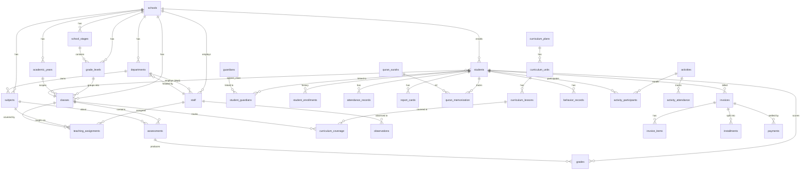
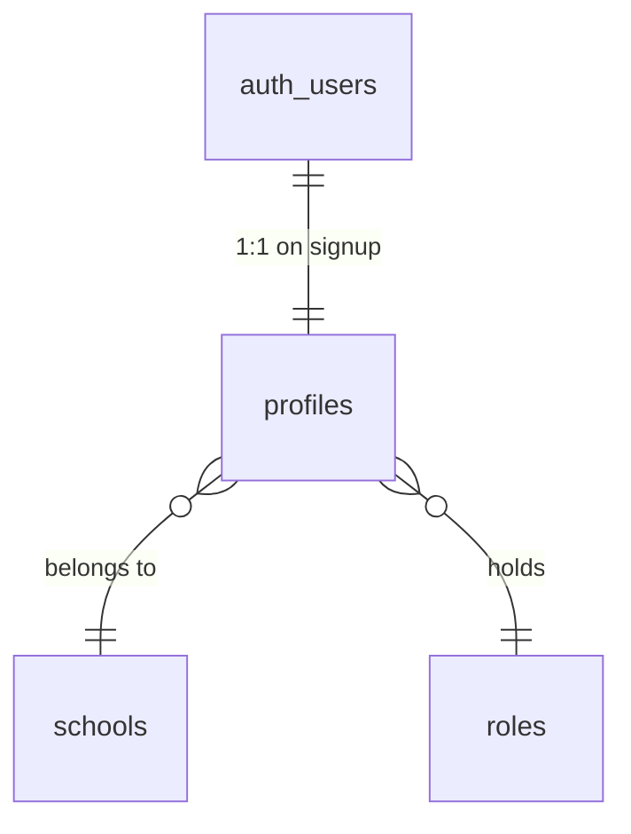
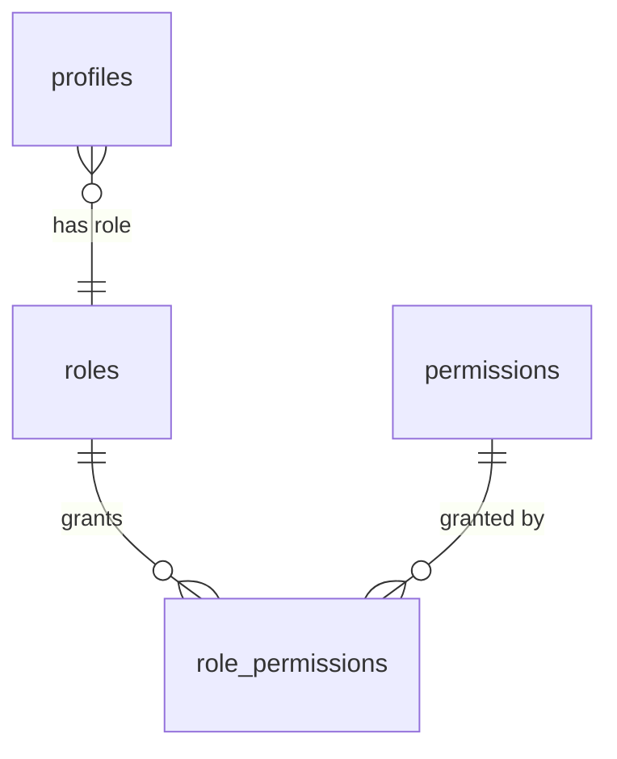
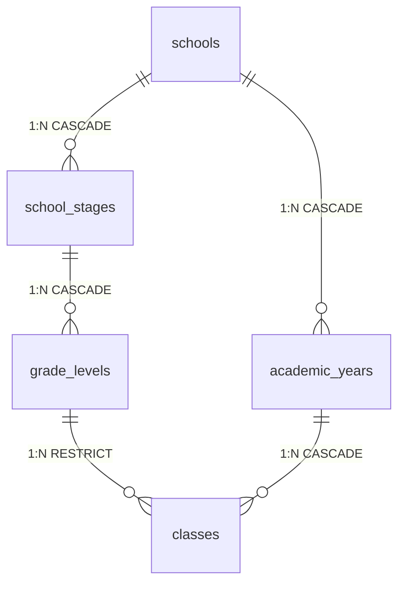
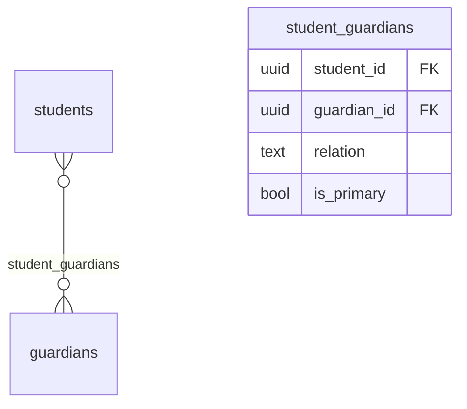
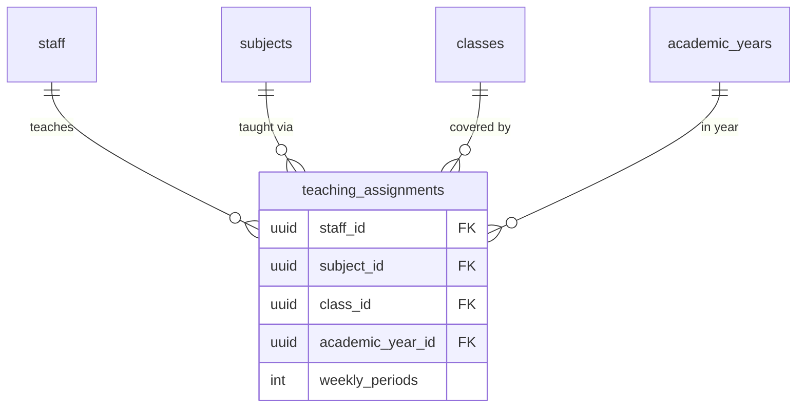
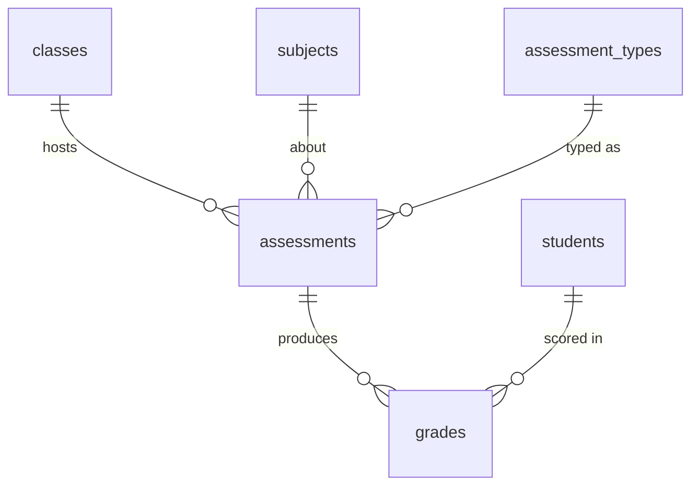
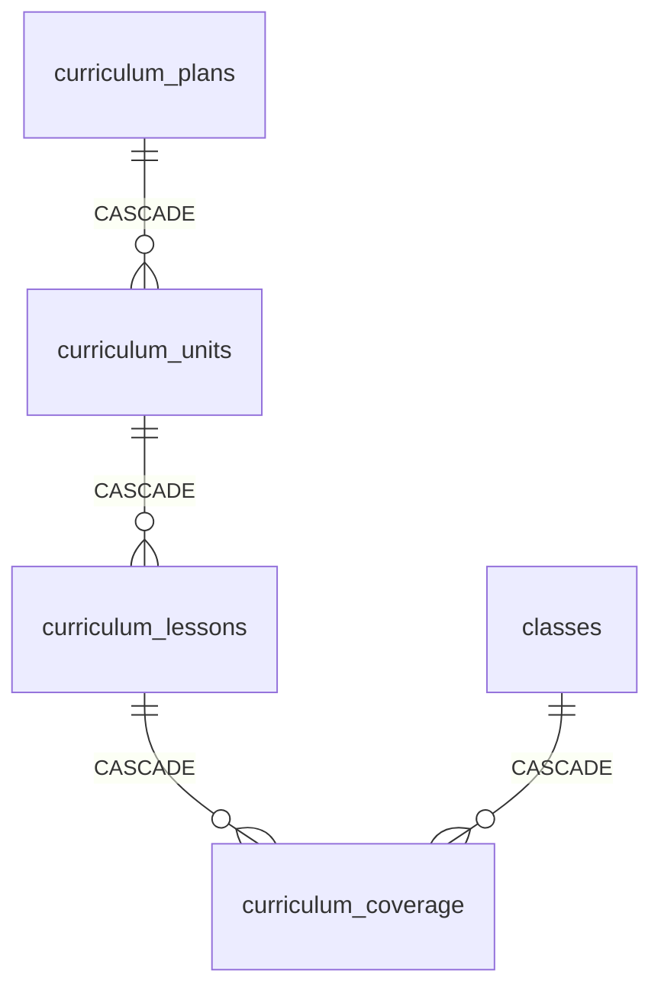
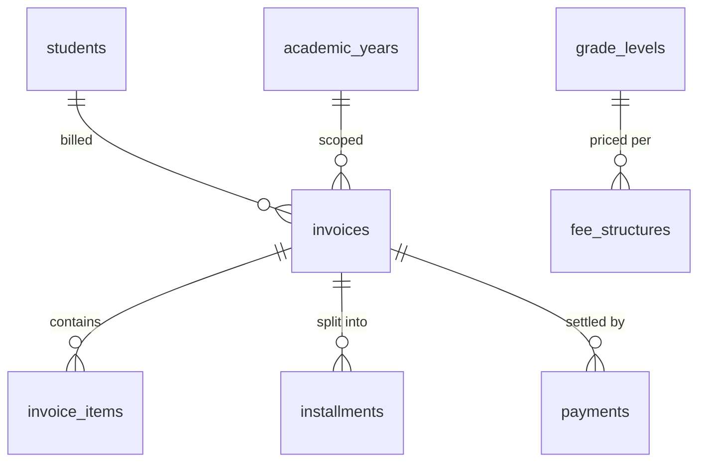

# 06 — Database Relationships

> **Madrasati ERP** · Schema version: migrations 0001–0005
>
> This document enumerates every foreign key in the schema, its cardinality,
> cascade/set-null behavior, and the rationale behind each design decision.
> Table names are written as `schema.table`; all live in the `public` schema.
> Migration file references are in parentheses.

---

## Table of Contents

1. [Conceptual Overview (Mermaid)](#1-conceptual-overview)
2. [Multi-Tenancy Root — `schools`](#2-multi-tenancy-root--schools)
3. [Auth & Identity](#3-auth--identity)
4. [RBAC — Roles & Permissions](#4-rbac--roles--permissions)
5. [Academic Hierarchy](#5-academic-hierarchy)
6. [People — Staff, Students, Guardians](#6-people--staff-students-guardians)
7. [Enrollment & Class Assignment](#7-enrollment--class-assignment)
8. [Teaching Assignments (M:N Resolution)](#8-teaching-assignments-mn-resolution)
9. [Daily Operations](#9-daily-operations)
   - 9.1 Attendance
   - 9.2 Assessments & Grades
   - 9.3 Report Cards
   - 9.4 Islamic Studies / Quran
   - 9.5 Curriculum Coverage
   - 9.6 Behavior & Discipline
   - 9.7 Timetable
   - 9.8 Activities & Participants
   - 9.9 Observations
10. [Administration, Communication & Finance](#10-administration-communication--finance)
    - 10.1 Announcements & Notifications
    - 10.2 Finance (Invoices, Payments)
    - 10.3 Audit Trail
11. [Cascade Decision Matrix](#11-cascade-decision-matrix)
12. [Circular / Deferred FK Notes](#12-circular--deferred-fk-notes)
13. [Derived / Computed State](#13-derived--computed-state)

---

## 1. Conceptual Overview

The diagram below uses abbreviated table names and shows only the most important
relationships. Detailed FK tables follow in each section.



---

## 2. Multi-Tenancy Root — `schools`

`schools` is the **tenant root**. Every domain table carries `school_id uuid not null references public.schools(id)` so that RLS helpers (`in_my_school()`, `current_school_id()`) can enforce per-tenant visibility in a single shared Postgres instance.

| Child table | Column | Cardinality | ON DELETE |
|---|---|---|---|
| `academic_years` | `school_id` | 1 school : N years | **CASCADE** |
| `school_stages` | `school_id` | 1 : N | **CASCADE** |
| `grade_levels` | `school_id` | 1 : N | **CASCADE** |
| `departments` | `school_id` | 1 : N | **CASCADE** |
| `staff` | `school_id` | 1 : N | **CASCADE** |
| `classes` | `school_id` | 1 : N | **CASCADE** |
| `subjects` | `school_id` | 1 : N | **CASCADE** |
| `students` | `school_id` | 1 : N | **CASCADE** |
| `guardians` | `school_id` | 1 : N | **CASCADE** |
| `rooms` | `school_id` | 1 : N | **CASCADE** |
| `periods` | `school_id` | 1 : N | **CASCADE** |
| `activities` | `school_id` | 1 : N | **CASCADE** |
| `observations` | `school_id` | 1 : N | **CASCADE** |
| `behavior_records` | `school_id` | 1 : N | **CASCADE** |
| `attendance_records` | `school_id` | 1 : N | **CASCADE** |
| `assessments` | `school_id` | 1 : N | **CASCADE** |
| `grades` | `school_id` | 1 : N | **CASCADE** |
| `grade_scales` | `school_id` | 1 : N | **CASCADE** |
| `assessment_types` | `school_id` | 1 : N | **CASCADE** |
| `report_cards` | `school_id` | 1 : N | **CASCADE** |
| `quran_memorization` | `school_id` | 1 : N | **CASCADE** |
| `quran_revisions` | `school_id` | 1 : N | **CASCADE** |
| `curriculum_plans` | `school_id` | 1 : N | **CASCADE** |
| `curriculum_coverage` | `school_id` | 1 : N | **CASCADE** |
| `fee_structures` | `school_id` | 1 : N | **CASCADE** |
| `invoices` | `school_id` | 1 : N | **CASCADE** |
| `payments` | `school_id` | 1 : N | **CASCADE** |
| `report_templates` | `school_id` | 1 : N | **CASCADE** |
| `announcements` | `school_id` | 1 : N | **CASCADE** |
| `notifications` | `school_id` | 1 : N | **CASCADE** |
| `message_log` | `school_id` | 1 : N | **CASCADE** |
| `timetable_slots` | `school_id` | 1 : N | **CASCADE** |
| `student_enrollments` | `school_id` | 1 : N | **CASCADE** |
| `profiles` | `school_id` | 1 : N | **SET NULL** |
| `audit_logs` | `school_id` | 1 : N | **SET NULL** |

**Rationale for CASCADE everywhere:** Deleting a school means the tenant is
being decommissioned. All operational data is meaningless without the tenant
root, so cascading is appropriate. `profiles` and `audit_logs` use SET NULL
because a super-admin user may exist across tenants and audit history has
forensic value that should survive school deletion.

---

## 3. Auth & Identity



### `profiles` (0001_core_and_rbac.sql)

| Column | References | Cardinality | ON DELETE | Rationale |
|---|---|---|---|---|
| `id` | `auth.users(id)` | **1:1** | **CASCADE** | Profile is a projection of the Supabase auth user. When auth user is deleted the profile should also disappear. |
| `school_id` | `public.schools(id)` | N:1 | **SET NULL** | A super-admin may not belong to any school (`school_id IS NULL` is valid). SET NULL avoids blocking school deletion. |
| `role` | `public.roles(key)` | N:1 | no action (FK default) | Role is a text PK so the reference is by natural key. Dropping a role without reassigning profiles would be a destructive migration, protected by no-action. |

**1:1 enforcement:** The `profiles.id` is itself the PK and also the FK to
`auth.users`, so the one-to-one constraint is structurally guaranteed. The
`handle_new_user()` trigger auto-inserts a profile row on signup with
`ON CONFLICT (id) DO NOTHING` to be idempotent.

---

## 4. RBAC — Roles & Permissions



### `role_permissions` — M:N join table (0001_core_and_rbac.sql)

| Column | References | Cardinality | ON DELETE |
|---|---|---|---|
| `role_key` | `public.roles(key)` | N:1 | **CASCADE** |
| `permission_key` | `public.permissions(key)` | N:1 | **CASCADE** |

**Composite PK:** `(role_key, permission_key)` — the pair is naturally unique,
no surrogate needed.

**CASCADE both sides:** If a role or permission is deleted (e.g., removing a
deprecated permission key), the grant rows are cleaned up automatically. This
is correct for a managed permission matrix where the migration controls the
seed data.

**Wildcard grant:** `super_admin` has a single `permission_key = '*'` row. The
`has_perm(text)` function checks `rp.permission_key = perm OR rp.permission_key = '*'`,
so no explicit grants for every permission key are needed.

---

## 5. Academic Hierarchy

The academic spine forms a strict 1:N chain:

```
schools → school_stages → grade_levels → classes (scoped by academic_years)
```



### `school_stages` (0002)

| Column | References | Cardinality | ON DELETE |
|---|---|---|---|
| `school_id` | `schools(id)` | N:1 | CASCADE |

### `grade_levels` (0002)

| Column | References | Cardinality | ON DELETE | Rationale |
|---|---|---|---|---|
| `school_id` | `schools(id)` | N:1 | CASCADE | Redundant tenant guard. |
| `stage_id` | `school_stages(id)` | N:1 | **CASCADE** | A grade level without a stage is invalid; cascade mirrors the tree destruction. |

### `academic_years` (0002)

| Column | References | Cardinality | ON DELETE |
|---|---|---|---|
| `school_id` | `schools(id)` | N:1 | CASCADE |

**Unique partial index:** `UNIQUE ON (school_id) WHERE is_current` — only one
academic year per school may be flagged `is_current`, enforced at the DB level
without a trigger.

### `classes` (0002)

| Column | References | Cardinality | ON DELETE | Rationale |
|---|---|---|---|---|
| `school_id` | `schools(id)` | N:1 | CASCADE | Tenant guard. |
| `academic_year_id` | `academic_years(id)` | N:1 | **CASCADE** | Deleting a year should delete its classes (data migration scenario). |
| `grade_level_id` | `grade_levels(id)` | N:1 | **RESTRICT** | Deleting a grade level that has active classes must be blocked to prevent orphaned class records. |
| `class_teacher_id` | `staff(id)` | N:1 | **SET NULL** | The homeroom teacher leaving school should not delete the class. |

---

## 6. People — Staff, Students, Guardians

### `departments` (0002)

| Column | References | Cardinality | ON DELETE | Rationale |
|---|---|---|---|---|
| `school_id` | `schools(id)` | N:1 | CASCADE | |
| `head_id` | `staff(id)` | N:1 (nullable) | **SET NULL** | The department head is optional and deferred (FK added after `staff` is created to break circular dependency; see §12). Losing a staff member must not destroy a department. |

### `staff` (0002)

| Column | References | Cardinality | ON DELETE | Rationale |
|---|---|---|---|---|
| `school_id` | `schools(id)` | N:1 | CASCADE | |
| `profile_id` | `profiles(id)` | N:1 (nullable) | **SET NULL** | A staff record may exist before the staff member has a portal account. Deleting the auth account should not erase employment history. |
| `department_id` | `departments(id)` | N:1 (nullable) | **SET NULL** | Staff can be unaffiliated; department dissolution should not cascade-delete employees. |

### `students` (0002)

| Column | References | Cardinality | ON DELETE | Rationale |
|---|---|---|---|---|
| `school_id` | `schools(id)` | N:1 | CASCADE | |
| `current_class_id` | `classes(id)` | N:1 (nullable) | **SET NULL** | Graduating or archiving a class should not delete the student record. The `refresh_class_count()` trigger maintains `classes.student_count` on changes to this column. |

### `guardians` (0002)

| Column | References | Cardinality | ON DELETE | Rationale |
|---|---|---|---|---|
| `school_id` | `schools(id)` | N:1 | CASCADE | |
| `profile_id` | `profiles(id)` | N:1 (nullable) | **SET NULL** | Same rationale as `staff.profile_id`. |

### `student_guardians` — M:N join table (0002)

Resolves the M:N between `students` and `guardians` (one guardian may cover
multiple children; one student may have multiple guardians).

| Column | References | Cardinality | ON DELETE |
|---|---|---|---|
| `student_id` | `students(id)` | N:1 | **CASCADE** |
| `guardian_id` | `guardians(id)` | N:1 | **CASCADE** |

**Composite PK:** `(student_id, guardian_id)`.
**Extra columns on the join:** `relation text` (father/mother/guardian) and
`is_primary boolean` — both are attributes of the relationship, not the
entities, justifying a proper join table over a simple array column.



---

## 7. Enrollment & Class Assignment

### `student_enrollments` (0002)

Maintains a full history of a student's class placements across years
(promotions, transfers). Distinct from `students.current_class_id`, which is
a denormalized "live" pointer.

| Column | References | Cardinality | ON DELETE | Rationale |
|---|---|---|---|---|
| `school_id` | `schools(id)` | N:1 | CASCADE | |
| `student_id` | `students(id)` | N:1 | **CASCADE** | Enrollment history is meaningless without the student. |
| `class_id` | `classes(id)` | N:1 (nullable) | **SET NULL** | The class may be archived; preserve the enrollment record with a null class pointer rather than deleting it. |
| `academic_year_id` | `academic_years(id)` | N:1 | **CASCADE** | Enrollment is always year-scoped. |

**Relationship:** 1 student : N enrollment rows (one per year/transfer event).

---

## 8. Teaching Assignments (M:N Resolution)

Three entities share an M:N:M relationship: a teacher (`staff`) teaches a
subject (`subjects`) in a class (`classes`) for an academic year. The join
table `teaching_assignments` materializes this.



### `teaching_assignments` (0002)

| Column | References | Cardinality | ON DELETE |
|---|---|---|---|
| `school_id` | `schools(id)` | N:1 | CASCADE |
| `staff_id` | `staff(id)` | N:1 | **CASCADE** |
| `subject_id` | `subjects(id)` | N:1 | **CASCADE** |
| `class_id` | `classes(id)` | N:1 | **CASCADE** |
| `academic_year_id` | `academic_years(id)` | N:1 | **CASCADE** |

**Unique constraint:** `(staff_id, subject_id, class_id, academic_year_id)` — a
teacher cannot be double-assigned to the same subject/class/year combination.

**CASCADE all sides:** If any of the four entities is deleted, the assignment
row is no longer meaningful and should be cleaned up automatically.

### `subjects` (0002)

| Column | References | Cardinality | ON DELETE | Rationale |
|---|---|---|---|---|
| `school_id` | `schools(id)` | N:1 | CASCADE | |
| `department_id` | `departments(id)` | N:1 (nullable) | **SET NULL** | Subjects can be interdisciplinary or pre-assigned to a department that is later dissolved. |

---

## 9. Daily Operations

### 9.1 Attendance (`attendance_records`) — 0003

| Column | References | Cardinality | ON DELETE | Rationale |
|---|---|---|---|---|
| `school_id` | `schools(id)` | N:1 | CASCADE | |
| `student_id` | `students(id)` | N:1 | **CASCADE** | Record is meaningless without student. |
| `class_id` | `classes(id)` | N:1 | **CASCADE** | Attendance is class-scoped; cascading avoids orphan rows. |
| `recorded_by` | `profiles(id)` | N:1 (nullable) | **SET NULL** | The teacher who recorded attendance may leave; preserve the attendance record. |

**Unique constraint:** `(student_id, date)` — one attendance record per student
per calendar day across all subjects (daily attendance model, not per-period).

### 9.2 Assessments & Grades — 0003

#### `assessment_types`

| Column | References | ON DELETE |
|---|---|---|
| `school_id` | `schools(id)` | CASCADE |

Lookup table scoped per school (quiz / midterm / final etc. with weights).

#### `assessments`

A graded event (an exam, quiz, project) for a specific class + subject.

| Column | References | Cardinality | ON DELETE | Rationale |
|---|---|---|---|---|
| `school_id` | `schools(id)` | N:1 | CASCADE | |
| `class_id` | `classes(id)` | N:1 | **CASCADE** | Assessment is class-bound. |
| `subject_id` | `subjects(id)` | N:1 | **CASCADE** | Assessment is subject-bound. |
| `assessment_type_id` | `assessment_types(id)` | N:1 (nullable) | **SET NULL** | Type label may be reconfigured without losing assessment history. |
| `created_by` | `profiles(id)` | N:1 (nullable) | **SET NULL** | Preserve assessment even if creator's account is deleted. |

#### `grades`

One score per student per assessment.

| Column | References | Cardinality | ON DELETE | Rationale |
|---|---|---|---|---|
| `school_id` | `schools(id)` | N:1 | CASCADE | |
| `assessment_id` | `assessments(id)` | N:1 | **CASCADE** | If the assessment is removed, its grades are removed. |
| `student_id` | `students(id)` | N:1 | **CASCADE** | Grade without student is meaningless. |

**Unique constraint:** `(assessment_id, student_id)` — one score per student per assessment.



### 9.3 Report Cards (`report_cards`) — 0003

Frozen, immutable snapshots generated at term-end. `data jsonb` holds the
per-subject breakdown at generation time (immune to subsequent grade edits).

| Column | References | Cardinality | ON DELETE | Rationale |
|---|---|---|---|---|
| `school_id` | `schools(id)` | N:1 | CASCADE | |
| `student_id` | `students(id)` | N:1 | **CASCADE** | No student, no report. |
| `academic_year_id` | `academic_years(id)` | N:1 | **CASCADE** | Year-scoped artifact. |

**No FK to `grades`:** Intentional. The report card captures a point-in-time
snapshot in `data jsonb`; it must not mutate when grades are later corrected.

### 9.4 Islamic Studies / Quran — 0003

#### `quran_surahs`

Reference table (`number int primary key`, 1–114). No school_id — it is global
metadata, not tenant data. **No FK on the number PK** — it is seeded data.

#### `quran_memorization`

| Column | References | Cardinality | ON DELETE | Rationale |
|---|---|---|---|---|
| `school_id` | `schools(id)` | N:1 | CASCADE | |
| `student_id` | `students(id)` | N:1 | **CASCADE** | |
| `surah_number` | `quran_surahs(number)` | N:1 | no action (FK default) | Surahs are immutable reference data; action not needed. |
| `assessed_by` | `profiles(id)` | N:1 (nullable) | **SET NULL** | Preserve record if assessor leaves. |

#### `quran_revisions`

| Column | References | ON DELETE |
|---|---|---|
| `school_id` | `schools(id)` | CASCADE |
| `student_id` | `students(id)` | CASCADE |
| `surah_number` | `quran_surahs(number)` | (default no action) |

### 9.5 Curriculum Coverage — 0003

Three-level hierarchy: Plan → Unit → Lesson, then a coverage record per lesson per class.



#### `curriculum_plans`

| Column | References | Cardinality | ON DELETE |
|---|---|---|---|
| `school_id` | `schools(id)` | N:1 | CASCADE |
| `subject_id` | `subjects(id)` | N:1 | **CASCADE** |
| `grade_level_id` | `grade_levels(id)` | N:1 (nullable) | **SET NULL** |
| `academic_year_id` | `academic_years(id)` | N:1 (nullable) | **CASCADE** |

#### `curriculum_units`

| Column | References | ON DELETE |
|---|---|---|
| `plan_id` | `curriculum_plans(id)` | **CASCADE** |

#### `curriculum_lessons`

| Column | References | ON DELETE |
|---|---|---|
| `unit_id` | `curriculum_units(id)` | **CASCADE** |

#### `curriculum_coverage`

Tracks which lessons a class has completed.

| Column | References | Cardinality | ON DELETE |
|---|---|---|---|
| `school_id` | `schools(id)` | N:1 | CASCADE |
| `lesson_id` | `curriculum_lessons(id)` | N:1 | **CASCADE** |
| `class_id` | `classes(id)` | N:1 | **CASCADE** |
| `recorded_by` | `profiles(id)` | N:1 (nullable) | **SET NULL** |

**Unique constraint:** `(lesson_id, class_id)` — a lesson is covered once per class.

### 9.6 Behavior & Discipline (`behavior_records`) — 0003

| Column | References | Cardinality | ON DELETE |
|---|---|---|---|
| `school_id` | `schools(id)` | N:1 | CASCADE |
| `student_id` | `students(id)` | N:1 | **CASCADE** |
| `recorded_by` | `profiles(id)` | N:1 (nullable) | **SET NULL** |

**No FK to `classes`:** Behavior incidents are recorded against the student
directly, not a class instance, because the student may not be in class at the
time of the incident.

### 9.7 Timetable — 0003

#### `rooms`

| Column | References | ON DELETE |
|---|---|---|
| `school_id` | `schools(id)` | CASCADE |

#### `periods`

| Column | References | ON DELETE |
|---|---|---|
| `school_id` | `schools(id)` | CASCADE |

#### `timetable_slots`

One slot = one class × one period × one day-of-week. Optionally assigned a
teacher, subject, and room.

| Column | References | Cardinality | ON DELETE | Rationale |
|---|---|---|---|---|
| `school_id` | `schools(id)` | N:1 | CASCADE | |
| `class_id` | `classes(id)` | N:1 | **CASCADE** | Slot is meaningless without the class. |
| `subject_id` | `subjects(id)` | N:1 (nullable) | **SET NULL** | Unscheduled / free period allowed. |
| `staff_id` | `staff(id)` | N:1 (nullable) | **SET NULL** | Teacher substitute or unfilled slot. |
| `room_id` | `rooms(id)` | N:1 (nullable) | **SET NULL** | Room may not be assigned. |
| `period_id` | `periods(id)` | N:1 | **CASCADE** | Period definition drives the slot; cascade is appropriate. |

**Conflict guards (unique indexes):**
- `UNIQUE (class_id, period_id, day_of_week)` — a class cannot be in two places at once.
- `UNIQUE (staff_id, period_id, day_of_week) WHERE staff_id IS NOT NULL` — a teacher cannot be in two places at once. Partial index excludes unassigned slots.

### 9.8 Activities & Participants — 0003

#### `activities`

| Column | References | Cardinality | ON DELETE |
|---|---|---|---|
| `school_id` | `schools(id)` | N:1 | CASCADE |
| `supervisor_id` | `staff(id)` | N:1 (nullable) | **SET NULL** |

#### `activity_participants` — M:N join

| Column | References | Cardinality | ON DELETE |
|---|---|---|---|
| `activity_id` | `activities(id)` | N:1 | **CASCADE** |
| `student_id` | `students(id)` | N:1 | **CASCADE** |

**Composite PK:** `(activity_id, student_id)`.
Extra columns: `fee_paid boolean`, `enrolled_at timestamptz`.

#### `activity_attendance`

Per-session attendance for an activity (distinct from regular class attendance).

| Column | References | ON DELETE |
|---|---|---|
| `activity_id` | `activities(id)` | CASCADE |
| `student_id` | `students(id)` | CASCADE |

**Note:** No unique constraint on `(activity_id, student_id, date)` in the
migration — should be added to prevent duplicate attendance entries.

### 9.9 Observations & Supervision — 0003

#### `observations`

| Column | References | Cardinality | ON DELETE | Rationale |
|---|---|---|---|---|
| `school_id` | `schools(id)` | N:1 | CASCADE | |
| `staff_id` | `staff(id)` | N:1 | **CASCADE** | The observed teacher is the subject; cascade is correct. |
| `observer_id` | `profiles(id)` | N:1 (nullable) | **SET NULL** | The observer (principal/head) may leave; preserve the observation record. |
| `class_id` | `classes(id)` | N:1 (nullable) | **SET NULL** | Context for the observation; losing the class record should not lose the observation. |
| `subject_id` | `subjects(id)` | N:1 (nullable) | **SET NULL** | Context only. |

#### `observation_items`

| Column | References | ON DELETE |
|---|---|---|
| `observation_id` | `observations(id)` | **CASCADE** |

Line items (criteria scores) are owned by the observation; cascade is appropriate.

---

## 10. Administration, Communication & Finance

### 10.1 Announcements & Notifications — 0004

#### `announcements`

| Column | References | ON DELETE |
|---|---|---|
| `school_id` | `schools(id)` | CASCADE |
| `created_by` | `profiles(id)` | **SET NULL** |

#### `notifications`

| Column | References | ON DELETE | Rationale |
|---|---|---|---|
| `school_id` | `schools(id)` | CASCADE | |
| `user_id` | `profiles(id)` | **CASCADE** | User-specific inbox; delete with account. |

#### `message_log`

No FK on `recipient` (it is a text phone/email address, not a profile ID) —
kept intentionally loose to support non-portal recipients (SMS/WhatsApp).

| Column | References | ON DELETE |
|---|---|---|
| `school_id` | `schools(id)` | CASCADE |

### 10.2 Finance — 0004



#### `fee_structures`

| Column | References | ON DELETE |
|---|---|---|
| `school_id` | `schools(id)` | CASCADE |
| `grade_level_id` | `grade_levels(id)` | **SET NULL** |
| `academic_year_id` | `academic_years(id)` | **CASCADE** |

#### `invoices`

| Column | References | ON DELETE |
|---|---|---|
| `school_id` | `schools(id)` | CASCADE |
| `student_id` | `students(id)` | **CASCADE** |
| `academic_year_id` | `academic_years(id)` | **CASCADE** |

#### `invoice_items`

| Column | References | ON DELETE |
|---|---|---|
| `invoice_id` | `invoices(id)` | **CASCADE** |

Line items are owned by the invoice; cascade is correct.

#### `installments`

| Column | References | ON DELETE |
|---|---|---|
| `invoice_id` | `invoices(id)` | **CASCADE** |

#### `payments`

| Column | References | ON DELETE | Rationale |
|---|---|---|---|
| `school_id` | `schools(id)` | CASCADE | |
| `invoice_id` | `invoices(id)` | **CASCADE** | Payment is against an invoice; cascade is financial convention (voiding an invoice voids its payments). |
| `received_by` | `profiles(id)` | **SET NULL** | Finance officer may leave; payment record must be preserved. |

### 10.3 Audit Trail (`audit_logs`) — 0004

| Column | References | ON DELETE | Rationale |
|---|---|---|---|
| `school_id` | `schools(id)` | **SET NULL** | School deletion should not destroy audit history; it should be retained with a null school pointer for forensic purposes. |
| `user_id` | `profiles(id)` | **SET NULL** | Same rationale — retain the action record even if the actor's account is deleted. `user_email text` is also stored denormalized for this reason. |

`audit_logs.id` is `bigint GENERATED ALWAYS AS IDENTITY` (not UUID) for
efficient sequential inserts and time-ordered queries.

---

## 11. Cascade Decision Matrix

The following table summarizes the pattern applied consistently across the schema:

| Scenario | Strategy | Examples |
|---|---|---|
| Child row is **operationally meaningless** without the parent | CASCADE | `grades → assessments`, `invoice_items → invoices`, `curriculum_units → curriculum_plans` |
| Child row has **independent historical value** | SET NULL | `attendance_records.recorded_by`, `staff.profile_id`, `payments.received_by` |
| Parent deletion **must be blocked** when children exist | RESTRICT | `classes.grade_level_id` |
| Reference to **global/static** lookup data | No special action | `quran_memorization.surah_number` |
| M:N **join table** — both sides cascade | CASCADE both | `student_guardians`, `activity_participants`, `role_permissions` |
| **Tenant root** deletion (school) | CASCADE for domain, SET NULL for meta | Domain tables cascade; `profiles`, `audit_logs` set null |

---

## 12. Circular / Deferred FK Notes

### `departments.head_id ↔ staff.department_id`

These two tables have a mutual reference:

- `staff.department_id → departments(id)` (set null)
- `departments.head_id → staff(id)` (set null)

**Resolution:** `departments` is created first with `head_id uuid` (no FK
constraint). `staff` is created next. Then, in the same migration file
(0002), an `ALTER TABLE departments ADD CONSTRAINT departments_head_fk
FOREIGN KEY (head_id) REFERENCES staff(id) ON DELETE SET NULL` is applied
after `staff` exists. This is the standard Postgres technique for deferred FK
in the same migration.

```sql
-- 0002_academic_and_people.sql (excerpt)
alter table public.departments
  drop constraint if exists departments_head_fk,
  add constraint departments_head_fk
    foreign key (head_id) references public.staff(id) on delete set null;
```

Both sides use SET NULL so either entity can be deleted independently without
cascading to the other.

---

## 13. Derived / Computed State

Some columns are not raw data — they are maintained by triggers to avoid
expensive real-time counts.

### `classes.student_count`

**Function:** `public.refresh_class_count()` (0002)
**Trigger:** `trg_student_class_count` fires `AFTER INSERT OR UPDATE OF current_class_id, status OR DELETE ON public.students` for each row.

**Logic:**
- On `INSERT` or `UPDATE` where `new.current_class_id IS NOT NULL`: recount enrolled students for the new class.
- On `UPDATE` where the class changed: also recount the **old** class.
- On `DELETE`: recount the old class.

This means `classes.student_count` is always in sync with
`COUNT(*) FROM students WHERE current_class_id = class.id AND status = 'enrolled'`
without a join at read time. Code should treat `student_count` as a cache and
not trust it during a batch migration without re-running the trigger logic.

### `students.current_class_id` (denormalization)

This column on `students` duplicates the "latest enrollment" from
`student_enrollments` for query performance. The canonical enrollment history
lives in `student_enrollments`; `current_class_id` is the live pointer. Both
must be kept in sync by application code (the server action that processes a
promotion should update both tables in the same transaction).

---

*Generated from migrations 0001–0005. Update this document whenever a new migration adds or alters foreign keys.*
