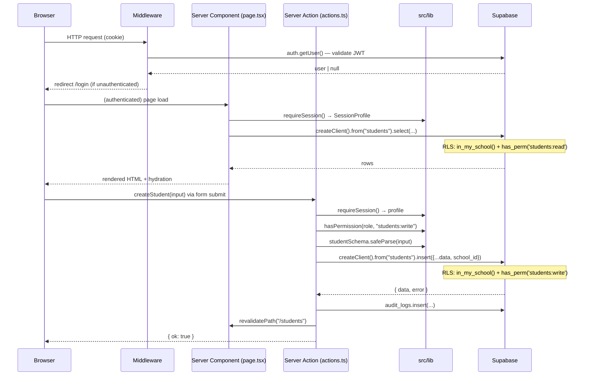

# 08 — Backend & Data-Layer Structure

> **Madrasati ERP** (مدرستي) — Arabic-first, multi-tenant school management system.
> Stack: Next.js 15 App Router · TypeScript · Supabase (Postgres + Auth + RLS + Storage).

---

## Table of Contents

1. [Overview](#1-overview)
2. [Directory Tree](#2-directory-tree)
3. [Supabase Layer](#3-supabase-layer)
   - 3.1 Migrations
   - 3.2 Seed
   - 3.3 Edge Functions (future)
4. [src/lib — Shared Server Utilities](#4-srclib--shared-server-utilities)
5. [Server Actions as the API Layer](#5-server-actions-as-the-api-layer)
6. [Route Handlers (src/app/api)](#6-route-handlers-srcappapi)
7. [Middleware](#7-middleware)
8. [Data Flow Diagram](#8-data-flow-diagram)
9. [Multi-Tenancy & RLS Strategy](#9-multi-tenancy--rls-strategy)
10. [Security Principles](#10-security-principles)

---

## 1. Overview

Madrasati has **no separate backend service**. The entire server side lives in two places:

| Layer | Location | Role |
|---|---|---|
| Database logic | `supabase/` | Schema, RLS policies, helper functions, seed data |
| Application logic | `src/` | Server Actions (`features/*/actions.ts`), shared utilities (`lib/`), optional Route Handlers |

**Server Actions are the primary API.** They replace REST controllers: they run on the server, are called directly from React components (no `fetch`, no API route needed), validate input with Zod, enforce RBAC, interact with Supabase, and write to the audit trail. Every mutation in the app goes through a Server Action.

The Supabase Postgres database enforces **Row Level Security (RLS)** as a hard defense-in-depth backstop — even if a Server Action bug were to skip the TypeScript permission check, the database policy rejects the query.

---

## 2. Directory Tree

```
/
├── supabase/
│   ├── migrations/
│   │   ├── 0001_core_and_rbac.sql          # Tenant root, roles, permissions, profiles, RBAC functions
│   │   ├── 0002_academic_and_people.sql     # Academic hierarchy, staff, students, guardians
│   │   ├── 0003_operations.sql             # Attendance, grades, Islamic studies, curriculum, behavior, timetable, activities
│   │   ├── 0004_admin_finance_audit.sql     # Report templates, communication, finance, audit_logs
│   │   └── 0005_rls_policies.sql           # All RLS policies (applied last, after tables exist)
│   └── seed.sql                            # Demo school "مدرسة النجاة النموذجية" with sample data
│
└── src/
    ├── middleware.ts                        # Edge middleware — session refresh + route guard
    │
    ├── app/
    │   ├── (app)/                          # Protected shell (authenticated routes)
    │   │   ├── layout.tsx                  # Shell layout — session check, sidebar, topbar
    │   │   ├── dashboard/page.tsx
    │   │   └── students/page.tsx           # Reference page (Server Component, data-fetching pattern)
    │   ├── login/page.tsx
    │   └── api/                            # Route Handlers (thin; prefer Server Actions)
    │
    ├── features/                           # Domain modules — one folder per resource
    │   └── students/
    │       ├── schema.ts                   # Zod schema (shared by form + server action)
    │       ├── actions.ts                  # "use server" — createStudent, updateStudent, archiveStudent
    │       ├── students-table.tsx          # Client Component (table + inline dialog)
    │       └── student-form.tsx            # Client Component (react-hook-form)
    │
    └── lib/
        ├── supabase/
        │   ├── server.ts                   # createClient() + createAdminClient()
        │   ├── client.ts                   # Browser client (read-only public queries)
        │   └── middleware.ts               # updateSession() for Next.js middleware
        ├── auth.ts                         # getSessionProfile(), requireSession()
        ├── auth-actions.ts                 # signOut() server action
        ├── rbac.ts                         # ROLES, PERMISSIONS, ROLE_PERMISSIONS, hasPermission()
        ├── audit.ts                        # logAudit() — appends to public.audit_logs
        ├── school.ts                       # getActiveSchool() — branding + calendar for the tenant
        ├── gpa.ts                          # Pure grade-computation helpers (subjectPercentage, termGpa, rankByDesc)
        ├── dates.ts                        # formatDate(), todayISO(), ageFrom() with Hijri support
        ├── navigation.ts                   # NAVIGATION — sidebar route map with required permissions
        ├── database.types.ts               # Hand-authored + generatable TypeScript types for Database<>
        └── utils.ts                        # cn() and other micro-utilities
```

---

## 3. Supabase Layer

### 3.1 Migrations

Migrations are plain `.sql` files in `supabase/migrations/`, applied in filename order. They are idempotent (`if not exists`, `on conflict do nothing`) so they can be re-run safely.

#### `0001_core_and_rbac.sql` — Tenant Root & RBAC

Establishes the two pillars that every other table depends on:

**`public.schools`** — the multi-tenant root. Every domain row in the database carries a `school_id uuid` FK pointing here. Key columns: `slug` (unique identifier), `theme jsonb` (CSS variable overrides for per-school branding), `calendar text` (`gregorian` | `hijri`).

**RBAC tables**:
- `public.roles` — 11 system roles (e.g. `principal` / مدير المدرسة, `teacher` / معلم, `registrar` / مسؤول التسجيل).
- `public.permissions` — 30 granular permissions in `resource:action` format (e.g. `students:write`, `finance:read`, `audit:read`).
- `public.role_permissions` — the grant matrix (role_key × permission_key).

**`public.profiles`** — one row per `auth.users` entry. Stores `role text` and `school_id uuid` — the two facts every RLS policy and Server Action needs. The `on_auth_user_created` trigger populates a profile automatically on signup.

**RBAC helper functions** (`SECURITY DEFINER`, so they bypass RLS recursion):

| Function | Returns | Purpose |
|---|---|---|
| `current_school_id()` | `uuid` | The `school_id` from the caller's `profiles` row |
| `current_role()` | `text` | The caller's role key |
| `is_super_admin()` | `boolean` | True if role = `super_admin` |
| `has_perm(perm text)` | `boolean` | True if the caller's role grants `perm` or `*` |
| `in_my_school(row_school uuid)` | `boolean` | True if `row_school` matches the caller's school, or caller is super_admin |

These functions are the sole dependency of every RLS policy in `0005`.

#### `0002_academic_and_people.sql` — Academic Hierarchy & People

Defines the school's structural data and its people:

```
schools
  └── academic_years          (is_current unique-partial index enforces one active year)
  └── school_stages           (المرحلة الابتدائية / المتوسطة / الثانوية)
        └── grade_levels      (الصف الأول .. الصف الثاني عشر)
              └── classes     (academic_year_id + grade_level_id + name; student_count maintained by trigger)
  └── departments             (اللغة العربية, الرياضيات, ...)
  └── staff                   (profile_id → profiles; employee_no, civil_id, hire_date)
  └── subjects                (code unique per school; weekly_periods)
  └── teaching_assignments    (staff × subject × class × academic_year; unique constraint)
  └── students                (ministry_no unique per school; current_class_id; status enum)
        └── student_enrollments (promotion/transfer history)
        └── student_guardians   (guardian_id → guardians; relation, is_primary)
  └── guardians               (profile_id → profiles for parent portal)
```

The `refresh_class_count()` trigger keeps `classes.student_count` accurate whenever a student's `current_class_id` or `status` changes — no application-level counter maintenance required.

#### `0003_operations.sql` — Daily Operations

| Domain | Key Tables |
|---|---|
| Attendance (الحضور) | `attendance_records` — `student_id + date` unique; status: `present`, `absent`, `excused`, `late`, `medical` |
| Grades (الدرجات) | `grade_scales`, `assessment_types` (with `weight`), `assessments`, `grades`, `report_cards` (frozen JSON snapshot) |
| Islamic Studies (التربية الإسلامية) | `quran_surahs` (reference), `quran_memorization`, `quran_revisions` |
| Curriculum (المنهج) | `curriculum_plans` → `curriculum_units` → `curriculum_lessons` → `curriculum_coverage` (per class) |
| Behavior (السلوك) | `behavior_records` — `kind` (`positive` / `negative`), `points` |
| Timetable (الجدول) | `rooms`, `periods`, `timetable_slots` — unique constraint per `(staff_id, period_id, day_of_week)` prevents double-booking |
| Activities (الأنشطة) | `activities`, `activity_participants`, `activity_attendance` |
| Observations (الملاحظات) | `observations`, `observation_items` — status lifecycle: `draft` → `submitted` → `acknowledged` |

#### `0004_admin_finance_audit.sql` — Administration, Finance & Audit

| Domain | Key Tables |
|---|---|
| Report Designer | `report_templates` — `layout jsonb` holds the drag-and-drop block definitions; `kind`: `report_card`, `certificate_quran`, `attendance`, `achievement`, `participation` |
| Communication | `announcements` (audience: `all`, `teachers`, `parents`, `class:<id>`), `notifications` (user-owned), `message_log` (outbound audit: email / sms / whatsapp / push) |
| Finance | `fee_structures`, `invoices`, `invoice_items`, `installments`, `payments` — schema is complete, UI activated separately |
| Audit Trail | `audit_logs` — `bigint` identity PK (insert-only); indexed on `(school_id, created_at desc)` and `(entity, entity_id)` |

#### `0005_rls_policies.sql` — Row Level Security

Applied after all tables exist. Uses a `DO` block to generate the four standard policies (SELECT / INSERT / UPDATE / DELETE) for 30+ tables from a data-driven values list, keeping the policy definitions DRY:

```sql
-- Excerpt from the generated pattern:
create policy students_sel on public.students for select to authenticated
  using (public.in_my_school(school_id) and public.has_perm('students:read'));

create policy students_ins on public.students for insert to authenticated
  with check (public.in_my_school(school_id) and public.has_perm('students:write'));
```

Child tables that have no `school_id` (e.g. `student_guardians`, `curriculum_units`, `invoice_items`) are scoped through their parent table via a correlated `EXISTS` sub-select.

Special cases:
- **`public.schools`** — read if `id = current_school_id()` or super_admin; write requires `settings:write` or `branding:write`.
- **`public.profiles`** — own row always readable/editable; admins with `users:manage` can see same-school profiles.
- **`public.notifications`** — strictly user-owned (`user_id = auth.uid()`).
- **`public.audit_logs`** — any same-school user may INSERT (append-only); SELECT requires `audit:read`.

### 3.2 Seed (`supabase/seed.sql`)

Creates a fully populated demo tenant — **مدرسة النجاة النموذجية** (slug: `najat`) — with:
- Academic year 2025/2026 (current)
- Two stages (ابتدائية / متوسطة), four grade levels, two classes (1/أ, 1/ب)
- Nine departments, four subjects (القرآن الكريم, التربية الإسلامية, اللغة العربية, الرياضيات)
- Three sample students
- Grade scale (A=4.0 ممتاز … F=0.0 راسب)
- Six assessment types (weights sum to 100)
- Six school periods (07:30 → 12:20)
- Nine Quran surahs (partial; extend to all 114 for the Islamic module)

All inserts use `on conflict do nothing`, making the seed idempotent.

### 3.3 Edge Functions (future)

`supabase/functions/` is reserved for Deno-based Supabase Edge Functions. Planned candidates:
- PDF report generation (calls the report designer layout + puppeteer/wkhtmltopdf)
- Outbound messaging gateway (email / WhatsApp via third-party providers)
- Bulk student import worker (uses `createAdminClient()` to bypass RLS for controlled batch inserts)

---

## 4. src/lib — Shared Server Utilities

### `lib/supabase/server.ts`

Two exported factories:

```typescript
// Standard authenticated client — respects RLS (anon key + session cookie).
export async function createClient(): Promise<SupabaseClient<Database>>

// Service-role client — BYPASSES RLS. Never import in Client Components.
// Use only for privileged operations: user provisioning, bulk import.
export function createAdminClient(): SupabaseClient<Database>
```

`createClient()` reads the session from the request cookie jar (`@supabase/ssr`). Every Server Action and Server Component that queries user-scoped data calls this. The service-role key (`SUPABASE_SERVICE_ROLE_KEY`) never reaches the browser.

### `lib/supabase/middleware.ts`

`updateSession(request)` — called by `src/middleware.ts` on every request. It:
1. Refreshes the Supabase JWT (calls `auth.getUser()`, which revalidates with the Supabase Auth server — more secure than trusting `getSession()` alone).
2. Redirects unauthenticated users to `/login?redirect=<original-path>`.
3. Redirects authenticated users away from `/login` to `/dashboard`.

Public paths that bypass the guard: `/login`, `/forgot-password`, `/auth`.

### `lib/auth.ts`

```typescript
// React cache() — hits the DB once per request, even if called from multiple layouts/pages.
export const getSessionProfile = cache(async (): Promise<SessionProfile | null>)

// For protected pages: returns profile or calls redirect("/login").
export async function requireSession(): Promise<SessionProfile>
```

`SessionProfile` carries: `id`, `email`, `fullName`, `role` (typed as `Role` from `rbac.ts`), `schoolId`, `avatarUrl`. This is the canonical session object passed to `hasPermission()` checks throughout the app.

### `lib/rbac.ts`

Single source of truth for the permission model, **mirrored verbatim in the database** (`0001_core_and_rbac.sql`). The TypeScript side is used for UI show/hide decisions; the DB side is the enforcement backstop.

Key exports:
- `ROLES` — const tuple of all 11 role keys.
- `PERMISSIONS` — const tuple of all 30 permission strings (`resource:action`).
- `ROLE_PERMISSIONS` — the default grant matrix (e.g. `teacher` gets `grades:write` but not `settings:write`).
- `hasPermission(role, perm)` — pure function; handles the `"*"` wildcard for `super_admin`.

### `lib/audit.ts`

```typescript
export async function logAudit(
  action: string,           // e.g. "student.create"
  entity?: string,          // e.g. "students"
  entityId?: string | number | null,
  meta?: Record<string, unknown>
): Promise<void>
```

- Appends to `public.audit_logs` with `school_id`, `user_id`, `user_email` from the current session.
- Wrapped in `try/catch` — **best-effort, non-blocking**. An audit failure never interrupts the user's operation.
- Used at the end of every mutating Server Action (after the DB write succeeds).

### `lib/school.ts`

`getActiveSchool(schoolId)` — React-cached, returns branding and calendar preference (`gregorian` | `hijri`) for the active tenant. Used in the shell layout to apply the school's custom CSS theme and in date formatting utilities.

### `lib/gpa.ts`

Pure, side-effect-free grade computation functions. Unit-tested in `src/lib/__tests__/gpa.test.ts`.

| Function | Purpose |
|---|---|
| `subjectPercentage(items)` | Weighted score rollup from `assessment_types.weight` values |
| `bandFor(pct, scale)` | Finds the matching row in `public.grade_scales` |
| `gpaFor(pct, scale)` | Returns the GPA point for a percentage |
| `termGpa(subjectPercentages, scale)` | Average GPA across subjects |
| `rankByDesc(rows, metric)` | Dense rank (1-based) for report card class ranking |

### `lib/dates.ts`

Locale-aware date formatting using the platform `Intl` API — no extra dependency.

```typescript
formatDate(date, locale, calendar)      // e.g. "١٥ محرم ١٤٤٧" or "September 15, 2025"
formatDateShort(date, locale, calendar) // numeric, for table cells
todayISO()                              // YYYY-MM-DD for attendance keys
ageFrom(dob)                            // integer years, for student profiles
```

Calendar is `"hijri"` (Umm al-Qura) or `"gregorian"`, driven by `schools.calendar`.

---

## 5. Server Actions as the API Layer

**Server Actions** (`"use server"` directive) are the primary API mechanism. They are TypeScript functions that run exclusively on the server, invoked directly from Client or Server Components — no REST endpoint is needed.

### Why Server Actions over Route Handlers

| Concern | Server Action | Route Handler |
|---|---|---|
| Called from a React component | Direct function call — type-safe, no `fetch()` | Must `fetch("/api/...")` — manual serialization |
| Session access | Calls `requireSession()` — cookie resolved server-side | Same, but requires manual cookie threading |
| CSRF protection | Built into Next.js (action tokens) | Must be implemented manually |
| Progressive enhancement | Works without JavaScript | JavaScript required |
| Revalidation | `revalidatePath()` called inline | Must coordinate separately |

### Anatomy of a Server Action (`features/students/actions.ts`)

Every Server Action follows the same four-step pattern:

```
1. requireSession()          → authenticate; get role + schoolId
2. hasPermission(role, perm) → TypeScript RBAC check (fast, in-process)
3. schema.safeParse(input)   → Zod validation (same schema shared with the form)
4. supabase.from(...).insert → DB write (RLS enforces tenant isolation + permission a second time)
5. logAudit(...)             → append to audit_logs (non-blocking)
6. revalidatePath(...)       → bust the Next.js cache so the page re-fetches
7. return { ok: true } | { ok: false, error: string }
```

Concrete example — `createStudent`:

```typescript
"use server";
export async function createStudent(input: StudentInput): Promise<ActionResult> {
  const profile = await requireSession();                         // step 1
  if (!hasPermission(profile.role, "students:write"))            // step 2
    return { ok: false, error: "forbidden" };

  const parsed = studentSchema.safeParse(input);                 // step 3
  if (!parsed.success)
    return { ok: false, error: parsed.error.issues[0]?.message ?? "invalid" };

  const supabase = await createClient();
  const { data, error } = await supabase                         // step 4
    .from("students")
    .insert({ ...parsed.data, school_id: profile.schoolId! })
    .select("id").single();

  if (error) return { ok: false, error: error.message };
  await logAudit("student.create", "students", data.id, { name: parsed.data.name_ar }); // step 5
  revalidatePath("/students");                                   // step 6
  return { ok: true };                                           // step 7
}
```

Note that `school_id` is **always injected from the session**, never from the client payload — a client cannot forge a cross-tenant write.

### Feature Module Layout Convention

Every domain module in `src/features/<resource>/` contains:

```
schema.ts     — Zod schema (imported by both form and action; single definition)
actions.ts    — "use server" file with all mutating operations
<resource>-table.tsx  — Client Component (data display + inline dialog trigger)
<resource>-form.tsx   — Client Component (react-hook-form controlled form)
```

The corresponding page at `src/app/(app)/<resource>/page.tsx` is a **Server Component** that:
1. Calls `requireSession()` + `hasPermission()`.
2. Fetches data directly via `createClient()` (no intermediate API call).
3. Passes data as props to the Client Component table.

---

## 6. Route Handlers (`src/app/api`)

Route Handlers (`route.ts` files under `src/app/api/`) are used for cases where Server Actions are not appropriate:

- **Webhook receivers** (e.g. payment gateway callbacks, SMS delivery receipts)
- **File download endpoints** (streaming PDF generation)
- **OAuth callbacks** (`/auth/callback`)
- **Third-party integrations** that send `POST` with their own auth scheme

For all other mutations, prefer Server Actions. Route Handlers that need to query the database follow the same pattern: `createClient()` from `lib/supabase/server.ts`, and `requireSession()` from `lib/auth.ts`.

---

## 7. Middleware

`src/middleware.ts` delegates entirely to `lib/supabase/middleware.ts`:

```typescript
export async function middleware(request: NextRequest) {
  return await updateSession(request);
}
export const config = {
  matcher: ["/((?!_next/static|_next/image|favicon.ico|.*\\.(?:svg|png|jpg|...)$).*)"],
};
```

The matcher runs on all app routes but skips static assets and image optimization files. The middleware:
1. Creates a Supabase client scoped to the incoming request.
2. Calls `auth.getUser()` to revalidate the JWT (not just `getSession()`, which could be stale).
3. Refreshes the session cookie on the response.
4. Redirects unauthenticated requests to `/login`.

---

## 8. Data Flow Diagram



---

## 9. Multi-Tenancy & RLS Strategy

Every domain table carries `school_id uuid not null references public.schools(id)`. The two DB helper functions make RLS policy expressions concise:

```sql
-- Standard read policy (generated for ~30 tables from a values list):
using (public.in_my_school(school_id) and public.has_perm('students:read'))

-- Standard write policy:
with check (public.in_my_school(school_id) and public.has_perm('students:write'))
```

`in_my_school(row_school)` resolves to:
```sql
select public.is_super_admin() or row_school = public.current_school_id()
```

Where `current_school_id()` reads `profiles.school_id` for `auth.uid()` — meaning the school binding is always derived from the authenticated session, never from the request payload.

**`super_admin`** is the only cross-tenant role. It bypasses `in_my_school` (via `is_super_admin()`) and holds the wildcard permission `*`. This role is intended for platform operators, not school staff.

### Child Tables (no school_id)

Five tables have no direct `school_id` column — they are children of a table that does. Their RLS policies scope access through their parent using a correlated `EXISTS`:

| Child table | Parent |
|---|---|
| `student_guardians` | `students` |
| `curriculum_units` | `curriculum_plans` |
| `curriculum_lessons` | `curriculum_units` → `curriculum_plans` |
| `observation_items` | `observations` |
| `activity_participants` | `activities` |
| `invoice_items`, `installments` | `invoices` |

---

## 10. Security Principles

1. **Dual enforcement.** Every permission check happens twice: once in TypeScript (`hasPermission`) for fast feedback, and once in Postgres RLS for hard enforcement. A bug in the application layer cannot exfiltrate data across tenants.

2. **Session from the server, never the client.** `school_id` and `role` are always read from `profiles` (via the session cookie), not from the request body or query string.

3. **`school_id` injected server-side.** Server Actions always set `school_id: profile.schoolId` from the session. Client components never pass `school_id` in form data.

4. **Service-role key is server-only.** `createAdminClient()` uses `SUPABASE_SERVICE_ROLE_KEY` (no `NEXT_PUBLIC_` prefix). It is only imported in trusted server-side paths such as bulk-import workers and is never bundled into the client.

5. **Audit trail on every mutation.** `logAudit()` is called at the end of every Server Action that modifies data. The `audit_logs` table is append-only under RLS (`INSERT` for any same-school user, `SELECT` only with `audit:read` permission, no `UPDATE`/`DELETE` policy).

6. **Middleware validates, not just trusts.** `auth.getUser()` in middleware performs a network round-trip to the Supabase Auth server to revalidate the JWT on every request. This catches token revocations and expirations immediately.

7. **No direct SQL from the client.** The Supabase `anon` key is exposed to the browser (it is in `NEXT_PUBLIC_SUPABASE_ANON_KEY`), but RLS ensures that the `anon` key combined with a valid session JWT can only reach data the user's role permits within their own school.
