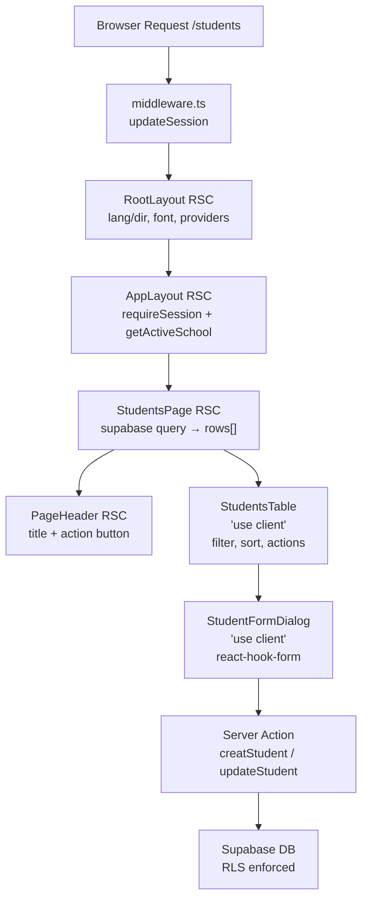

# 09 — Frontend Structure

**Madrasati ERP** — Next.js 15 App Router, Arabic-first (RTL), multi-tenant.

---

## Table of Contents

1. [Directory Tree](#1-directory-tree)
2. [Route Groups: `(auth)` and `(app)`](#2-route-groups-auth-and-app)
3. [src/components](#3-srccomponents)
4. [src/features/\<module\>](#4-srcfeaturesmodule)
5. [src/lib](#5-srclib)
6. [src/i18n and src/messages](#6-srci18n-and-srcmessages)
7. [Rendering Model: RSC vs Client Components](#7-rendering-model-rsc-vs-client-components)
8. [Data-Fetching Conventions](#8-data-fetching-conventions)
9. [RTL and Arabic-First Conventions](#9-rtl-and-arabic-first-conventions)
10. [Path Aliases](#10-path-aliases)

---

## 1. Directory Tree

```
src/
├── app/
│   ├── layout.tsx                    # Root layout — <html lang dir>, Cairo font, providers
│   ├── globals.css                   # Tailwind base, CSS variable theme tokens
│   ├── page.tsx                      # "/" → redirect to /dashboard
│   │
│   ├── login/
│   │   └── page.tsx                  # Public login page (RSC shell + LoginForm client)
│   │
│   └── (app)/                        # Authenticated route group
│       ├── layout.tsx                # App shell: requireSession + Sidebar + Topbar
│       ├── dashboard/
│       │   └── page.tsx              # Executive dashboard (RSC, force-dynamic)
│       └── students/
│           └── page.tsx              # Students list (RSC, force-dynamic)
│           # ... (teachers, classes, grades, attendance, etc.)
│
├── components/
│   ├── providers.tsx                 # TanStack Query QueryClientProvider
│   ├── language-switcher.tsx         # Locale toggle (calls setLocale server action)
│   │
│   ├── ui/                           # shadcn-style primitives (all client-compatible)
│   │   ├── avatar.tsx
│   │   ├── badge.tsx
│   │   ├── button.tsx
│   │   ├── card.tsx
│   │   ├── dialog.tsx
│   │   ├── dropdown-menu.tsx
│   │   ├── input.tsx
│   │   ├── label.tsx
│   │   ├── select.tsx
│   │   ├── separator.tsx
│   │   ├── skeleton.tsx
│   │   ├── sonner.tsx                # Toast (Toaster positioned by locale dir)
│   │   ├── table.tsx
│   │   └── tabs.tsx
│   │
│   ├── shell/                        # Application chrome
│   │   ├── sidebar.tsx               # Collapsible sidebar ("use client")
│   │   ├── topbar.tsx                # Top bar with user menu / school name
│   │   ├── user-menu.tsx             # Avatar dropdown (sign-out)
│   │   ├── page-header.tsx           # PageHeader RSC — title + subtitle + action slot
│   │   └── icon.tsx                  # NavIcon: lucide icon rendered by string name
│   │
│   ├── auth/
│   │   └── login-form.tsx            # LoginForm "use client" — Supabase signInWithPassword
│   │
│   └── dashboard/
│       ├── stat-card.tsx             # KPI card with icon + tone variant
│       └── charts.tsx                # recharts wrappers (AttendanceTrendChart, etc.)
│
├── features/                         # One sub-folder per domain module
│   └── students/
│       ├── schema.ts                 # Zod schema (studentSchema) + StudentInput type
│       ├── actions.ts                # "use server" — createStudent, updateStudent, archiveStudent
│       ├── students-table.tsx        # "use client" — filterable table + inline archive
│       └── student-form.tsx          # "use client" — react-hook-form dialog (create/edit)
│
├── i18n/
│   ├── config.ts                     # locales, defaultLocale ("ar"), LOCALE_COOKIE, localeDir
│   ├── request.ts                    # next-intl getRequestConfig — cookie-based locale
│   └── actions.ts                    # "use server" setLocale — persists cookie, revalidates
│
├── lib/
│   ├── auth.ts                       # getSessionProfile (cached), requireSession
│   ├── auth-actions.ts               # "use server" signOut
│   ├── rbac.ts                       # ROLES, PERMISSIONS, ROLE_PERMISSIONS matrix, hasPermission
│   ├── audit.ts                      # logAudit → audit_logs table (best-effort, non-blocking)
│   ├── school.ts                     # getActiveSchool (cached) — branding + calendar
│   ├── navigation.ts                 # NAVIGATION: NavGroup[] used by Sidebar
│   ├── dates.ts                      # formatDate (Gregorian/Hijri), todayISO, ageFrom
│   ├── gpa.ts                        # subjectPercentage, bandFor, gpaFor, termGpa, rankByDesc
│   ├── utils.ts                      # cn (clsx + twMerge), pct
│   ├── database.types.ts             # Generated Supabase TypeScript types (Database)
│   └── supabase/
│       ├── server.ts                 # createClient (SSR cookie), createAdminClient (service role)
│       ├── client.ts                 # createClient for browser (anon key)
│       └── middleware.ts             # updateSession — keeps Supabase cookie refreshed
│
├── messages/
│   ├── ar.json                       # Arabic translations (default, RTL)
│   └── en.json                       # English translations
│
└── middleware.ts                     # Next.js middleware → updateSession on every route
```

---

## 2. Route Groups: `(auth)` and `(app)`

Next.js route groups (folders wrapped in parentheses) share a layout without adding a URL segment. Madrasati uses two groups:

```
app/
├── login/          ← public, no group — layout.tsx (root) only
└── (app)/          ← authenticated group
    ├── layout.tsx  ← injects AppLayout (session guard + shell)
    ├── dashboard/
    └── students/
    └── …
```

### Root layout (`src/app/layout.tsx`)

Applies to every route. Responsibilities:

- Loads `locale` from the next-intl request config (cookie → fallback `"ar"`).
- Sets `<html lang={locale} dir={dir}>`. `dir` comes from `localeDir` in `src/i18n/config.ts` — `"rtl"` for Arabic, `"ltr"` for English.
- Registers the **Cairo** typeface (`next/font/google`, subsets `["arabic", "latin"]`, CSS variable `--font-sans`).
- Wraps children in `<NextIntlClientProvider>` + `<Providers>` (TanStack Query).
- Mounts `<Toaster>` (sonner) — positioned `bottom-left` for RTL, `bottom-right` for LTR.

### App layout (`src/app/(app)/layout.tsx`)

Runs only for authenticated routes. Responsibilities:

1. Calls `requireSession()` — redirects unauthenticated users to `/login`.
2. Calls `getActiveSchool(profile.schoolId)` — retrieves the school's `name_ar`, `name_en`, `logo_url`, `theme` (JSON CSS overrides), and `calendar`.
3. Injects per-school theme CSS into `<style>` as `:root { --primary: …; … }`.
4. Renders `<Sidebar role={profile.role} …>` + `<Topbar …>` + `<main>` (with responsive padding `p-4 md:p-6 lg:p-8`).

Both `getSessionProfile` and `getActiveSchool` are memoized with React's `cache()`, so multiple layout/page calls in the same request hit Supabase only once.

### Login route (`src/app/login/page.tsx`)

A public RSC. Renders a two-column split: branding panel (desktop only) + login card. The interactive `<LoginForm>` is a `"use client"` component that calls `supabase.auth.signInWithPassword`. On success it `router.replace("/dashboard")`.

---

## 3. src/components

Components are organized by **concern**, not by domain. Domain-specific UI (tables, forms) lives in `src/features/<module>` instead.

### 3.1 ui/ — Primitives

Thin wrappers around Radix UI / headless components, styled with Tailwind. They are **not** marked `"use client"` themselves — they can be composed in RSCs (they rely on Radix's own client boundary). All spacing uses logical CSS properties (`ps-`, `pe-`, `ms-`, `me-`, `start-`, `end-`) so RTL flipping is automatic.

| File | Purpose |
|---|---|
| `button.tsx` | Variants: `default`, `outline`, `ghost`, `destructive`. Sizes: `default`, `sm`, `icon`. |
| `badge.tsx` | `variant` prop: `success`, `secondary`, `warning`, `destructive`. Used for student status chips. |
| `card.tsx` | `Card`, `CardHeader`, `CardTitle`, `CardContent` — the primary surface. |
| `dialog.tsx` | Full-screen overlay used by all module forms. |
| `table.tsx` | `Table`, `TableHeader`, `TableRow`, `TableHead`, `TableBody`, `TableCell`. |
| `select.tsx` | Accessible dropdown (Radix Select). |
| `dropdown-menu.tsx` | Context menus — used in table row action menus. |
| `sonner.tsx` | `Toaster` wrapper re-exported; direction-aware positioning set in root layout. |
| `skeleton.tsx` | Loading placeholder. |

### 3.2 shell/ — Application Chrome

The shell components form the persistent UI frame around every authenticated page.

**`sidebar.tsx`** (`"use client"`)

- Reads `NAVIGATION` from `src/lib/navigation.ts` — a `NavGroup[]` array with 4 groups: `academic`, `operations`, `insights`, `administration`.
- Filters each `NavItem` through `hasPermission(role, item.permission)` so the sidebar only shows links the signed-in role can reach.
- Icons are rendered via `<NavIcon name={item.icon} />`, a string-keyed lucide-react lookup in `icon.tsx`.
- Supports collapse to icon-only mode (`w-[76px]`) via local `useState`.
- Sticky (`sticky top-0 h-screen`), RTL-compatible, hidden on mobile (`hidden md:flex`).

**`page-header.tsx`** (RSC)

Used at the top of every module page:

```tsx
// Example from src/app/(app)/students/page.tsx
<PageHeader title={t("title")} subtitle={t("subtitle")}>
  <Button variant="outline"><Download /> {tc("export")}</Button>
</PageHeader>
```

Props: `title`, `subtitle?`, `children` (action buttons), `className?`. Renders an `<h1>` with `text-2xl font-bold` and a flex row that pushes actions to the end (logical `justify-between`).

**`icon.tsx`** (RSC-compatible)

`NavIcon` resolves a lucide icon by name at runtime using a static `MAP` object. This allows the data-driven `NAVIGATION` array and `StatCard` to specify icons as plain strings without a dynamic `require()`. The MAP currently includes: `LayoutDashboard`, `GraduationCap`, `Users`, `School`, `BookOpen`, `Building2`, `CalendarCheck`, `ClipboardList`, `CalendarDays`, `BookMarked`, `BookHeart`, `Scale`, `Eye`, `Trophy`, `FileText`, `LineChart`, `MessageSquare`, `Wallet`, `ShieldCheck`, `Palette`, `Settings`, `ScrollText`.

### 3.3 auth/

`login-form.tsx` (`"use client"`) — the only truly interactive auth component. Uses the **browser** Supabase client (`src/lib/supabase/client.ts`), never the server one.

### 3.4 dashboard/

`stat-card.tsx` — A `<Card>` with an icon container, label, large value, and optional hint string. The `tone` prop (`primary`, `success`, `warning`, `muted`) maps to Tailwind bg/text classes using the CSS variable theme tokens.

`charts.tsx` — recharts wrappers: `AttendanceTrendChart` (line/bar), `DepartmentPerformanceChart` (bar), `EnrollmentDonut` (pie). All are `"use client"` because recharts uses browser APIs.

---

## 4. src/features/\<module\>

Each domain module gets one directory under `src/features/`. The students module is the **canonical reference** — all future modules must follow the same four-file pattern.

```
src/features/students/
├── schema.ts          # Zod + TypeScript — shared by form and server action
├── actions.ts         # "use server" — all DB mutations for this module
├── students-table.tsx # "use client" — read + UI interaction
└── student-form.tsx   # "use client" — create/edit dialog
```

### 4.1 schema.ts

Pure TypeScript + Zod. **No Next.js or Supabase imports.** Defines the input shape for a create/update operation. The schema is the single source of truth for both client-side validation (react-hook-form) and server-side validation (Server Action). The `studentSchema` covers every column in `public.students` that the UI can write:

```
name_ar, name_en, gender, student_no, ministry_no, civil_id, dob,
nationality, religion, address, medical_notes, enrollment_date,
emergency_contact, father_name, mother_name, guardian_name,
guardian_mobile, guardian_email, guardian_occupation,
current_class_id, status
```

Note: `id`, `school_id`, `photo_url`, `created_at`, `updated_at` are excluded — they are managed by the DB or the action layer.

### 4.2 actions.ts

`"use server"` file. Contains all mutations for the module. Pattern for every action:

1. `requireSession()` — abort if unauthenticated.
2. `hasPermission(profile.role, '<resource>:write')` — return `{ ok: false, error: "forbidden" }` if denied.
3. `schema.safeParse(input)` — return `{ ok: false, error: … }` on invalid data.
4. `createClient()` → `supabase.from(table)…` — the RLS on Supabase enforces `school_id` automatically via `in_my_school()`.
5. `logAudit(action, entity, entityId, meta)` — append to `audit_logs` (best-effort, never throws into the caller).
6. `revalidatePath('/students')` — invalidate the Next.js cache for the list page.
7. Return `{ ok: true }`.

Mutations defined in `students/actions.ts`: `createStudent`, `updateStudent`, `archiveStudent`. Soft-delete (`status = 'archived'`) is used instead of hard-delete to preserve history.

### 4.3 \<module\>-table.tsx

`"use client"`. Receives all data as props from the RSC page (no client-side fetching for the initial list). Responsibilities:

- Client-side text search (filter across `name_ar`, `name_en`, `ministry_no`, `civil_id`, `guardian_mobile` using a `useMemo`).
- Row action menu (Radix `DropdownMenu`) with Edit (opens form dialog) and Archive.
- Calls Server Actions directly (e.g., `archiveStudent(id)`), then calls `toast.success/error`.
- Uses `useLocale()` to decide whether to display `name_ar` or `name_en`.

The exported `StudentRow` type extends `StudentInput` with `id` and `className` (denormalized from the `classes` join).

### 4.4 \<module\>-form.tsx

`"use client"`. A `<Dialog>` controlled by local `useState(open)`. Uses `react-hook-form` with `zodResolver(studentSchema)`. Dual-mode: if `id` prop is present it calls `updateStudent`, otherwise `createStudent`. After a successful save it closes the dialog and resets the form (for create) or leaves data in place (for edit).

The form layout uses a two-column `<section className="grid gap-4 sm:grid-cols-2">` grid for field pairs, with RTL-aware `dir="ltr"` on specific inputs where numbers or Latin values must read left-to-right (e.g., `ministry_no`, `civil_id`, `guardian_mobile`).

---

## 5. src/lib

Pure utility and integration code. Nothing in `src/lib` contains JSX. All server-only modules use Supabase's SSR cookie client; browser-facing modules use the anon client.

### 5.1 auth.ts

```typescript
// Key exports:
getSessionProfile(): Promise<SessionProfile | null>  // cached per request
requireSession(): Promise<SessionProfile>            // redirects to /login if null
```

`SessionProfile` shape mirrors the `profiles` table columns:
`id`, `email`, `fullName` (← `full_name`), `role`, `schoolId` (← `school_id`), `avatarUrl` (← `avatar_url`).

Internally calls `supabase.auth.getUser()` then a single `profiles.select(…).eq("id", user.id)` query. Both calls are behind `React.cache()` so the same request never hits the DB twice regardless of how many layouts/pages call it.

### 5.2 rbac.ts

The RBAC model is fully expressed in TypeScript here, mirroring the DB tables `roles`, `permissions`, and `role_permissions` (migration `0001_core_and_rbac.sql`). The frontend uses it to show/hide UI; the DB enforces the same rules via RLS (`has_perm()`).

```typescript
// The 11 roles:
"super_admin" | "principal" | "vice_principal" | "department_head"
| "teacher" | "activity_supervisor" | "registrar" | "finance_officer"
| "auditor" | "student" | "parent"

// 37 permissions in resource:action format, e.g.:
"students:read" | "students:write" | "students:delete" | "students:import"
"attendance:write" | "grades:write" | "finance:read" | "audit:read" …

// Usage in RSC pages:
if (!hasPermission(profile.role, "students:read")) redirect("/dashboard");

// Usage in client components (UI gating):
canWrite={hasPermission(profile.role, "students:write")}
```

### 5.3 audit.ts

`logAudit(action, entity?, entityId?, meta?)` — writes to `public.audit_logs`. Columns written: `school_id`, `user_id`, `user_email`, `action` (e.g., `"student.create"`), `entity` (e.g., `"students"`), `entity_id`, `meta` (jsonb). The function is wrapped in `try/catch` — an audit failure never bubbles up to the calling action.

### 5.4 school.ts

`getActiveSchool(schoolId)` — cached per request. Queries `public.schools` for `id, name_ar, name_en, logo_url, theme, calendar`. The `theme` column is `jsonb` with CSS custom property key/value pairs (e.g., `{ "--primary": "218 64% 23%" }`). The app layout injects these as a `<style>` block so each school has its own brand color.

### 5.5 navigation.ts

`NAVIGATION: NavGroup[]` — the authoritative sidebar map. Each `NavItem` carries:

| Field | Type | Example |
|---|---|---|
| `key` | `string` | `"students"` (i18n key under `nav.*`) |
| `href` | `string` | `"/students"` |
| `icon` | `string` | `"GraduationCap"` (lucide name) |
| `permission?` | `Permission` | `"students:read"` |

Groups: `academic` (dashboard, students, teachers, classes, subjects, departments), `operations` (attendance, grades, timetable, curriculum, islamic, behavior, observations, activities), `insights` (reports, analytics, communication), `administration` (finance, users, branding, settings, auditLog).

### 5.6 dates.ts

```typescript
formatDate(date, locale, calendar?, options?)   // Gregorian or Hijri (Intl engine)
formatDateShort(date, locale, calendar?)        // numeric short form
todayISO(): string                              // "YYYY-MM-DD" for attendance keys
ageFrom(dob): number                            // age in years
```

Calendar support: `"gregorian"` uses `ar-SA` / `en-US` Intl locales; `"hijri"` appends `-u-ca-islamic-umalqura`. The active calendar comes from `schools.calendar` (set per school in the Branding/Settings module).

### 5.7 gpa.ts

Pure computation functions, fully unit-tested (`src/lib/__tests__/gpa.test.ts`). No Supabase calls:

```typescript
subjectPercentage(items: WeightedScore[]): number   // weighted rollup → 0..100
bandFor(pct, scale): GradeBand | null               // find letter band
gpaFor(pct, scale): number                          // GPA point for a percentage
termGpa(percentages, scale): number                 // average across subjects
rankByDesc<T>(rows, metric): Map<T, number>         // dense ranking
```

`GradeBand` is shaped after `public.grade_scales`: `min_pct`, `max_pct`, `letter`, `gpa`, `label_ar`.

### 5.8 supabase/

Three files with strict separation:

| File | Client type | Where imported |
|---|---|---|
| `server.ts` | SSR cookie client (RLS-aware) | Server Components, Server Actions, Route Handlers |
| `client.ts` | Browser anon client | `"use client"` components only (login form) |
| `middleware.ts` | `updateSession` | `src/middleware.ts` — refreshes session token on every request |

`createAdminClient()` in `server.ts` uses the `SUPABASE_SERVICE_ROLE_KEY` (bypasses RLS). It is only used for privileged server-side operations like bulk imports and must never be imported into any client-facing file.

---

## 6. src/i18n and src/messages

Madrasati uses **next-intl** without locale-prefixed routing. The active locale lives in a cookie (`madrasati_locale`), so all URLs remain clean (e.g., `/students` not `/ar/students`).

### 6.1 i18n/config.ts

```typescript
export const locales = ["ar", "en"] as const;
export const defaultLocale: Locale = "ar";           // Arabic is the default
export const LOCALE_COOKIE = "madrasati_locale";
export const localeDir: Record<Locale, "rtl" | "ltr"> = { ar: "rtl", en: "ltr" };
```

### 6.2 i18n/request.ts

Called by next-intl's `getRequestConfig`. Reads `LOCALE_COOKIE` from the request's cookie store; falls back to `"ar"`. Dynamically imports `src/messages/<locale>.json`.

### 6.3 i18n/actions.ts

`setLocale(locale)` — a Server Action called by the `<LanguageSwitcher>` component. Writes the cookie (`maxAge` 1 year, `sameSite: "lax"`) then calls `revalidatePath("/", "layout")` to force a full re-render in the new locale.

### 6.4 messages/ar.json and messages/en.json

Flat-with-namespaces JSON. Namespaces in use:

| Namespace | Contents |
|---|---|
| `app` | `name` ("مدرستي"), `tagline` |
| `common` | Shared labels: `save`, `cancel`, `edit`, `archive`, `search`, `noData`, `saved`, `error`, … |
| `nav` | Sidebar link labels + group headings (4 groups: `academic`, `people`, `operations`, `insights`, `administration`) |
| `auth` | Login screen copy, error messages |
| `dashboard` | KPI card labels, chart section titles |
| `students` | Field labels, status enum labels (`statusEnrolled` → "مقيّد"), action labels |
| `teachers` | Staff field labels |
| `classes` | Class management labels |
| `subjects` | Subject field labels |
| `attendance` | Attendance status labels (`present`, `absent`, `excused`, `late`, `medical`) |
| `grades` | Assessment type labels, GPA/rank labels |
| `islamic` | Quran/Islamic education specific labels |
| `departments` | Department names and KPI labels |
| `settings` | School configuration labels |
| `language` | Language switcher labels |

Usage conventions:

```typescript
// RSC
const t = await getTranslations("students");
t("title")  // "الطلاب"

// Client component
const t = useTranslations("students");
const tc = useTranslations("common");
```

---

## 7. Rendering Model: RSC vs Client Components

The project follows a **server-first** model. Components default to RSC; `"use client"` is added only when browser APIs, state, or event handlers are required.



### Decision matrix

| Situation | Rendering | Reason |
|---|---|---|
| Page data fetch from Supabase | RSC | Direct DB access, no waterfall |
| Permission check (`hasPermission`) | RSC (page) | Guards are enforced server-side; client check is UI-only hint |
| Static shell (PageHeader, sidebar labels) | RSC or server-compatible | No interactivity needed |
| Filter/search within a loaded list | Client | `useState` + `useMemo` |
| Dialog open/close | Client | `useState` |
| Form with validation | Client | `react-hook-form` + `zodResolver` |
| Chart rendering (recharts) | Client | Browser canvas/SVG APIs |
| Language switcher | Client | Calls Server Action, then router refresh |
| Toast notifications | Client | `sonner` |

---

## 8. Data-Fetching Conventions

### 8.1 Page-level data fetch (RSC)

All initial data for a page is fetched in the RSC page component, not in child components. This eliminates client-side loading spinners for the primary content. Parallel queries use `Promise.all`:

```typescript
// src/app/(app)/students/page.tsx
const [{ data: students }, { data: classes }] = await Promise.all([
  supabase
    .from("students")
    .select("id, name_ar, name_en, gender, ministry_no, civil_id, dob, nationality, guardian_mobile, current_class_id, status, classes:current_class_id(name)")
    .order("name_ar")
    .limit(1000),
  supabase.from("classes").select("id, name").eq("status", "active").order("name"),
]);
```

Data is then cast into a typed shape (`StudentRow[]`) before being passed as props to client components.

### 8.2 Client mutations (Server Actions)

Mutations go through Server Actions (`"use server"` functions in `features/<module>/actions.ts`). The client component calls them like regular async functions:

```typescript
// In students-table.tsx
const res = await archiveStudent(id);
if (res.ok) toast.success(tc("saved"));
else toast.error(tc("error"));
```

All actions return `{ ok: true } | { ok: false; error: string }` — never throw.

### 8.3 TanStack Query (secondary / interactive data)

`<Providers>` wraps the app with `QueryClientProvider` (staleTime 30s, no refetch-on-focus). TanStack Query is used for:

- Polling or reactive data (e.g., attendance real-time updates).
- Infinite scroll / paginated lists.
- Data that multiple unrelated components share.

For the initial page load TanStack Query is not used — RSC does the fetch.

### 8.4 `force-dynamic` on all app pages

```typescript
export const dynamic = "force-dynamic";
```

Added to every page in `(app)/`. This disables static generation and ensures Supabase auth cookies are read fresh on every request. Without it, Next.js may cache the page and serve stale data or the wrong user's session.

---

## 9. RTL and Arabic-First Conventions

The HTML `dir` attribute is set at the `<html>` level by the root layout based on the active locale. All layout is done with **logical CSS** so the same code works in both directions:

| Avoid | Use instead |
|---|---|
| `left`, `right` | `start`, `end` |
| `pl-`, `pr-` | `ps-`, `pe-` |
| `ml-`, `mr-` | `ms-`, `me-` |
| `text-left`, `text-right` | `text-start`, `text-end` |
| `border-l`, `border-r` | `border-s`, `border-e` |

When a specific field contains LTR content (number IDs, email, phone), `dir="ltr"` is applied on the `<Input>` element while keeping `text-start` alignment:

```tsx
// students/student-form.tsx
<Input dir="ltr" {...register("ministry_no")} />
<Input dir="ltr" {...register("civil_id")} />
```

Arabic names display as primary; English names (`name_en`) are shown only when `locale === "en"` and the column is non-null:

```tsx
// students-table.tsx
{locale === "en" && r.name_en ? r.name_en : r.name_ar}
```

The `sonner` Toaster is positioned `bottom-left` in RTL (the natural reading-end corner for Arabic) and `bottom-right` in LTR.

---

## 10. Path Aliases

All imports use the `@/` alias pointing to `src/`. No relative `../../` imports are used.

| Alias pattern | Resolves to |
|---|---|
| `@/lib/auth` | `src/lib/auth.ts` |
| `@/lib/rbac` | `src/lib/rbac.ts` |
| `@/lib/supabase/server` | `src/lib/supabase/server.ts` |
| `@/features/students/actions` | `src/features/students/actions.ts` |
| `@/components/ui/button` | `src/components/ui/button.tsx` |
| `@/components/shell/page-header` | `src/components/shell/page-header.tsx` |
| `@/i18n/config` | `src/i18n/config.ts` |
| `@/messages/ar.json` | `src/messages/ar.json` |

---

## Adding a New Module

Follow the students module pattern exactly:

1. **`src/features/<module>/schema.ts`** — Zod schema for create/update input. Reference DB columns from `supabase/migrations/`.
2. **`src/features/<module>/actions.ts`** — Server Actions: permission check → zod parse → Supabase mutation → `logAudit` → `revalidatePath` → `{ ok: true }`.
3. **`src/features/<module>/<module>-table.tsx`** — `"use client"` table. Receive rows as props. Client-side filter only.
4. **`src/features/<module>/<module>-form.tsx`** — `"use client"` dialog. `react-hook-form` + `zodResolver`.
5. **`src/app/(app)/<module>/page.tsx`** — RSC. `requireSession` → `hasPermission` → parallel Supabase queries → pass typed rows to the table component. Add `export const dynamic = "force-dynamic"`.
6. **`src/lib/navigation.ts`** — Add a `NavItem` in the appropriate group with the matching `permission` key.
7. **`src/messages/ar.json` + `en.json`** — Add a top-level namespace for the module.
8. **`src/lib/rbac.ts`** — Verify the required permission (`<resource>:read`, `<resource>:write`) is listed in `PERMISSIONS` and granted to the appropriate roles in `ROLE_PERMISSIONS`.
