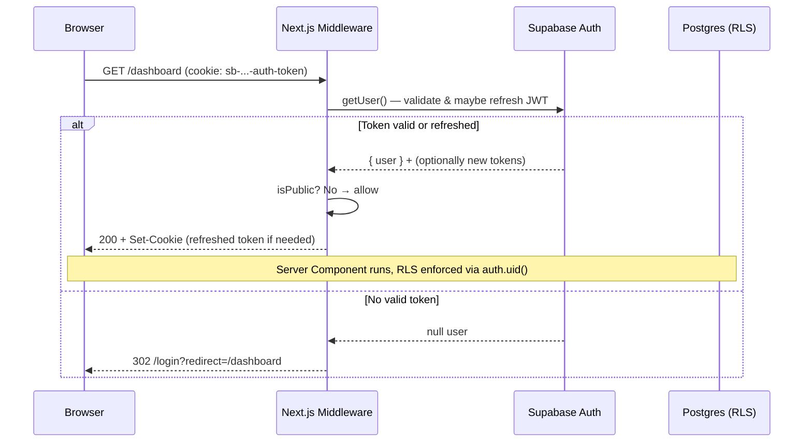
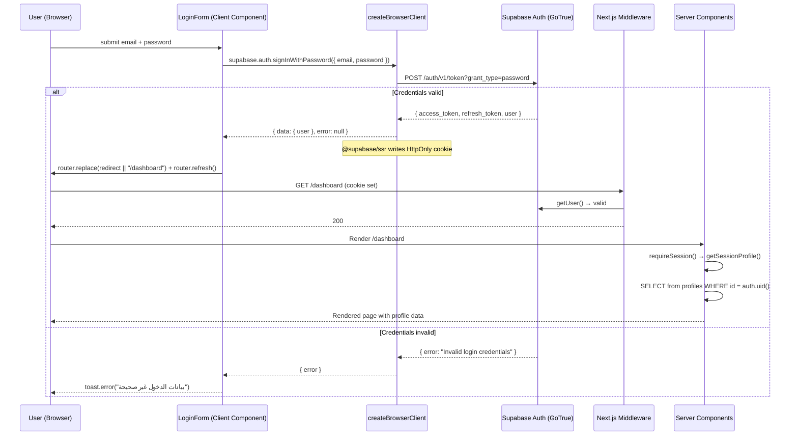
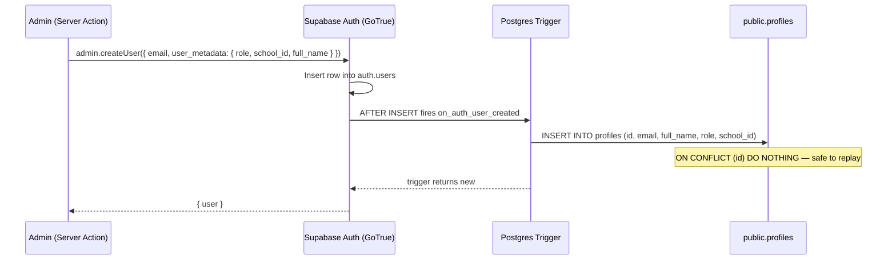
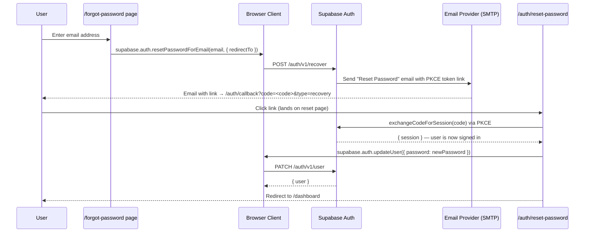
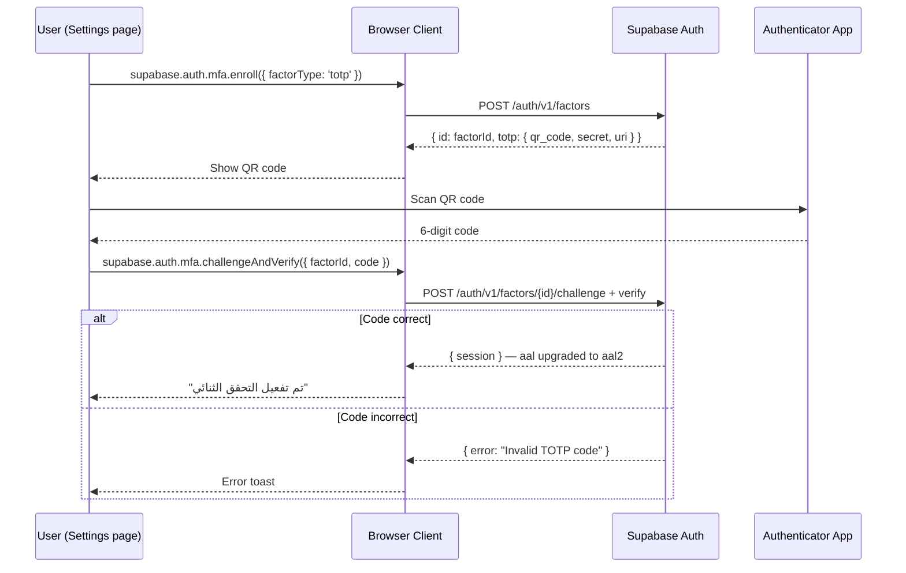
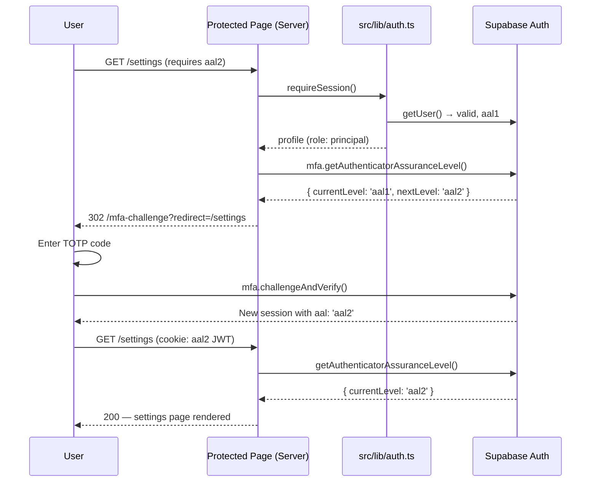

# 11 — Authentication Flow

Madrasati uses **Supabase Auth** as its identity provider backed by Postgres. All sessions are JWT-based, transported exclusively as HTTP-only cookies on the server side (never `localStorage` in production). The Next.js App Router runs on the edge/Node.js server; session management is handled by `@supabase/ssr` so no session data is trusted from the client.

---

## Table of Contents

1. [Stack Summary](#1-stack-summary)
2. [Cookie Session Architecture](#2-cookie-session-architecture)
3. [Middleware: Session Refresh & Route Guarding](#3-middleware-session-refresh--route-guarding)
4. [Sign-In Flow (Email + Password)](#4-sign-in-flow-email--password)
5. [Server-Side Session Resolution](#5-server-side-session-resolution)
6. [The `handle_new_user` Trigger](#6-the-handle_new_user-trigger)
7. [Password Reset Flow](#7-password-reset-flow)
8. [Multi-Factor Authentication (TOTP / AAL2)](#8-multi-factor-authentication-totp--aal2)
9. [Token Lifecycle & Refresh](#9-token-lifecycle--refresh)
10. [Sign-Out](#10-sign-out)
11. [RLS & RBAC Integration](#11-rls--rbac-integration)
12. [Audit Trail](#12-audit-trail)
13. [Security Notes](#13-security-notes)

---

## 1. Stack Summary

| Layer | Technology | Key File |
|---|---|---|
| Identity provider | Supabase Auth (GoTrue) | — |
| Session transport | HTTP-only cookies via `@supabase/ssr` | `src/lib/supabase/server.ts` |
| Browser client | `createBrowserClient` | `src/lib/supabase/client.ts` |
| Server/RSC client | `createServerClient` | `src/lib/supabase/server.ts` |
| Middleware | `updateSession` | `src/lib/supabase/middleware.ts` |
| Route guarding | `requireSession()` | `src/lib/auth.ts` |
| Profile + roles | `public.profiles` table | migration `0001_core_and_rbac.sql` |
| RLS enforcement | Postgres policies | migration `0005_rls_policies.sql` |
| Audit logging | `public.audit_logs` + `logAudit()` | `src/lib/audit.ts` |

---

## 2. Cookie Session Architecture

Supabase Auth issues two JWTs per authenticated session:

- **Access token** — short-lived (~1 hour). Contains `sub` (user UUID), `role` (`authenticated`), `aal` (assurance level), and any custom claims. Sent to Postgres as a bearer token so RLS can call `auth.uid()`.
- **Refresh token** — long-lived (default 7 days, revocable). Used to obtain a new access token when the current one expires.

`@supabase/ssr` stores both tokens in a **single `HttpOnly; Secure; SameSite=Lax` cookie** named `sb-<project-ref>-auth-token`. The cookie is split across chunks if it exceeds 4 KB. Because the cookie is `HttpOnly`, JavaScript running in the browser cannot read it — the access token is effectively opaque to client-side code.

```
Browser                        Next.js Server                  Supabase Auth / Postgres
  │                                  │                                   │
  │  POST /login (credentials)       │                                   │
  │─────────────────────────────────>│                                   │
  │                                  │  signInWithPassword()             │
  │                                  │──────────────────────────────────>│
  │                                  │  ← { access_token, refresh_token }│
  │  Set-Cookie: sb-...-auth-token   │                                   │
  │<─────────────────────────────────│                                   │
```

**Client component calls** (e.g., `LoginForm`) use `createBrowserClient` from `src/lib/supabase/client.ts`. Supabase SSR automatically intercepts `setSession` calls from the browser client and reflects the tokens back to the Next.js server via a cookie, so Server Components see an up-to-date session on the next request.

**Server Component / Server Action calls** use `createClient()` from `src/lib/supabase/server.ts`, which reads the cookie store via Next.js's `cookies()` API. The `setAll` callback writes refreshed tokens back to the response cookie. If `setAll` is called from a read-only Server Component (no outgoing response), the `try/catch` silently drops it — middleware handles the refresh instead.

---

## 3. Middleware: Session Refresh & Route Guarding

Every HTTP request (except static assets) passes through `src/middleware.ts` → `updateSession()` in `src/lib/supabase/middleware.ts`.

```typescript
// src/middleware.ts
export async function middleware(request: NextRequest) {
  return await updateSession(request);
}

export const config = {
  matcher: [
    "/((?!_next/static|_next/image|favicon.ico|.*\\.(?:svg|png|jpg|jpeg|gif|webp|ico)$).*)",
  ],
};
```

`updateSession` does three things:

1. **Builds a server-side Supabase client** wired to `request.cookies` for reads and both `request.cookies` and `response.cookies` for writes (so refreshed tokens propagate in the `Set-Cookie` response header).

2. **Calls `supabase.auth.getUser()`** — this is critical. `getUser()` makes a network call to Supabase Auth to revalidate the access token rather than trusting the cookie value alone. If the access token is expired, Supabase Auth exchanges the refresh token for a new pair and the middleware writes fresh cookies onto the response.

3. **Guards routes** based on the `PUBLIC_PATHS` list (`/login`, `/forgot-password`, `/auth`):
   - Unauthenticated request to a private path → `302` redirect to `/login?redirect=<original-path>`.
   - Authenticated request to `/login` → `302` redirect to `/dashboard`.



> **Why `getUser()` and not `getSession()`?** `getSession()` only decodes the JWT locally — it does not verify the token's revocation status against Supabase Auth. A leaked or force-expired token would still appear valid. `getUser()` makes a network round-trip that checks the server-side session store, catching sign-outs from other devices and admin-forced logouts.

---

## 4. Sign-In Flow (Email + Password)

The login page is `src/app/login/page.tsx` — a Server Component shell wrapping `<LoginForm />`, which is a Client Component (`"use client"`) at `src/components/auth/login-form.tsx`.



Key points:

- `signInWithPassword` calls GoTrue's `/auth/v1/token` endpoint with `grant_type=password`.
- The `@supabase/ssr` browser client intercepts the response and stores tokens in the `sb-<ref>-auth-token` cookie via a `Set-Cookie` header (or a client-side cookie write in the browser context).
- After `router.replace()`, `router.refresh()` forces Next.js to revalidate all Server Component data — the new cookie is now visible to Server Components on the refreshed request.
- The `redirect` query param is set by middleware when it redirects unauthenticated users; after login the user lands back on their intended page.

---

## 5. Server-Side Session Resolution

Every protected Server Component or Server Action calls one of two helpers in `src/lib/auth.ts`:

### `getSessionProfile()`

```typescript
export const getSessionProfile = cache(async (): Promise<SessionProfile | null> => {
  const supabase = await createClient();
  const { data: { user } } = await supabase.auth.getUser();
  if (!user) return null;

  const { data: profile } = await supabase
    .from("profiles")
    .select("id, email, full_name, role, school_id, avatar_url")
    .eq("id", user.id)
    .single();
  // ...
});
```

- Wrapped in React's `cache()` — the Supabase call and profiles query run **once per request**, regardless of how many layouts, pages, or components call it.
- Calls `supabase.auth.getUser()` (server-side), which validates the JWT via Supabase Auth.
- Then queries `public.profiles` — gated by RLS policy `profiles_sel`:
  ```sql
  create policy profiles_sel on public.profiles for select to authenticated
    using (id = auth.uid() or public.is_super_admin()
           or (school_id = public.current_school_id() and public.has_perm('users:manage')));
  ```
  A regular user can only read their own row; admins with `users:manage` can read their school's rows; `super_admin` can read all.
- Falls back gracefully if the profile row does not exist yet (trigger backfill pending): returns a minimal profile with role `'teacher'` and `schoolId: null`.

### `requireSession()`

```typescript
export async function requireSession(): Promise<SessionProfile> {
  const profile = await getSessionProfile();
  if (!profile) redirect("/login");
  return profile;
}
```

Used in every protected page layout. If the user has no valid session, Next.js throws a `NEXT_REDIRECT` which terminates rendering and sends a `302` to `/login`. This is a defense-in-depth layer; the middleware already blocks unauthenticated requests, but `requireSession()` guarantees correctness even if the middleware matcher has gaps.

### `SessionProfile` type

```typescript
export type SessionProfile = {
  id: string;         // auth.users.id (UUID)
  email: string | null;
  fullName: string | null;
  role: Role;         // one of the 11 roles in src/lib/rbac.ts
  schoolId: string | null;  // tenant binding
  avatarUrl: string | null;
};
```

The `role` and `schoolId` fields are the two most important for downstream RBAC and RLS checks.

---

## 6. The `handle_new_user` Trigger

When Supabase Auth creates a row in `auth.users` (on signup or admin-invite), a Postgres trigger fires automatically:

```sql
-- migration: 0001_core_and_rbac.sql
create or replace function public.handle_new_user()
returns trigger language plpgsql security definer set search_path = public as $$
begin
  insert into public.profiles (id, email, full_name, role, school_id)
  values (
    new.id,
    new.email,
    coalesce(new.raw_user_meta_data->>'full_name', new.email),
    coalesce(new.raw_user_meta_data->>'role', 'teacher'),
    nullif(new.raw_user_meta_data->>'school_id','')::uuid
  )
  on conflict (id) do nothing;
  return new;
end; $$;

create trigger on_auth_user_created
  after insert on auth.users
  for each row execute function public.handle_new_user();
```



Key details:

- The function runs as `SECURITY DEFINER` with `search_path = public` to bypass RLS when inserting the profile row (the auth system itself has no JWT at trigger time).
- `raw_user_meta_data` is the JSON payload sent by the caller during user creation. Admins provision users via a Server Action that calls `createAdminClient().auth.admin.createUser(...)` — this is the only place the service-role key is used.
- `must_change_password` defaults to `false` in the table definition but can be toggled on provisioned accounts to force a password update on first login.
- `on conflict (id) do nothing` makes the trigger idempotent — safe if replayed due to a transaction retry.

---

## 7. Password Reset Flow

Supabase Auth implements the "forgot password" flow via a one-time magic link sent to the user's email.



Notes:

- The `redirectTo` parameter must be an explicitly allow-listed URL in the Supabase project's "Redirect URLs" settings.
- Supabase uses **PKCE** (Proof Key for Code Exchange) for the recovery flow so the one-time code cannot be intercepted in the URL and replayed.
- The `/auth/callback` route handler calls `supabase.auth.exchangeCodeForSession(code)` and then redirects to the password-update page. This route should be added to `PUBLIC_PATHS` in `src/lib/supabase/middleware.ts` so unauthenticated recovery links are not blocked.
- After `updateUser()` completes, it is good practice to call `logAudit('auth.password_reset', 'profiles', userId)` and set `must_change_password = false` on the profile row.

---

## 8. Multi-Factor Authentication (TOTP / AAL2)

Supabase Auth supports **TOTP** (Time-based One-Time Passwords, RFC 6238) as the second factor, gated by Auth Assurance Level (AAL).

### Assurance Levels

| Level | Meaning | JWT claim |
|---|---|---|
| `aal1` | Password only (single factor) | `aal: "aal1"` |
| `aal2` | Password + TOTP (two factor) | `aal: "aal2"` |

### TOTP Enrollment



### AAL2 Enforcement on Sensitive Routes

After a normal password sign-in the session is `aal1`. Routes that require `aal2` must:

1. Check the current assurance level:
   ```typescript
   const { data } = await supabase.auth.mfa.getAuthenticatorAssuranceLevel();
   // data.currentLevel, data.nextLevel, data.currentAuthenticationMethods
   ```
2. If `currentLevel === 'aal1'` and `nextLevel === 'aal2'` (user has enrolled MFA), redirect to an MFA challenge page.
3. On the challenge page, call `supabase.auth.mfa.challengeAndVerify({ factorId, code })` — on success the access token is re-issued with `aal: "aal2"`.

The `LoginForm` comment in `src/components/auth/login-form.tsx` notes this pattern:

```typescript
// MFA, if enrolled, is enforced by Supabase on the next privileged call;
// for AAL2 you would check supabase.auth.mfa.getAuthenticatorAssuranceLevel().
```

The recommended implementation pattern for Madrasati is:

- `super_admin` and `principal` roles → enforce AAL2 as part of `requireSession()` or a dedicated `requireAAL2()` guard.
- Other roles → AAL2 optional but available to any user who enrolls.



---

## 9. Token Lifecycle & Refresh

```
               ┌─────────────────────────────────────────────────────────────────┐
               │                    JWT Access Token (~1h)                       │
               │  sub: <user-uuid>  ·  role: authenticated  ·  aal: aal1|aal2   │
               └──────────────────────────┬──────────────────────────────────────┘
                                          │ expires
                                          ▼
               ┌─────────────────────────────────────────────────────────────────┐
               │                 Refresh Token (≤7 days, revocable)              │
               │  Stored in same sb-...-auth-token cookie (chunked if needed)    │
               └──────────────────────────┬──────────────────────────────────────┘
                                          │ used by middleware to get new pair
                                          ▼
                            Supabase Auth /auth/v1/token
                            (grant_type=refresh_token)
```

The middleware calls `supabase.auth.getUser()` on every request. Internally, `@supabase/ssr` checks if the access token is expired and — if a valid refresh token is present — silently exchanges it for a new access + refresh pair before forwarding the request. The new tokens are written via `response.cookies.set()` and reach the browser as `Set-Cookie` headers.

**Refresh token rotation**: Supabase rotates the refresh token on each use. An old refresh token is immediately invalidated; if an attacker intercepts and uses a refresh token, the next legitimate use by the real user will fail and the session is revoked entirely. This is enforced server-side; the `@supabase/ssr` layer handles it transparently.

**Session expiry**: If both tokens are expired (e.g., user has not visited in >7 days), `getUser()` returns `null`, middleware redirects to `/login`, and the stale cookie is cleared.

---

## 10. Sign-Out

Sign-out is initiated from the client:

```typescript
const supabase = createClient(); // browser client
await supabase.auth.signOut();
router.push("/login");
```

`signOut()` calls `DELETE /auth/v1/logout` on Supabase Auth, which:

1. Revokes the refresh token server-side (adds it to the revocation list).
2. `@supabase/ssr` clears the `sb-...-auth-token` cookie by setting it to an empty string with `Max-Age=0`.

On the next request the browser sends no session cookie → middleware redirects to `/login`.

**Global sign-out** (sign out of all devices / sessions) uses `supabase.auth.signOut({ scope: 'global' })` — this revokes all refresh tokens for the user, not just the current one.

Administrators can force-sign-out a user by calling the Admin API `supabase.auth.admin.signOut(userId)` from a Server Action (using `createAdminClient()` with the service-role key). This should be logged via `logAudit('auth.admin_signout', 'profiles', userId)`.

---

## 11. RLS & RBAC Integration

Once a request is authenticated and the access token is attached to the Supabase server client, **every SQL query runs under the identity of the signed-in user** via `auth.uid()`. Postgres RLS policies enforce multi-tenant isolation and permission checks transparently, with no application code needed per query.

### Core Helper Functions (migration `0001_core_and_rbac.sql`)

All run as `SECURITY DEFINER` to avoid RLS recursion:

```sql
-- Returns the school UUID of the calling user.
public.current_school_id() → uuid

-- Returns the role string of the calling user.
public.current_role() → text

-- True if the calling user has role = 'super_admin'.
public.is_super_admin() → boolean

-- True if the calling user's role grants the given permission,
-- including the wildcard '*' held by super_admin.
public.has_perm(perm text) → boolean

-- True if row_school matches the caller's school, or caller is super_admin.
public.in_my_school(row_school uuid) → boolean
```

### Standard Policy Pattern (migration `0005_rls_policies.sql`)

All school-scoped tables follow the same four-policy pattern generated dynamically:

```sql
-- SELECT: caller is in the school AND has read permission
USING (public.in_my_school(school_id) AND public.has_perm('students:read'))

-- INSERT: same check on the new row
WITH CHECK (public.in_my_school(school_id) AND public.has_perm('students:write'))

-- UPDATE / DELETE: same
```

### `profiles` Special Policy

```sql
create policy profiles_sel on public.profiles for select to authenticated
  using (
    id = auth.uid()                                         -- own row always visible
    or public.is_super_admin()                              -- super_admin sees all
    or (school_id = public.current_school_id()
        and public.has_perm('users:manage'))                -- in-school admin
  );
```

### Application-Level Check

`src/lib/rbac.ts` exports `hasPermission(role, perm)` for UI gating (show/hide buttons, menu items). The comment in the file is explicit: **never rely on the client check alone** — the DB is the authoritative enforcement point.

```typescript
export function hasPermission(role: Role | null | undefined, perm: Permission): boolean {
  if (!role) return false;
  const grants = ROLE_PERMISSIONS[role];
  return (grants as string[]).includes("*") || (grants as string[]).includes(perm);
}
```

---

## 12. Audit Trail

Security-relevant events must be logged to `public.audit_logs`. The `logAudit()` helper in `src/lib/audit.ts` is non-blocking (errors are swallowed) and resolves the user context from the current session automatically.

```typescript
await logAudit('auth.sign_in',    'profiles', userId);
await logAudit('auth.sign_out',   'profiles', userId);
await logAudit('auth.mfa_enroll', 'profiles', userId);
await logAudit('auth.password_reset', 'profiles', userId);
```

The `audit_logs` table schema (`0004_admin_finance_audit.sql`):

```sql
create table public.audit_logs (
  id         bigint generated always as identity primary key,
  school_id  uuid  references public.schools(id)   on delete set null,
  user_id    uuid  references public.profiles(id)  on delete set null,
  user_email text,
  action     text not null,    -- e.g. 'auth.sign_in', 'students.delete'
  entity     text,             -- e.g. 'profiles', 'students'
  entity_id  text,
  meta       jsonb,
  created_at timestamptz not null default now()
);
```

RLS: `audit_sel` requires `audit:read` permission (granted to `auditor`, `principal`). `audit_ins` allows any same-school authenticated user to append — enabling per-action logging from Server Actions without elevated privileges.

---

## 13. Security Notes

### Never Trust the Client

- The anon key (`NEXT_PUBLIC_SUPABASE_ANON_KEY`) is public — it is not a secret. All security is enforced by RLS.
- The service-role key (`SUPABASE_SERVICE_ROLE_KEY`) bypasses RLS entirely. It is used exclusively in `createAdminClient()` for server-side admin provisioning. It must never be imported into any Client Component or `"use client"` module.

### Cookie Security

- The session cookie is `HttpOnly; Secure; SameSite=Lax`. `HttpOnly` prevents XSS-based token theft. `SameSite=Lax` prevents most CSRF attacks. `Secure` ensures the cookie is only sent over HTTPS.
- Do not set `SameSite=None` unless cross-origin requests are explicitly required (e.g., an embedded iFrame scenario).

### JWT Validation

- Middleware calls `getUser()` (server-to-server validation), not `getSession()` (local JWT decode only). This is the `@supabase/ssr` recommended pattern and is the only way to detect revoked sessions from other devices or admin force-logouts.

### `must_change_password`

- The `profiles.must_change_password` boolean column is set on provisioned accounts. The application should check this flag in `getSessionProfile()` (or `requireSession()`) and redirect to `/change-password` before allowing access to any other route. It is reset to `false` after `supabase.auth.updateUser({ password })` completes.

### Rate Limiting

- Supabase Auth has built-in rate limiting on the `/auth/v1/token` (sign-in) and `/auth/v1/recover` (password reset) endpoints, configurable in the Supabase dashboard under Authentication → Rate Limits.
- For the school environment, the recommended setting is to enable email OTP rate limits and consider IP-based rate limiting via a WAF/CDN layer in front of the Next.js deployment.

### Multi-Tenant Isolation

- `current_school_id()` and `in_my_school()` are the primary isolation primitives. They run on every RLS-protected query.
- A `super_admin` (رول: `مدير النظام`) bypasses `in_my_school()` checks and can access all schools' data. This role must be assigned only to trusted platform operators, not school staff.
- `school_id` on every domain table is `NOT NULL` (except where explicitly nullable, e.g., `audit_logs.school_id` which may be null for system-level events).
