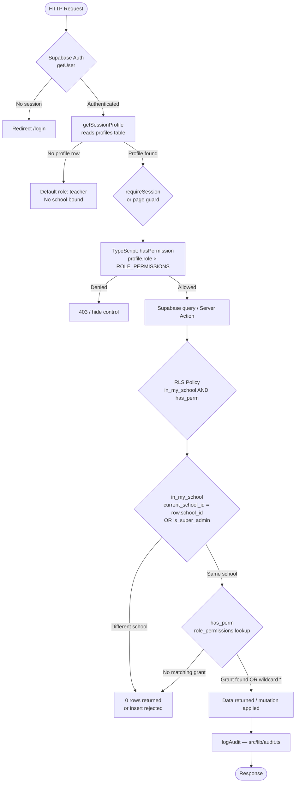

# 12 — RBAC Design: Roles, Permissions & Access Enforcement

**Madrasati ERP — Role-Based Access Control**

---

## Table of Contents

1. [Overview](#1-overview)
2. [The 11 Roles](#2-the-11-roles)
3. [Permission Catalog](#3-permission-catalog)
4. [Role → Permission Matrix](#4-role--permission-matrix)
5. [Database Enforcement](#5-database-enforcement)
6. [UI-Layer Enforcement](#6-ui-layer-enforcement)
7. [How School Customization Works](#7-how-school-customization-works)
8. [Security Guarantees & Threat Model](#8-security-guarantees--threat-model)
9. [Decision Flow Diagram](#9-decision-flow-diagram)

---

## 1. Overview

Madrasati uses a **Role-Based Access Control (RBAC)** model where every authenticated user is assigned exactly one role (stored in `profiles.role`). That role maps to a set of permissions, and every resource access — from Postgres row reads to sidebar nav items — is gated by those permissions.

The model has two authoritative sources that must stay in sync:

| Layer | File | Purpose |
|---|---|---|
| TypeScript | `src/lib/rbac.ts` | Client-side checks; nav filtering; server action guards |
| Database | `supabase/migrations/0001_core_and_rbac.sql` | Tables `roles`, `permissions`, `role_permissions`; SQL helper functions |
| RLS Policies | `supabase/migrations/0005_rls_policies.sql` | Row-level enforcement on every domain table |

The DB is the **enforcement boundary**. The TypeScript layer is a convenience layer for UI responsiveness — it must never be the sole check.

---

## 2. The 11 Roles

Defined in `src/lib/rbac.ts` (`ROLES` constant) and seeded into `public.roles` in `0001_core_and_rbac.sql`.

| Key | Arabic (name_ar) | English (name_en) | Scope |
|---|---|---|---|
| `super_admin` | مدير النظام | Super Administrator | Platform-wide; bypasses all tenant checks |
| `principal` | مدير المدرسة | Principal | Full school management, all sensitive ops |
| `vice_principal` | وكيل المدرسة | Vice Principal | Academic ops; no finance, no settings |
| `department_head` | رئيس قسم | Department Head | Own department academic oversight |
| `teacher` | معلم | Teacher | Classroom management; grades & attendance |
| `activity_supervisor` | مشرف نشاط | Activity Supervisor | Extracurricular activities only |
| `registrar` | مسؤول التسجيل | Registrar | Student enrollment & records |
| `finance_officer` | مسؤول مالي | Finance Officer | Fees, invoices, payments only |
| `auditor` | مدقق النظام | System Auditor | Read-only audit trail and analytics |
| `student` | طالب | Student | Own grades, attendance, timetable, activities |
| `parent` | ولي أمر | Parent | Child's grades, attendance, timetable, behavior |

### Role characteristics

- **`super_admin`**: granted the wildcard permission `*`. The `is_super_admin()` SQL function short-circuits every policy, including `in_my_school()`, allowing cross-tenant access. This role should be restricted to platform operators only.
- **Portal roles (`student`, `parent`)**: read-only, narrow scope. They see only data relevant to themselves or their child. These roles do not appear in the school's user-management UI for assignment to staff accounts.
- **`auditor`**: a security-sensitive role. It can read `audit_logs` and `analytics` but cannot write anything, ensuring the audit trail cannot be tampered with by the auditor themselves.

---

## 3. Permission Catalog

Defined in `src/lib/rbac.ts` (`PERMISSIONS` constant) and seeded into `public.permissions` in `0001_core_and_rbac.sql`. Permissions follow the `resource:action` naming convention.

### Academic Core

| Permission | Description |
|---|---|
| `students:read` | List and view student records, profiles, enrollments |
| `students:write` | Create and edit student records and guardians |
| `students:delete` | Remove students (soft or hard) |
| `students:import` | Bulk import students via CSV/spreadsheet |
| `teachers:read` | View staff and teaching assignment data |
| `teachers:write` | Create/edit staff records and assignments |
| `classes:read` | View class and section listings |
| `classes:write` | Create and manage classes |
| `subjects:read` | View subjects and course definitions |
| `subjects:write` | Create and edit subjects |
| `departments:read` | View departments |
| `departments:write` | Manage departments |

### Academic Operations

| Permission | Description |
|---|---|
| `attendance:read` | View attendance records |
| `attendance:write` | Record and edit attendance |
| `grades:read` | View assessment results and report cards |
| `grades:write` | Enter and edit grades |
| `timetable:read` | View class schedules and room assignments |
| `timetable:write` | Create and modify timetable slots |
| `curriculum:read` | View curriculum plans, units, and lessons |
| `curriculum:write` | Author and update curriculum content |
| `islamic:read` | View Quran memorization and revision records |
| `islamic:write` | Record Quran progress |
| `behavior:read` | View behavioral incident records |
| `behavior:write` | Log behavior incidents |
| `observations:read` | View teacher observation reports |
| `observations:write` | Submit observation reports |
| `activities:read` | View extracurricular activities and participation |
| `activities:write` | Manage activities and attendance |

### Insights & Communication

| Permission | Description |
|---|---|
| `reports:read` | Generate and export academic/admin reports |
| `analytics:read` | View dashboard analytics and trend data |
| `communication:send` | Send announcements and messages |

### Administration

| Permission | Description |
|---|---|
| `finance:read` | View fee structures, invoices, and payments |
| `finance:write` | Manage fees, issue invoices, record payments |
| `settings:write` | Modify school settings and academic calendar |
| `branding:write` | Update school branding (logo, colors, stamp) |
| `users:manage` | Create, edit, assign roles to school users |
| `audit:read` | Read audit log entries |

### Special

| Permission | Description |
|---|---|
| `*` | Wildcard — grants all permissions. Assigned only to `super_admin`. |

---

## 4. Role → Permission Matrix

`✓` = granted by default. Blank = denied.

| Permission | super_admin | principal | vice_principal | department_head | teacher | activity_supervisor | registrar | finance_officer | auditor | student | parent |
|---|:---:|:---:|:---:|:---:|:---:|:---:|:---:|:---:|:---:|:---:|:---:|
| `students:read` | ✓ | ✓ | ✓ | ✓ | ✓ | ✓ | ✓ | ✓ | | | |
| `students:write` | ✓ | ✓ | ✓ | | | | ✓ | | | | |
| `students:delete` | ✓ | | | | | | ✓ | | | | |
| `students:import` | ✓ | | | | | | ✓ | | | | |
| `teachers:read` | ✓ | ✓ | ✓ | ✓ | | | | | | | |
| `teachers:write` | ✓ | ✓ | | | | | | | | | |
| `classes:read` | ✓ | ✓ | ✓ | ✓ | ✓ | | ✓ | | | | |
| `classes:write` | ✓ | ✓ | ✓ | | | | ✓ | | | | |
| `subjects:read` | ✓ | ✓ | | ✓ | ✓ | | | | | | |
| `subjects:write` | ✓ | ✓ | | ✓ | | | | | | | |
| `departments:read` | ✓ | ✓ | | ✓ | | | | | | | |
| `departments:write` | ✓ | ✓ | | | | | | | | | |
| `attendance:read` | ✓ | ✓ | ✓ | | ✓ | ✓ | ✓ | | | ✓ | ✓ |
| `attendance:write` | ✓ | | ✓ | | ✓ | ✓ | | | | | |
| `grades:read` | ✓ | ✓ | ✓ | ✓ | ✓ | | | | | ✓ | ✓ |
| `grades:write` | ✓ | | | | ✓ | | | | | | |
| `timetable:read` | ✓ | ✓ | ✓ | | ✓ | | | | | ✓ | ✓ |
| `timetable:write` | ✓ | ✓ | ✓ | | | | | | | | |
| `curriculum:read` | ✓ | ✓ | ✓ | ✓ | ✓ | | | | | | |
| `curriculum:write` | ✓ | | | ✓ | ✓ | | | | | | |
| `islamic:read` | ✓ | ✓ | | | ✓ | | | | | | |
| `islamic:write` | ✓ | | | | ✓ | | | | | | |
| `behavior:read` | ✓ | ✓ | ✓ | | ✓ | | | | | | ✓ |
| `behavior:write` | ✓ | ✓ | ✓ | | ✓ | | | | | | |
| `observations:read` | ✓ | ✓ | ✓ | ✓ | | | | | | | |
| `observations:write` | ✓ | ✓ | ✓ | ✓ | | | | | | | |
| `activities:read` | ✓ | ✓ | ✓ | | | ✓ | | | | ✓ | |
| `activities:write` | ✓ | | | | | ✓ | | | | | |
| `reports:read` | ✓ | ✓ | ✓ | ✓ | ✓ | | ✓ | ✓ | ✓ | | |
| `analytics:read` | ✓ | ✓ | ✓ | ✓ | | | | | ✓ | | |
| `communication:send` | ✓ | ✓ | ✓ | | ✓ | ✓ | | | | | |
| `finance:read` | ✓ | | | | | | | ✓ | | | |
| `finance:write` | ✓ | | | | | | | ✓ | | | |
| `settings:write` | ✓ | ✓ | | | | | | | | | |
| `branding:write` | ✓ | ✓ | | | | | | | | | |
| `users:manage` | ✓ | ✓ | | | | | | | | | |
| `audit:read` | ✓ | ✓ | | | | | | | ✓ | | |

> `super_admin` holds the `*` wildcard and is shown as `✓` for all permissions above, but technically only one row exists in `role_permissions` for this role: `('super_admin', '*')`.

---

## 5. Database Enforcement

### 5.1 Schema: Three RBAC Tables

Defined in `supabase/migrations/0001_core_and_rbac.sql`:

```sql
-- Canonical role registry
create table public.roles (
  key       text primary key,     -- e.g. 'teacher'
  name_ar   text not null,
  name_en   text not null,
  is_system boolean not null default true
);

-- All known permission keys
create table public.permissions (
  key         text primary key,   -- e.g. 'grades:write'
  description text
);

-- The grant matrix: (role → permission) pairs.
-- This is the table a school customizes to add/remove grants.
create table public.role_permissions (
  role_key       text not null references public.roles(key) on delete cascade,
  permission_key text not null references public.permissions(key) on delete cascade,
  primary key (role_key, permission_key)
);
```

The `profiles` table binds each auth user to a role and school:

```sql
create table public.profiles (
  id        uuid primary key references auth.users(id) on delete cascade,
  school_id uuid references public.schools(id) on delete set null,
  role      text not null default 'teacher' references public.roles(key),
  ...
);
```

### 5.2 RBAC Helper Functions

All four functions are `SECURITY DEFINER` with `set search_path = public`, preventing RLS recursion and search-path injection.

#### `current_school_id() → uuid`
```sql
select school_id from public.profiles where id = auth.uid();
```
Returns the school the caller belongs to. Used in `in_my_school()`.

#### `current_role() → text`
```sql
select role from public.profiles where id = auth.uid();
```
Returns the caller's role key (e.g. `'teacher'`).

#### `is_super_admin() → boolean`
```sql
select exists(select 1 from public.profiles where id = auth.uid() and role = 'super_admin');
```
Short-circuit: if true, all downstream permission and tenancy checks pass.

#### `has_perm(perm text) → boolean`
```sql
select exists(
  select 1 from public.role_permissions rp
  join public.profiles p on p.id = auth.uid()
  where rp.role_key = p.role
    and (rp.permission_key = perm or rp.permission_key = '*')
);
```
Looks up the caller's role in `role_permissions` and matches either the exact permission key or the wildcard `'*'`. This is the **live permission check** — it reads from `role_permissions` at query time, so any grant added to that table takes effect immediately without a code deploy.

#### `in_my_school(row_school uuid) → boolean`
```sql
select public.is_super_admin() or row_school = public.current_school_id();
```
Combines tenancy isolation with the super_admin bypass. Every domain table row carries `school_id`, and this function gates all access to rows in the caller's school only.

### 5.3 Row Level Security Policies

Applied in `supabase/migrations/0005_rls_policies.sql`. RLS is enabled on every table. The policies follow two patterns:

#### Pattern A — Standard domain tables (school-scoped, permission-gated)

A dynamic loop generates four policies (`_sel`, `_ins`, `_upd`, `_del`) for each of the 30+ domain tables:

```sql
-- SELECT: must be in the same school AND have the read permission
create policy students_sel on public.students for select to authenticated
  using (public.in_my_school(school_id) and public.has_perm('students:read'));

-- INSERT: same school AND write permission
create policy students_ins on public.students for insert to authenticated
  with check (public.in_my_school(school_id) and public.has_perm('students:write'));

-- UPDATE, DELETE: same pattern with write permission
```

The table-to-permission mapping used by the loop:

| Table | Read Permission | Write Permission |
|---|---|---|
| `students` | `students:read` | `students:write` |
| `staff` | `teachers:read` | `teachers:write` |
| `classes` | `classes:read` | `classes:write` |
| `attendance_records` | `attendance:read` | `attendance:write` |
| `grades` | `grades:read` | `grades:write` |
| `timetable_slots` | `timetable:read` | `timetable:write` |
| `curriculum_plans` | `curriculum:read` | `curriculum:write` |
| `quran_memorization` | `islamic:read` | `islamic:write` |
| `behavior_records` | `behavior:read` | `behavior:write` |
| `observations` | `observations:read` | `observations:write` |
| `activities` | `activities:read` | `activities:write` |
| `fee_structures` / `invoices` / `payments` | `finance:read` | `finance:write` |
| `message_log` | `reports:read` | `communication:send` |
| `report_templates` | `reports:read` | `branding:write` |
| `academic_years` / `school_stages` / `grade_levels` | `reports:read` | `settings:write` |
| ... | ... | ... |

#### Pattern B — Special tables with custom logic

**`schools`** — a user can only see their own school; `super_admin` sees all. Mutation requires `settings:write` or `branding:write`:
```sql
create policy schools_sel on public.schools for select to authenticated
  using (public.is_super_admin() or id = public.current_school_id());
```

**`profiles`** — users can read/update their own row, plus same-school users with `users:manage`:
```sql
create policy profiles_sel on public.profiles for select to authenticated
  using (id = auth.uid() or public.is_super_admin()
         or (school_id = public.current_school_id() and public.has_perm('users:manage')));
```

**`audit_logs`** — read requires `audit:read`; any authenticated same-school user may insert (the audit trail must not be blocked by permission gaps):
```sql
create policy audit_sel on public.audit_logs for select to authenticated
  using (public.in_my_school(school_id) and public.has_perm('audit:read'));
create policy audit_ins on public.audit_logs for insert to authenticated
  with check (school_id is null or public.in_my_school(school_id));
```

**`notifications`** — strictly user-owned (`user_id = auth.uid()`), no role check.

**`announcements`** — any school member reads; `communication:send` to write.

**`roles`, `permissions`, `role_permissions`** — readable by all authenticated users (needed by the client); mutable only by `super_admin`.

#### Pattern C — Child tables (no direct `school_id`)

Tables without their own `school_id` are scoped via their parent. The policy joins back to the parent:

```sql
-- student_guardians → scoped via students.school_id
create policy sg_all on public.student_guardians for all to authenticated
  using (exists (
    select 1 from public.students s
    where s.id = student_id
      and public.in_my_school(s.school_id)
      and public.has_perm('students:read')
  ));
```

This same join-back pattern covers `curriculum_units`, `curriculum_lessons`, `observation_items`, `activity_participants`, `invoice_items`, and `installments`.

---

## 6. UI-Layer Enforcement

The UI layer provides a fast, non-authoritative check to avoid showing controls the user cannot use. It must never replace DB enforcement.

### 6.1 `hasPermission()` in `src/lib/rbac.ts`

```typescript
export function hasPermission(role: Role | null | undefined, perm: Permission): boolean {
  if (!role) return false;
  const grants = ROLE_PERMISSIONS[role];
  return (grants as string[]).includes("*") || (grants as string[]).includes(perm);
}
```

This reads from the in-memory `ROLE_PERMISSIONS` constant — it does not hit the database. It is used in:
- Server components and server actions (fast pre-check before DB call)
- Client components to conditionally render buttons and controls

### 6.2 Session Profile in `src/lib/auth.ts`

`getSessionProfile()` resolves the signed-in user's `role` and `school_id` from `profiles` once per request using React's `cache()`:

```typescript
export const getSessionProfile = cache(async (): Promise<SessionProfile | null> => {
  const supabase = await createClient();
  const { data: { user } } = await supabase.auth.getUser();
  if (!user) return null;
  const { data: profile } = await supabase
    .from("profiles")
    .select("id, email, full_name, role, school_id, avatar_url")
    .eq("id", user.id)
    .single();
  ...
});
```

`requireSession()` wraps this and redirects unauthenticated users to `/login`.

### 6.3 Sidebar Navigation Filtering

`src/lib/navigation.ts` defines `NAVIGATION` — a grouped list of nav items, each optionally tagged with a `permission`:

```typescript
{ key: "students", href: "/students", icon: "GraduationCap", permission: "students:read" }
```

The sidebar component filters `NAVIGATION` at render time using `hasPermission(profile.role, item.permission)`. Items without a `permission` (e.g. Dashboard) are always shown.

Navigation groups and their required permissions:

| Group | Route | Required Permission |
|---|---|---|
| Academic | `/students` | `students:read` |
| Academic | `/teachers` | `teachers:read` |
| Academic | `/classes` | `classes:read` |
| Academic | `/subjects` | `subjects:read` |
| Academic | `/departments` | `departments:read` |
| Operations | `/attendance` | `attendance:read` |
| Operations | `/grades` | `grades:read` |
| Operations | `/timetable` | `timetable:read` |
| Operations | `/curriculum` | `curriculum:read` |
| Operations | `/islamic` | `islamic:read` |
| Operations | `/behavior` | `behavior:read` |
| Operations | `/observations` | `observations:read` |
| Operations | `/activities` | `activities:read` |
| Insights | `/reports` | `reports:read` |
| Insights | `/analytics` | `analytics:read` |
| Insights | `/communication` | `communication:send` |
| Administration | `/finance` | `finance:read` |
| Administration | `/users` | `users:manage` |
| Administration | `/branding` | `branding:write` |
| Administration | `/settings` | `settings:write` |
| Administration | `/audit` | `audit:read` |

### 6.4 Server Action Guards (Pattern)

Every server action in `src/features/*/actions.ts` must follow this guard pattern (see `src/features/students/actions.ts` as the reference):

```typescript
const profile = await requireSession();         // redirect if unauthenticated
if (!hasPermission(profile.role, "students:write")) {
  throw new Error("Forbidden");                 // fast in-memory check
}
// The Supabase query below will still be blocked by RLS if the
// in-memory check was somehow bypassed.
```

The double-check (in-memory TypeScript + DB RLS) ensures defense in depth.

---

## 7. How School Customization Works

The default grants are seeded in `0001_core_and_rbac.sql` and mirrored in `ROLE_PERMISSIONS` in `src/lib/rbac.ts`. The DB is the live source; the TypeScript constant is a static snapshot for UI speed.

### 7.1 Adding a Custom Grant

A school administrator with `users:manage` (or a `super_admin`) can insert a row into `role_permissions` to extend a role's access:

```sql
-- Allow registrars in school X to read grades (non-default grant)
insert into public.role_permissions (role_key, permission_key)
values ('registrar', 'grades:read')
on conflict do nothing;
```

Because `has_perm()` reads `role_permissions` at query time, this grant takes effect immediately for all existing sessions. No deploy is needed.

### 7.2 Revoking a Default Grant

```sql
delete from public.role_permissions
where role_key = 'teacher' and permission_key = 'curriculum:write';
```

Again, live effect. The TypeScript `hasPermission()` function will still return `true` until the next code deploy — this is the known trade-off of the dual-layer model. For security-critical revocations, the DB deletion is sufficient; the UI may briefly show a button that the DB will reject.

### 7.3 Scope of Customization

Currently `role_permissions` is a **global** table (no `school_id`). This means all schools in the platform share the same grant matrix. School-specific overrides would require adding a `school_id` column (nullable, with `NULL` meaning "platform default") and updating `has_perm()` to prefer school-specific rows. This is a planned future enhancement.

### 7.4 Who Can Customize

RLS on `role_permissions` allows mutation only by `super_admin`:

```sql
create policy role_permissions_admin on public.role_permissions
  for all to authenticated
  using (public.is_super_admin())
  with check (public.is_super_admin());
```

`principal` and other school administrators cannot modify the grant matrix directly — they work within the role structure.

---

## 8. Security Guarantees & Threat Model

| Threat | Mitigation |
|---|---|
| Unauthenticated access | Supabase Auth; all tables require `to authenticated`; `requireSession()` redirects to `/login` |
| Cross-tenant data leak | `in_my_school(school_id)` on every policy; `current_school_id()` is `SECURITY DEFINER` |
| Privilege escalation via client-side bypass | RLS is enforced at the DB layer regardless of what the client sends; `has_perm()` re-checks in SQL |
| Audit log tampering by auditor | Auditor has only `audit:read`; no delete or update policy exists on `audit_logs` |
| Role self-assignment | `users:manage` is needed to update `profiles.role`; the RLS policy on `profiles` enforces this |
| `super_admin` blast radius | `super_admin` accounts should be restricted to platform operators; school staff must not be assigned this role |
| Stale UI after permission revocation | DB revocation is immediate; TypeScript `hasPermission()` reflects stale defaults until next deploy — acceptable for non-critical UI toggles |
| Search-path injection in helper functions | All four RBAC functions use `set search_path = public` |

---

## 9. Decision Flow Diagram



---

## Appendix A: Files Referenced

| File | Role in RBAC |
|---|---|
| `src/lib/rbac.ts` | `ROLES`, `PERMISSIONS`, `ROLE_PERMISSIONS` constants; `hasPermission()` |
| `src/lib/auth.ts` | `getSessionProfile()`, `requireSession()`, `SessionProfile` type |
| `src/lib/navigation.ts` | `NAVIGATION` with per-item permission annotations for sidebar filtering |
| `src/lib/audit.ts` | `logAudit()` — called after successful mutations |
| `supabase/migrations/0001_core_and_rbac.sql` | Tables: `roles`, `permissions`, `role_permissions`, `profiles`; functions: `current_school_id()`, `current_role()`, `is_super_admin()`, `has_perm()`, `in_my_school()` |
| `supabase/migrations/0005_rls_policies.sql` | All RLS policies on all tables |
| `src/features/students/actions.ts` | Reference implementation of the server-action guard pattern |

## Appendix B: Adding a New Permission (Checklist)

1. Add the key to `PERMISSIONS` in `src/lib/rbac.ts`.
2. Add it to the relevant roles in `ROLE_PERMISSIONS` in `src/lib/rbac.ts`.
3. Insert into `public.permissions` via a new migration file.
4. Insert the appropriate `role_permissions` rows via the same migration.
5. Use `has_perm('new:perm')` in the relevant RLS policy (new migration or update existing).
6. Tag any new nav items in `src/lib/navigation.ts` with `permission: "new:perm"`.
7. Guard the server action with `hasPermission(profile.role, "new:perm")`.
