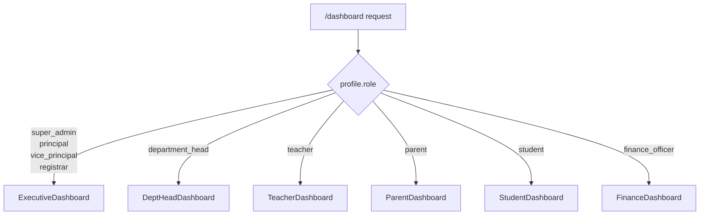
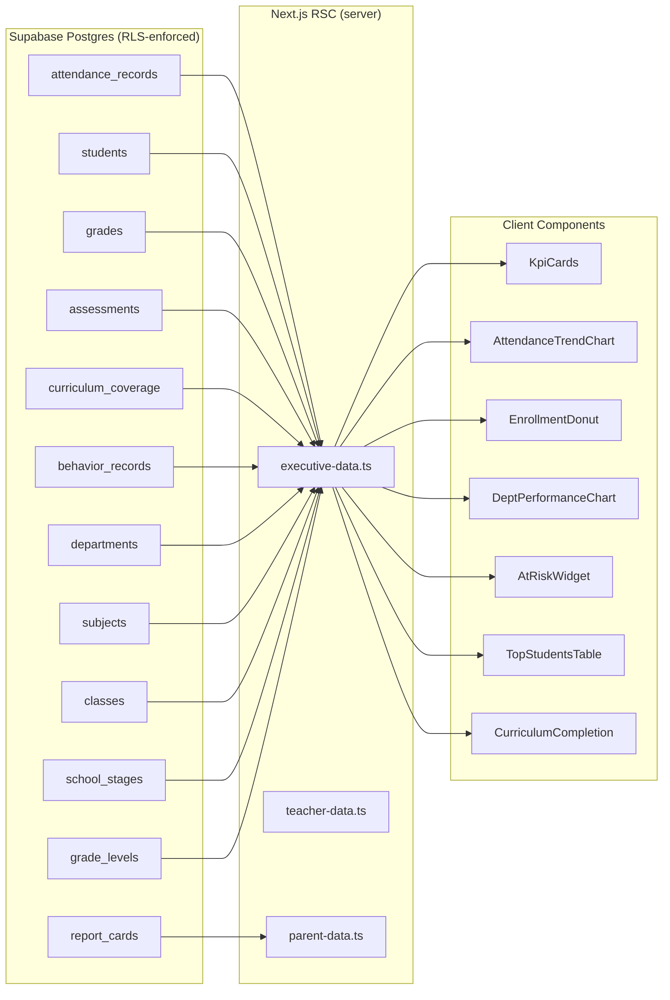

# 14 — Executive Dashboard Design

**Madrasati ERP · Academic Management System**
_Arabic-first, RTL, multi-tenant (school-scoped). Default language: Arabic (العربية)._

---

## 1. Overview

The dashboard (`/dashboard`) is the first screen every authenticated user lands on after login. It is **not** a generic admin panel — it presents a different surface to each role. A principal (مدير المدرسة) needs a school-wide executive view; a teacher (معلم) needs their own class roster at a glance; a parent (ولي أمر) needs their child's status only.

This document specifies:

- The KPI card set, chart widgets, and special widgets for the **full executive view** (principal / vice_principal / super_admin).
- Variant dashboards for **department_head**, **teacher**, and **parent**.
- The exact Supabase table/column sources for every number displayed.
- Rendering architecture — Next.js 15 RSC pattern, matching `/src/app/(app)/students/page.tsx`.
- i18n and RTL considerations.

---

## 2. Route & Access Control

```
src/app/(app)/dashboard/page.tsx        ← RSC entry, force-dynamic
src/features/dashboard/
  kpi-cards.tsx
  attendance-trend-chart.tsx
  department-performance-chart.tsx
  enrollment-donut.tsx
  at-risk-widget.tsx
  top-students-table.tsx
  curriculum-completion-widget.tsx
  teacher-dashboard.tsx
  parent-dashboard.tsx
```

The page imports `requireSession` from `src/lib/auth.ts` and branches on `profile.role`:

```ts
// src/app/(app)/dashboard/page.tsx
export const dynamic = "force-dynamic";

export default async function DashboardPage() {
  const profile = await requireSession();

  if (profile.role === "parent") return <ParentDashboard profile={profile} />;
  if (profile.role === "teacher") return <TeacherDashboard profile={profile} />;
  if (profile.role === "department_head") return <DeptHeadDashboard profile={profile} />;
  // principal, vice_principal, registrar, super_admin → full executive view
  return <ExecutiveDashboard profile={profile} />;
}
```

`hasPermission` from `src/lib/rbac.ts` guards individual widgets. The RLS functions `in_my_school(school_id)` and `has_perm(perm)` enforce data scope at the Postgres layer — client-side gating is defence-in-depth only.

---

## 3. Executive Dashboard — Principal / Vice-Principal / Super-Admin

### 3.1 Layout

```
┌──────────────────────────────────────────────────────────────────┐
│ PageHeader: "لوحة التحكم"   subtitle: school name + academic year │
└──────────────────────────────────────────────────────────────────┘

┌────────┐ ┌────────┐ ┌────────┐ ┌────────┐ ┌────────┐ ┌────────┐
│  KPI 1 │ │  KPI 2 │ │  KPI 3 │ │  KPI 4 │ │  KPI 5 │ │  KPI 6 │
└────────┘ └────────┘ └────────┘ └────────┘ └────────┘ └────────┘

┌─────────────────────────────┐  ┌──────────────────────────────┐
│  Attendance Trend (30-day)  │  │  Enrollment by Stage (Donut) │
└─────────────────────────────┘  └──────────────────────────────┘

┌─────────────────────────────┐  ┌──────────────────────────────┐
│  Department Performance Bar │  │  Curriculum Completion        │
└─────────────────────────────┘  └──────────────────────────────┘

┌─────────────────────────────┐  ┌──────────────────────────────┐
│  At-Risk Students Widget    │  │  Top Students                 │
└─────────────────────────────┘  └──────────────────────────────┘
```

The outer grid is `grid grid-cols-1 md:grid-cols-2 gap-6` for chart pairs.
KPI cards are `grid grid-cols-2 sm:grid-cols-3 xl:grid-cols-6 gap-4`.

---

### 3.2 KPI Cards

Six summary cards at the top of the screen. Each is a `<Card>` (`src/components/ui/card.tsx`) with an icon (`src/components/shell/icon.tsx`), a large numeric value, an Arabic label, and a delta badge.

| # | Arabic Label | English Label | Value Formula | Primary Table(s) | Key Columns |
|---|---|---|---|---|---|
| 1 | إجمالي الطلاب | Total Students | `COUNT(*)` where `status = 'enrolled'` | `students` | `school_id`, `status` |
| 2 | نسبة الحضور اليوم | Today's Attendance | `COUNT(status='present') / COUNT(*) * 100` for today's date | `attendance_records` | `school_id`, `date`, `status` |
| 3 | الطلاب المعرضون للخطر | At-Risk Students | `COUNT(*)` students with ≥3 unexcused absences in last 30 days (see §3.6) | `attendance_records` | `school_id`, `student_id`, `date`, `status` |
| 4 | اكتمال المنهج | Curriculum Completion | `COUNT(status='completed') / COUNT(*) * 100` across all lessons | `curriculum_coverage` | `school_id`, `status` |
| 5 | متوسط الدرجات | School Average | Avg of `grades.score / assessments.max_score * 100` for current term | `grades`, `assessments` | `score`, `max_score`, `term` |
| 6 | معلمون نشطون | Active Staff | `COUNT(*)` where `status = 'active'` | `staff` | `school_id`, `status` |

**Delta badge**: compare to same period last academic year (join `academic_years` on `is_current = false`, order by `start_date` desc, limit 1). Show green arrow-up or red arrow-down with percentage change.

#### SQL sketch — KPI 2 (today's attendance rate)

```sql
select
  round(
    count(*) filter (where status = 'present')::numeric
    / nullif(count(*), 0) * 100,
    1
  ) as attendance_pct
from attendance_records
where school_id = current_school_id()
  and date = current_date;
```

---

### 3.3 Attendance Trend Chart (30-Day Line Chart)

**Widget**: `AttendanceTrendChart`
**Library**: `recharts` — `<LineChart>` with `<CartesianGrid>`, `<XAxis>`, `<YAxis>`, `<Tooltip>`, `<Line>`.

#### Data Shape

```ts
type AttendanceTrendPoint = {
  date: string;      // "2025-09-01"
  present: number;   // count
  absent: number;    // count
  excused: number;   // count
  pct: number;       // present / total * 100
};
```

#### Source Query

```sql
select
  date,
  count(*) filter (where status = 'present') as present,
  count(*) filter (where status = 'absent')  as absent,
  count(*) filter (where status = 'excused') as excused,
  round(
    count(*) filter (where status = 'present')::numeric / nullif(count(*),0) * 100,
    1
  ) as pct
from attendance_records
where school_id = current_school_id()
  and date >= current_date - interval '29 days'
group by date
order by date;
```

Tables: `attendance_records` · Columns: `school_id`, `date`, `status`.

#### Chart Details

- X-axis: date formatted as `dd/MM` (Gregorian) or Hijri short via `src/lib/dates.ts`.
- Y-axis (right, RTL-aware): percentage 0–100%.
- Two series: حضور (present%, solid primary color) and غياب (absence%, dashed destructive color).
- Tooltip shows full Arabic date + counts for each status.
- Reference line at school's target attendance threshold (configurable in `schools.theme` jsonb or a settings key; default 90%).

---

### 3.4 Enrollment by Stage — Donut Chart

**Widget**: `EnrollmentDonut`
**Library**: `recharts` — `<PieChart>` with `<Pie>` (innerRadius for donut), `<Cell>`, `<Legend>`, `<Tooltip>`.

#### Source Query

```sql
select
  ss.name_ar   as stage,
  count(s.id)  as total
from students s
join classes c  on c.id = s.current_class_id
join grade_levels gl on gl.id = c.grade_level_id
join school_stages ss on ss.id = gl.stage_id
where s.school_id = current_school_id()
  and s.status = 'enrolled'
group by ss.id, ss.name_ar, ss.sort_order
order by ss.sort_order;
```

Tables: `students`, `classes`, `grade_levels`, `school_stages`.
Key columns: `students.current_class_id`, `students.status`, `school_stages.name_ar`, `school_stages.sort_order`.

#### Chart Details

- Center label: total enrolled count.
- Legend placed below the chart (RTL-safe, no `left`/`right` CSS — use `flex-wrap justify-center`).
- Slice labels: stage name + count.
- Colors assigned from the school's `theme` jsonb if present, otherwise fallback to Tailwind CSS variables.

---

### 3.5 Department Performance Bar Chart

**Widget**: `DepartmentPerformanceChart`
**Library**: `recharts` — `<BarChart>` horizontal layout (`layout="vertical"`).

Measures the average student score per department across the current term.

#### Source Query

```sql
select
  d.name_ar                                         as department,
  round(avg(g.score / a.max_score * 100)::numeric, 1) as avg_score,
  count(distinct s.id)                               as student_count
from grades g
join assessments a      on a.id = g.assessment_id
join subjects sub       on sub.id = a.subject_id
join departments d      on d.id = sub.department_id
join students s         on s.id = g.student_id
join academic_years ay  on ay.id = a.class_id  -- indirect via classes
where sub.school_id = current_school_id()
  and g.score is not null
group by d.id, d.name_ar
order by avg_score desc;
```

> **Note**: `assessments.class_id` → `classes.academic_year_id` → `academic_years.is_current = true` filters to current year. Add that join in the full implementation.

Tables: `grades`, `assessments`, `subjects`, `departments`.
Key columns: `grades.score`, `assessments.max_score`, `subjects.department_id`, `departments.name_ar`.

#### Chart Details

- Y-axis: `departments.name_ar` (Arabic department names).
- X-axis: 0–100 percentage.
- Bar color gradient: green (≥80%), amber (60–79%), red (<60%).
- Tooltip: avg score, student count, teacher count (join `teaching_assignments`).
- Required permission: `analytics:read` (principal has it; teacher does not → widget hidden).

---

### 3.6 At-Risk Students Widget

**Widget**: `AtRiskWidget`

Identifies students needing intervention. "At-risk" is defined as **three or more unexcused absences (`status = 'absent'`) in the last 30 calendar days**. The threshold is intentionally low to surface problems early.

#### Source Query

```sql
select
  s.id,
  s.name_ar,
  s.photo_url,
  cl.name                  as class_name,
  count(ar.id)             as absent_days,
  -- latest negative behavior count for context
  (select count(*) from behavior_records br
   where br.student_id = s.id
     and br.kind = 'negative'
     and br.date >= current_date - 30) as behavior_flags,
  -- current term average grade
  round(avg(g.score / a.max_score * 100)::numeric, 1) as grade_avg
from students s
join attendance_records ar on ar.student_id = s.id
                           and ar.date >= current_date - 30
                           and ar.status = 'absent'
join classes cl on cl.id = s.current_class_id
left join grades g on g.student_id = s.id
left join assessments a on a.id = g.assessment_id
where s.school_id = current_school_id()
  and s.status = 'enrolled'
group by s.id, s.name_ar, s.photo_url, cl.name
having count(ar.id) >= 3
order by absent_days desc, grade_avg asc
limit 10;
```

Tables: `students`, `attendance_records`, `classes`, `behavior_records`, `grades`, `assessments`.
Key columns: `attendance_records.status ('absent')`, `attendance_records.date`, `behavior_records.kind`, `grades.score`.

#### Widget Layout

- Scrollable list (max 5 rows visible, internal scroll).
- Each row: `<Avatar>` (student photo or initials) + name_ar + class name + absence badge (red pill) + behavior flag count + grade average.
- "عرض الكل" (View All) button links to `/students?filter=at_risk`.
- Clicking a student row opens a slide-over (Sheet) with the full student profile.
- Required permission: `students:read` (both principal and vice_principal have this).

---

### 3.7 Top Students Widget

**Widget**: `TopStudentsTable`

Shows the top 5 students by weighted grade average for the current academic year, school-wide.

#### Source Query

```sql
select
  s.id,
  s.name_ar,
  s.photo_url,
  cl.name                                              as class_name,
  round(avg(g.score / a.max_score * 100)::numeric, 1) as avg_score,
  rank() over (order by avg(g.score / a.max_score * 100) desc) as rank
from grades g
join assessments a on a.id = g.assessment_id
join classes cl    on cl.id = a.class_id
join academic_years ay on ay.id = cl.academic_year_id and ay.is_current = true
join students s    on s.id = g.student_id
where s.school_id = current_school_id()
  and s.status = 'enrolled'
  and g.score is not null
group by s.id, s.name_ar, s.photo_url, cl.name
order by avg_score desc
limit 5;
```

Tables: `grades`, `assessments`, `classes`, `academic_years`, `students`.
Key columns: `academic_years.is_current`, `grades.score`, `assessments.max_score`.

#### Widget Layout

- Compact table: Rank # | Avatar + Name | Class | Average %.
- Gold/silver/bronze badge for ranks 1–3.
- "عرض التقرير الكامل" link to `/reports`.

---

### 3.8 Curriculum Completion Widget

**Widget**: `CurriculumCompletionWidget`

Stacked horizontal bar showing per-subject/department curriculum completion percentage.

#### Source Query

```sql
select
  sub.name_ar                                              as subject,
  d.name_ar                                               as department,
  count(cc.id)                                            as total_lessons,
  count(cc.id) filter (where cc.status = 'completed')    as completed,
  count(cc.id) filter (where cc.status = 'in_progress')  as in_progress,
  round(
    count(cc.id) filter (where cc.status = 'completed')::numeric
    / nullif(count(cc.id), 0) * 100, 1
  ) as completion_pct
from curriculum_coverage cc
join curriculum_lessons cl  on cl.id = cc.lesson_id
join curriculum_units cu    on cu.id = cl.unit_id
join curriculum_plans cp    on cp.id = cu.plan_id
join subjects sub           on sub.id = cp.subject_id
left join departments d     on d.id = sub.department_id
where cp.school_id = current_school_id()
  and cp.academic_year_id = (
    select id from academic_years
    where school_id = current_school_id() and is_current = true
    limit 1
  )
group by sub.id, sub.name_ar, d.name_ar
order by completion_pct desc;
```

Tables: `curriculum_coverage`, `curriculum_lessons`, `curriculum_units`, `curriculum_plans`, `subjects`, `departments`, `academic_years`.
Key columns: `curriculum_coverage.status ('not_started' | 'in_progress' | 'completed')`, `academic_years.is_current`.

#### Widget Layout

- One horizontal stacked bar per subject (recharts `<BarChart layout="vertical">` with stacked bars).
- Green = completed, amber = in_progress, gray = not_started.
- Numbers shown as `42/58 دروس` (42/58 lessons).
- Required permission: `curriculum:read`.

---

## 4. Role-Specific Dashboard Variants

### 4.1 Branching Logic



---

### 4.2 Principal Dashboard — (مدير المدرسة)

The full Executive Dashboard described in §3. All 6 KPI cards, all 5 chart/widget pairs.

**Extra widgets** available to `principal` but not `vice_principal`:
- Pending observations count: `COUNT(*) from observations where status = 'draft'` (requires `observations:read`).
- Unread audit actions this week: `COUNT(*) from audit_logs where school_id = ... and created_at >= now() - interval '7 days'` (requires `audit:read`).

---

### 4.3 Department Head Dashboard — (رئيس قسم)

Permission set from `rbac.ts`: `students:read`, `teachers:read`, `classes:read`, `subjects:read/write`, `departments:read`, `grades:read`, `curriculum:read/write`, `observations:read/write`, `reports:read`, `analytics:read`.

**Widgets shown**:

| Widget | Scope Restriction | Table Filter |
|---|---|---|
| KPI: طلاب القسم (students in dept classes) | classes taught by dept's teachers | `teaching_assignments.staff_id in (select id from staff where department_id = $dept_id)` |
| KPI: متوسط الدرجات للقسم | dept subjects only | `subjects.department_id = $dept_id` |
| KPI: اكتمال المنهج (dept) | dept subjects only | `curriculum_plans.subject_id in (dept subjects)` |
| Department Performance Bar | only this dept's subjects | filter `d.id = $dept_id` |
| Curriculum Completion | dept subjects only | same as above |
| Pending Observations | `observer_id = auth.uid()` or `staff.department_id = $dept_id` | `observations.status = 'draft'` |
| Top Students (dept) | students in classes taught by dept | join via `teaching_assignments` |

The `$dept_id` is resolved from `staff.department_id` where `staff.profile_id = auth.uid()`.

No attendance-trend or enrollment-donut (those require `students:read` school-wide; department heads only see their dept's scope per RLS).

---

### 4.4 Teacher Dashboard — (معلم)

Permission set from `rbac.ts`: `students:read`, `classes:read`, `attendance:read/write`, `grades:read/write`, `curriculum:read/write`, `behavior:read/write`, `communication:send`.

The teacher's scope is their assigned classes via `teaching_assignments.staff_id = (select id from staff where profile_id = auth.uid())`.

**Widgets shown**:

#### KPI Cards (4)

| Arabic Label | Source |
|---|---|
| طلابي اليوم (students in my classes) | `COUNT(DISTINCT s.id)` via `teaching_assignments` → `classes` → `students` |
| حضور اليوم (today's attendance %) | `attendance_records` where `class_id in (my classes)` and `date = today` |
| مهام التقييم المعلقة (pending grades) | `assessments` I created with `grades` rows where `score IS NULL` |
| تغطية المنهج (curriculum coverage %) | `curriculum_coverage` for my classes |

#### Chart Widgets (2)

1. **Class Attendance Trend** — same query as §3.3 but filtered to `class_id in (my classes)`. 14-day window instead of 30.
2. **My Classes Performance** — bar chart per class: `avg(grades.score/max_score*100)` for assessments I created.

#### List Widgets (2)

1. **غياب اليوم (Absent Today)** — students absent today in my classes. Quick link to mark attendance (`/attendance`).
   ```sql
   select s.name_ar, s.photo_url, c.name as class_name
   from attendance_records ar
   join students s on s.id = ar.student_id
   join classes c on c.id = ar.class_id
   where ar.class_id = any($my_class_ids)
     and ar.date = current_date
     and ar.status = 'absent';
   ```

2. **تسليم الدرجات (Grades Due)** — assessments due this week without full grading.
   ```sql
   select a.title, sub.name_ar, c.name as class_name,
          count(g.id) filter (where g.score is null) as missing
   from assessments a
   join subjects sub on sub.id = a.subject_id
   join classes c on c.id = a.class_id
   left join grades g on g.assessment_id = a.id
   where a.created_by = auth.uid()
     and a.date <= current_date + 7
   group by a.id, a.title, sub.name_ar, c.name
   having count(g.id) filter (where g.score is null) > 0;
   ```

---

### 4.5 Parent Dashboard — (ولي أمر)

Permission set: `grades:read`, `attendance:read`, `timetable:read`, `behavior:read`.

The parent sees data scoped to their linked children only. The link is via `student_guardians` where `guardian_id = (select id from guardians where profile_id = auth.uid())`.

If a parent has multiple children, a tab strip (`<Tabs>`) at the top switches between them.

**Widgets shown for each child**:

#### KPI Cards (4)

| Arabic Label | Source |
|---|---|
| الحضور هذا الشهر | `COUNT(status='present') / COUNT(*) * 100` for current month | `attendance_records.student_id = $child_id` |
| الغياب هذا الشهر | `COUNT(status='absent')` same scope | |
| آخر متوسط درجات | average from latest `report_cards.average` row | `report_cards.student_id = $child_id` order by `issued_at` desc limit 1 |
| نقاط السلوك | `SUM(points)` from `behavior_records` this term | `behavior_records.student_id = $child_id` |

#### Chart — Attendance Calendar Heatmap

A 4-week calendar grid (7 × 4) where each cell is colored by attendance status:
- Green = present
- Red = absent
- Amber = excused / late / medical
- Gray = weekend / holiday (no record)

Source: `attendance_records` where `student_id = $child_id` and `date >= current_date - 28`.
Color mapped from `status` column: `present | absent | excused | late | medical`.

#### List — Recent Grades

Last 10 `grades` rows for the child with subject name:

```sql
select
  sub.name_ar,
  a.title,
  a.max_score,
  g.score,
  round(g.score / a.max_score * 100, 1) as pct,
  a.date
from grades g
join assessments a on a.id = g.assessment_id
join subjects sub on sub.id = a.subject_id
where g.student_id = $child_id
order by a.date desc
limit 10;
```

#### List — Behavior Events

Last 5 `behavior_records` rows (positive and negative) for the child:

```sql
select kind, category, description, points, date
from behavior_records
where student_id = $child_id
order by date desc
limit 5;
```

Row styling: positive → green left border (`border-s-4 border-green-500`); negative → red (`border-s-4 border-red-500`). Use logical CSS `border-s` (not `border-l`) for RTL safety.

---

## 5. Data Fetching Architecture

All dashboard data is fetched in Next.js 15 **React Server Components** using `async/await`, following the pattern in `src/app/(app)/students/page.tsx`. Multiple queries run in parallel with `Promise.all`.

```ts
// src/features/dashboard/executive-data.ts
export async function getExecutiveDashboardData(schoolId: string) {
  const supabase = await createClient();

  const [kpi, attendanceTrend, enrollmentByStage, deptPerformance,
         curriculumCompletion, atRisk, topStudents] = await Promise.all([
    fetchKpis(supabase, schoolId),
    fetchAttendanceTrend(supabase, schoolId),
    fetchEnrollmentByStage(supabase, schoolId),
    fetchDepartmentPerformance(supabase, schoolId),
    fetchCurriculumCompletion(supabase, schoolId),
    fetchAtRiskStudents(supabase, schoolId),
    fetchTopStudents(supabase, schoolId),
  ]);

  return { kpi, attendanceTrend, enrollmentByStage, deptPerformance,
           curriculumCompletion, atRisk, topStudents };
}
```

Charts receive their serialised data as props and are **Client Components** (`"use client"`) because recharts requires the DOM. The RSC fetches and passes the data; the client component only handles rendering.

```ts
// src/features/dashboard/attendance-trend-chart.tsx
"use client";
import { LineChart, Line, ... } from "recharts";

export function AttendanceTrendChart({ data }: { data: AttendanceTrendPoint[] }) { ... }
```

### Caching Strategy

| Data | Cache Strategy | Reason |
|---|---|---|
| Today's attendance rate | `no-store` | Changes every minute during roll-call |
| 30-day trend | Revalidate every 15 min (`next: { revalidate: 900 }`) | Historical data rarely changes |
| Top students | Revalidate hourly | Grades posted infrequently |
| At-risk list | Revalidate every 10 min | Absence records change during the school day |
| Curriculum completion | Revalidate every 30 min | Teachers update coverage during or after class |

Alternatively, `export const dynamic = "force-dynamic"` on the page route (which is already the pattern in `students/page.tsx`) fetches fresh data per request. Prefer per-query revalidation only if performance profiling shows a bottleneck.

---

## 6. Postgres Views (Recommended)

To avoid repeating complex aggregation SQL across RSC files, define Postgres views/functions in a future migration `0006_dashboard_views.sql`:

```sql
-- School-wide KPI snapshot (refreshed on demand or via pg_cron)
create or replace view public.v_school_kpi as
select
  school_id,
  count(*) filter (where status = 'enrolled')   as enrolled_students,
  count(*) filter (where status = 'active')     as -- NOTE: this is for staff; split into two views
from public.students
group by school_id;

-- Attendance rate for today per school
create or replace view public.v_today_attendance as
select
  school_id,
  round(
    count(*) filter (where status = 'present')::numeric / nullif(count(*),0) * 100, 1
  ) as rate_pct,
  count(*) filter (where status = 'absent') as absent_count,
  current_date as for_date
from public.attendance_records
where date = current_date
group by school_id;
```

These views respect RLS on their source tables as long as they are queried through the authenticated Supabase client. Use `security_invoker = true` on view definitions (Postgres 15+) to ensure the caller's RLS context is applied.

---

## 7. i18n & RTL Implementation

### Translation Keys (to add to `src/messages/ar.json` and `en.json`)

```json
{
  "dashboard": {
    "title": "لوحة التحكم",
    "subtitle": "نظرة عامة على المدرسة",
    "kpi": {
      "totalStudents": "إجمالي الطلاب",
      "todayAttendance": "الحضور اليوم",
      "atRisk": "طلاب في خطر",
      "curriculumCompletion": "اكتمال المنهج",
      "schoolAverage": "متوسط الدرجات",
      "activeStaff": "معلمون نشطون"
    },
    "charts": {
      "attendanceTrend": "اتجاه الحضور (30 يوماً)",
      "enrollmentByStage": "التوزيع حسب المرحلة",
      "departmentPerformance": "أداء الأقسام",
      "curriculumCoverage": "تغطية المنهج الدراسي"
    },
    "widgets": {
      "atRiskStudents": "طلاب يحتاجون متابعة",
      "topStudents": "أفضل الطلاب",
      "viewAll": "عرض الكل",
      "absenceDays": "أيام غياب",
      "behaviorFlags": "ملاحظات سلوك"
    }
  }
}
```

### RTL Rules for Charts

- `recharts` does not natively support RTL. Apply `dir="rtl"` on the chart wrapper `<div>` and set `xAxisId` and layout carefully.
- For horizontal bar charts (`layout="vertical"`) the text renders correctly in RTL once the parent container has `dir="rtl"`.
- For tooltips: wrap the tooltip content in a `<div dir="rtl">` with `text-align: start`.
- Never use absolute `left`/`right` CSS in chart container styles. Use `ms-` / `me-` / `ps-` / `pe-` Tailwind utilities.
- Legend: use `align="center"` in recharts `<Legend>`, never `align="left"`.

---

## 8. Data Flow Diagram



---

## 9. Permission Matrix — Widget Visibility

| Widget | principal | vice_principal | department_head | teacher | parent |
|---|---|---|---|---|---|
| All 6 KPI cards (school-wide) | Yes | Yes | No (dept-scoped only) | No | No |
| Attendance Trend (school) | Yes | Yes | No | No | No |
| Enrollment Donut | Yes | Yes | No | No | No |
| Department Performance | Yes | Yes | Yes (own dept) | No | No |
| Curriculum Completion | Yes | Yes | Yes (own dept) | Yes (own classes) | No |
| At-Risk Widget | Yes | Yes | No | Yes (own classes) | No |
| Top Students | Yes | Yes | Yes (own dept) | Yes (own classes) | No |
| Child Attendance Calendar | No | No | No | No | Yes |
| Child Recent Grades | No | No | No | No | Yes |
| Child Behavior Events | No | No | No | No | Yes |
| Pending Observations | Yes | Yes | Yes | No | No |
| Absent Today (my classes) | No | No | No | Yes | No |
| Grades Due | No | No | No | Yes | No |

Permission enforcement is layered:
1. Client: `hasPermission(profile.role, perm)` from `src/lib/rbac.ts` hides widgets before rendering.
2. Server action: same check before running the query.
3. RLS: `in_my_school()` and `has_perm()` in `0005_rls_policies.sql` enforce at the Postgres row level regardless.

---

## 10. File Creation Checklist

When implementing this design, create these files (following the pattern of `src/features/students/`):

```
src/app/(app)/dashboard/page.tsx
src/features/dashboard/
  executive-data.ts          ← all server-side data fetchers for exec view
  teacher-data.ts            ← teacher-scoped fetchers
  parent-data.ts             ← parent-scoped fetchers (child link via student_guardians)
  kpi-cards.tsx              ← "use client" — renders 6 KPI cards
  attendance-trend-chart.tsx ← "use client" — recharts LineChart
  enrollment-donut.tsx       ← "use client" — recharts PieChart
  department-performance-chart.tsx ← "use client" — recharts BarChart
  at-risk-widget.tsx         ← "use client" — scrollable list + Sheet
  top-students-table.tsx     ← "use client" — compact ranked table
  curriculum-completion-widget.tsx ← "use client" — stacked bar
  teacher-dashboard.tsx      ← RSC component (imports teacher-data.ts + client widgets)
  parent-dashboard.tsx       ← RSC component (imports parent-data.ts + client widgets)
  dept-head-dashboard.tsx    ← RSC component (scoped exec view)
```

No new database migrations are required for the initial implementation. The `0006_dashboard_views.sql` file described in §6 is a performance optimisation for later.
