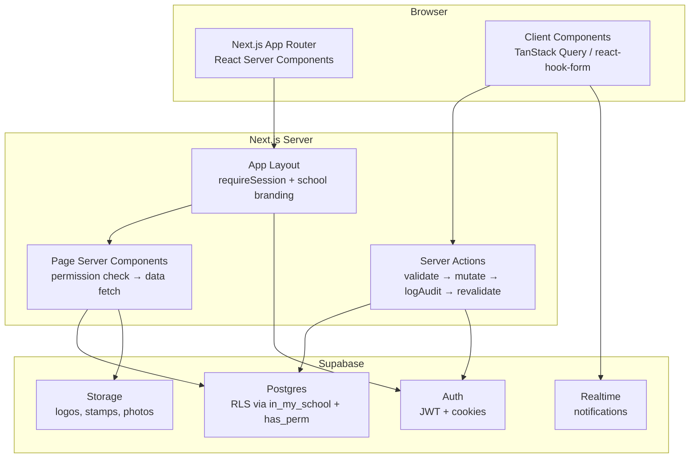
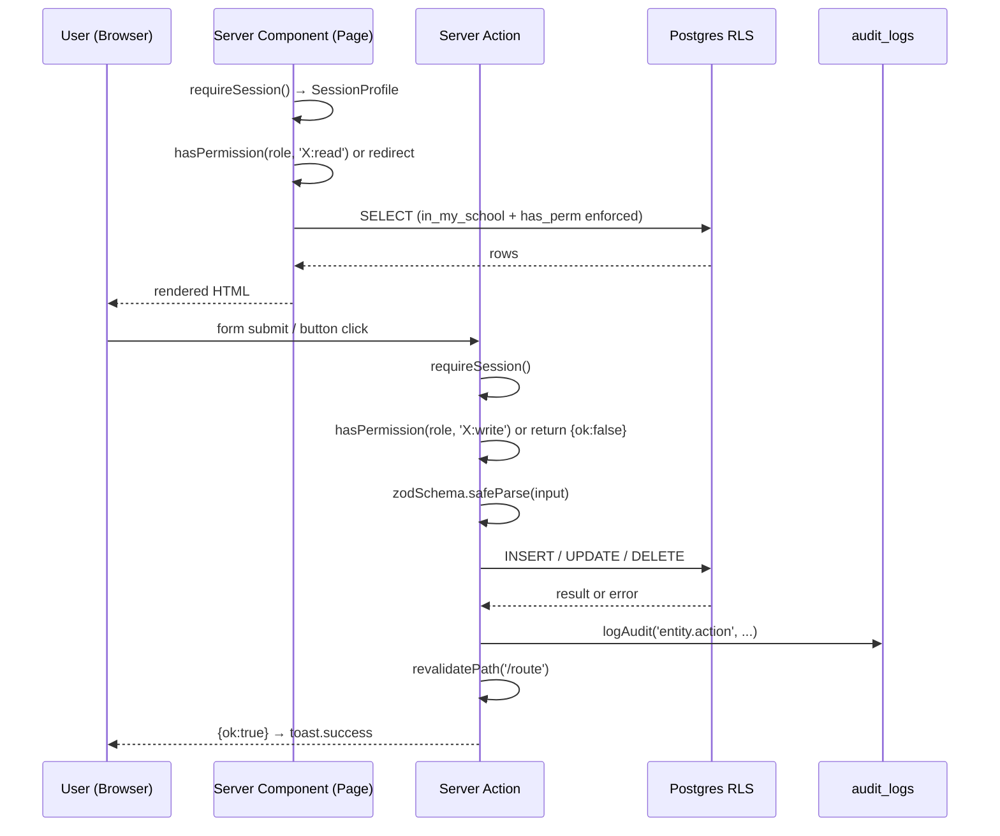

# Madrasati ERP — Page-by-Page Specifications

> **Arabic-first, RTL-default** enterprise school ERP built with Next.js 15 App Router, TypeScript, TailwindCSS, shadcn-style UI, next-intl (cookie locale, no locale in URL), and Supabase (Postgres + Auth + RLS).
>
> Every domain table carries `school_id`; access is enforced at the database layer by Postgres RLS using the helpers `in_my_school(school_id)`, `has_perm('resource:action')`, `current_school_id()`, and `is_super_admin()` defined in migration `0001_core_and_rbac.sql`. The application layer mirrors these checks via `hasPermission(role, perm)` from `src/lib/rbac.ts` to control UI rendering and server action guards.
>
> All pages under `src/app/(app)/` are wrapped by the authenticated shell layout (`src/app/(app)/layout.tsx`) which calls `requireSession()`, loads per-school branding (logo, theme CSS variables) from the `schools` table, and renders `<Sidebar>` + `<Topbar>` around page content.

---

## Table of Contents

1. [/login — Sign In](#1-login--sign-in)
2. [/forgot-password — Password Recovery](#2-forgot-password--password-recovery)
3. [/dashboard — Executive Dashboard](#3-dashboard--executive-dashboard)
4. [/students — Student Registry](#4-students--student-registry)
5. [/teachers — Staff & Teachers](#5-teachers--staff--teachers)
6. [/classes — Classes Management](#6-classes--classes-management)
7. [/subjects — Subjects Catalogue](#7-subjects--subjects-catalogue)
8. [/departments — Academic Departments](#8-departments--academic-departments)
9. [/attendance — Attendance & Absence](#9-attendance--attendance--absence)
10. [/grades — Grades & Assessments](#10-grades--grades--assessments)
11. [/timetable — School Timetable](#11-timetable--school-timetable)
12. [/curriculum — Curriculum Coverage](#12-curriculum--curriculum-coverage)
13. [/islamic — Islamic Studies Tracker](#13-islamic--islamic-studies-tracker)
14. [/behavior — Behavior & Discipline](#14-behavior--behavior--discipline)
15. [/observations — Classroom Observations](#15-observations--classroom-observations)
16. [/activities — Activities & Clubs](#16-activities--activities--clubs)
17. [/reports — Reports Center](#17-reports--reports-center)
18. [/analytics — Analytics Dashboard](#18-analytics--analytics-dashboard)
19. [/communication — Communication Hub](#19-communication--communication-hub)
20. [/finance — Finance Module](#20-finance--finance-module)
21. [/users — User & Role Management](#21-users--user--role-management)
22. [/branding — School Identity & Branding](#22-branding--school-identity--branding)
23. [/settings — School Settings](#23-settings--school-settings)
24. [/audit — Audit Log](#24-audit--audit-log)

---

## System-wide Conventions

### Authentication & Session

Every protected page calls `requireSession()` from `src/lib/auth.ts`. This function calls `getSessionProfile()` (React `cache`-wrapped, so it only hits the DB once per request) to resolve the Supabase Auth user and their `profiles` row, returning a `SessionProfile` object:

```ts
type SessionProfile = {
  id: string;
  email: string | null;
  fullName: string | null;
  role: Role;        // from profiles.role
  schoolId: string | null; // from profiles.school_id
  avatarUrl: string | null;
};
```

If there is no session, the user is redirected to `/login`. If the user's profile does not yet have a row (edge case during trigger backfill), a degraded profile with role `"teacher"` is returned.

### Permission Guard Pattern

Every server component (page) and every Server Action follows this two-layer guard:

1. **App layer** — `hasPermission(profile.role, 'permission:key')` from `src/lib/rbac.ts`; redirect to `/dashboard` on failure.
2. **Database layer** — Postgres RLS policy `has_perm('permission:key') AND in_my_school(school_id)` enforced on every query; returns empty result set or error for unauthorized access.

### Audit Trail

Every mutating Server Action calls `logAudit(action, entity, entityId, meta)` from `src/lib/audit.ts`. The function inserts into `public.audit_logs` with `school_id`, `user_id`, `user_email`, `action` (dot-notation e.g. `student.create`), `entity` (table name), `entity_id`, and a free-form `meta` JSONB blob. The function is best-effort and never throws into the calling action.

### RTL / i18n

All UI uses logical CSS properties (`ms-`, `me-`, `ps-`, `pe-`, `start`, `end`) — never physical `left`/`right`. The locale is read from a cookie (no locale prefix in the URL). Translation namespaces live in `src/messages/ar.json` and `src/messages/en.json`. Arabic is the default and primary language. Dates may be rendered in Gregorian or Hijri calendar depending on `schools.calendar`.

### Shell Layout

The authenticated shell (`src/app/(app)/layout.tsx`) renders:
- `<Sidebar>` — filtered navigation from `src/lib/navigation.ts` (items hidden based on `profile.role` permissions).
- `<Topbar>` — user avatar, name, school name, locale switcher, notification bell.
- `<main>` — page content, `p-4 md:p-6 lg:p-8`.

The per-school theme is injected as a `<style>` block computing CSS custom properties from `schools.theme` JSONB (e.g. `--primary: 218 64% 23%`).

---

## 1. /login — Sign In

**File:** `src/app/login/page.tsx`

### Purpose

Entry point for all user types. Authenticates via Supabase Auth (email + password). The page is public (no `requireSession` guard). After successful authentication the user is redirected to `/dashboard`. On first login (if `profiles.must_change_password = true`), a forced password-change flow should intercept the redirect.

### Who Can Access

Anonymous — no authentication required. Already-authenticated users should be redirected away.

### Data Shown

- School logo (if available from the login page theme — `schools.login_bg_url`, `schools.logo_url`).
- i18n string `auth.welcomeBack` / `auth.loginSubtitle`.

### Actions

| Action | Description |
|---|---|
| Sign In | Calls `supabase.auth.signInWithPassword({ email, password })`. On success, redirects to `/dashboard`. On failure, shows `auth.invalidCredentials`. |
| Forgot Password | Link to `/forgot-password`. |

### Key Components

- `<Input>` — email (type=email), password (type=password).
- `<Button>` — submit; shows loading state while signing in.
- Locale switcher — sets the locale cookie without navigating.
- Error display — inline below the form.

### Technical Notes

- Uses `supabase.auth.signInWithPassword` from the browser Supabase client.
- Supabase sets `sb-*` session cookies automatically; the server client reads them on subsequent requests.
- The page renders the school's `login_bg_url` as a full-height side panel on desktop (>= lg breakpoint).

---

## 2. /forgot-password — Password Recovery

**File:** `src/app/forgot-password/page.tsx`

### Purpose

Allows a user to request a password-reset email. Supabase sends a magic-link/reset email to the provided address. The reset link lands on Supabase's hosted page (or a custom `/auth/callback` route) which then allows the user to set a new password.

### Who Can Access

Anonymous (public route).

### Data Shown

- Single email input with explanatory copy.
- Confirmation message after submission.

### Actions

| Action | Description |
|---|---|
| Send Reset Email | Calls `supabase.auth.resetPasswordForEmail(email, { redirectTo })`. Shows success/error inline. |

### Key Components

- `<Input>` (email), `<Button>` (send), back-to-login link.

---

## 3. /dashboard — Executive Dashboard

**File:** `src/app/(app)/dashboard/page.tsx`

### Purpose

The first page a user sees after login. Provides a real-time at-a-glance view of key school metrics: student enrollment, staff count, today's attendance rate, and academic-performance indicators. Charts give principals and administrators immediate situational awareness without needing to drill into individual modules.

### Who Can Access

All authenticated users (no explicit permission guard; `requireSession` is sufficient). The sidebar and stat cards are filtered/adapted by role — a teacher sees their own class context, while a principal sees school-wide aggregates.

### Data Shown

#### KPI Stat Cards (top row, `grid-cols-4`)

| Card | Source Query | Table / Column |
|---|---|---|
| إجمالي الطلاب (Total Students) | `COUNT(*) WHERE status='enrolled'` | `students.status` |
| إجمالي المعلمين (Total Teachers) | `COUNT(*) WHERE status='active'` | `staff.status` |
| إجمالي الفصول (Total Classes) | `COUNT(*) WHERE status='active'` | `classes.status` |
| حضور اليوم (Today's Attendance %) | `present/total` for `date = today()` | `attendance_records.status`, `attendance_records.date` |

#### Charts (middle and bottom rows)

| Chart | Component | Data |
|---|---|---|
| اتجاه الحضور (Attendance Trend) | `AttendanceTrendChart` (recharts `AreaChart`) | 7-day rolling `attendance_records` aggregate |
| التوزيع المرحلي (Enrollment by Stage) | `EnrollmentDonut` (recharts `PieChart`) | `students` grouped by `current_class_id → grade_level_id → stage_id` |
| أداء الأقسام (Department Performance) | `DepartmentPerformanceChart` (recharts `BarChart`) | Average `grades.score` per `departments.name_ar` |
| الطلاب المعرضون للخطر (At-Risk Students) | Placeholder card | Low attendance + low grades heuristic (future AI module) |

### Actions

- Navigation to any module via sidebar (permission-filtered).
- Clicking a stat card navigates to the relevant module (e.g. students card → `/students`).

### Key Components

- `PageHeader` (`src/components/shell/page-header.tsx`) — title + welcome message with user's `full_name`.
- `StatCard` (`src/components/dashboard/stat-card.tsx`) — icon, label, value, optional `hint`.
- `AttendanceTrendChart`, `DepartmentPerformanceChart`, `EnrollmentDonut` — `src/components/dashboard/charts.tsx`.
- `Card`, `CardHeader`, `CardContent` from `src/components/ui/card.tsx`.

### Technical Notes

- `export const dynamic = "force-dynamic"` — disables Next.js page-level caching; every request fetches fresh counts.
- `safeCount()` helper handles the case where tables may not yet be populated (returns 0 instead of throwing).
- All count queries use `{ count: 'exact', head: true }` — no row data is fetched, only the count header.

---

## 4. /students — Student Registry

**Files:**
- `src/app/(app)/students/page.tsx`
- `src/features/students/students-table.tsx`
- `src/features/students/student-form.tsx`
- `src/features/students/schema.ts`
- `src/features/students/actions.ts`

### Purpose

Central registry for all students in the school. Supports full CRUD, status transitions (enrolled → transferred/withdrawn/graduated/archived), bulk CSV import, and per-student drill-down. This is the reference module; all other feature modules follow its patterns exactly.

### Who Can Access

| Role | Permission | Access Level |
|---|---|---|
| super_admin | `*` | Full read + write |
| principal | `students:read`, `students:write` | Full read + write |
| vice_principal | `students:read`, `students:write` | Full read + write |
| registrar | `students:read`, `students:write`, `students:delete`, `students:import` | Full read + write + delete + import |
| teacher | `students:read` | Read-only |
| department_head | `students:read` | Read-only |
| finance_officer | `students:read` | Read-only |
| parent | — | No access (redirect to `/dashboard`) |
| student | — | No access |

Read guard: `hasPermission(profile.role, 'students:read')`.
Write actions additionally check `students:write` (or `students:delete` / `students:import` for those operations).

### Data Shown

The page fetches up to 1,000 students from `public.students` joined with `classes(name)` via `current_class_id`. Columns rendered in `StudentsTable`:

| Column (AR) | DB Column | Notes |
|---|---|---|
| الاسم بالعربية | `students.name_ar` | Locale-aware: shows `name_en` when locale is `en` and value exists |
| الرقم الوزاري | `students.ministry_no` | `dir="ltr"` for LTR rendering |
| الفصل | `students.current_class_id → classes.name` | |
| رقم الجوال | `students.guardian_mobile` | |
| الحالة | `students.status` | Rendered as a colored `Badge` |

Status badge color mapping (`STATUS_VARIANT`):

| Status | Variant |
|---|---|
| enrolled | success (green) |
| transferred | secondary (gray) |
| withdrawn | destructive (red) |
| graduated | secondary (gray) |
| archived | warning (amber) |

A client-side search input (`useState`) filters across `name_ar`, `name_en`, `ministry_no`, `civil_id`, and `guardian_mobile` without a round-trip.

### Actions

| Action | Permission | Implementation |
|---|---|---|
| Add Student (إضافة طالب) | `students:write` | Opens `StudentFormDialog` in create mode; calls `createStudent()` server action |
| Edit Student (تعديل) | `students:write` | Opens `StudentFormDialog` prefilled; calls `updateStudent(id, input)` |
| Archive Student (أرشفة) | `students:write` | Sets `status = 'archived'`; calls `archiveStudent(id)` |
| Export (تصدير) | Any reader | Downloads a CSV/Excel snapshot (button placeholder) |
| Bulk Import (استيراد من إكسل) | `students:import` | Parses an uploaded XLSX, validates each row with `studentSchema`, batch-inserts |
| Search | Any reader | Client-side filter on the already-loaded list |

### Key Components

- `PageHeader` — title `t("students.title")`, subtitle, export button.
- `StudentsTable` (client component) — searchable, paginated `<Table>` with row actions.
- `StudentFormDialog` (client component) — `react-hook-form` + `zodResolver(studentSchema)` inside a shadcn `Dialog`.
- `DropdownMenu` (row actions menu) — Edit / Archive.

### StudentFormDialog Fields

All fields map directly to `students` table columns, validated by `studentSchema` (Zod, `src/features/students/schema.ts`):

**Student Info section:**
`name_ar` (required, min 2), `name_en`, `gender` (Select: male/female), `dob` (date), `ministry_no`, `civil_id`, `nationality`, `current_class_id` (Select from active classes).

**Guardian section:**
`father_name`, `guardian_name`, `guardian_mobile`, `guardian_email` (email validation), `guardian_occupation`.

**Other:**
`medical_notes`, `enrollment_date`, `address`, `emergency_contact`, `status` (Select).

### Server Actions (`src/features/students/actions.ts`)

```
createStudent(input)  → INSERT students + logAudit('student.create') + revalidatePath('/students')
updateStudent(id, input) → UPDATE students + logAudit('student.update') + revalidatePath
archiveStudent(id)    → UPDATE students SET status='archived' + logAudit('student.archive') + revalidatePath
```

All actions return `{ ok: true } | { ok: false; error: string }`. The UI shows a `sonner` toast on success/failure.

### RLS

`students` table: `in_my_school(school_id) AND has_perm('students:read')` for SELECT; `has_perm('students:write')` for INSERT/UPDATE/DELETE.

### Future Enhancements

- Student detail page (`/students/[id]`) with tabs: Overview, Grades, Attendance, Behavior, Quran.
- Photo upload to Supabase Storage (`students.photo_url`).
- Promotion wizard: bulk-advance a class's students to the next grade level, creating `student_enrollments` history rows.

---

## 5. /teachers — Staff & Teachers

**Files:**
- `src/app/(app)/teachers/page.tsx` *(to be created)*
- `src/features/teachers/` *(to be created, mirrors students pattern)*

### Purpose

Management of all school staff (teachers and non-teaching staff). Displays employee records, department assignments, teaching loads, and links to classroom observation records. This is the HR component for academic personnel.

### Who Can Access

| Role | Permission | Access Level |
|---|---|---|
| super_admin | `*` | Full |
| principal | `teachers:read`, `teachers:write` | Full |
| vice_principal | `teachers:read` | Read-only |
| department_head | `teachers:read` | Read-only (own department) |
| registrar | — | No access |
| Others | — | No access |

### Database Tables

Primary: `public.staff`

| Column | Type | Notes |
|---|---|---|
| `id` | uuid PK | |
| `school_id` | uuid FK → schools | Multi-tenant scope |
| `profile_id` | uuid FK → profiles | Linked auth account (nullable) |
| `employee_no` | text | Internal employee number |
| `civil_id` | text | National ID |
| `name_ar` | text NOT NULL | |
| `name_en` | text | |
| `department_id` | uuid FK → departments | |
| `position` | text | Job title (e.g. معلم رياضيات) |
| `qualifications` | text | |
| `experience_years` | int | |
| `email` | citext | |
| `mobile` | text | |
| `hire_date` | date | |
| `status` | text | active / inactive / archived |

Secondary: `public.teaching_assignments` (which subjects/classes a teacher teaches in the current academic year).

### Data Shown

A searchable, filterable table displaying:
- Name (AR/EN locale-aware), Employee No., Department, Position, Status.
- Teaching load: count of `teaching_assignments` rows for the current academic year.
- Quick links: View Schedule (→ `/timetable`), Observations (→ `/observations`).

Department filter dropdown (populated from `departments`).

### Actions

| Action | Permission |
|---|---|
| Add Staff (إضافة معلم) | `teachers:write` |
| Edit Staff | `teachers:write` |
| Archive Staff | `teachers:write` |
| Assign to Department | `teachers:write` |
| View Teaching Assignments | `teachers:read` |
| Link Auth Account (invite) | `users:manage` |
| Export staff list | `teachers:read` |

### Key Components

- `PageHeader` — title `t("teachers.title")`, subtitle `t("teachers.subtitle")`.
- Staff table with search, department filter, status filter.
- `StaffFormDialog` — mirrors `StudentFormDialog` structure with fields: `name_ar`, `name_en`, `employee_no`, `civil_id`, `department_id`, `position`, `qualifications`, `experience_years`, `email`, `mobile`, `hire_date`, `status`.
- Teaching assignments sub-panel: lists (subject × class × weekly_periods) for the active academic year.

### Schema (Zod)

```ts
staffSchema = z.object({
  name_ar: z.string().min(2),
  name_en: z.string().optional().nullable(),
  employee_no: z.string().optional().nullable(),
  civil_id: z.string().optional().nullable(),
  department_id: z.string().uuid().optional().nullable(),
  position: z.string().optional().nullable(),
  qualifications: z.string().optional().nullable(),
  experience_years: z.number().int().optional().nullable(),
  email: z.string().email().optional().or(z.literal('')).nullable(),
  mobile: z.string().optional().nullable(),
  hire_date: z.string().optional().nullable(),
  status: z.enum(['active','inactive','archived']).default('active'),
})
```

### RLS

`staff` table: `in_my_school(school_id) AND has_perm('teachers:read')` for SELECT; `has_perm('teachers:write')` for mutations.

---

## 6. /classes — Classes Management

**Files:**
- `src/app/(app)/classes/page.tsx` *(to be created)*
- `src/features/classes/` *(to be created)*

### Purpose

Manages class sections (فصول) for the current academic year. A class is the fundamental container for students and is the unit for taking attendance, assigning grades, and generating timetable slots. Displays enrollment fill rates and allows the registrar/principal to create, rename, archive, and assign class teachers.

### Who Can Access

| Role | Permission |
|---|---|
| super_admin, principal | `classes:read`, `classes:write` |
| vice_principal | `classes:read`, `classes:write` |
| registrar | `classes:read`, `classes:write` |
| teacher, department_head | `classes:read` |
| Others | No access |

### Database Tables

Primary: `public.classes`

| Column | Notes |
|---|---|
| `academic_year_id` FK | Scoped to one academic year |
| `grade_level_id` FK → grade_levels | Which year/grade (e.g. الصف الثاني) |
| `name` | e.g. "2-A", "الصف الثاني أ" |
| `capacity` | Max students (default 42) |
| `class_teacher_id` FK → staff | Class homeroom teacher (رائد الفصل) |
| `student_count` | Auto-updated by trigger `trg_student_class_count` |
| `status` | active / archived |

Supporting: `school_stages`, `grade_levels` (for the stage → grade → class hierarchy).

### Data Shown

Grouped by stage → grade level, showing each class:
- Name, Grade Level, Stage.
- Student Count / Capacity (fill bar: `student_count / capacity`).
- Class Teacher name.
- Status badge.

Academic year selector (dropdown, defaulting to the year where `is_current = true`).

### Actions

| Action | Permission | Notes |
|---|---|---|
| Add Class | `classes:write` | Requires `grade_level_id`, `name`, optional `class_teacher_id` |
| Edit Class | `classes:write` | Can rename, change capacity, reassign teacher |
| Archive Class | `classes:write` | Sets `status = 'archived'`; students in the class are not affected |
| Move Students | `classes:write` + `students:write` | Bulk-reassign `students.current_class_id` |
| View Class Roster | `classes:read` | Drill-down to a filtered view of `/students` |
| Merge Classes | `classes:write` | Merge two classes: move all students to one, archive the other |

### Key Components

- Accordion or grouped table by stage.
- Capacity fill progress bar.
- `ClassFormDialog`.
- `ClassRosterDrawer` — shows student list for a specific class.

---

## 7. /subjects — Subjects Catalogue

**Files:** `src/app/(app)/subjects/page.tsx`, `src/features/subjects/`

### Purpose

Catalogue of all subjects (مواد دراسية) taught at the school. Subjects are linked to departments and are referenced in teaching assignments, timetable slots, assessments, and curriculum plans. The page is primarily managed by department heads and the principal.

### Who Can Access

| Role | Permission |
|---|---|
| super_admin, principal | `subjects:read`, `subjects:write` |
| department_head | `subjects:read`, `subjects:write` (own dept) |
| teacher, registrar, vice_principal | `subjects:read` |

### Database Tables

Primary: `public.subjects`

| Column | Notes |
|---|---|
| `department_id` FK → departments | Which department owns this subject |
| `name_ar` | Arabic name (e.g. الرياضيات) |
| `name_en` | English name |
| `code` | Short code (unique per school), e.g. MATH-7 |
| `weekly_periods` | Standard periods per week |

Linked: `teaching_assignments` (who teaches this subject in which class).

### Data Shown

Filterable table grouped by department:
- Subject name (AR/EN), Code, Department, Weekly Periods.
- Teachers count (how many staff are assigned to teach this subject this year).

### Actions

| Action | Permission |
|---|---|
| Add Subject | `subjects:write` |
| Edit Subject | `subjects:write` |
| Delete Subject | `subjects:write` (only if no dependent assessments or timetable slots) |
| Assign Teacher to Subject + Class | `teachers:write` (creates `teaching_assignments` row) |

---

## 8. /departments — Academic Departments

**Files:** `src/app/(app)/departments/page.tsx`, `src/features/departments/`

### Purpose

Manages the school's academic departments (أقسام — e.g. قسم الرياضيات, قسم اللغة العربية). Each department has a head teacher and contains a set of subjects. Department KPIs (average grade, curriculum coverage %) aggregate from child records.

### Who Can Access

| Role | Permission |
|---|---|
| super_admin, principal | `departments:read`, `departments:write` |
| vice_principal, department_head | `departments:read` |

### Database Tables

Primary: `public.departments`

| Column | Notes |
|---|---|
| `name_ar`, `name_en` | Department name |
| `head_id` FK → staff | Department head (رئيس القسم) |

Related: `subjects` (many subjects per department), `staff` (staff in department via `staff.department_id`).

### Data Shown

Card grid per department showing:
- Department name, Head teacher name.
- Number of subjects.
- Number of teachers.
- Average score across all grades for subjects in this department (this academic year).
- Curriculum coverage % (completed lessons / total lessons).

### Actions

| Action | Permission |
|---|---|
| Add Department | `departments:write` |
| Edit Department (rename, change head) | `departments:write` |
| View Department Detail | `departments:read` | Drill-down with subject list and teacher list |

---

## 9. /attendance — Attendance & Absence

**Files:** `src/app/(app)/attendance/page.tsx`, `src/features/attendance/`

### Purpose

Daily attendance taking and reporting. Teachers record attendance per class per day. Administrators view school-wide patterns, spot chronic absentees, and generate monthly PDF reports for parents.

### Who Can Access

| Role | Permission |
|---|---|
| super_admin, principal, vice_principal | `attendance:read` (view all), `attendance:write` |
| teacher | `attendance:read`, `attendance:write` (own classes) |
| registrar | `attendance:read` |
| activity_supervisor | `attendance:read`, `attendance:write` (for their activity) |
| parent | `attendance:read` (own children only — RLS filtered) |
| student | `attendance:read` (own record only) |

### Database Tables

Primary: `public.attendance_records`

| Column | Notes |
|---|---|
| `student_id` FK → students | |
| `class_id` FK → classes | |
| `date` | date (unique with student_id) |
| `status` | present / absent / excused / late / medical |
| `note` | Optional free-text note |
| `recorded_by` FK → profiles | Who took attendance |

### Data Shown

#### Attendance Taking View (Teacher)

- Class selector (if teacher teaches multiple classes).
- Date picker (defaults to today).
- Student roster for the selected class (from `students` WHERE `current_class_id = class_id`).
- For each student: status toggle (حاضر / غائب / بعذر / متأخر / مرضي).
- "Mark all present" shortcut button.
- Save button — upserts all `attendance_records` rows for the date + class combo.

#### Attendance Overview (Admin/Principal)

- Date range selector.
- Class filter.
- Summary table: student name, total present, total absent, excused, late, attendance %.
- Color-coded: below 80% attendance highlighted in amber/red.
- Chart: weekly/monthly attendance trend line.

#### Chronic Absentee Alert

Students with attendance below a configurable threshold (e.g. < 75% in last 30 days) shown in a dedicated alert card. Triggers a notification (`notifications` table) to the parent.

### Actions

| Action | Permission |
|---|---|
| Take / Submit Attendance | `attendance:write` |
| Edit Past Attendance | `attendance:write` (with audit trail) |
| Export Monthly Report (PDF) | `attendance:read` |
| Send Absence Notification to Parent | `communication:send` |

### Key Components

- Class/date selector toolbar.
- Roster `<Table>` with inline status toggles (radio button group per row).
- Monthly calendar heatmap for a single student's attendance history.
- `AttendanceTrendChart` (recharts).

### RLS

`attendance_records`: `in_my_school(school_id) AND has_perm('attendance:read')` for SELECT. For parent/student portals, an additional RLS policy filters by `student_id IN (SELECT student_id FROM student_guardians WHERE guardian_id = current_guardian_id())` (to be implemented).

---

## 10. /grades — Grades & Assessments

**Files:** `src/app/(app)/grades/page.tsx`, `src/features/grades/`

### Purpose

The grading module manages assessment definitions, score entry, and the computation of final subject totals and GPAs. Teachers create assessments (quizzes, midterms, finals, homework, projects) for their class × subject, then enter scores per student. The system computes weighted totals using `assessment_types.weight` and maps to letter grades via `grade_scales`.

### Who Can Access

| Role | Permission |
|---|---|
| super_admin, principal | `grades:read` |
| vice_principal, department_head | `grades:read` |
| teacher | `grades:read`, `grades:write` (own classes/subjects) |
| registrar | — |
| finance_officer, auditor | — |
| parent | `grades:read` (own children) |
| student | `grades:read` (own grades) |

### Database Tables

| Table | Key Columns | Purpose |
|---|---|---|
| `assessment_types` | `name_ar`, `name_en`, `weight`, `max_score`, `sort_order` | Configurable types: واجب / اختبار / مشروع / نهائي |
| `assessments` | `class_id`, `subject_id`, `assessment_type_id`, `term`, `title`, `max_score`, `date` | A specific graded event |
| `grades` | `assessment_id`, `student_id`, `score`, `note` | Individual student score |
| `grade_scales` | `min_pct`, `max_pct`, `letter`, `gpa`, `label_ar` | School-configured A/B/C/D/F scale |
| `report_cards` | `student_id`, `academic_year_id`, `term`, `gpa`, `average`, `rank`, `data` JSONB | Frozen term snapshot |

### Data Shown

#### Assessment List View

- Class + Subject + Term selector.
- List of assessments (grouped by `assessment_type`), showing title, date, max score.
- For each assessment: count of grades entered vs. total students.

#### Grade Entry Grid (Gradebook)

For a selected assessment:
- Tabular view: one row per student, one score input column.
- Total and percentage auto-calculated client-side.
- Color coding: below pass threshold highlighted.

#### Subject Summary (per Class)

- Matrix: students as rows, assessment types as columns.
- Final weighted total and letter grade per student.
- Class average and distribution.

#### Report Card View

- Generated from `report_cards.data` JSONB snapshot.
- Per-subject breakdown, overall GPA, class rank.
- Printable PDF via `report_templates`.

### Actions

| Action | Permission |
|---|---|
| Create Assessment | `grades:write` |
| Edit/Delete Assessment | `grades:write` (if no grades entered) |
| Enter / Update Scores | `grades:write` |
| Generate Report Cards | `grades:write` (principal/vice principal) |
| Print Report Card | `reports:read` |
| Export Gradebook (Excel) | `grades:read` |

### Key Components

- Class / Subject / Term selector toolbar.
- Grades grid (client component with optimistic updates via TanStack Query `useMutation`).
- `ReportCardPreview` — renders the stored `report_cards.data` using a `report_templates.layout`.
- Grade scale configuration (in Settings).

---

## 11. /timetable — School Timetable

**Files:** `src/app/(app)/timetable/page.tsx`, `src/features/timetable/`

### Purpose

Visual weekly timetable grid showing which teacher teaches which subject in which room during each period, for each class. The timetable builder validates teacher conflicts (a teacher cannot be in two places simultaneously) using the unique index `timetable_teacher_uq`. Students and parents view their own class's timetable.

### Who Can Access

| Role | Permission |
|---|---|
| super_admin, principal, vice_principal | `timetable:read`, `timetable:write` |
| teacher | `timetable:read` |
| department_head | `timetable:read` |
| student | `timetable:read` (own class) |
| parent | `timetable:read` (own child's class) |

### Database Tables

| Table | Key Columns |
|---|---|
| `periods` | `label` (e.g. الحصة الأولى), `start_time`, `end_time`, `sort_order` |
| `rooms` | `name`, `capacity` |
| `timetable_slots` | `class_id`, `subject_id`, `staff_id`, `room_id`, `period_id`, `day_of_week` (0=Sunday..6=Saturday) |

### Data Shown

Grid layout: **rows** = periods (sorted by `sort_order`), **columns** = days of the week (Sunday–Thursday for Kuwait/GCC schools, or as configured).

Each cell shows:
- Subject name (`subjects.name_ar`).
- Teacher name (`staff.name_ar`).
- Room (`rooms.name`).

Toggling class selector shows a different class's timetable. Toggling teacher selector shows all slots where that teacher appears.

### Actions

| Action | Permission |
|---|---|
| Create/Update Slot | `timetable:write` — drag-and-drop or form |
| Delete Slot | `timetable:write` |
| Print Timetable | `timetable:read` |
| Detect Conflicts | Auto — DB unique constraint + app-level pre-check |
| Manage Periods (add/rename/reorder) | `settings:write` |
| Manage Rooms | `timetable:write` |

### Key Components

- `TimetableGrid` (client component) — `<table>` with period rows and day columns; drag-and-drop slot placement.
- `SlotEditor` — dialog to assign subject, teacher, and room to a (class, period, day) cell.
- Conflict warning banner when a teacher is double-booked.
- Print stylesheet that hides the sidebar/topbar.

---

## 12. /curriculum — Curriculum Coverage

**Files:** `src/app/(app)/curriculum/page.tsx`, `src/features/curriculum/`

### Purpose

Tracks whether the prescribed curriculum (lessons in each unit of each subject plan) has been delivered to each class. Teachers mark lessons as `not_started`, `in_progress`, or `completed`. Administrators can see school-wide coverage percentages by subject and department, identifying delayed classes.

### Who Can Access

| Role | Permission |
|---|---|
| super_admin, principal, vice_principal | `curriculum:read` |
| department_head | `curriculum:read`, `curriculum:write` |
| teacher | `curriculum:read`, `curriculum:write` (own subjects) |

### Database Tables

| Table | Key Columns |
|---|---|
| `curriculum_plans` | `subject_id`, `grade_level_id`, `academic_year_id`, `title` |
| `curriculum_units` | `plan_id`, `title`, `sort_order` |
| `curriculum_lessons` | `unit_id`, `title`, `outcomes`, `planned_date`, `sort_order` |
| `curriculum_coverage` | `lesson_id`, `class_id`, `status`, `covered_on`, `recorded_by` |

### Data Shown

#### Plan Browser (Admin)

- Select subject → grade level → academic year.
- Shows the curriculum plan: list of units, each with a list of lessons.
- For each (lesson × class) combination: coverage status indicator.
- Summary: X% complete across all classes.

#### Teacher Coverage Entry

- Teacher selects their subject and class.
- Sees their lesson list; toggles status per lesson as they deliver it.
- `covered_on` is auto-set to today when marking `completed`.

#### Department Overview

Recharts bar chart: % coverage per subject per week of the academic year.

### Actions

| Action | Permission |
|---|---|
| Create Curriculum Plan / Units / Lessons | `curriculum:write` |
| Mark Lesson Status | `curriculum:write` |
| Export Coverage Report | `curriculum:read` |

---

## 13. /islamic — Islamic Studies Tracker

**Files:** `src/app/(app)/islamic/page.tsx`, `src/features/islamic/`

### Purpose

Specialized module for tracking Quran memorization (حفظ), revision (مراجعة), and Tajweed assessment (تجويد) for each student. Supports the common GCC school requirement of tracking progress through the 114 surahs, scoring both memorization quality and Tajweed proficiency.

### Who Can Access

| Role | Permission |
|---|---|
| super_admin, principal | `islamic:read` |
| teacher | `islamic:read`, `islamic:write` |
| vice_principal, department_head | `islamic:read` |
| student | `islamic:read` (own record) |
| parent | — |

### Database Tables

| Table | Key Columns |
|---|---|
| `quran_surahs` | `number` (1–114 PK), `name_ar`, `ayah_count` — static reference |
| `quran_memorization` | `student_id`, `surah_number`, `from_ayah`, `to_ayah`, `status` (not_started/in_progress/memorized), `score`, `tajweed_score`, `assessed_by`, `assessed_at` |
| `quran_revisions` | `student_id`, `surah_number`, `date`, `quality` (excellent/good/fair/weak), `note` |

### Data Shown

#### Student View

- Quran completion wheel: circular progress showing memorized / in-progress / remaining surahs out of 114.
- Surah-by-surah grid: each surah colored by status.
- Recent revision log.

#### Class View (Teacher)

- Table: students as rows, surahs as columns (or a condensed summary).
- Average memorization score, Tajweed score.
- Students needing revision (last revision > N days ago).

### Actions

| Action | Permission |
|---|---|
| Record Memorization Assessment | `islamic:write` |
| Record Revision Session | `islamic:write` |
| Update Surah Status | `islamic:write` |
| Print Memorization Certificate | `reports:read` (using `report_templates` where `kind = 'certificate_quran'`) |

---

## 14. /behavior — Behavior & Discipline

**Files:** `src/app/(app)/behavior/page.tsx`, `src/features/behavior/`

### Purpose

Records positive and negative behavioral events for students. Positive kinds include merit awards, leadership recognition, and academic excellence; negative kinds include warnings, misconduct, and suspensions. Points accumulate per student, feeding into the dashboard's at-risk indicators.

### Who Can Access

| Role | Permission |
|---|---|
| super_admin, principal, vice_principal | `behavior:read`, `behavior:write` |
| teacher | `behavior:read`, `behavior:write` |
| parent | `behavior:read` (own children) |
| student | — |

### Database Tables

Primary: `public.behavior_records`

| Column | Notes |
|---|---|
| `student_id` FK → students | |
| `kind` | positive / negative |
| `category` | award / leadership / warning / misconduct / suspension |
| `description` | Free text |
| `action_taken` | For negative records (e.g. اتصال بولي الأمر) |
| `points` | Positive or negative integer |
| `recorded_by` FK → profiles | |
| `date` | Record date |

### Data Shown

#### Student Behavior Timeline

- Chronological list of records with kind badges.
- Running points balance.

#### Class/School Overview (Admin)

- Top-praised students (highest positive points).
- Students with negative flags this term.
- Breakdown chart by category.

### Actions

| Action | Permission |
|---|---|
| Add Positive Record (مكافأة/شهادة تقدير) | `behavior:write` |
| Add Negative Record (إنذار/توقيف) | `behavior:write` |
| Edit Record | `behavior:write` |
| Delete Record | `behavior:write` |
| Notify Guardian | `communication:send` |
| Print Commendation Certificate | `reports:read` |

---

## 15. /observations — Classroom Observations

**Files:** `src/app/(app)/observations/page.tsx`, `src/features/observations/`

### Purpose

Formal classroom observation and teacher evaluation module. Principals, vice principals, and department heads conduct structured lesson observations, scoring teachers against rubric criteria. Completed observations include strengths, areas for improvement, and development plans. Teachers can acknowledge their observations.

### Who Can Access

| Role | Permission |
|---|---|
| super_admin, principal | `observations:read`, `observations:write` |
| vice_principal | `observations:read`, `observations:write` |
| department_head | `observations:read`, `observations:write` (own dept) |
| teacher | `observations:read` (own observations only — RLS via `staff_id`) |

### Database Tables

| Table | Key Columns |
|---|---|
| `observations` | `staff_id` (observed teacher), `observer_id`, `class_id`, `subject_id`, `date`, `overall_score`, `strengths`, `improvements`, `development_plan`, `status` (draft/submitted/acknowledged) |
| `observation_items` | `observation_id`, `criterion`, `score`, `note` |

### Data Shown

#### Observation List (Admin)

- Table: Teacher, Date, Class/Subject, Overall Score (out of configurable max), Status.
- Filters by teacher, department, date range, status.

#### Observation Form / Detail

- Header: teacher name, date, class, subject.
- Rubric table: list of `observation_items` with criterion name, score input, note.
- Overall score (auto-computed or manual override).
- Text areas: Strengths, Areas for Improvement, Development Plan.
- Status workflow: Draft → Submitted → Acknowledged.

### Actions

| Action | Permission |
|---|---|
| Create Observation | `observations:write` |
| Edit Draft Observation | `observations:write` |
| Submit Observation | `observations:write` |
| Acknowledge (Teacher) | Teacher's own profile — updates `status = 'acknowledged'` |
| Print Observation Report | `reports:read` |

---

## 16. /activities — Activities & Clubs

**Files:** `src/app/(app)/activities/page.tsx`, `src/features/activities/`

### Purpose

Manages extracurricular activities, summer clubs, sports, competitions, and field trips. Activity supervisors manage participant enrollment and take daily attendance for their activities. Finance officers can track activity fees.

### Who Can Access

| Role | Permission |
|---|---|
| super_admin, principal | `activities:read`, `activities:write` |
| activity_supervisor | `activities:read`, `activities:write` |
| teacher | `activities:read` |
| student | `activities:read` (enrolled activities) |
| finance_officer | `activities:read` (fee tracking) |

### Database Tables

| Table | Key Columns |
|---|---|
| `activities` | `name`, `kind` (summer_club/camp/competition/sport/trip), `description`, `supervisor_id`, `start_date`, `end_date`, `fee`, `capacity` |
| `activity_participants` | `activity_id`, `student_id`, `enrolled_at`, `fee_paid` |
| `activity_attendance` | `activity_id`, `student_id`, `date`, `present` |

### Data Shown

#### Activity Catalogue

- Card grid: activity name, kind badge, date range, enrolled/capacity, supervisor name.
- Filter by kind, date, supervisor.

#### Activity Detail

- Description, schedule, supervisor.
- Participant list with fee_paid status.
- Daily attendance sheet (similar to classroom attendance).

### Actions

| Action | Permission |
|---|---|
| Create Activity | `activities:write` |
| Edit Activity | `activities:write` |
| Enroll Students | `activities:write` |
| Remove Student | `activities:write` |
| Take Daily Attendance | `activities:write` |
| Mark Fee Paid | `activities:write` or `finance:write` |
| Print Participation Certificate | `reports:read` |

---

## 17. /reports — Reports Center

**Files:** `src/app/(app)/reports/page.tsx`, `src/features/reports/`

### Purpose

Central hub for generating, previewing, and printing school documents. Supports multiple report kinds driven by `report_templates` stored in the database. The template designer produces a JSON layout that is rendered server-side into a PDF (via a print-friendly HTML route or a PDF generation service).

### Who Can Access

| Role | Permission |
|---|---|
| super_admin, principal, vice_principal | `reports:read` |
| teacher | `reports:read` |
| registrar | `reports:read` |
| auditor, finance_officer | `reports:read` |
| department_head | `reports:read` |

### Database Tables

| Table | Key Columns |
|---|---|
| `report_templates` | `name`, `kind` (report_card/attendance/certificate_quran/achievement/participation), `layout` JSONB, `is_default` |
| `report_cards` | `student_id`, `academic_year_id`, `term`, `gpa`, `average`, `rank`, `comment`, `data` JSONB, `issued_at` |

### Report Types

| Kind | Description | Data Source |
|---|---|---|
| `report_card` | Term/year academic report card | `report_cards.data` JSONB snapshot |
| `attendance` | Monthly/term attendance summary | `attendance_records` |
| `certificate_quran` | Quran memorization certificate | `quran_memorization` |
| `achievement` | Academic achievement certificate | `grades`, `report_cards` |
| `participation` | Activity participation certificate | `activity_participants` |

### Data Shown

- Template gallery: cards for each `report_template` kind.
- Report generation wizard: select template → choose scope (school / class / individual student) → choose academic year + term → preview → print/download.
- Template editor link (→ `/branding` or inline designer for `settings:write` role).

### Actions

| Action | Permission |
|---|---|
| Generate Report | `reports:read` |
| Print / Download PDF | `reports:read` |
| Bulk Print (whole class) | `reports:read` |
| Edit Template | `branding:write` |

---

## 18. /analytics — Analytics Dashboard

**Files:** `src/app/(app)/analytics/page.tsx`, `src/features/analytics/`

### Purpose

Data-driven analytics for administrators and department heads. Surfaces trends that are not immediately visible in the operational modules: grade distribution histograms, attendance correlation with grades, department comparison heatmaps, and year-over-year enrollment growth.

### Who Can Access

| Role | Permission |
|---|---|
| super_admin, principal | `analytics:read` |
| vice_principal, department_head | `analytics:read` |
| auditor | `analytics:read` |

### Data Shown

#### Academic Performance

- Grade distribution histogram per subject / department.
- Top 10 / Bottom 10 students this term.
- Pass rate per subject (score >= pass threshold).

#### Attendance Analytics

- Heatmap: attendance rate by class by week.
- Chronic absentee list (< configured threshold).
- Correlation: attendance rate vs. average grade (scatter plot).

#### Enrollment Trends

- Year-over-year student count by stage.
- Gender distribution donut.
- Nationality distribution.

#### Teacher Metrics

- Average observation score per teacher.
- Curriculum coverage completion % per teacher.
- Teaching load vs. performance (scatter).

### Key Components

- recharts `BarChart`, `LineChart`, `ScatterChart`, `HeatMapChart` (custom).
- Date range / academic year selectors.
- Department and grade level filters.
- Exportable table below each chart.

---

## 19. /communication — Communication Hub

**Files:** `src/app/(app)/communication/page.tsx`, `src/features/communication/`

### Purpose

Allows staff with `communication:send` permission to send announcements, targeted messages, and automated notifications to parents, students, teachers, or specific classes. Messages are dispatched via email, SMS, WhatsApp, or push notification (depending on school's configured channels) and logged in `message_log`.

### Who Can Access

| Role | Permission |
|---|---|
| super_admin, principal, vice_principal | `communication:send` |
| teacher | `communication:send` |
| activity_supervisor | `communication:send` |

### Database Tables

| Table | Key Columns |
|---|---|
| `announcements` | `title`, `body`, `audience` (all/teachers/parents/students/class:<id>), `published_at`, `created_by` |
| `notifications` | `user_id`, `title`, `body`, `kind` (attendance/grade/announcement/event), `read_at` |
| `message_log` | `channel` (email/sms/whatsapp/push), `recipient`, `template`, `payload` JSONB, `status` (queued/sent/failed) |

### Data Shown

#### Announcement Feed

- Reverse-chronological list of announcements visible to the current user's audience.
- Unread indicator.

#### Compose Message

- Title and body (rich text or plain).
- Audience selector: All School / Teachers / Parents / Students / Specific Class.
- Channel selector: In-App / Email / SMS / WhatsApp.
- Schedule or send immediately.

#### Message Log (Admin)

- Table of outbound messages with status badges (queued/sent/failed).
- Retry failed messages.

### Actions

| Action | Permission |
|---|---|
| Create Announcement | `communication:send` |
| Edit/Delete Draft | `communication:send` |
| Publish Announcement | `communication:send` |
| Send Bulk Message | `communication:send` |
| View Delivery Status | `communication:send` |

### In-App Notifications

The `<Topbar>` notification bell reads from `public.notifications WHERE user_id = auth.uid()`. Clicking marks `read_at = now()`.

---

## 20. /finance — Finance Module

**Files:** `src/app/(app)/finance/page.tsx`, `src/features/finance/`

### Purpose

School fee management: configure fee structures by grade level and academic year, generate invoices per student, record payments, manage installment plans, and track outstanding balances. The schema is fully designed; the UI is planned for activation after the core academic modules are stable.

### Who Can Access

| Role | Permission |
|---|---|
| super_admin | `finance:read`, `finance:write` |
| principal | — (read-only summary via `analytics:read`) |
| finance_officer | `finance:read`, `finance:write` |
| auditor | `finance:read` |

### Database Tables

| Table | Key Columns |
|---|---|
| `fee_structures` | `name`, `grade_level_id`, `academic_year_id`, `amount` |
| `invoices` | `student_id`, `academic_year_id`, `number`, `total`, `discount`, `status` (unpaid/partial/paid/void), `due_date` |
| `invoice_items` | `invoice_id`, `description`, `amount` |
| `installments` | `invoice_id`, `due_date`, `amount`, `paid` |
| `payments` | `invoice_id`, `amount`, `method` (cash/card/transfer/knet), `paid_at`, `received_by` |

### Data Shown

#### Finance Overview

- KPI cards: Total invoiced this year, Total collected, Outstanding balance, Overdue invoices.
- Collection rate donut chart.

#### Fee Structures

- Table of fee structures per grade level per year.
- Add / Edit structure.

#### Student Invoices

- Search by student name / invoice number.
- Invoice status filter (unpaid / partial / paid / void).
- Per-invoice: breakdown of invoice items, installment schedule, payment history.

#### Payment Entry

- Select invoice, enter amount, method (cash/knet/transfer), date.
- System updates `invoices.status` to `partial` or `paid` based on total paid vs. total.

### Actions

| Action | Permission |
|---|---|
| Configure Fee Structures | `finance:write` |
| Generate Invoice for Student | `finance:write` |
| Record Payment | `finance:write` |
| Void Invoice | `finance:write` |
| Export Financial Report | `finance:read` |
| Send Payment Reminder | `communication:send` |

---

## 21. /users — User & Role Management

**Files:** `src/app/(app)/users/page.tsx`, `src/features/users/`

### Purpose

Manages Supabase Auth user accounts and their linked `profiles` rows. Allows administrators to invite new users (triggering `handle_new_user()` trigger which auto-creates the `profiles` row), assign or change roles, link staff accounts to `staff` records, and reset passwords.

### Who Can Access

| Role | Permission |
|---|---|
| super_admin | Full access (cross-school) |
| principal | `users:manage` (own school) |

### Database Tables

| Table | Key Columns |
|---|---|
| `profiles` | `id` (FK → auth.users), `school_id`, `email`, `full_name`, `role`, `avatar_url`, `must_change_password` |

RLS on `profiles`: a user can always read/update their own row; `users:manage` grants read/update of all same-school profiles; `is_super_admin()` grants full access.

### Data Shown

Table of all users in the school:
- Full name, Email, Role (Arabic label), Status (active/inactive), Last sign-in.
- Filter by role.

### Actions

| Action | Permission |
|---|---|
| Invite User (send Supabase magic link) | `users:manage` |
| Change User Role | `users:manage` |
| Link to Staff Record (`staff_id`) | `users:manage` |
| Reset Password (send reset email) | `users:manage` |
| Force Password Change on Next Login | `users:manage` (sets `must_change_password = true`) |
| Deactivate / Reactivate User | `users:manage` |

### Role Assignment Notes

Roles defined in `public.roles` and mirrored in `src/lib/rbac.ts`:
- `super_admin` — cannot be assigned by a principal; only by `is_super_admin()`.
- `student` and `parent` roles provide read-only portal access scoped by RLS.

---

## 22. /branding — School Identity & Branding

**Files:** `src/app/(app)/branding/page.tsx`, `src/features/branding/`

### Purpose

Allows principals and super admins to customize the school's visual identity: logo, secondary logo, stamp image, official signature, login background, banner, slogan, and theme color palette. Changes take effect immediately via the CSS variables injected in the app layout.

### Who Can Access

| Role | Permission |
|---|---|
| super_admin | Full |
| principal | `branding:write` |

### Database Tables

Primary: `public.schools` (same row as the school's configuration, scoped by `id = current_school_id()`)

Relevant columns:

| Column | Purpose |
|---|---|
| `logo_url` | Primary school logo (shown in sidebar, reports) |
| `secondary_logo_url` | Optional alternate logo |
| `stamp_url` | School stamp image (used on printed documents) |
| `signature_url` | Principal's official signature (used on certificates) |
| `login_bg_url` | Background image for the login page |
| `banner_url` | Banner for report card headers |
| `slogan_ar`, `slogan_en` | School motto |
| `theme` | JSONB: CSS custom property overrides `{ "--primary": "218 64% 23%", ... }` |

### Data Shown

- Preview panel showing the school's current branding in context.
- Image upload controls for each asset (uploads to Supabase Storage, stores URL in `schools`).
- Color picker / theme palette editor that updates `schools.theme`.
- Slogan text fields.

### Actions

| Action | Permission |
|---|---|
| Upload/Replace Logo | `branding:write` |
| Upload Stamp / Signature | `branding:write` |
| Upload Login Background / Banner | `branding:write` |
| Edit Theme Colors | `branding:write` |
| Edit Slogan | `branding:write` |
| Preview in Context | `branding:write` |
| Manage Report Templates | `branding:write` (opens template designer) |

### Template Designer

`report_templates` rows are edited here: drag-and-drop JSON layout editor for `report_card`, `attendance`, `certificate_quran`, `achievement`, and `participation` template kinds. The layout JSONB drives the PDF renderer in the Reports module.

---

## 23. /settings — School Settings

**Files:** `src/app/(app)/settings/page.tsx`, `src/features/settings/`

### Purpose

School-level configuration: school name, contact information, principal name, active academic year, grade scales, assessment type weights, period definitions, and the calendar type (Gregorian vs. Hijri). These settings rarely change but are foundational — all other modules rely on them.

### Who Can Access

| Role | Permission |
|---|---|
| super_admin | Full |
| principal | `settings:write` |

### Database Tables

| Table | Relevant Columns |
|---|---|
| `schools` | `name_ar`, `name_en`, `slug`, `address`, `phone`, `email`, `website`, `principal_name`, `calendar` |
| `academic_years` | `name`, `start_date`, `end_date`, `is_current` |
| `school_stages` | `name_ar`, `name_en`, `sort_order` |
| `grade_levels` | `name_ar`, `name_en`, `stage_id`, `sort_order` |
| `grade_scales` | `min_pct`, `max_pct`, `letter`, `gpa`, `label_ar` |
| `assessment_types` | `name_ar`, `name_en`, `weight`, `max_score`, `sort_order` |
| `periods` | `label`, `start_time`, `end_time`, `sort_order` |
| `rooms` | `name`, `capacity` |

### Data Shown

Settings organized in tabs:

| Tab | Content |
|---|---|
| School Info | Name (AR/EN), address, phone, email, website, principal name |
| Academic Years | List of years; toggle `is_current`; add new year |
| Stages & Grades | Expandable tree: Stage → Grade Levels; sort order drag |
| Grade Scale | Table: letter grade, GPA points, percentage range, Arabic label |
| Assessment Types | Table: type name, weight %, max score, sort order |
| Timetable Setup | Periods list (start/end time, label), Rooms list |
| Calendar | Toggle: Gregorian / Hijri |

### Actions

| Action | Permission |
|---|---|
| Edit School Info | `settings:write` |
| Create / Edit Academic Year | `settings:write` |
| Set Active Year | `settings:write` |
| Add / Edit Stages & Grade Levels | `settings:write` |
| Configure Grade Scale | `settings:write` |
| Configure Assessment Types & Weights | `settings:write` |
| Add / Rename Periods | `settings:write` |
| Add / Rename Rooms | `settings:write` |

---

## 24. /audit — Audit Log

**Files:** `src/app/(app)/audit/page.tsx`, `src/features/audit/`

### Purpose

Immutable, chronological log of all mutations performed in the system. Every server action writes to `audit_logs` via `logAudit()`. This page allows authorized auditors and administrators to review who did what, when. It is the compliance and forensics trail for the multi-tenant ERP.

### Who Can Access

| Role | Permission |
|---|---|
| super_admin | Full (cross-school) |
| principal | `audit:read` (own school) |
| auditor | `audit:read` |

### Database Tables

Primary: `public.audit_logs`

| Column | Type | Notes |
|---|---|---|
| `id` | bigint (identity) | Auto-incrementing primary key |
| `school_id` | uuid FK → schools | Null for system-level events |
| `user_id` | uuid FK → profiles | Who performed the action |
| `user_email` | text | Denormalized for readability |
| `action` | text | Dot-notation: `student.create`, `grade.update`, etc. |
| `entity` | text | Table name (e.g. `students`) |
| `entity_id` | text | UUID of affected row |
| `meta` | jsonb | Extra context (e.g. `{ name: "أحمد محمد" }`) |
| `created_at` | timestamptz | When the event occurred |

Indexes: `audit_school_time_idx (school_id, created_at DESC)`, `audit_entity_idx (entity, entity_id)`.

RLS: `in_my_school(school_id) AND has_perm('audit:read')` for SELECT; any same-school user can INSERT (the `logAudit()` function writes on behalf of the calling user).

### Data Shown

Paginated table (server-side pagination, newest first):

| Column | Notes |
|---|---|
| Timestamp | Formatted using `src/lib/dates.ts` (Gregorian or Hijri) |
| User | `user_email` |
| Action | `action` dot-notation |
| Entity | `entity` + `entity_id` (clickable to navigate to the record) |
| Details | Collapsible `meta` JSONB preview |

Filters:
- User (email search).
- Action prefix (e.g. `student.*`, `grade.*`).
- Entity type.
- Date range.

### Actions

| Action | Permission |
|---|---|
| View / Paginate Log | `audit:read` |
| Filter & Search | `audit:read` |
| Export Log (CSV) | `audit:read` |

### Notes

- The audit log is append-only by design (no UPDATE/DELETE RLS policies on `audit_logs`).
- Super admins viewing cross-school need to pass a `school_id` filter manually; the RLS `in_my_school` check uses their own `current_school_id()` by default.

---

## Architecture Diagram



---

## Data Flow: Mutating Action Pattern



---

## Permission Matrix Quick Reference

| Route | Read Permission | Write Permission |
|---|---|---|
| /dashboard | (any auth) | — |
| /students | `students:read` | `students:write` |
| /teachers | `teachers:read` | `teachers:write` |
| /classes | `classes:read` | `classes:write` |
| /subjects | `subjects:read` | `subjects:write` |
| /departments | `departments:read` | `departments:write` |
| /attendance | `attendance:read` | `attendance:write` |
| /grades | `grades:read` | `grades:write` |
| /timetable | `timetable:read` | `timetable:write` |
| /curriculum | `curriculum:read` | `curriculum:write` |
| /islamic | `islamic:read` | `islamic:write` |
| /behavior | `behavior:read` | `behavior:write` |
| /observations | `observations:read` | `observations:write` |
| /activities | `activities:read` | `activities:write` |
| /reports | `reports:read` | `branding:write` (template edit) |
| /analytics | `analytics:read` | — |
| /communication | `communication:send` | `communication:send` |
| /finance | `finance:read` | `finance:write` |
| /users | `users:manage` | `users:manage` |
| /branding | `branding:write` | `branding:write` |
| /settings | `settings:write` | `settings:write` |
| /audit | `audit:read` | — |
