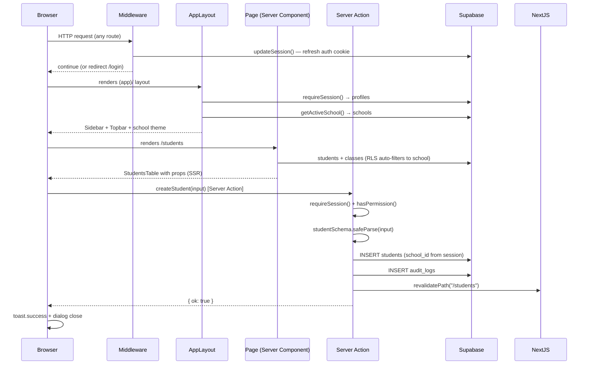

# 16 — Source Code Overview

**Madrasati** (مدرستي) — Enterprise School ERP & Academic Management System.

This document describes how the implemented codebase is organised, what is fully functional versus scaffolded, and gives a precise step-by-step guide for adding a new module by following the Students pattern.

---

## Table of Contents

1. [Repository Layout](#1-repository-layout)
2. [Technology Stack](#2-technology-stack)
3. [Application Shell](#3-application-shell)
4. [Database Layer](#4-database-layer)
5. [Authentication & Session](#5-authentication--session)
6. [RBAC — Role-Based Access Control](#6-rbac--role-based-access-control)
7. [Internationalisation (Arabic-first)](#7-internationalisation-arabic-first)
8. [Module Architecture — the Feature Pattern](#8-module-architecture--the-feature-pattern)
9. [The Students Module — Reference Implementation](#9-the-students-module--reference-implementation)
10. [Data Flow Diagram](#10-data-flow-diagram)
11. [What Is Fully Functional vs. Scaffolded](#11-what-is-fully-functional-vs-scaffolded)
12. [How to Add a New Module — Step-by-Step](#12-how-to-add-a-new-module--step-by-step)
13. [Coding Conventions](#13-coding-conventions)
14. [Utility Library Reference](#14-utility-library-reference)
15. [Testing](#15-testing)

---

## 1. Repository Layout

```
ERP System/
├── src/
│   ├── app/                        # Next.js 15 App Router pages
│   │   ├── layout.tsx              # Root layout: Cairo font, RTL dir, providers
│   │   ├── page.tsx                # Root redirect → /login or /dashboard
│   │   ├── login/page.tsx          # Public login page
│   │   ├── forgot-password/page.tsx
│   │   └── (app)/                  # Authenticated route group
│   │       ├── layout.tsx          # AppLayout: sidebar + topbar shell
│   │       ├── loading.tsx         # Suspense fallback
│   │       ├── dashboard/page.tsx  # Executive dashboard (IMPLEMENTED)
│   │       └── students/page.tsx   # Students list page (IMPLEMENTED)
│   │
│   ├── features/                   # One sub-folder per domain module
│   │   └── students/
│   │       ├── schema.ts           # Zod validation schema + TypeScript types
│   │       ├── actions.ts          # Next.js Server Actions (create/update/archive)
│   │       ├── students-table.tsx  # Client component: filterable table + row actions
│   │       └── student-form.tsx    # Client component: Dialog form (create & edit)
│   │
│   ├── components/
│   │   ├── auth/login-form.tsx
│   │   ├── dashboard/
│   │   │   ├── stat-card.tsx       # KPI card with icon, tone, hint
│   │   │   └── charts.tsx          # recharts wrappers (attendance trend, donut, bar)
│   │   ├── shell/
│   │   │   ├── sidebar.tsx         # Collapsible sidebar, permission-filtered nav
│   │   │   ├── topbar.tsx          # Top bar: school name, language switcher, user menu
│   │   │   ├── user-menu.tsx       # Avatar dropdown (profile / logout)
│   │   │   ├── page-header.tsx     # PageHeader component used by every page
│   │   │   └── icon.tsx            # NavIcon: maps lucide-react name → component
│   │   ├── language-switcher.tsx   # AR/EN cookie toggle (no page reload needed)
│   │   ├── providers.tsx           # TanStack Query client provider
│   │   └── ui/                     # shadcn-style primitives
│   │       ├── avatar.tsx
│   │       ├── badge.tsx
│   │       ├── button.tsx
│   │       ├── card.tsx
│   │       ├── dialog.tsx
│   │       ├── dropdown-menu.tsx
│   │       ├── input.tsx
│   │       ├── label.tsx
│   │       ├── select.tsx
│   │       ├── separator.tsx
│   │       ├── skeleton.tsx
│   │       ├── sonner.tsx          # Toast (Sonner)
│   │       ├── table.tsx
│   │       └── tabs.tsx
│   │
│   ├── lib/
│   │   ├── auth.ts                 # getSessionProfile(), requireSession()
│   │   ├── auth-actions.ts         # Server Actions: login, logout, forgot-password
│   │   ├── rbac.ts                 # ROLES, PERMISSIONS, ROLE_PERMISSIONS, hasPermission()
│   │   ├── audit.ts                # logAudit() — best-effort audit trail
│   │   ├── school.ts               # getActiveSchool() — branding + calendar
│   │   ├── navigation.ts           # NAVIGATION constant (sidebar groups & items)
│   │   ├── dates.ts                # formatDate(), formatDateShort(), todayISO(), ageFrom()
│   │   ├── gpa.ts                  # subjectPercentage(), bandFor(), termGpa(), rankByDesc()
│   │   ├── utils.ts                # cn(), pct()
│   │   ├── database.types.ts       # Auto-generated Supabase TypeScript types
│   │   ├── supabase/
│   │   │   ├── server.ts           # createClient() (SSR), createAdminClient() (service role)
│   │   │   ├── client.ts           # Browser Supabase client
│   │   │   └── middleware.ts       # updateSession() used by middleware.ts
│   │   └── __tests__/
│   │       ├── rbac.test.ts        # Vitest unit tests for RBAC
│   │       └── gpa.test.ts         # Vitest unit tests for grade helpers
│   │
│   ├── i18n/
│   │   ├── config.ts               # locales, defaultLocale ("ar"), localeDir, LOCALE_COOKIE
│   │   ├── request.ts              # next-intl request config (cookie-based locale)
│   │   └── actions.ts              # setLocale() Server Action
│   │
│   ├── messages/
│   │   ├── ar.json                 # Arabic strings (primary)
│   │   └── en.json                 # English strings
│   │
│   ├── middleware.ts               # Supabase session refresh on every request
│   └── app/globals.css             # Tailwind base + CSS custom properties
│
└── supabase/
    └── migrations/
        ├── 0001_core_and_rbac.sql      # schools, profiles, roles, permissions, RLS helpers
        ├── 0002_academic_and_people.sql # academic_years, stages, grades, classes, students, staff
        ├── 0003_operations.sql          # attendance, grades, Islamic, curriculum, behavior, timetable, activities, observations
        ├── 0004_admin_finance_audit.sql # report templates, communication, finance, audit_logs
        └── 0005_rls_policies.sql        # All RLS policies (applied last)
```

---

## 2. Technology Stack

| Layer | Choice | Notes |
|---|---|---|
| Framework | Next.js 15 App Router | `force-dynamic` pages; Server Components fetch directly |
| Language | TypeScript (strict) | Shared types between server and client |
| Styling | TailwindCSS | CSS variables for theming; `cn()` utility from `clsx + tailwind-merge` |
| UI components | shadcn-style primitives | Located in `src/components/ui/` |
| Charts | recharts | Wrapped in `src/components/dashboard/charts.tsx` |
| Database | Supabase (Postgres + Auth + RLS + Storage) | All domain tables scoped by `school_id` |
| ORM / client | `@supabase/ssr` + auto-generated `database.types.ts` | No Prisma; raw Supabase query builder |
| Forms | react-hook-form + `@hookform/resolvers/zod` | Schema shared between form and Server Action |
| Validation | zod | One schema file per module under `src/features/<module>/schema.ts` |
| Server mutations | Next.js Server Actions (`"use server"`) | No separate API routes for CRUD |
| Client data fetching | TanStack Query | Provider in `src/components/providers.tsx`; stale time 30 s |
| i18n | next-intl (cookie-based, no URL prefix) | Default locale `ar`, direction `rtl` |
| Toast notifications | Sonner | Positioned bottom-left in RTL, bottom-right in LTR |
| Font | Cairo (Google Fonts) | Covers Arabic + Latin; `--font-sans` CSS variable |
| Testing | Vitest | Pure function unit tests only (RBAC, GPA helpers) |

---

## 3. Application Shell

### Root layout (`src/app/layout.tsx`)

Sets `lang` and `dir` on `<html>` from the active locale cookie, loads the Cairo font, wraps everything in `NextIntlClientProvider` and `Providers` (TanStack Query), and mounts the global `Toaster`.

```
<html lang="ar" dir="rtl">
  <body class="Cairo font-sans">
    <NextIntlClientProvider>
      <Providers>          ← TanStack Query
        {children}
        <Toaster />
      </Providers>
    </NextIntlClientProvider>
  </body>
</html>
```

### Authenticated shell (`src/app/(app)/layout.tsx`)

Every page inside `(app)/` gets:

1. `requireSession()` — redirects to `/login` if unauthenticated.
2. `getActiveSchool(profile.schoolId)` — loads the school's `name_ar`, `name_en`, `logo_url`, `theme`, and `calendar`.
3. Per-school theme: the school's `theme` column (a JSON map of CSS custom property overrides, e.g. `{"--primary": "218 64% 23%"}`) is injected as an inline `<style>` tag, cascading over `:root`.
4. `<Sidebar>` and `<Topbar>` rendered around `<main>`.

### Sidebar (`src/components/shell/sidebar.tsx`)

Reads `NAVIGATION` from `src/lib/navigation.ts` and filters each item's `permission` field against `hasPermission(role, item.permission)`. Groups with no visible items are not rendered. Supports collapsing to icon-only mode (76 px wide).

### Navigation map (`src/lib/navigation.ts`)

Four groups — `academic`, `operations`, `insights`, `administration` — each containing `NavItem` objects with `key` (i18n), `href`, `icon` (lucide-react name), and optional `permission`.

---

## 4. Database Layer

### Migrations (apply in filename order)

#### `0001_core_and_rbac.sql` — Tenant root & RBAC

Key tables:

| Table | Purpose |
|---|---|
| `schools` | Multi-tenant root. Every domain row carries `school_id` FK to this table. Fields include `name_ar`, `name_en`, `slug`, `logo_url`, `theme` (jsonb), `calendar` (gregorian/hijri). |
| `profiles` | One row per `auth.users` entry. Carries `school_id`, `role`, `full_name`, `avatar_url`, `must_change_password`. Auto-created by the `on_auth_user_created` trigger. |
| `roles` | Lookup table for role keys (mirrors `src/lib/rbac.ts`). |
| `permissions` | Lookup table for permission keys. |
| `role_permissions` | Many-to-many join: which roles hold which permissions. |

RBAC helper functions (all `SECURITY DEFINER` to avoid RLS recursion):

| Function | Returns |
|---|---|
| `current_school_id()` | `uuid` of the calling user's school |
| `current_role()` | `text` role key |
| `is_super_admin()` | `boolean` |
| `has_perm(perm text)` | `boolean` — checks `role_permissions` for the calling user |
| `in_my_school(row_school uuid)` | `boolean` — true if `is_super_admin()` OR `row_school = current_school_id()` |

#### `0002_academic_and_people.sql` — Academic hierarchy & people

```
schools
  └─ academic_years          (is_current unique per school)
  └─ school_stages           (Primary / Middle / High)
       └─ grade_levels        (Grade 1, Grade 2 … )
            └─ classes        (Section A, Section B …)
                 └─ students  (current_class_id FK, many statuses)
  └─ departments
       └─ staff               (profile_id → profiles; department_id FK)
            └─ teaching_assignments  (staff × subject × class × year)
  └─ subjects
  └─ guardians               (parent portal accounts)
       └─ student_guardians  (relation, is_primary)
  └─ student_enrollments     (promotion / transfer history)
```

The `refresh_class_count()` trigger keeps `classes.student_count` accurate whenever a student's `current_class_id` or `status` changes.

#### `0003_operations.sql` — Daily operations

| Domain | Tables |
|---|---|
| Attendance | `attendance_records` (student × date, unique; statuses: present/absent/excused/late/medical) |
| Grades | `grade_scales`, `assessment_types`, `assessments`, `grades`, `report_cards` |
| Islamic Studies | `quran_surahs`, `quran_memorization`, `quran_revisions` |
| Curriculum | `curriculum_plans` → `curriculum_units` → `curriculum_lessons` → `curriculum_coverage` |
| Behavior | `behavior_records` (kind: positive/negative; points system) |
| Timetable | `rooms`, `periods`, `timetable_slots` (unique per class × period × day; teacher conflict guard) |
| Activities | `activities`, `activity_participants`, `activity_attendance` |
| Observations | `observations`, `observation_items` |

#### `0004_admin_finance_audit.sql` — Administration

| Domain | Tables |
|---|---|
| Report templates | `report_templates` (jsonb layout; kinds: report_card/attendance/certificate_quran/achievement/participation) |
| Communication | `announcements`, `notifications`, `message_log` |
| Finance | `fee_structures`, `invoices`, `invoice_items`, `installments`, `payments` |
| Audit | `audit_logs` (bigint identity PK; indexed by `school_id, created_at desc` and `entity, entity_id`) |

#### `0005_rls_policies.sql` — Row Level Security

All RLS follows one of two patterns:

**Standard school-scoped table:**
```sql
-- SELECT: user must be in the same school AND hold the read permission
create policy students_sel on public.students for select to authenticated
  using (public.in_my_school(school_id) and public.has_perm('students:read'));

-- INSERT / UPDATE / DELETE: requires the write permission
create policy students_ins on public.students for insert to authenticated
  with check (public.in_my_school(school_id) and public.has_perm('students:write'));
```

**Child tables (no direct `school_id`):** Scoped via their parent table using an `EXISTS` sub-query. Examples: `student_guardians` (via `students`), `curriculum_units` (via `curriculum_plans`), `invoice_items` (via `invoices`).

**Special cases:**
- `profiles`: own row, or same-school users with `users:manage`.
- `notifications`: strictly user-owned.
- `announcements`: whole school reads; `communication:send` to write.
- `audit_logs`: `audit:read` to select; any same-school user may insert.
- `schools`: only `super_admin` may INSERT; `settings:write` or `branding:write` to UPDATE.

---

## 5. Authentication & Session

### `src/lib/supabase/server.ts`

Two Supabase clients:

- **`createClient()`** — uses `@supabase/ssr` with the request cookie store. Used in Server Components, Server Actions, and Route Handlers. Session is automatically refreshed by `middleware.ts` on every request via `updateSession()`.
- **`createAdminClient()`** — uses the `SUPABASE_SERVICE_ROLE_KEY`. Bypasses RLS entirely. Must never be imported into any Client Component. Reserved for privileged server-side operations (bulk import, user provisioning).

### `src/lib/auth.ts`

```typescript
export type SessionProfile = {
  id: string;
  email: string | null;
  fullName: string | null;
  role: Role;
  schoolId: string | null;
  avatarUrl: string | null;
};

// Cached per React request tree — multiple page/layout calls hit the DB once
export const getSessionProfile = cache(async (): Promise<SessionProfile | null>)

// Use in protected pages: returns profile or redirects to /login
export async function requireSession(): Promise<SessionProfile>
```

`getSessionProfile` calls `supabase.auth.getUser()` then queries `profiles` for `id, email, full_name, role, school_id, avatar_url`. If the profile row does not yet exist (signup trigger backfill race), it returns a safe fallback with role `"teacher"`.

### `src/middleware.ts`

Runs `updateSession(request)` on every route except static assets, keeping the Supabase session cookie fresh without any additional application logic.

---

## 6. RBAC — Role-Based Access Control

### `src/lib/rbac.ts`

Single source of truth for the client side (mirrored in `0001_core_and_rbac.sql`).

**11 roles:** `super_admin`, `principal`, `vice_principal`, `department_head`, `teacher`, `activity_supervisor`, `registrar`, `finance_officer`, `auditor`, `student`, `parent`.

**Permissions** follow the format `resource:action`, e.g. `students:read`, `attendance:write`. The full list is:

```
students:{read,write,delete,import}   teachers:{read,write}
classes:{read,write}                  subjects:{read,write}
departments:{read,write}              attendance:{read,write}
grades:{read,write}                   timetable:{read,write}
curriculum:{read,write}               islamic:{read,write}
behavior:{read,write}                 observations:{read,write}
activities:{read,write}               reports:read
communication:send                    analytics:read
finance:{read,write}                  settings:write
branding:write                        users:manage
audit:read
```

**`ROLE_PERMISSIONS`** is a static map from role to granted permissions. `super_admin` is granted `["*"]` (wildcard).

**`hasPermission(role, perm)`** — used in page-level guards and UI visibility checks:
```typescript
if (!hasPermission(profile.role, "students:write")) redirect("/dashboard");
```

> **Security note:** Client-side `hasPermission` is for UX only (hiding buttons, redirecting). The database RLS policies via `has_perm()` are the authoritative enforcement layer. Never rely on the client check alone.

---

## 7. Internationalisation (Arabic-first)

### Configuration (`src/i18n/config.ts`)

- `locales: ["ar", "en"]` — Arabic is the default.
- Locale stored in a cookie (`madrasati_locale`) — no URL prefixes, routes stay clean.
- `localeDir`: `ar → "rtl"`, `en → "ltr"`. The root layout applies this as the `dir` attribute on `<html>`.

### Message files

- `src/messages/ar.json` — Arabic (primary, always kept complete).
- `src/messages/en.json` — English.

Both files are structured as nested namespaces: `common`, `nav`, `auth`, `dashboard`, `students`, `teachers`, `classes`, `subjects`, `attendance`, `grades`, `islamic`, `departments`, `settings`, `language`.

### Usage

**In Server Components:**
```typescript
const t = await getTranslations("students");
const tc = await getTranslations("common");
t("title")         // → "الطلاب"
tc("save")         // → "حفظ"
```

**In Client Components:**
```typescript
const t = useTranslations("students");
const locale = useLocale();  // "ar" | "en"
```

### RTL CSS conventions

Always use logical CSS properties. Never use physical `left`/`right`:

| Physical (avoid) | Logical (use) |
|---|---|
| `pl-3`, `pr-3` | `ps-3`, `pe-3` |
| `ml-auto` | `ms-auto` |
| `text-left` | `text-start` |
| `float: left` | `float: inline-start` |

Numbers (`ministry_no`, `civil_id`, phone) use `dir="ltr" className="text-start"` to force correct LTR display within an RTL document.

---

## 8. Module Architecture — the Feature Pattern

Every domain module follows the same four-file structure under `src/features/<module>/`:

```
src/features/<module>/
├── schema.ts          # Zod schema + TypeScript input type
├── actions.ts         # Server Actions: create, update, archive (or delete)
├── <module>-table.tsx # Client component: filterable table + row action menu
└── <module>-form.tsx  # Client component: Dialog form (create + edit in one)
```

The page (`src/app/(app)/<module>/page.tsx`) is a Server Component that:
1. Guards access with `requireSession()` + `hasPermission()`.
2. Fetches data from Supabase (RLS-filtered automatically).
3. Passes data as props to the client Table component.

This means zero client-side fetching is needed for the initial load — the page is fully server-rendered with accurate, permission-filtered data.

---

## 9. The Students Module — Reference Implementation

The Students module is the complete reference that all other modules must copy.

### File roles

| File | Directive | Responsibility |
|---|---|---|
| `src/app/(app)/students/page.tsx` | Server Component (no directive) | Auth guard, data fetch, prop passing |
| `src/features/students/schema.ts` | None (pure TS/Zod) | Validation schema shared by form and Server Action |
| `src/features/students/actions.ts` | `"use server"` | `createStudent`, `updateStudent`, `archiveStudent` |
| `src/features/students/students-table.tsx` | `"use client"` | Table with search filter + row action dropdown |
| `src/features/students/student-form.tsx` | `"use client"` | Dialog form for create and edit |

### `schema.ts` — key decisions

- `name_ar` is required (minimum 2 chars, Arabic error message).
- `guardian_email` uses `.email("بريد غير صحيح").optional().or(z.literal("")).nullable()` — handles empty string, null, and undefined gracefully.
- `status` is a typed enum: `enrolled | transferred | withdrawn | graduated | archived`, defaulting to `enrolled`.
- All other fields are optional/nullable.

```typescript
export const studentSchema = z.object({ ... });
export type StudentInput = z.infer<typeof studentSchema>;
```

### `actions.ts` — Server Action pattern

Every action follows this exact sequence:

```typescript
"use server";

export async function createStudent(input: StudentInput): Promise<ActionResult> {
  // 1. Authenticate
  const profile = await requireSession();
  // 2. Authorise (TypeScript + RBAC)
  if (!hasPermission(profile.role, "students:write"))
    return { ok: false, error: "forbidden" };
  // 3. Validate with Zod
  const parsed = studentSchema.safeParse(input);
  if (!parsed.success)
    return { ok: false, error: parsed.error.issues[0]?.message ?? "invalid" };
  // 4. Mutate (school_id injected here — never from client input)
  const supabase = await createClient();
  const { data, error } = await supabase
    .from("students")
    .insert({ ...parsed.data, school_id: profile.schoolId! })
    .select("id").single();
  if (error) return { ok: false, error: error.message };
  // 5. Audit
  await logAudit("student.create", "students", data.id, { name: parsed.data.name_ar });
  // 6. Invalidate Next.js cache
  revalidatePath("/students");
  return { ok: true };
}
```

`ActionResult` is `{ ok: true } | { ok: false; error: string }`.

`school_id` is **always** taken from `profile.schoolId` (the verified server-side session), never trusted from client input. RLS provides a second layer of enforcement.

### `students-table.tsx` — Client Table

- Receives `rows: StudentRow[]`, `classes`, and `canWrite` as props.
- Client-side search (`useMemo` filter over `name_ar`, `name_en`, `ministry_no`, `civil_id`, `guardian_mobile`).
- Status badge colours: `enrolled → success`, `withdrawn → destructive`, `transferred/graduated → secondary`, `archived → warning`.
- Row action menu: Edit (opens `StudentFormDialog` in edit mode) and Archive.
- `canWrite` prop controls whether the add button and row actions are rendered.

### `student-form.tsx` — Dialog Form

- Single `StudentFormDialog` handles both create (no `id` prop) and edit (`id` + `initial` props).
- `useForm` with `zodResolver(studentSchema)`.
- `Select` from shadcn uses `watch()` + `setValue()` since it is an uncontrolled component.
- On success: show `toast.success`, close dialog, reset form if creating.
- On error: show `toast.error` with the error message (or a generic "حدث خطأ" for "forbidden").

### `page.tsx` — Server Component

```typescript
export const dynamic = "force-dynamic";

export default async function StudentsPage() {
  const profile = await requireSession();
  if (!hasPermission(profile.role, "students:read")) redirect("/dashboard");

  const t = await getTranslations("students");
  const supabase = await createClient();

  const [{ data: students }, { data: classes }] = await Promise.all([
    supabase
      .from("students")
      .select("id, name_ar, name_en, gender, ministry_no, civil_id, dob, nationality, guardian_mobile, current_class_id, status, classes:current_class_id(name)")
      .order("name_ar")
      .limit(1000),
    supabase.from("classes").select("id, name").eq("status", "active").order("name"),
  ]);

  return (
    <div>
      <PageHeader title={t("title")} subtitle={t("subtitle")}>
        <Button variant="outline"><Download /> {tc("export")}</Button>
      </PageHeader>
      <StudentsTable rows={rows} classes={classes ?? []} canWrite={hasPermission(profile.role, "students:write")} />
    </div>
  );
}
```

Note: `export const dynamic = "force-dynamic"` disables static caching so every request returns fresh data. Use this on all CRUD pages.

---

## 10. Data Flow Diagram



---

## 11. What Is Fully Functional vs. Scaffolded

### Fully functional (end-to-end working)

| Area | Status |
|---|---|
| Supabase auth (login, session, cookie refresh) | Complete |
| Multi-tenant RLS (all 5 migrations applied) | Complete |
| RBAC — `hasPermission()`, `has_perm()` DB function, role matrix | Complete |
| Audit trail — `logAudit()`, `audit_logs` table + RLS | Complete |
| Students CRUD — list, create, update, archive (soft-delete) | Complete |
| Dashboard — KPI stat cards, attendance trend chart, enrollment donut, department bar | Complete (with placeholder chart data until live history accrues) |
| Application shell — sidebar, topbar, user menu, language switcher, collapsible nav | Complete |
| Arabic/English i18n with RTL/LTR switching (cookie-based) | Complete |
| Per-school branding (logo, name, CSS theme override) | Complete (data model + shell injection) |
| GPA computation helpers with unit tests | Complete |
| Date helpers (Gregorian/Hijri) | Complete |

### Database schema defined but UI not yet built

The following tables are fully migrated and RLS-protected but do not yet have pages or Server Actions:

| Module | Tables |
|---|---|
| Teachers (المعلمون) | `staff`, `teaching_assignments` |
| Classes (الفصول) | `classes`, `grade_levels`, `school_stages`, `academic_years` |
| Subjects (المواد) | `subjects` |
| Departments (الأقسام) | `departments` |
| Attendance (الحضور) | `attendance_records` |
| Grades (الدرجات) | `assessments`, `assessment_types`, `grade_scales`, `grades`, `report_cards` |
| Islamic Studies (التربية الإسلامية) | `quran_memorization`, `quran_revisions`, `quran_surahs` |
| Curriculum (المنهج) | `curriculum_plans`, `curriculum_units`, `curriculum_lessons`, `curriculum_coverage` |
| Behavior (السلوك) | `behavior_records` |
| Timetable (الجدول) | `timetable_slots`, `periods`, `rooms` |
| Activities (الأنشطة) | `activities`, `activity_participants`, `activity_attendance` |
| Observations (الملاحظات) | `observations`, `observation_items` |
| Finance (المالية) | `fee_structures`, `invoices`, `invoice_items`, `installments`, `payments` |
| Report templates | `report_templates` |
| Communication | `announcements`, `notifications`, `message_log` |
| Users management | (via `profiles` table) |
| Branding / Settings | (via `schools` table) |
| Audit log viewer | (via `audit_logs` table) |
| Parent/Student portal | (roles exist; portal pages not built) |

---

## 12. How to Add a New Module — Step-by-Step

This walkthrough uses **Attendance** (الحضور والغياب) as the example. Replace `attendance` / `AttendanceRecord` with your module name.

### Step 1 — Identify the database table and its permission

From `0003_operations.sql` the table is `attendance_records`. From `0005_rls_policies.sql`:
```
('attendance_records', 'attendance:read', 'attendance:write')
```
From `src/lib/rbac.ts` — teachers have `attendance:write`; principals and vice-principals also hold both.

### Step 2 — Create `src/features/attendance/schema.ts`

Model the INSERT/UPDATE columns as a Zod schema. Exclude `id`, `school_id`, `created_at` (server-set):

```typescript
import { z } from "zod";

export const attendanceSchema = z.object({
  student_id:  z.string().uuid(),
  class_id:    z.string().uuid(),
  date:        z.string().regex(/^\d{4}-\d{2}-\d{2}$/, "تاريخ غير صحيح"),
  status:      z.enum(["present", "absent", "excused", "late", "medical"]),
  note:        z.string().optional().nullable(),
});

export type AttendanceInput = z.infer<typeof attendanceSchema>;
```

### Step 3 — Create `src/features/attendance/actions.ts`

Copy the Server Action pattern from `src/features/students/actions.ts` exactly:

```typescript
"use server";

import { revalidatePath } from "next/cache";
import { createClient } from "@/lib/supabase/server";
import { requireSession } from "@/lib/auth";
import { hasPermission } from "@/lib/rbac";
import { logAudit } from "@/lib/audit";
import { attendanceSchema, type AttendanceInput } from "./schema";

type ActionResult = { ok: true } | { ok: false; error: string };

export async function upsertAttendance(input: AttendanceInput): Promise<ActionResult> {
  const profile = await requireSession();
  if (!hasPermission(profile.role, "attendance:write"))
    return { ok: false, error: "forbidden" };

  const parsed = attendanceSchema.safeParse(input);
  if (!parsed.success)
    return { ok: false, error: parsed.error.issues[0]?.message ?? "invalid" };

  const supabase = await createClient();
  const { error } = await supabase
    .from("attendance_records")
    .upsert(
      { ...parsed.data, school_id: profile.schoolId!, recorded_by: profile.id },
      { onConflict: "student_id,date" }
    );
  if (error) return { ok: false, error: error.message };

  await logAudit("attendance.upsert", "attendance_records", null, { date: parsed.data.date });
  revalidatePath("/attendance");
  return { ok: true };
}
```

Key rules:
- Always start with `requireSession()` + `hasPermission()`.
- Always validate with `safeParse` before any DB call.
- Always inject `school_id` from `profile.schoolId!` — never from client input.
- Always call `logAudit()` after success.
- Always call `revalidatePath("/<route>")` to invalidate the page cache.

### Step 4 — Create `src/features/attendance/attendance-table.tsx`

Copy `src/features/students/students-table.tsx`. Adjust:

- Change the `export type AttendanceRow` to match your query shape.
- Update `STATUS_VARIANT` for the new status values.
- Update column headers to use `useTranslations("attendance")`.
- Replace the archive action with your delete/update action.

```typescript
"use client";

import { useTranslations } from "next-intl";
// ... imports

export type AttendanceRow = AttendanceInput & { id: string; studentName: string };

export function AttendanceTable({ rows, canWrite }: { rows: AttendanceRow[]; canWrite: boolean }) {
  const t = useTranslations("attendance");
  const tc = useTranslations("common");
  // ... same structure as StudentsTable
}
```

### Step 5 — Create `src/features/attendance/attendance-form.tsx`

Copy `src/features/students/student-form.tsx`. Replace `studentSchema` with `attendanceSchema`, adjust form fields, and call `upsertAttendance` instead of `createStudent`/`updateStudent`.

### Step 6 — Create the page at `src/app/(app)/attendance/page.tsx`

```typescript
import { getTranslations } from "next-intl/server";
import { redirect } from "next/navigation";
import { requireSession } from "@/lib/auth";
import { hasPermission } from "@/lib/rbac";
import { createClient } from "@/lib/supabase/server";
import { PageHeader } from "@/components/shell/page-header";
import { AttendanceTable, type AttendanceRow } from "@/features/attendance/attendance-table";

export const dynamic = "force-dynamic";

export default async function AttendancePage() {
  const profile = await requireSession();
  if (!hasPermission(profile.role, "attendance:read")) redirect("/dashboard");

  const t = await getTranslations("attendance");
  const supabase = await createClient();

  const { data: records } = await supabase
    .from("attendance_records")
    .select("id, student_id, class_id, date, status, note, students:student_id(name_ar)")
    .order("date", { ascending: false })
    .limit(500);

  const rows: AttendanceRow[] = (records ?? []).map((r: any) => ({
    ...r,
    studentName: r.students?.name_ar ?? "—",
  }));

  return (
    <div>
      <PageHeader title={t("title")} />
      <AttendanceTable rows={rows} canWrite={hasPermission(profile.role, "attendance:write")} />
    </div>
  );
}
```

### Step 7 — Add i18n strings

Add keys under `"attendance"` to both `src/messages/ar.json` and `src/messages/en.json`. At minimum, add `title`, `subtitle`, plus one key per status value and per form field label. The Arabic file is the source of truth; English can follow.

### Step 8 — Verify the navigation entry already exists

`src/lib/navigation.ts` already declares:
```typescript
{ key: "attendance", href: "/attendance", icon: "CalendarCheck", permission: "attendance:read" }
```
The sidebar will automatically show it for users with `attendance:read`.

### Step 9 — Wire `PageHeader` actions

If the module needs toolbar buttons (e.g. "رصد الحضور", export), pass them as children to `<PageHeader>`:
```tsx
<PageHeader title={t("title")}>
  <Button onClick={...}><Plus /> {t("takeAttendance")}</Button>
</PageHeader>
```

### Step 10 — (Optional) Add unit tests

For pure helper logic (e.g. computing attendance percentage), add a test file at `src/lib/__tests__/<topic>.test.ts` using Vitest. See `rbac.test.ts` and `gpa.test.ts` for the pattern.

---

## 13. Coding Conventions

### File naming

- Pages: `page.tsx` (Next.js convention).
- Feature files: lowercase hyphenated, e.g. `students-table.tsx`, `student-form.tsx`.
- Utility modules: lowercase, e.g. `rbac.ts`, `dates.ts`.
- Test files: `<topic>.test.ts` under `src/lib/__tests__/`.

### Component directives

- `"use server"` — **only** on Server Action files (e.g. `actions.ts`). Never on pages or layouts.
- `"use client"` — on any component that uses React hooks (`useState`, `useForm`, `useTranslations`, event handlers). The table and form components always need this.
- No directive — Server Components (pages, layouts).

### TypeScript

- `type` for data shapes (`SessionProfile`, `StudentRow`, `NavItem`). Use `interface` only when you need declaration merging (rare).
- Prefer `z.infer<typeof schema>` for form/action input types.
- Use `as const` on readonly literal arrays (see `ROLES`, `PERMISSIONS`).
- Avoid `any` — use `unknown` and narrow, or write a proper interface. The one legitimate exception is Supabase join responses before types are regenerated.

### Supabase queries

- Always use the typed `createClient()` from `src/lib/supabase/server.ts` — it carries `Database` generics.
- Select only the columns you need — never `select("*")` in production code.
- For joined relations, use the PostgREST syntax: `"classes:current_class_id(name)"`.
- Handle `null` data defensively: `data ?? []`, `data?.field ?? "—"`.

### Server Actions

- Return type must be `Promise<ActionResult>` where `ActionResult = { ok: true } | { ok: false; error: string }`.
- The action must re-verify permissions internally — never trust that the calling UI already checked.
- `school_id` is always sourced from `profile.schoolId` (session), never from client-supplied input.
- `logAudit()` is called after the DB mutation succeeds. It never throws — failures are swallowed.
- `revalidatePath()` is called to bust the page cache after mutations.

### UI & styling

- Use existing primitives from `src/components/ui/`. Do not reach for external component libraries.
- `cn()` from `src/lib/utils.ts` (wraps `clsx` + `tailwind-merge`) for conditional class names.
- Use `Badge` with a `variant` prop for status pills. Map statuses to variants in a `STATUS_VARIANT` constant at the top of the table file.
- Page structure:
  1. `<PageHeader title={...} subtitle={...}>` (with optional action buttons as children)
  2. Filters / search row
  3. `<div className="rounded-xl border bg-card"><Table>…</Table></div>`
- Toast on success: `toast.success(tc("saved"))`. Toast on error: `toast.error(message)`.

### Forms

- Always use `useForm` + `zodResolver`. The same schema validates both the form and the Server Action.
- Control `Select` components with `watch()` + `setValue()` — they are not natively registered.
- Use `isSubmitting` from `formState` to disable the submit button and show a `<Loader2 className="animate-spin" />` spinner.
- Dialog pattern: one `Dialog` component that serves as both create and edit by checking whether an `id` prop was passed.

### Dates and numbers

- Use `formatDate()` or `formatDateShort()` from `src/lib/dates.ts` — they respect the school's `calendar` preference (Gregorian / Hijri) and the active locale.
- Telephone numbers, ministry numbers, civil IDs: always rendered with `dir="ltr" className="text-start"` to avoid number reversal in RTL context.
- Western (ASCII) numerals are preferred throughout the UI even in Arabic mode.

### Soft-delete vs. hard-delete

- Prefer soft-delete (set `status = "archived"`) to preserve audit history. Students, staff, and classes use this pattern.
- Only use hard-delete for child/junction rows (e.g. removing a student from an activity).

---

## 14. Utility Library Reference

### `src/lib/auth.ts`
- `getSessionProfile()` — cached React server function; returns `SessionProfile | null`.
- `requireSession()` — calls `getSessionProfile()`, redirects to `/login` on null.

### `src/lib/rbac.ts`
- `hasPermission(role, permission)` — returns `boolean`. Client-side guard.
- `ROLE_LABELS` — bilingual display names for all roles.
- `PERMISSIONS` — full tuple of all permission strings.

### `src/lib/audit.ts`
- `logAudit(action, entity?, entityId?, meta?)` — inserts into `audit_logs`. Best-effort (never throws).

### `src/lib/school.ts`
- `getActiveSchool(schoolId)` — cached; returns `ActiveSchool` with `nameAr`, `nameEn`, `logoUrl`, `theme`, `calendar`.

### `src/lib/dates.ts`
- `formatDate(date, locale, calendar?, options?)` — full date string using `Intl.DateTimeFormat`.
- `formatDateShort(date, locale, calendar?)` — `DD/MM/YYYY` format.
- `todayISO()` — `"YYYY-MM-DD"` for today (used as attendance primary key component).
- `ageFrom(dob)` — age in whole years.

### `src/lib/gpa.ts`
- `subjectPercentage(items: WeightedScore[])` — weighted average as 0–100 with one decimal.
- `bandFor(pct, scale)` — returns the matching `GradeBand` or `null`.
- `gpaFor(pct, scale)` — GPA point (0 if unmatched).
- `termGpa(subjectPercentages, scale)` — average GPA across subjects.
- `rankByDesc(rows, metric)` — dense ranking, descending, returns `Map<T, number>`.

### `src/lib/utils.ts`
- `cn(...classes)` — `clsx` + `tailwind-merge`.
- `pct(value, decimals?)` — rounds a number to `decimals` decimal places (default 1).

### `src/lib/navigation.ts`
- `NAVIGATION: NavGroup[]` — all sidebar groups and items. Import to read; do not mutate at runtime.

---

## 15. Testing

### Test runner

Vitest. Tests live under `src/lib/__tests__/`.

### Current coverage

| File | What it tests |
|---|---|
| `rbac.test.ts` | `hasPermission()` for wildcard, role grants, null role; all roles have a defined permission set |
| `gpa.test.ts` | `subjectPercentage()` with full marks, partial weights, empty input; `bandFor()` and `gpaFor()` against a sample scale; `termGpa()` averaging; `rankByDesc()` dense ranking with ties |

### What is not yet tested

- Server Actions (require Supabase mocking or integration test environment).
- UI components (no React Testing Library setup yet).
- RLS policies (require a running Postgres instance — suitable for CI with `supabase start`).

### Adding a test

Create `src/lib/__tests__/<topic>.test.ts`:

```typescript
import { describe, it, expect } from "vitest";
import { myHelper } from "@/lib/my-module";

describe("myHelper", () => {
  it("does the right thing", () => {
    expect(myHelper(input)).toBe(expectedOutput);
  });
});
```

Only pure functions (no Supabase, no Next.js) belong in unit tests. Server Action integration tests should be deferred to a Supabase-connected test environment.
