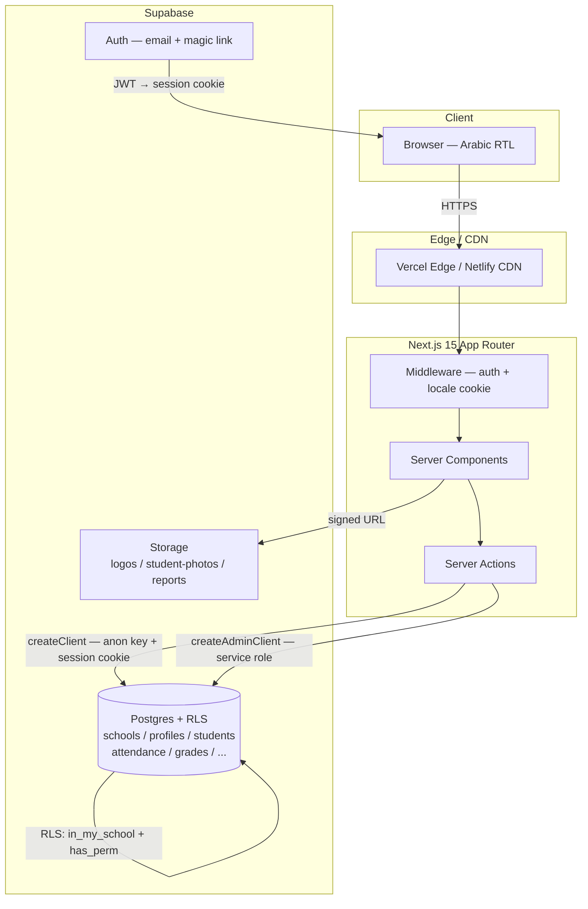
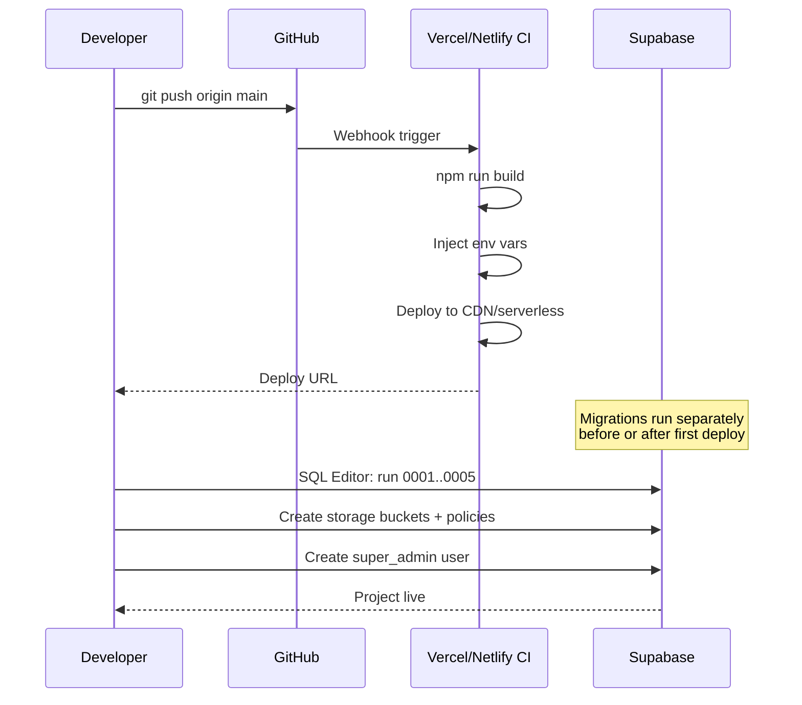

# Madrasati ERP — Deployment Guide

> **Target audience:** DevOps engineer or senior developer setting up a production instance of Madrasati (مدرستي) for the first time, or onboarding a new school tenant.
>
> This guide covers the complete path from a blank Supabase project to a live, multi-tenant school ERP accessible on a custom domain — on both Vercel and Netlify.

---

## Table of Contents

1. [Prerequisites](#1-prerequisites)
2. [Create a Supabase Project](#2-create-a-supabase-project)
3. [Run Database Migrations](#3-run-database-migrations)
4. [Seed Reference Data](#4-seed-reference-data)
5. [Storage Buckets & Policies](#5-storage-buckets--policies)
6. [Environment Variables](#6-environment-variables)
7. [Deploy to Vercel](#7-deploy-to-vercel)
8. [Deploy to Netlify](#8-deploy-to-netlify)
9. [Custom Domain](#9-custom-domain)
10. [Create the First Super Admin](#10-create-the-first-super-admin)
11. [Onboard the First School Tenant](#11-onboard-the-first-school-tenant)
12. [Backups & Point-in-Time Recovery](#12-backups--point-in-time-recovery)
13. [Post-Launch Checklist](#13-post-launch-checklist)

---

## 1. Prerequisites

| Tool | Version | Purpose |
|------|---------|---------|
| Node.js | 20 LTS | Build Next.js |
| npm | ≥ 10 | Package manager |
| Git | any | Source control |
| Supabase CLI | ≥ 1.200 | Local dev, migrations |
| Vercel CLI | ≥ 36 | Optional, for CLI deploy |
| Netlify CLI | ≥ 17 | Optional, for CLI deploy |

Install Supabase CLI:

```bash
npm install -g supabase
```

Install Vercel CLI (optional):

```bash
npm install -g vercel
```

Install Netlify CLI (optional):

```bash
npm install -g netlify-cli
```

---

## 2. Create a Supabase Project

### 2.1 Via the Supabase Dashboard

1. Go to [supabase.com/dashboard](https://supabase.com/dashboard) and sign in.
2. Click **New project**.
3. Fill in:
   - **Name:** `madrasati-prod` (or your preferred name)
   - **Database password:** generate a strong one and **save it immediately** — you cannot retrieve it later
   - **Region:** choose the region closest to your users (e.g. `Middle East (Bahrain)` → `me-central-1` for Gulf-region schools)
   - **Plan:** Pro (required for PITR, daily backups, and custom SMTP)
4. Click **Create new project** and wait ~2 minutes for provisioning.

### 2.2 Note Your Project Credentials

Navigate to **Project Settings → API**. You need:

| Variable | Location |
|----------|----------|
| Project URL | `https://<ref>.supabase.co` |
| `anon` key | Under "Project API keys" |
| `service_role` key | Under "Project API keys" (keep secret) |
| JWT secret | Under "JWT Settings" |

Navigate to **Project Settings → Database** for:

| Variable | Location |
|----------|----------|
| Connection string (Transaction mode) | Port 6543 (use for serverless) |
| Connection string (Session mode) | Port 5432 (use for migrations) |
| Direct URI | `postgresql://postgres:<password>@db.<ref>.supabase.co:5432/postgres` |

### 2.3 Link Local Repo (Optional, for CLI workflow)

```bash
cd "/Users/bo_jasem/Desktop/ERP System"
supabase login
supabase link --project-ref <your-project-ref>
```

---

## 3. Run Database Migrations

Madrasati has five ordered migration files under `supabase/migrations/`. They **must be run in filename order** because each depends on tables created by the previous one.

```
0001_core_and_rbac.sql        — extensions, schools, RBAC tables, profiles, helper functions
0002_academic_and_people.sql  — academic years, stages, grades, staff, classes, students
0003_operations.sql           — attendance, grades, Quran, curriculum, behavior, timetable, activities
0004_admin_finance_audit.sql  — report templates, announcements, notifications, finance, audit_logs
0005_rls_policies.sql         — Row Level Security (RLS) for all tables — run LAST
```

### 3.1 Option A: Supabase SQL Editor (Recommended for First Deploy)

In the Supabase Dashboard, go to **SQL Editor → New query**.

Paste and run each file in order. Click **Run** after each:

1. Copy contents of `supabase/migrations/0001_core_and_rbac.sql` → paste → Run
2. Copy contents of `supabase/migrations/0002_academic_and_people.sql` → paste → Run
3. Copy contents of `supabase/migrations/0003_operations.sql` → paste → Run
4. Copy contents of `supabase/migrations/0004_admin_finance_audit.sql` → paste → Run
5. Copy contents of `supabase/migrations/0005_rls_policies.sql` → paste → Run

Verify each run shows `Success. No rows returned` (DDL statements return no rows).

### 3.2 Option B: Supabase CLI Push

If you linked the project in step 2.3:

```bash
supabase db push
```

This applies all migrations in `supabase/migrations/` in filename order. Migrations already applied are skipped.

### 3.3 Option C: psql Direct Connection

Use the **Session mode** connection string (port 5432) for psql:

```bash
PGPASSWORD='<db-password>' psql \
  "postgresql://postgres@db.<ref>.supabase.co:5432/postgres" \
  -f "supabase/migrations/0001_core_and_rbac.sql" \
  -f "supabase/migrations/0002_academic_and_people.sql" \
  -f "supabase/migrations/0003_operations.sql" \
  -f "supabase/migrations/0004_admin_finance_audit.sql" \
  -f "supabase/migrations/0005_rls_policies.sql"
```

### 3.4 Verify Migrations

Run this in the SQL Editor to confirm all expected tables exist:

```sql
select table_name
from information_schema.tables
where table_schema = 'public'
order by table_name;
```

Expected tables include: `academic_years`, `activities`, `activity_attendance`, `activity_participants`, `announcements`, `assessments`, `assessment_types`, `attendance_records`, `audit_logs`, `behavior_records`, `classes`, `curriculum_coverage`, `curriculum_lessons`, `curriculum_plans`, `curriculum_units`, `departments`, `fee_structures`, `grade_levels`, `grade_scales`, `grades`, `guardians`, `installments`, `invoice_items`, `invoices`, `message_log`, `notifications`, `observations`, `observation_items`, `payments`, `periods`, `permissions`, `profiles`, `quran_memorization`, `quran_revisions`, `quran_surahs`, `report_cards`, `report_templates`, `role_permissions`, `roles`, `rooms`, `school_stages`, `schools`, `staff`, `student_enrollments`, `student_guardians`, `students`, `subjects`, `teaching_assignments`, `timetable_slots`.

Also verify helper functions exist:

```sql
select routine_name
from information_schema.routines
where routine_schema = 'public'
  and routine_type = 'FUNCTION'
order by routine_name;
```

Expected: `current_role`, `current_school_id`, `handle_new_user`, `has_perm`, `in_my_school`, `is_super_admin`, `refresh_class_count`, `set_updated_at`.

---

## 4. Seed Reference Data

### 4.1 Quran Surahs (Required)

The `quran_memorization` table references `quran_surahs(number)` (1–114). Run this seed to populate all 114 surahs. A minimal excerpt is shown; use a full seed file for production:

```sql
-- Full 114-surah seed — paste the complete list or generate with a script.
insert into public.quran_surahs (number, name_ar, ayah_count) values
  (1,  'الفاتحة',  7),
  (2,  'البقرة',   286),
  (3,  'آل عمران', 200),
  (4,  'النساء',   176),
  (5,  'المائدة',  120),
  -- ... continue through 114 ...
  (114, 'الناس',   6)
on conflict (number) do nothing;
```

### 4.2 RBAC Roles and Permissions (Already in Migration 0001)

Roles (`super_admin`, `principal`, `vice_principal`, `department_head`, `teacher`, `activity_supervisor`, `registrar`, `finance_officer`, `auditor`, `student`, `parent`) and all permissions are inserted by `0001_core_and_rbac.sql`. No extra seed needed.

### 4.3 Demo School (Optional)

To verify the stack end-to-end before going live, insert a test school:

```sql
insert into public.schools (name_ar, name_en, slug, calendar, is_active)
values ('مدرسة النموذج', 'Model School', 'model-school', 'gregorian', true);
```

Delete or mark inactive before production:

```sql
update public.schools set is_active = false where slug = 'model-school';
```

---

## 5. Storage Buckets & Policies

Madrasati uses three Supabase Storage buckets. Create them in **Storage → New bucket** or via SQL.

### 5.1 Create Buckets

#### Via Dashboard

| Bucket Name | Public | Max Size | Allowed MIME types |
|-------------|--------|----------|--------------------|
| `logos` | Yes | 2 MB | `image/png`, `image/jpeg`, `image/svg+xml`, `image/webp` |
| `student-photos` | No | 3 MB | `image/png`, `image/jpeg`, `image/webp` |
| `reports` | No | 20 MB | `application/pdf` |

In the dashboard: **Storage → New bucket** → set name → toggle **Public bucket** where indicated above → **Create bucket**.

#### Via SQL

```sql
-- logos: public bucket for school branding (logo_url, secondary_logo_url, stamp_url, etc.)
insert into storage.buckets (id, name, public, file_size_limit, allowed_mime_types)
values (
  'logos', 'logos', true, 2097152,
  array['image/png','image/jpeg','image/svg+xml','image/webp']
) on conflict (id) do nothing;

-- student-photos: private; accessed via signed URLs only
insert into storage.buckets (id, name, public, file_size_limit, allowed_mime_types)
values (
  'student-photos', 'student-photos', false, 3145728,
  array['image/png','image/jpeg','image/webp']
) on conflict (id) do nothing;

-- reports: private; generated PDF report cards and certificates
insert into storage.buckets (id, name, public, file_size_limit, allowed_mime_types)
values (
  'reports', 'reports', false, 20971520,
  array['application/pdf']
) on conflict (id) do nothing;
```

### 5.2 Storage RLS Policies

Run these policies in the SQL Editor. They mirror the application's RBAC: school branding is public, student data requires authentication and correct school membership.

```sql
-- ============================================================
--  logos bucket — public read; only users with branding:write may upload
-- ============================================================
create policy "logos: public read"
  on storage.objects for select
  using (bucket_id = 'logos');

create policy "logos: authenticated upload (branding:write)"
  on storage.objects for insert to authenticated
  with check (
    bucket_id = 'logos'
    and public.has_perm('branding:write')
  );

create policy "logos: authenticated update (branding:write)"
  on storage.objects for update to authenticated
  using (
    bucket_id = 'logos'
    and public.has_perm('branding:write')
  );

create policy "logos: authenticated delete (branding:write)"
  on storage.objects for delete to authenticated
  using (
    bucket_id = 'logos'
    and public.has_perm('branding:write')
  );

-- ============================================================
--  student-photos bucket — private; school-scoped
--  Path convention: student-photos/<school_id>/<student_id>.jpg
-- ============================================================
create policy "student-photos: read (students:read, same school)"
  on storage.objects for select to authenticated
  using (
    bucket_id = 'student-photos'
    and public.has_perm('students:read')
    and (storage.foldername(name))[1] = public.current_school_id()::text
  );

create policy "student-photos: upload (students:write, same school)"
  on storage.objects for insert to authenticated
  with check (
    bucket_id = 'student-photos'
    and public.has_perm('students:write')
    and (storage.foldername(name))[1] = public.current_school_id()::text
  );

create policy "student-photos: update (students:write, same school)"
  on storage.objects for update to authenticated
  using (
    bucket_id = 'student-photos'
    and public.has_perm('students:write')
    and (storage.foldername(name))[1] = public.current_school_id()::text
  );

create policy "student-photos: delete (students:write, same school)"
  on storage.objects for delete to authenticated
  using (
    bucket_id = 'student-photos'
    and public.has_perm('students:write')
    and (storage.foldername(name))[1] = public.current_school_id()::text
  );

-- ============================================================
--  reports bucket — private; school-scoped PDFs
--  Path convention: reports/<school_id>/<year>/<filename>.pdf
-- ============================================================
create policy "reports: read (reports:read, same school)"
  on storage.objects for select to authenticated
  using (
    bucket_id = 'reports'
    and public.has_perm('reports:read')
    and (storage.foldername(name))[1] = public.current_school_id()::text
  );

create policy "reports: upload (grades:write, same school)"
  on storage.objects for insert to authenticated
  with check (
    bucket_id = 'reports'
    and public.has_perm('grades:write')
    and (storage.foldername(name))[1] = public.current_school_id()::text
  );

create policy "reports: delete (grades:write, same school)"
  on storage.objects for delete to authenticated
  using (
    bucket_id = 'reports'
    and public.has_perm('grades:write')
    and (storage.foldername(name))[1] = public.current_school_id()::text
  );
```

### 5.3 Verify Bucket Creation

```sql
select id, name, public, file_size_limit
from storage.buckets
order by name;
```

Expected output:

```
 id              | name            | public | file_size_limit
-----------------+-----------------+--------+-----------------
 logos           | logos           | t      | 2097152
 reports         | reports         | f      | 20971520
 student-photos  | student-photos  | f      | 3145728
```

---

## 6. Environment Variables

Create a `.env.local` file at the project root for local development. For production, set these in the platform's environment variable UI (see sections 7 and 8).

```bash
# ─── Supabase ───────────────────────────────────────────────────────────────
# Public — safe to expose to the browser
NEXT_PUBLIC_SUPABASE_URL=https://<your-ref>.supabase.co
NEXT_PUBLIC_SUPABASE_ANON_KEY=eyJhbGciOiJIUzI1NiIsInR5cCI6IkpXVCJ9...

# Private — server-only; NEVER expose to the client
# Used by createAdminClient() in src/lib/supabase/server.ts to bypass RLS
SUPABASE_SERVICE_ROLE_KEY=eyJhbGciOiJIUzI1NiIsInR5cCI6IkpXVCJ9...

# ─── App ────────────────────────────────────────────────────────────────────
NEXT_PUBLIC_APP_URL=https://erp.madrasati.school  # no trailing slash

# ─── Optional — Email (Supabase SMTP override) ───────────────────────────────
# Configure in Supabase Dashboard → Auth → SMTP Settings instead of here.
# Leave blank to use Supabase's built-in email (limited to 3 emails/hour on Free).
```

> **Security notes:**
> - `SUPABASE_SERVICE_ROLE_KEY` bypasses all RLS policies. It is only used server-side in `createAdminClient()` for privileged operations (user provisioning, bulk import). It must never appear in client-side code or be committed to version control.
> - Add `.env.local` to `.gitignore` if not already present.
> - The `NEXT_PUBLIC_SUPABASE_ANON_KEY` is safe to expose — Supabase RLS enforces data isolation regardless.

---

## 7. Deploy to Vercel

Vercel is the native platform for Next.js and requires minimal configuration. The project ships a `vercel.json` that sets `"framework": "nextjs"` and targets the `fra1` (Frankfurt) region.

### 7.1 Initial Setup via Vercel Dashboard

1. Go to [vercel.com](https://vercel.com) and sign in.
2. Click **Add New → Project**.
3. Import your Git repository (GitHub / GitLab / Bitbucket).
4. Vercel auto-detects Next.js. Confirm:
   - **Framework Preset:** Next.js
   - **Root Directory:** `.` (project root)
   - **Build Command:** `npm run build` (auto-detected)
   - **Output Directory:** `.next` (auto-detected)
5. Expand **Environment Variables** and add all six variables from section 6.
6. Click **Deploy**.

### 7.2 Environment Variables in Vercel

Go to **Project → Settings → Environment Variables** and add:

| Name | Value | Environments |
|------|-------|--------------|
| `NEXT_PUBLIC_SUPABASE_URL` | `https://<ref>.supabase.co` | Production, Preview, Development |
| `NEXT_PUBLIC_SUPABASE_ANON_KEY` | `eyJ...` | Production, Preview, Development |
| `SUPABASE_SERVICE_ROLE_KEY` | `eyJ...` | Production, Preview, Development |
| `NEXT_PUBLIC_APP_URL` | `https://erp.madrasati.school` | Production |
| `NEXT_PUBLIC_APP_URL` | `https://staging.madrasati.school` | Preview |

### 7.3 vercel.json Reference

The existing `vercel.json` at the project root:

```json
{
  "$schema": "https://openapi.vercel.sh/vercel.json",
  "framework": "nextjs",
  "regions": ["fra1"],
  "git": { "deploymentEnabled": { "main": true } }
}
```

- `regions: ["fra1"]` places serverless functions in Frankfurt. Change to `"me1"` (Dubai) or `["me1","fra1"]` (multi-region) if your users are primarily Gulf-region.
- Automatic deployments are enabled only for the `main` branch. Pull request previews are still created.

### 7.4 CLI Deploy (Alternative)

```bash
# One-time login
vercel login

# First deploy (creates project, prompts for settings)
vercel

# Subsequent production deploys
vercel --prod
```

### 7.5 Verify Vercel Deployment

After deploy completes:

```bash
curl -I https://<your-vercel-url>.vercel.app/
```

Expected: `HTTP/2 200` with header `x-vercel-id`.

Check that Supabase connectivity works by visiting `/login` — the page should render without errors.

---

## 8. Deploy to Netlify

Netlify supports Next.js via the `@netlify/plugin-nextjs` plugin. The project ships a `netlify.toml` that configures this.

### 8.1 netlify.toml Reference

The existing `netlify.toml` at the project root:

```toml
[build]
  command = "npm run build"
  publish = ".next"

[[plugins]]
  package = "@netlify/plugin-nextjs"

[build.environment]
  NODE_VERSION = "20"
```

### 8.2 Install the Netlify Next.js Plugin

Ensure the plugin is in `devDependencies` (it may already be there):

```bash
npm install --save-dev @netlify/plugin-nextjs
```

### 8.3 Initial Setup via Netlify Dashboard

1. Go to [netlify.com](https://app.netlify.com) and sign in.
2. Click **Add new site → Import an existing project**.
3. Connect to your Git provider and select the repository.
4. Netlify reads `netlify.toml` automatically. Confirm:
   - **Build command:** `npm run build`
   - **Publish directory:** `.next`
5. Click **Show advanced** → **New variable** and add all variables from section 6.
6. Click **Deploy site**.

### 8.4 Environment Variables in Netlify

Go to **Site → Site configuration → Environment variables → Add a variable**:

| Key | Value | Scopes |
|-----|-------|--------|
| `NEXT_PUBLIC_SUPABASE_URL` | `https://<ref>.supabase.co` | All |
| `NEXT_PUBLIC_SUPABASE_ANON_KEY` | `eyJ...` | All |
| `SUPABASE_SERVICE_ROLE_KEY` | `eyJ...` | All |
| `NEXT_PUBLIC_APP_URL` | `https://erp.madrasati.school` | Production |

### 8.5 CLI Deploy (Alternative)

```bash
# One-time login
netlify login

# Link to existing site or create new
netlify init

# Build and deploy to production
netlify deploy --build --prod

# Deploy preview (no --prod flag)
netlify deploy --build
```

### 8.6 Netlify-Specific Notes

- **Server Actions** (used for form submissions throughout the app) require Netlify Functions. The `@netlify/plugin-nextjs` plugin handles this automatically.
- **Server Components** and the Next.js App Router work with the plugin on Netlify's serverless infrastructure.
- If you see 404s on dynamic routes, ensure the plugin version is ≥ 5.0: `npm list @netlify/plugin-nextjs`.
- The `serverActions.bodySizeLimit: "10mb"` configured in `next.config.ts` (for Excel imports) is respected by the plugin.

### 8.7 Verify Netlify Deployment

```bash
curl -I https://<your-netlify-subdomain>.netlify.app/
```

Expected: `HTTP/2 200` with `x-nf-request-id` header.

---

## 9. Custom Domain

### 9.1 Vercel Custom Domain

1. In Vercel, go to **Project → Settings → Domains**.
2. Click **Add**.
3. Enter your domain, e.g. `erp.madrasati.school`.
4. Vercel shows you DNS records to add. Choose:
   - **CNAME** `erp` → `cname.vercel-dns.com` (for subdomains)
   - **A** record `@` → Vercel's IP (for apex domains)
5. Add the records at your DNS registrar (Cloudflare, Route53, etc.).
6. Vercel auto-provisions a TLS certificate via Let's Encrypt within minutes.

Update `NEXT_PUBLIC_APP_URL` in Vercel environment variables to the new domain.

### 9.2 Netlify Custom Domain

1. In Netlify, go to **Site → Domain management → Add custom domain**.
2. Enter your domain (e.g. `erp.madrasati.school`) and click **Verify**.
3. Add the DNS records Netlify provides:
   - **CNAME** `erp` → `<your-site>.netlify.app`
   - Or use Netlify DNS (delegate your nameservers to Netlify for automatic management).
4. Netlify auto-provisions TLS via Let's Encrypt.

Update `NEXT_PUBLIC_APP_URL` in Netlify environment variables.

### 9.3 Supabase Allowed Redirect URLs

After setting a custom domain, add it to the Supabase Auth allowed redirect list:

1. **Dashboard → Authentication → URL Configuration**
2. **Site URL:** `https://erp.madrasati.school`
3. **Redirect URLs:** add:
   - `https://erp.madrasati.school/**`
   - `https://*.vercel.app/**` (for preview deployments)
   - `https://*.netlify.app/**` (for Netlify previews)

### 9.4 Security Headers

`next.config.ts` already adds baseline headers (`X-Frame-Options: SAMEORIGIN`, `X-Content-Type-Options: nosniff`, etc.) for all routes. No additional platform configuration needed for these.

---

## 10. Create the First Super Admin

The `super_admin` role has the wildcard permission `*` in `role_permissions` (set in `0001_core_and_rbac.sql`). The first super admin must be created via the Supabase Auth API or Dashboard, then their `profiles.role` set to `super_admin`.

### 10.1 Create the Auth User

#### Option A: Supabase Dashboard

1. Go to **Authentication → Users → Add user**.
2. Enter the email and a strong temporary password.
3. Click **Create user**.

#### Option B: Supabase SQL (service-role required, use with care)

```sql
-- Run in SQL Editor or via service-role API call, NOT from the app.
-- This uses the auth schema and requires superuser/service role access.
select auth.uid(); -- sanity check (returns null in SQL editor)
```

The SQL Editor runs as `postgres` (service role), so you can directly insert:

```sql
-- Only do this if Dashboard UI is not available.
-- Prefer the Auth dashboard UI.
```

#### Option C: Sign Up via the App

Navigate to `/login` on your deployed app, use the "Sign up" flow (if enabled), then immediately promote in step 10.2.

### 10.2 Promote to super_admin

After the user signs up (which triggers `handle_new_user()` and inserts into `profiles`), run this in the SQL Editor:

```sql
-- Replace with the actual email address.
update public.profiles
set role = 'super_admin'
where email = 'admin@madrasati.school';

-- Verify:
select id, email, role, school_id
from public.profiles
where email = 'admin@madrasati.school';
```

Expected output: `role = 'super_admin'`, `school_id = null` (super admin is not scoped to a school; `is_super_admin()` returns `true` and RLS grants access to all tenants).

### 10.3 Force Password Change on First Login

```sql
update public.profiles
set must_change_password = true
where email = 'admin@madrasati.school';
```

The `must_change_password` column is read by the app's session logic to redirect to a change-password screen on first login.

---

## 11. Onboard the First School Tenant

Once the super admin is in, create the first school record through the app's Settings UI, or directly:

```sql
-- Insert school
insert into public.schools (
  name_ar, name_en, slug, calendar, phone, email, is_active
) values (
  'مدرسة الأمل', 'Al-Amal School', 'al-amal',
  'gregorian', '+966-11-000-0000', 'info@alamal.edu.sa', true
)
returning id;
```

Then create the school's principal account via Auth → Add user, and set `school_id` and `role`:

```sql
update public.profiles
set
  role = 'principal',
  school_id = '<school-uuid-from-above>'
where email = 'principal@alamal.edu.sa';
```

---

## 12. Backups & Point-in-Time Recovery

### 12.1 Built-in Daily Backups (Pro Plan)

Supabase Pro automatically takes daily backups retained for 7 days. View and restore them at **Dashboard → Database → Backups**.

To restore to a specific daily backup:

1. Go to **Database → Backups**.
2. Click **Restore** next to the backup timestamp.
3. Confirm. Restoration creates a new database; you will be redirected.

### 12.2 Point-in-Time Recovery (PITR)

PITR is available on the **Pro plan** and above. It lets you restore to any second within the retention window (7 days on Pro, 30 days on Team/Enterprise).

**Enable PITR:**

1. **Dashboard → Database → Backups → Enable point in time recovery**.
2. Choose retention period.
3. Enable. This charges additional storage for WAL logs.

**Restore using PITR:**

1. Go to **Dashboard → Database → Backups → Point in Time**.
2. Select date and time.
3. Click **Restore**. Supabase spins up a new project with data at the specified moment.

### 12.3 Manual Database Dumps

For additional safety, schedule regular `pg_dump` exports via your CI or a cron job:

```bash
# Dump schema + data to a compressed file
pg_dump \
  "postgresql://postgres:<password>@db.<ref>.supabase.co:5432/postgres" \
  --format=custom \
  --no-acl \
  --no-owner \
  --compress=9 \
  --file="madrasati-$(date +%Y%m%d-%H%M%S).dump"
```

> Use the **Session mode** port `5432`, not the transaction pooler port `6543`, for `pg_dump`.

Store dumps in a separate cloud storage location (e.g. S3, R2, or GCS) with versioning enabled.

### 12.4 Storage Bucket Backups

Supabase Storage (logos, student-photos, reports) is not included in the database dump. Backup strategy:

- **logos:** Low-change bucket; download manually or sync to S3 monthly.
- **student-photos:** Use `supabase storage download` or the S3-compatible API to sync to your own bucket weekly.
- **reports:** Generated PDFs can be regenerated from database data; still recommended to retain 90 days.

```bash
# Example: sync student-photos to AWS S3 using rclone
rclone sync \
  "supabase-s3:student-photos" \
  "s3:your-backup-bucket/madrasati/student-photos/$(date +%Y%m%d)" \
  --config ~/.config/rclone/rclone.conf
```

### 12.5 Backup Verification

Monthly, test restoring a backup to a staging Supabase project:

1. Create a new Supabase project (`madrasati-restore-test`).
2. Restore the latest backup to it.
3. Run the migration smoke-test query (section 3.4).
4. Verify a sample query:

```sql
select count(*) from public.students;
select count(*) from public.audit_logs;
```

5. Delete the restore project after verification.

---

## 13. Post-Launch Checklist

```
[ ] All 5 migrations applied; all ~45 tables present
[ ] quran_surahs seeded (114 rows)
[ ] Storage buckets: logos (public), student-photos (private), reports (private)
[ ] Storage RLS policies applied and tested
[ ] NEXT_PUBLIC_SUPABASE_URL, NEXT_PUBLIC_SUPABASE_ANON_KEY, SUPABASE_SERVICE_ROLE_KEY set in deployment platform
[ ] NEXT_PUBLIC_APP_URL matches the live domain
[ ] Custom domain configured; TLS certificate active
[ ] Supabase Auth Redirect URLs include production domain
[ ] super_admin user created and verified (profiles.role = 'super_admin')
[ ] First school record inserted; principal user bound to school_id
[ ] must_change_password = true on all provisioned accounts
[ ] PITR enabled on Supabase project (Pro plan)
[ ] Daily backup retention confirmed (7+ days)
[ ] Manual pg_dump schedule configured (recommend daily, store 30 days)
[ ] Supabase custom SMTP configured (Auth → SMTP) — avoids 3/hr limit
[ ] Supabase email templates customized (Arabic/RTL) in Auth → Email Templates
[ ] next.config.ts CSP header tightened for production domain
[ ] vercel.json or netlify.toml region matches user geography
[ ] Error monitoring configured (Sentry, Datadog, etc.)
[ ] Audit logs (public.audit_logs) access tested with an auditor-role account
```

---

## Architecture Overview



---

## Deployment Flow



---

*Document version: 2026-06-17. Reflects migrations 0001–0005, Next.js 15, `@supabase/ssr`, Vercel `fra1` region, and Netlify `@netlify/plugin-nextjs`.*
