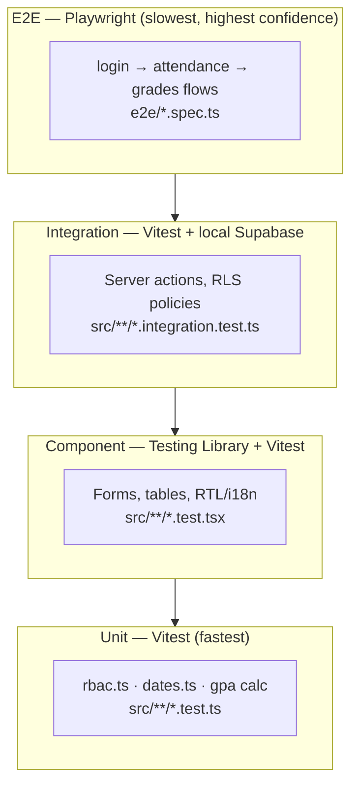
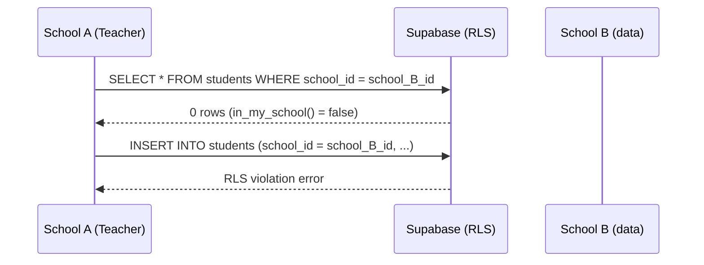

# 18 — Testing Strategy

> **Madrasati ERP** — Enterprise School Management System  
> Arabic-first (RTL), multi-tenant, Next.js 15 App Router + Supabase

---

## Table of Contents

1. [Guiding Principles](#1-guiding-principles)
2. [Test Pyramid & Toolchain](#2-test-pyramid--toolchain)
3. [Unit Tests — `vitest`](#3-unit-tests--vitest)
   - 3.1 [RBAC helper — `hasPermission`](#31-rbac-helper--haspermission)
   - 3.2 [Date utilities](#32-date-utilities)
   - 3.3 [GPA / grade-scale calculation](#33-gpa--grade-scale-calculation)
4. [Component Tests — Testing Library](#4-component-tests--testing-library)
   - 4.1 [RTL & i18n awareness](#41-rtl--i18n-awareness)
   - 4.2 [StudentForm validation](#42-studentform-validation)
   - 4.3 [Skeleton loading states](#43-skeleton-loading-states)
5. [Integration Tests — Server Actions against Local Supabase](#5-integration-tests--server-actions-against-local-supabase)
   - 5.1 [Test environment setup](#51-test-environment-setup)
   - 5.2 [`createStudent` action](#52-createstudent-action)
   - 5.3 [Attendance recording](#53-attendance-recording)
   - 5.4 [Grade submission](#54-grade-submission)
6. [RLS Policy Tests](#6-rls-policy-tests)
   - 6.1 [Cross-school isolation](#61-cross-school-isolation)
   - 6.2 [Permission-gated writes](#62-permission-gated-writes)
   - 6.3 [Profiles self-edit & admin-edit](#63-profiles-self-edit--admin-edit)
7. [E2E Tests — Playwright](#7-e2e-tests--playwright)
   - 7.1 [Auth flow: login → dashboard](#71-auth-flow-login--dashboard)
   - 7.2 [Attendance flow](#72-attendance-flow)
   - 7.3 [Grades flow](#73-grades-flow)
   - 7.4 [RTL smoke tests](#74-rtl-smoke-tests)
8. [CI Pipeline](#8-ci-pipeline)
9. [Test Data & Seeding Strategy](#9-test-data--seeding-strategy)
10. [Coverage Targets](#10-coverage-targets)
11. [Conventions & File Layout](#11-conventions--file-layout)

---

## 1. Guiding Principles

| Principle | Implementation |
|-----------|---------------|
| **Test at the right layer** | Business rules (RBAC, GPA) live in pure functions — unit-test them. UI wiring lives in components — component-test them. DB + auth live in actions — integration-test them. Flows live in browsers — E2E-test them. |
| **Arabic-first** | Tests use Arabic strings as primary inputs (`name_ar`). RTL layout assertions run in every component suite. |
| **Tenant isolation is a first-class concern** | Every integration test asserts that tenant A cannot read or write tenant B's rows, even with valid credentials. |
| **RLS is the last line of defence** | App-layer permission checks (`hasPermission`) are unit-tested independently. Postgres RLS policies are separately verified using service-role and user-role connections. |
| **Fast feedback loop** | Unit + component tests run in < 5 s. Integration tests spin up a local Supabase instance. E2E tests run in CI after the integration suite passes. |

---

## 2. Test Pyramid & Toolchain



| Layer | Runner | Config | Speed |
|-------|--------|--------|-------|
| Unit | `vitest` | `vitest.config.ts` (jsdom, globals) | < 1 s |
| Component | `vitest` + `@testing-library/react` | same | < 5 s |
| Integration | `vitest` with `--pool=forks` | `vitest.integration.config.ts` (node env) | 10–30 s |
| E2E | `@playwright/test` | `playwright.config.ts` | 1–3 min |

---

## 3. Unit Tests — `vitest`

### 3.1 RBAC helper — `hasPermission`

**File:** `src/lib/rbac.test.ts`

`hasPermission` (defined in `src/lib/rbac.ts`) is the critical gate used in every server action and page guard. It must be tested exhaustively because a regression silently opens or closes the wrong doors.

```ts
import { describe, it, expect } from "vitest";
import { hasPermission, ROLE_PERMISSIONS, ROLES, PERMISSIONS } from "@/lib/rbac";
import type { Role, Permission } from "@/lib/rbac";

describe("hasPermission", () => {
  it("returns false for null/undefined role", () => {
    expect(hasPermission(null, "students:read")).toBe(false);
    expect(hasPermission(undefined, "grades:write")).toBe(false);
  });

  it("super_admin has every permission via wildcard", () => {
    for (const perm of PERMISSIONS) {
      expect(hasPermission("super_admin", perm)).toBe(true);
    }
  });

  it("teacher can write attendance and grades", () => {
    expect(hasPermission("teacher", "attendance:write")).toBe(true);
    expect(hasPermission("teacher", "grades:write")).toBe(true);
  });

  it("teacher cannot access finance or audit", () => {
    expect(hasPermission("teacher", "finance:read")).toBe(false);
    expect(hasPermission("teacher", "audit:read")).toBe(false);
  });

  it("registrar can import students but cannot write grades", () => {
    expect(hasPermission("registrar", "students:import")).toBe(true);
    expect(hasPermission("registrar", "grades:write")).toBe(false);
  });

  it("parent can read grades, attendance, timetable, behavior — nothing else", () => {
    const allowed: Permission[] = ["grades:read", "attendance:read", "timetable:read", "behavior:read"];
    const denied = PERMISSIONS.filter((p) => !allowed.includes(p));

    for (const p of allowed) expect(hasPermission("parent", p)).toBe(true);
    for (const p of denied) expect(hasPermission("parent", p)).toBe(false);
  });

  it("student cannot write anything", () => {
    const writePerms = PERMISSIONS.filter((p) => p.endsWith(":write") || p === "users:manage");
    for (const p of writePerms) {
      expect(hasPermission("student", p)).toBe(false);
    }
  });

  it("auditor can only read audit, analytics, reports", () => {
    expect(hasPermission("auditor", "audit:read")).toBe(true);
    expect(hasPermission("auditor", "analytics:read")).toBe(true);
    expect(hasPermission("auditor", "reports:read")).toBe(true);
    expect(hasPermission("auditor", "students:read")).toBe(false);
  });

  it("ROLE_PERMISSIONS is exhaustive — every role has an entry", () => {
    for (const role of ROLES) {
      expect(ROLE_PERMISSIONS[role]).toBeDefined();
    }
  });
});
```

### 3.2 Date utilities

**File:** `src/lib/dates.test.ts`

The helpers in `src/lib/dates.ts` are used in attendance keys (`todayISO`), table display (`formatDateShort`), and profile pages (`ageFrom`). The Hijri calendar path is especially important for Arabic schools using `calendar = 'hijri'` (stored in `schools.calendar`).

```ts
import { describe, it, expect, vi, afterEach } from "vitest";
import { formatDate, formatDateShort, todayISO, ageFrom } from "@/lib/dates";

describe("formatDate", () => {
  it("formats a Gregorian date in English", () => {
    const result = formatDate("2024-09-01", "en");
    expect(result).toMatch(/September/);
    expect(result).toMatch(/2024/);
  });

  it("formats a Gregorian date in Arabic (ar-SA locale)", () => {
    const result = formatDate("2024-09-01", "ar");
    // Arabic month names or Arabic digits
    expect(result).toBeTruthy();
    expect(result).not.toBe("—");
  });

  it("formats a Hijri date using Umm al-Qura calendar", () => {
    // 2024-09-01 Gregorian ≈ 27 Safar 1446 AH
    const result = formatDate("2024-09-01", "ar", "hijri");
    expect(result).not.toBe("—");
    // Should contain Arabic script
    expect(/[؀-ۿ]/.test(result)).toBe(true);
  });

  it("returns '—' for an invalid date string", () => {
    expect(formatDate("not-a-date", "ar")).toBe("—");
  });

  it("accepts a Date object directly", () => {
    const d = new Date("2024-01-15");
    expect(formatDate(d, "en")).toMatch(/2024/);
  });
});

describe("formatDateShort", () => {
  it("produces numeric short form", () => {
    const result = formatDateShort("2024-09-01", "en");
    expect(result).toMatch(/09|9/);
    expect(result).toMatch(/2024/);
  });
});

describe("todayISO", () => {
  afterEach(() => vi.useRealTimers());

  it("returns YYYY-MM-DD format", () => {
    expect(todayISO()).toMatch(/^\d{4}-\d{2}-\d{2}$/);
  });

  it("returns the mocked current date", () => {
    vi.useFakeTimers();
    vi.setSystemTime(new Date("2025-03-15T12:00:00Z"));
    expect(todayISO()).toBe("2025-03-15");
  });
});

describe("ageFrom", () => {
  afterEach(() => vi.useRealTimers());

  it("computes age in full years", () => {
    vi.useFakeTimers();
    vi.setSystemTime(new Date("2025-06-17"));
    expect(ageFrom("2010-06-16")).toBe(15);
    expect(ageFrom("2010-06-18")).toBe(14); // birthday not yet this year
  });

  it("accepts a Date object", () => {
    vi.useFakeTimers();
    vi.setSystemTime(new Date("2025-06-17"));
    expect(ageFrom(new Date("2005-01-01"))).toBe(20);
  });
});
```

### 3.3 GPA / grade-scale calculation

**File:** `src/lib/gpa.test.ts`  
_(The pure calculation function should live in `src/lib/gpa.ts`, separate from any Supabase query.)_

The `grade_scales` table (defined in `0003_operations.sql`) stores `min_pct`, `max_pct`, `letter`, and `gpa` per school. The UI and report cards need a pure function to map a raw percentage to its letter/GPA.

```ts
// src/lib/gpa.ts  (to be created — extracted from report-card logic)
export type GradeScale = { min_pct: number; max_pct: number; letter: string; gpa: number; label_ar?: string | null };

/** Resolves the scale entry for a given percentage. Returns null if no band matches. */
export function resolveGrade(pct: number, scales: GradeScale[]): GradeScale | null {
  return scales.find((s) => pct >= s.min_pct && pct <= s.max_pct) ?? null;
}

/** Weighted average GPA across subjects. `items` = [{gpa, weight}]. */
export function weightedGpa(items: { gpa: number; weight: number }[]): number {
  const totalWeight = items.reduce((s, i) => s + i.weight, 0);
  if (totalWeight === 0) return 0;
  const sum = items.reduce((s, i) => s + i.gpa * i.weight, 0);
  return Math.round((sum / totalWeight) * 100) / 100;
}
```

```ts
// src/lib/gpa.test.ts
import { describe, it, expect } from "vitest";
import { resolveGrade, weightedGpa } from "@/lib/gpa";
import type { GradeScale } from "@/lib/gpa";

const SAMPLE_SCALES: GradeScale[] = [
  { min_pct: 90, max_pct: 100, letter: "A+", gpa: 4.0, label_ar: "ممتاز+" },
  { min_pct: 80, max_pct: 89.99, letter: "A",  gpa: 3.7, label_ar: "ممتاز" },
  { min_pct: 70, max_pct: 79.99, letter: "B+", gpa: 3.3, label_ar: "جيد جداً+" },
  { min_pct: 60, max_pct: 69.99, letter: "C",  gpa: 2.0, label_ar: "مقبول" },
  { min_pct: 0,  max_pct: 59.99, letter: "F",  gpa: 0.0, label_ar: "راسب" },
];

describe("resolveGrade", () => {
  it("maps 95% to A+", () => {
    expect(resolveGrade(95, SAMPLE_SCALES)?.letter).toBe("A+");
  });

  it("maps exactly 90% to A+", () => {
    expect(resolveGrade(90, SAMPLE_SCALES)?.letter).toBe("A+");
  });

  it("maps 89.5% to A", () => {
    expect(resolveGrade(89.5, SAMPLE_SCALES)?.letter).toBe("A");
  });

  it("maps 0% to F", () => {
    expect(resolveGrade(0, SAMPLE_SCALES)?.letter).toBe("F");
  });

  it("returns null when no band matches (e.g., 101%)", () => {
    expect(resolveGrade(101, SAMPLE_SCALES)).toBeNull();
  });

  it("includes the Arabic label", () => {
    expect(resolveGrade(75, SAMPLE_SCALES)?.label_ar).toBe("جيد جداً+");
  });
});

describe("weightedGpa", () => {
  it("computes simple equal-weight average", () => {
    const items = [
      { gpa: 4.0, weight: 1 },
      { gpa: 3.0, weight: 1 },
    ];
    expect(weightedGpa(items)).toBe(3.5);
  });

  it("weights heavier subjects correctly", () => {
    const items = [
      { gpa: 4.0, weight: 3 }, // high-weight subject
      { gpa: 2.0, weight: 1 },
    ];
    expect(weightedGpa(items)).toBe(3.5);
  });

  it("returns 0 when weights sum to zero", () => {
    expect(weightedGpa([])).toBe(0);
  });
});
```

---

## 4. Component Tests — Testing Library

**Setup:** `vitest.config.ts` already sets `environment: "jsdom"` and `globals: true`. Import `@testing-library/jest-dom` in `src/test/setup.ts` and reference it in `vitest.config.ts` under `setupFiles`.

```ts
// src/test/setup.ts
import "@testing-library/jest-dom";
```

```ts
// vitest.config.ts (updated excerpt)
test: {
  environment: "jsdom",
  globals: true,
  setupFiles: ["src/test/setup.ts"],
  include: ["src/**/*.{test,spec}.{ts,tsx}"],
}
```

### 4.1 RTL & i18n awareness

Every component test that renders Arabic UI must assert `dir="rtl"`. Use a `renderRtl` helper:

```tsx
// src/test/render-rtl.tsx
import { render } from "@testing-library/react";
import { NextIntlClientProvider } from "next-intl";
import ar from "@/messages/ar.json";

export function renderRtl(ui: React.ReactElement) {
  return render(
    <NextIntlClientProvider locale="ar" messages={ar} timeZone="Asia/Riyadh">
      <div dir="rtl">{ui}</div>
    </NextIntlClientProvider>
  );
}
```

### 4.2 StudentForm validation

**File:** `src/features/students/student-form.test.tsx`

The `studentSchema` (in `src/features/students/schema.ts`) validates Arabic name presence (`name_ar` min 2 chars), email format, and UUID class references. The component must surface Zod errors in Arabic.

```tsx
import { describe, it, expect, vi } from "vitest";
import { screen, fireEvent, waitFor } from "@testing-library/react";
import userEvent from "@testing-library/user-event";
import { renderRtl } from "@/test/render-rtl";
import { StudentForm } from "@/features/students/student-form";

const noop = vi.fn();

describe("StudentForm", () => {
  it("shows Arabic error when name_ar is empty", async () => {
    renderRtl(<StudentForm onSubmit={noop} />);
    const submitBtn = screen.getByRole("button", { name: /حفظ|إضافة/i });
    await userEvent.click(submitBtn);
    await waitFor(() => {
      expect(screen.getByText("الاسم مطلوب")).toBeInTheDocument();
    });
  });

  it("shows email format error in Arabic", async () => {
    renderRtl(<StudentForm onSubmit={noop} />);
    const emailField = screen.getByLabelText(/بريد|Email/i);
    await userEvent.type(emailField, "not-an-email");
    await userEvent.tab();
    await waitFor(() => {
      expect(screen.getByText("بريد غير صحيح")).toBeInTheDocument();
    });
  });

  it("calls onSubmit with valid data", async () => {
    renderRtl(<StudentForm onSubmit={noop} />);
    await userEvent.type(screen.getByLabelText(/الاسم بالعربي/i), "محمد عبدالله");
    // select gender
    await userEvent.click(screen.getByRole("combobox", { name: /الجنس/i }));
    await userEvent.click(screen.getByRole("option", { name: /ذكر/i }));

    await userEvent.click(screen.getByRole("button", { name: /حفظ|إضافة/i }));
    await waitFor(() => expect(noop).toHaveBeenCalledOnce());
    expect(noop.mock.calls[0][0].name_ar).toBe("محمد عبدالله");
  });

  it("renders in RTL direction", () => {
    const { container } = renderRtl(<StudentForm onSubmit={noop} />);
    expect(container.firstChild).toHaveAttribute("dir", "rtl");
  });
});
```

### 4.3 Skeleton loading states

Skeleton components (using `src/components/ui/skeleton.tsx`) must render the correct ARIA role so screen readers announce loading correctly.

```tsx
import { describe, it, expect } from "vitest";
import { render, screen } from "@testing-library/react";
import { Skeleton } from "@/components/ui/skeleton";

describe("Skeleton", () => {
  it("renders with animate-pulse class", () => {
    const { container } = render(<Skeleton className="h-4 w-full" />);
    expect(container.firstChild).toHaveClass("animate-pulse");
  });
});
```

---

## 5. Integration Tests — Server Actions against Local Supabase

### 5.1 Test environment setup

Integration tests require a running local Supabase instance with applied migrations. They use a **service-role** connection to seed data and **user-role** connections to run the actions under test.

**Prerequisites:**
```bash
# Start local Supabase
supabase start

# Apply all migrations (0001 → 0005)
supabase db push

# Confirm local URLs
supabase status
```

**Separate vitest config for integration tests:**

```ts
// vitest.integration.config.ts
import { defineConfig } from "vitest/config";
import path from "node:path";

export default defineConfig({
  test: {
    environment: "node",       // no jsdom — server-action context
    globals: true,
    include: ["src/**/*.integration.test.ts"],
    setupFiles: ["src/test/integration-setup.ts"],
    pool: "forks",             // isolate process state between files
    testTimeout: 30_000,
  },
  resolve: {
    alias: { "@": path.resolve(__dirname, "./src") },
  },
});
```

```bash
# package.json scripts
"test:integration": "vitest run --config vitest.integration.config.ts"
```

**Integration setup file:**

```ts
// src/test/integration-setup.ts
import { createClient } from "@supabase/supabase-js";

const LOCAL_URL = process.env.SUPABASE_LOCAL_URL ?? "http://localhost:54321";
const SERVICE_KEY = process.env.SUPABASE_SERVICE_ROLE_KEY!;

/** Service-role client — bypasses RLS for seeding/teardown. */
export const adminDb = createClient(LOCAL_URL, SERVICE_KEY, {
  auth: { autoRefreshToken: false, persistSession: false },
});

/** Create a test school and a user with the given role, returning schoolId + accessToken. */
export async function seedTenant(role: string): Promise<{ schoolId: string; accessToken: string; userId: string }> {
  // Insert a school
  const { data: school } = await adminDb
    .from("schools")
    .insert({ name_ar: "مدرسة الاختبار", slug: `test-school-${Date.now()}`, calendar: "gregorian" })
    .select("id")
    .single();
  const schoolId = school!.id;

  // Create an auth user
  const email = `test-${Date.now()}@madrasati.test`;
  const { data: authData } = await adminDb.auth.admin.createUser({
    email,
    password: "Test@1234!",
    user_metadata: { role, school_id: schoolId, full_name: "مستخدم تجريبي" },
    email_confirm: true,
  });
  const userId = authData.user!.id;

  // Obtain an access token for RLS context
  const { data: session } = await adminDb.auth.admin.generateLink({
    type: "magiclink",
    email,
  });
  // Exchange the magic link token for a session (local dev only)
  const anonClient = createClient(LOCAL_URL, process.env.NEXT_PUBLIC_SUPABASE_ANON_KEY!);
  const { data: signIn } = await anonClient.auth.verifyOtp({
    token_hash: session?.properties?.hashed_token ?? "",
    type: "magiclink",
  });

  return { schoolId, accessToken: signIn?.session?.access_token ?? "", userId };
}

/** Clean up a school and its auth user after a test. */
export async function teardownTenant(schoolId: string, userId: string) {
  await adminDb.from("schools").delete().eq("id", schoolId);
  await adminDb.auth.admin.deleteUser(userId);
}
```

### 5.2 `createStudent` action

**File:** `src/features/students/actions.integration.test.ts`

```ts
import { describe, it, expect, beforeAll, afterAll } from "vitest";
import { seedTenant, teardownTenant, adminDb } from "@/test/integration-setup";

// We test the action in isolation by mocking the cookie-based auth context
// and pointing createClient at the local Supabase with a real session token.
// Alternatively, call the Supabase client directly using the user token.

let schoolId: string;
let userId: string;
let userToken: string;

beforeAll(async () => {
  ({ schoolId, userId, accessToken: userToken } = await seedTenant("registrar"));
});

afterAll(async () => {
  await teardownTenant(schoolId, userId);
});

describe("students table — registrar role", () => {
  it("inserts a student row with school_id set", async () => {
    const { createClient } = await import("@supabase/supabase-js");
    const userDb = createClient(
      process.env.SUPABASE_LOCAL_URL ?? "http://localhost:54321",
      process.env.NEXT_PUBLIC_SUPABASE_ANON_KEY!,
      { global: { headers: { Authorization: `Bearer ${userToken}` } } }
    );

    const { data, error } = await userDb
      .from("students")
      .insert({
        school_id: schoolId,
        name_ar: "ريم سعد الأحمدي",
        gender: "female",
        status: "enrolled",
      })
      .select("id, name_ar, school_id")
      .single();

    expect(error).toBeNull();
    expect(data?.name_ar).toBe("ريم سعد الأحمدي");
    expect(data?.school_id).toBe(schoolId);
  });

  it("rejects a student insert without a valid school_id", async () => {
    const { createClient } = await import("@supabase/supabase-js");
    const userDb = createClient(
      process.env.SUPABASE_LOCAL_URL ?? "http://localhost:54321",
      process.env.NEXT_PUBLIC_SUPABASE_ANON_KEY!,
      { global: { headers: { Authorization: `Bearer ${userToken}` } } }
    );

    // Attempt to write to another school's scope — RLS blocks it
    const fakeSchoolId = "00000000-0000-0000-0000-000000000000";
    const { error } = await userDb
      .from("students")
      .insert({
        school_id: fakeSchoolId,
        name_ar: "متسلل",
        gender: "male",
        status: "enrolled",
      });

    // RLS policy: in_my_school(school_id) → this insert must be rejected
    expect(error).not.toBeNull();
  });
});
```

### 5.3 Attendance recording

**File:** `src/features/attendance/attendance.integration.test.ts`

The `attendance_records` table (`0003_operations.sql`) has a unique constraint `(student_id, date)` — a student cannot have two records for the same day.

```ts
import { describe, it, expect, beforeAll, afterAll } from "vitest";
import { createClient } from "@supabase/supabase-js";
import { seedTenant, teardownTenant, adminDb } from "@/test/integration-setup";
import { todayISO } from "@/lib/dates";

let schoolId: string;
let userId: string;
let userToken: string;
let classId: string;
let studentId: string;

beforeAll(async () => {
  ({ schoolId, userId, accessToken: userToken } = await seedTenant("teacher"));

  // Seed minimal academic structure via service role
  const { data: ay } = await adminDb
    .from("academic_years")
    .insert({ school_id: schoolId, name: "2025/2026", start_date: "2025-09-01", end_date: "2026-06-30", is_current: true })
    .select("id").single();

  const { data: stage } = await adminDb
    .from("school_stages")
    .insert({ school_id: schoolId, name_ar: "ابتدائي", sort_order: 1 })
    .select("id").single();

  const { data: grade } = await adminDb
    .from("grade_levels")
    .insert({ school_id: schoolId, stage_id: stage!.id, name_ar: "الصف الأول", sort_order: 1 })
    .select("id").single();

  const { data: cls } = await adminDb
    .from("classes")
    .insert({ school_id: schoolId, academic_year_id: ay!.id, grade_level_id: grade!.id, name: "1أ" })
    .select("id").single();
  classId = cls!.id;

  const { data: student } = await adminDb
    .from("students")
    .insert({ school_id: schoolId, name_ar: "عمر خالد", gender: "male", current_class_id: classId })
    .select("id").single();
  studentId = student!.id;
});

afterAll(async () => {
  await teardownTenant(schoolId, userId);
});

describe("attendance_records", () => {
  const date = todayISO();

  it("teacher can insert an attendance record", async () => {
    const userDb = createClient(
      process.env.SUPABASE_LOCAL_URL ?? "http://localhost:54321",
      process.env.NEXT_PUBLIC_SUPABASE_ANON_KEY!,
      { global: { headers: { Authorization: `Bearer ${userToken}` } } }
    );

    const { data, error } = await userDb
      .from("attendance_records")
      .insert({ school_id: schoolId, student_id: studentId, class_id: classId, date, status: "present" })
      .select("id, status")
      .single();

    expect(error).toBeNull();
    expect(data?.status).toBe("present");
  });

  it("inserting a duplicate (same student + date) is rejected by the unique constraint", async () => {
    const { error } = await adminDb
      .from("attendance_records")
      .insert({ school_id: schoolId, student_id: studentId, class_id: classId, date, status: "absent" });

    expect(error).not.toBeNull();
    expect(error?.code).toBe("23505"); // Postgres unique violation
  });
});
```

### 5.4 Grade submission

**File:** `src/features/grades/grades.integration.test.ts`

The `grades` table has `unique (assessment_id, student_id)`. An upsert is the correct pattern for score updates.

```ts
describe("grades upsert", () => {
  it("teacher can upsert a grade — initial insert", async () => {
    // assume assessmentId seeded in beforeAll
    const { data, error } = await userDb
      .from("grades")
      .upsert(
        { school_id: schoolId, assessment_id: assessmentId, student_id: studentId, score: 87.5 },
        { onConflict: "assessment_id,student_id" }
      )
      .select("score")
      .single();

    expect(error).toBeNull();
    expect(data?.score).toBe(87.5);
  });

  it("teacher can update an existing grade via upsert", async () => {
    const { data, error } = await userDb
      .from("grades")
      .upsert(
        { school_id: schoolId, assessment_id: assessmentId, student_id: studentId, score: 92 },
        { onConflict: "assessment_id,student_id" }
      )
      .select("score")
      .single();

    expect(error).toBeNull();
    expect(data?.score).toBe(92);
  });
});
```

---

## 6. RLS Policy Tests

These tests verify the Postgres policies in `supabase/migrations/0005_rls_policies.sql` directly — independently of the application layer.

### 6.1 Cross-school isolation



**File:** `src/test/rls-isolation.integration.test.ts`

```ts
describe("RLS cross-tenant isolation", () => {
  it("tenant A teacher cannot read tenant B students", async () => {
    // tenantA.userDb is a Supabase client authenticated as a teacher in school A
    // seedStudentInSchoolB inserts via service role into school B
    const { data } = await tenantA.userDb
      .from("students")
      .select("id")
      .eq("school_id", tenantB.schoolId);

    expect(data).toHaveLength(0);
  });

  it("tenant A teacher cannot write to tenant B attendance", async () => {
    const { error } = await tenantA.userDb
      .from("attendance_records")
      .insert({
        school_id: tenantB.schoolId,
        student_id: tenantB.studentId,
        class_id: tenantB.classId,
        date: "2025-11-01",
        status: "present",
      });

    expect(error).not.toBeNull();
  });
});
```

### 6.2 Permission-gated writes

```ts
describe("RLS permission gates", () => {
  it("student role cannot insert attendance_records", async () => {
    // studentDb is authenticated with role='student'
    const { error } = await studentDb
      .from("attendance_records")
      .insert({ school_id, student_id: studentId, class_id: classId, date: "2025-11-01", status: "present" });

    expect(error).not.toBeNull(); // has_perm('attendance:write') fails for student
  });

  it("parent role cannot read audit_logs", async () => {
    const { data } = await parentDb.from("audit_logs").select("id").limit(1);
    expect(data).toHaveLength(0); // has_perm('audit:read') = false for parent
  });

  it("finance_officer can read invoices but not write grades", async () => {
    const { error: gradeError } = await financeDb
      .from("grades")
      .insert({ school_id, assessment_id: someAssessmentId, student_id: studentId, score: 50 });
    expect(gradeError).not.toBeNull();

    const { data: invoices, error: invError } = await financeDb
      .from("invoices")
      .select("id")
      .limit(1);
    expect(invError).toBeNull();
  });
});
```

### 6.3 Profiles self-edit & admin-edit

From `0005_rls_policies.sql`, the `profiles_upd` policy allows `id = auth.uid()` OR `is_super_admin()` OR `(same school AND has_perm('users:manage'))`.

```ts
describe("profiles RLS", () => {
  it("user can update their own profile", async () => {
    const { error } = await userDb
      .from("profiles")
      .update({ full_name: "محدّث" })
      .eq("id", userId);
    expect(error).toBeNull();
  });

  it("teacher cannot update another teacher's profile", async () => {
    const { error } = await teacherDb
      .from("profiles")
      .update({ full_name: "مخترق" })
      .eq("id", otherTeacherId);
    // 0 rows affected (RLS filters) rather than an error — verify via service role
    const { data } = await adminDb.from("profiles").select("full_name").eq("id", otherTeacherId).single();
    expect(data?.full_name).not.toBe("مخترق");
  });

  it("principal (users:manage) can update a teacher profile in same school", async () => {
    const { error } = await principalDb
      .from("profiles")
      .update({ full_name: "معلم معدّل" })
      .eq("id", teacherUserId);
    expect(error).toBeNull();
  });
});
```

---

## 7. E2E Tests — Playwright

The existing `playwright.config.ts` sets `locale: "ar"`, `baseURL: "http://localhost:3000"`, and starts the dev server. Tests live in `e2e/`.

### 7.1 Auth flow: login → dashboard

**File:** `e2e/login.spec.ts` (already partially exists; expand below)

```ts
import { test, expect } from "@playwright/test";

const TEACHER_EMAIL = process.env.E2E_TEACHER_EMAIL!;
const TEACHER_PASS  = process.env.E2E_TEACHER_PASS!;

test.describe("Authentication", () => {
  test("unauthenticated → redirected to /login", async ({ page }) => {
    await page.goto("/dashboard");
    await expect(page).toHaveURL(/\/login/);
  });

  test("login page is Arabic RTL", async ({ page }) => {
    await page.goto("/login");
    await expect(page.locator("html")).toHaveAttribute("dir", "rtl");
    await expect(page.locator("html")).toHaveAttribute("lang", "ar");
  });

  test("invalid credentials shows Arabic error", async ({ page }) => {
    await page.goto("/login");
    await page.getByLabel(/البريد|Email/i).fill("wrong@example.com");
    await page.getByLabel(/كلمة المرور|Password/i).fill("wrongpass");
    await page.getByRole("button", { name: /تسجيل الدخول|Sign in/i }).click();
    await expect(page.getByText(/بيانات غير صحيحة|Invalid credentials|خطأ/i)).toBeVisible();
  });

  test("valid teacher logs in and lands on dashboard", async ({ page }) => {
    await page.goto("/login");
    await page.getByLabel(/البريد|Email/i).fill(TEACHER_EMAIL);
    await page.getByLabel(/كلمة المرور|Password/i).fill(TEACHER_PASS);
    await page.getByRole("button", { name: /تسجيل الدخول|Sign in/i }).click();
    await expect(page).toHaveURL(/\/dashboard/, { timeout: 10_000 });
    await expect(page.getByText(/أهلاً|مرحباً|لوحة التحكم/i)).toBeVisible();
  });
});
```

### 7.2 Attendance flow

**File:** `e2e/attendance.spec.ts`

```ts
import { test, expect } from "@playwright/test";

test.use({ storageState: "e2e/.auth/teacher.json" }); // pre-authenticated session

test.describe("Attendance flow", () => {
  test("teacher can navigate to attendance and take roll", async ({ page }) => {
    await page.goto("/attendance");
    await expect(page).toHaveURL(/\/attendance/);
    await expect(page.getByRole("heading", { name: /الحضور والغياب/i })).toBeVisible();
  });

  test("marks a student present and shows confirmation", async ({ page }) => {
    await page.goto("/attendance");
    // Select today's class from the dropdown
    await page.getByRole("combobox", { name: /الفصل|Class/i }).first().click();
    await page.getByRole("option").first().click();

    // Wait for student list to load
    const firstStudentRow = page.getByRole("row").nth(1);
    await expect(firstStudentRow).toBeVisible();

    // Click "حاضر" for the first student
    await firstStudentRow.getByRole("button", { name: /حاضر|Present/i }).click();

    // Expect a success toast
    await expect(page.getByText(/تم الحفظ|saved|✓/i)).toBeVisible({ timeout: 5_000 });
  });

  test("attendance page has RTL layout — buttons on the right", async ({ page }) => {
    await page.goto("/attendance");
    const saveBtn = page.getByRole("button", { name: /حفظ الغياب|Save/i });
    await expect(saveBtn).toBeVisible();
    // In RTL, the primary action button should be end-aligned (right in LTR == left in RTL)
    const box = await saveBtn.boundingBox();
    const viewport = page.viewportSize()!;
    // Button should be in the right half of the viewport for RTL end-alignment
    expect(box!.x + box!.width / 2).toBeGreaterThan(viewport.width / 2);
  });
});
```

### 7.3 Grades flow

**File:** `e2e/grades.spec.ts`

```ts
import { test, expect } from "@playwright/test";

test.use({ storageState: "e2e/.auth/teacher.json" });

test.describe("Grades flow", () => {
  test("teacher can open a gradebook and enter a score", async ({ page }) => {
    await page.goto("/grades");
    await expect(page.getByRole("heading", { name: /الدرجات|Grades/i })).toBeVisible();

    // Select a class and subject
    await page.getByRole("combobox", { name: /الفصل|Class/i }).first().click();
    await page.getByRole("option").first().click();
    await page.getByRole("combobox", { name: /المادة|Subject/i }).first().click();
    await page.getByRole("option").first().click();

    // Enter a score in the first editable cell
    const firstScoreInput = page.getByRole("spinbutton").first();
    await firstScoreInput.fill("88");
    await firstScoreInput.blur();

    // Expect the GPA/letter badge to update
    await expect(page.getByText(/A|ممتاز/)).toBeVisible({ timeout: 3_000 });
  });

  test("grade out of range shows validation error", async ({ page }) => {
    await page.goto("/grades");
    // Navigate to a gradebook cell
    const firstScoreInput = page.getByRole("spinbutton").first();
    await firstScoreInput.fill("150"); // > max_score = 100
    await firstScoreInput.blur();
    await expect(page.getByText(/تجاوز|exceeded|maximum/i)).toBeVisible();
  });
});
```

**Pre-auth helper** (`e2e/global-setup.ts`) — run once before the suite to create saved storage states:

```ts
// e2e/global-setup.ts
import { chromium } from "@playwright/test";

export default async function globalSetup() {
  const browser = await chromium.launch();
  const page = await browser.newPage();

  await page.goto("http://localhost:3000/login");
  await page.getByLabel(/البريد|Email/i).fill(process.env.E2E_TEACHER_EMAIL!);
  await page.getByLabel(/كلمة المرور|Password/i).fill(process.env.E2E_TEACHER_PASS!);
  await page.getByRole("button", { name: /تسجيل الدخول/i }).click();
  await page.waitForURL(/\/dashboard/);

  await page.context().storageState({ path: "e2e/.auth/teacher.json" });
  await browser.close();
}
```

```ts
// playwright.config.ts — add globalSetup
export default defineConfig({
  globalSetup: "./e2e/global-setup.ts",
  // ...existing config
});
```

### 7.4 RTL smoke tests

**File:** `e2e/rtl.spec.ts`

```ts
import { test, expect } from "@playwright/test";

const PROTECTED_ROUTES = ["/dashboard", "/students", "/attendance", "/grades", "/timetable"];

for (const route of PROTECTED_ROUTES) {
  test(`${route} renders in RTL`, async ({ page, context }) => {
    // Use teacher auth state
    await context.addCookies(/* load from e2e/.auth/teacher.json if not using storageState */);
    await page.goto(route);
    await expect(page.locator("html")).toHaveAttribute("dir", "rtl");
    await expect(page.locator("html")).toHaveAttribute("lang", "ar");
  });
}
```

---

## 8. CI Pipeline


**GitHub Actions workflow:** `.github/workflows/ci.yml`

```yaml
name: CI

on:
  push:
    branches: [main]
  pull_request:

jobs:
  quality:
    runs-on: ubuntu-latest
    services:
      # Supabase local uses Docker — run via supabase CLI
    steps:
      - uses: actions/checkout@v4

      - name: Setup Node
        uses: actions/setup-node@v4
        with:
          node-version: 20
          cache: npm

      - name: Install dependencies
        run: npm ci

      - name: Lint
        run: npm run lint

      - name: TypeScript check
        run: npx tsc --noEmit

      - name: Unit & Component tests
        run: npm test -- --reporter=verbose

      - name: Setup Supabase CLI
        uses: supabase/setup-cli@v1
        with:
          version: latest

      - name: Start local Supabase
        run: supabase start
        env:
          SUPABASE_ACCESS_TOKEN: ${{ secrets.SUPABASE_ACCESS_TOKEN }}

      - name: Apply migrations
        run: supabase db push

      - name: Integration tests
        run: npm run test:integration
        env:
          SUPABASE_LOCAL_URL: http://localhost:54321
          NEXT_PUBLIC_SUPABASE_ANON_KEY: ${{ env.SUPABASE_LOCAL_ANON_KEY }}
          SUPABASE_SERVICE_ROLE_KEY: ${{ env.SUPABASE_LOCAL_SERVICE_KEY }}

      - name: Install Playwright browsers
        run: npx playwright install --with-deps chromium

      - name: Build Next.js
        run: npm run build
        env:
          NEXT_PUBLIC_SUPABASE_URL: http://localhost:54321
          NEXT_PUBLIC_SUPABASE_ANON_KEY: ${{ env.SUPABASE_LOCAL_ANON_KEY }}

      - name: E2E tests
        run: npm run test:e2e
        env:
          NEXT_PUBLIC_APP_URL: http://localhost:3000
          E2E_TEACHER_EMAIL: ${{ secrets.E2E_TEACHER_EMAIL }}
          E2E_TEACHER_PASS: ${{ secrets.E2E_TEACHER_PASS }}

      - name: Upload Playwright report
        uses: actions/upload-artifact@v4
        if: failure()
        with:
          name: playwright-report
          path: playwright-report/

      - name: Coverage report
        run: npm test -- --coverage
        if: github.ref == 'refs/heads/main'
```

**Required GitHub secrets:**

| Secret | Description |
|--------|-------------|
| `SUPABASE_ACCESS_TOKEN` | Personal access token for Supabase CLI |
| `E2E_TEACHER_EMAIL` | Email of a seeded teacher in the test project |
| `E2E_TEACHER_PASS` | Password for the E2E teacher account |

---

## 9. Test Data & Seeding Strategy

### Hierarchy

Every integration test and E2E flow requires a minimal slice of the domain hierarchy. Insert from top to bottom:

```
schools
  └── academic_years           (is_current = true)
        └── school_stages
              └── grade_levels
                    └── classes
                          └── students
                          └── teaching_assignments
                                └── assessments
                                      └── grades
                                      └── attendance_records
```

### SQL seed file for local Supabase

```sql
-- supabase/seed.sql
-- This file is loaded automatically by `supabase start` (development only).

insert into public.schools (id, name_ar, name_en, slug, calendar, is_active)
values ('11111111-0000-0000-0000-000000000001', 'مدرسة النموذج', 'Model School', 'model-school', 'gregorian', true)
on conflict (slug) do nothing;

-- Seed an academic year
insert into public.academic_years (school_id, name, start_date, end_date, is_current)
values ('11111111-0000-0000-0000-000000000001', '2025/2026', '2025-09-01', '2026-06-30', true)
on conflict do nothing;
```

### Grade scale seed (required for GPA calculation)

```sql
insert into public.grade_scales (school_id, min_pct, max_pct, letter, gpa, label_ar) values
  ('11111111-0000-0000-0000-000000000001', 90, 100,   'A+', 4.00, 'ممتاز+'),
  ('11111111-0000-0000-0000-000000000001', 80, 89.99, 'A',  3.70, 'ممتاز'),
  ('11111111-0000-0000-0000-000000000001', 70, 79.99, 'B+', 3.30, 'جيد جداً+'),
  ('11111111-0000-0000-0000-000000000001', 60, 69.99, 'C',  2.00, 'مقبول'),
  ('11111111-0000-0000-0000-000000000001',  0, 59.99, 'F',  0.00, 'راسب');
```

---

## 10. Coverage Targets

| Layer | Tool | Target |
|-------|------|--------|
| `src/lib/*.ts` (rbac, dates, gpa) | vitest `--coverage` | **100%** line coverage |
| `src/features/**/actions.ts` | integration tests | **90%** branch coverage |
| `src/features/**/schema.ts` | unit tests (all enum branches) | **100%** |
| `src/features/**/*.tsx` components | Testing Library | **80%** |
| Critical E2E paths (login, attendance, grades) | Playwright | all paths pass |

Run coverage locally:

```bash
npm test -- --coverage --reporter=verbose
# output: coverage/index.html
```

---

## 11. Conventions & File Layout

```
src/
  lib/
    rbac.test.ts            # unit — hasPermission
    dates.test.ts           # unit — formatDate, ageFrom, todayISO
    gpa.ts                  # pure function (to create)
    gpa.test.ts             # unit — resolveGrade, weightedGpa
  features/
    students/
      schema.test.ts        # unit — Zod schema edge cases
      student-form.test.tsx # component — Arabic validation, RTL
      actions.integration.test.ts  # integration — createStudent, updateStudent
    attendance/
      attendance.integration.test.ts
    grades/
      grades.integration.test.ts
  test/
    setup.ts                # @testing-library/jest-dom setup
    render-rtl.tsx          # RTL + next-intl wrapper
    integration-setup.ts    # seedTenant, teardownTenant, adminDb
e2e/
  global-setup.ts           # pre-auth storage states
  .auth/
    teacher.json            # saved Playwright auth state (git-ignored)
  login.spec.ts             # existing + expanded
  attendance.spec.ts
  grades.spec.ts
  rtl.spec.ts
```

**Naming conventions:**

- Unit/component tests: `*.test.ts` / `*.test.tsx` — picked up by `vitest.config.ts`
- Integration tests: `*.integration.test.ts` — picked up by `vitest.integration.config.ts` only
- E2E tests: `e2e/*.spec.ts` — picked up by `playwright.config.ts`

**Mock strategy:**

- `next/navigation` (`redirect`, `useRouter`) — mock via `vi.mock("next/navigation")` in component tests
- `next-intl` — use the real provider via `renderRtl` helper (avoids stale translation mocks)
- Supabase client — do **not** mock in integration tests; use a real local instance with real RLS
- `cookies()` from `next/headers` — mock in action unit tests only; bypass in integration tests by calling the Supabase client directly with a bearer token

---

*End of testing strategy document.*
