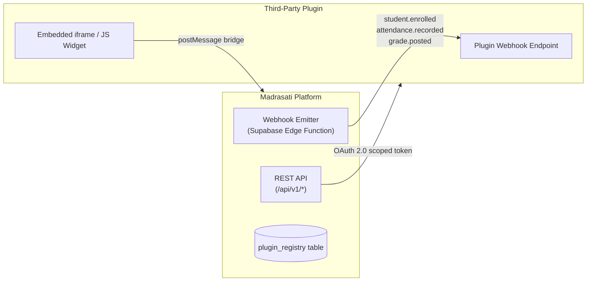
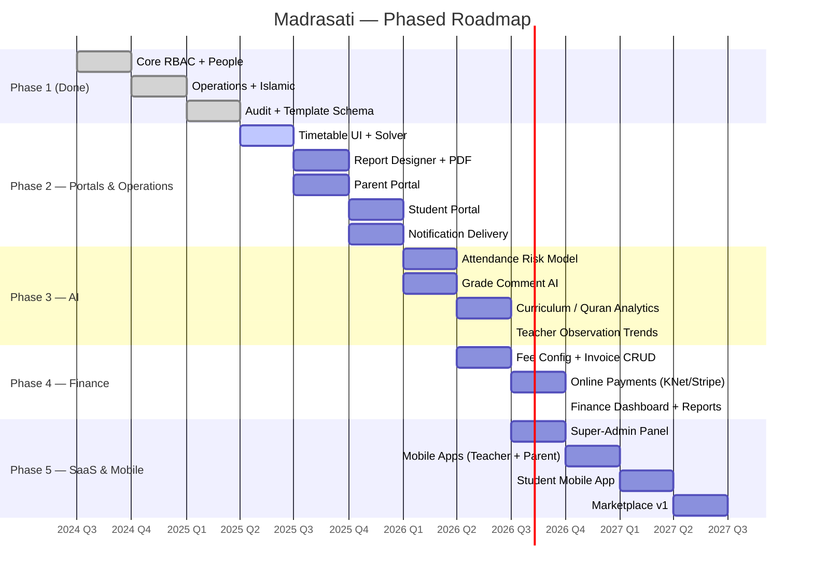
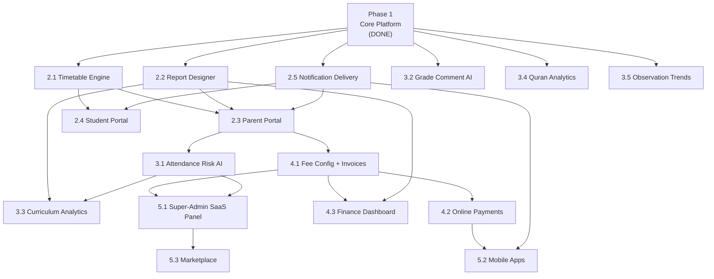

# Madrasati ERP — Future Expansion Roadmap

> **مدرستي** · Enterprise School ERP & Academic Management System  
> Arabic-first (RTL) · Multi-tenant Supabase/Next.js 15 · This document covers Phases 2–5.  
> Phase 1 (core platform) is already in production; it is described here only as the dependency baseline.

---

## Table of Contents

1. [Baseline: Phase 1 — Core Platform (Done)](#1-baseline-phase-1--core-platform-done)
2. [Phase 2 — Timetable Engine, Report Designer, Portals & Notifications](#2-phase-2--timetable-engine-report-designer-portals--notifications)
3. [Phase 3 — AI Analytics & Intelligent Insights](#3-phase-3--ai-analytics--intelligent-insights)
4. [Phase 4 — Finance Activation](#4-phase-4--finance-activation)
5. [Phase 5 — Multi-School SaaS, Mobile Apps & Marketplace](#5-phase-5--multi-school-saas-mobile-apps--marketplace)
6. [Master Timeline (Quarter-by-Quarter)](#6-master-timeline-quarter-by-quarter)
7. [Dependency Graph](#7-dependency-graph)
8. [Database & API Evolution Strategy](#8-database--api-evolution-strategy)
9. [Risk Register](#9-risk-register)

---

## 1. Baseline: Phase 1 — Core Platform (Done)

### What Is Shipped

| Domain | Tables | Key Files |
|--------|--------|-----------|
| Multi-tenant RBAC | `schools`, `profiles`, `roles`, `permissions`, `role_permissions` | `0001_core_and_rbac.sql`, `src/lib/rbac.ts` |
| Academic structure | `academic_years`, `school_stages`, `grade_levels`, `classes`, `subjects`, `departments`, `teaching_assignments` | `0002_academic_and_people.sql` |
| People | `students`, `staff`, `guardians`, `student_guardians`, `student_enrollments` | `src/features/students/` |
| Daily operations | `attendance_records`, `assessments`, `assessment_types`, `grades`, `grade_scales`, `report_cards` | `0003_operations.sql` |
| Islamic studies | `quran_surahs`, `quran_memorization`, `quran_revisions` | `0003_operations.sql` |
| Curriculum | `curriculum_plans`, `curriculum_units`, `curriculum_lessons`, `curriculum_coverage` | `0003_operations.sql` |
| Behavior & discipline | `behavior_records` | `0003_operations.sql` |
| Timetable primitives | `rooms`, `periods`, `timetable_slots` | `0003_operations.sql` |
| Activities | `activities`, `activity_participants`, `activity_attendance` | `0003_operations.sql` |
| Observations | `observations`, `observation_items` | `0003_operations.sql` |
| Communication scaffolding | `announcements`, `notifications`, `message_log` | `0004_admin_finance_audit.sql` |
| Report templates | `report_templates` (JSON layout, `kind` ∈ `report_card|attendance|certificate_quran|achievement|participation`) | `0004_admin_finance_audit.sql` |
| Finance schema (dormant UI) | `fee_structures`, `invoices`, `invoice_items`, `installments`, `payments` | `0004_admin_finance_audit.sql` |
| Audit trail | `audit_logs` (identity PK, append-only, `audit_ins` policy) | `0004_admin_finance_audit.sql`, `src/lib/audit.ts` |
| RLS | Every domain table: `in_my_school(school_id) AND has_perm('resource:action')` | `0005_rls_policies.sql` |

### Tech Stack

```
Next.js 15 App Router  ·  TypeScript  ·  TailwindCSS  ·  shadcn-style UI
next-intl (Arabic-first, RTL, cookie locale, no locale path prefix)
Supabase (Postgres 15 · PostgREST · Auth · Storage · Realtime · Edge Functions)
TanStack Query  ·  recharts  ·  zod + react-hook-form
```

### Navigation Structure (nav groups already wired in `src/lib/navigation.ts`)

| Group | Routes |
|-------|--------|
| `academic` | `/dashboard`, `/students`, `/teachers`, `/classes`, `/subjects`, `/departments` |
| `operations` | `/attendance`, `/grades`, `/timetable`, `/curriculum`, `/islamic`, `/behavior`, `/observations`, `/activities` |
| `insights` | `/reports`, `/analytics`, `/communication` |
| `administration` | `/finance`, `/users`, `/branding`, `/settings`, `/audit` |

All routes beyond `/students` and `/dashboard` have DB tables and permission entries but no UI pages yet — this is the Phase 2 opportunity.

---

## 2. Phase 2 — Timetable Engine, Report Designer, Portals & Notifications

**Theme:** Complete the operational core so every role has a daily-use workflow.

### 2.1 Automated Timetable Engine

The `timetable_slots` table already enforces teacher uniqueness via:

```sql
-- supabase/migrations/0003_operations.sql
create unique index if not exists timetable_teacher_uq
  on public.timetable_slots(staff_id, period_id, day_of_week) where staff_id is not null;
```

What is missing is the **solver and UI**.

**Data model additions (migration `0006_timetable_constraints.sql`):**

```sql
-- Teacher unavailability windows
create table public.staff_unavailability (
  id          uuid primary key default gen_random_uuid(),
  school_id   uuid not null references public.schools(id) on delete cascade,
  staff_id    uuid not null references public.staff(id) on delete cascade,
  day_of_week int not null check (day_of_week between 0 and 6),
  period_id   uuid not null references public.periods(id) on delete cascade,
  reason      text
);

-- Subject load caps per class per week
create table public.subject_load_caps (
  school_id       uuid not null references public.schools(id) on delete cascade,
  grade_level_id  uuid not null references public.grade_levels(id) on delete cascade,
  subject_id      uuid not null references public.subjects(id) on delete cascade,
  max_per_day     int not null default 2,
  primary key (school_id, grade_level_id, subject_id)
);
```

**Solver approach:**  
A Supabase Edge Function (`generate-timetable`) implements a constraint-satisfaction backtracking solver seeded from:
- `teaching_assignments` (which staff teaches which subject in which class)
- `staff_unavailability`
- `subject_load_caps`
- `periods` and the unique index on `timetable_slots`

The solver writes into `timetable_slots` transactionally. Conflicts are surfaced as a JSON error payload that the UI renders inline. For large schools (>30 classes), an optional OR-Tools WASM binary is bundled.

**UI pages:**
- `/timetable` — weekly grid (class or teacher view, day columns, period rows)
- `/timetable/generate` — wizard: select academic year → assign loads → run solver → review conflicts → publish
- `/timetable/substitution` — one-click teacher substitution for a day (updates `timetable_slots` with `substitute_staff_id` column added in `0006`)

**Permissions already in place:** `timetable:read` / `timetable:write` in `role_permissions`.

---

### 2.2 Drag-and-Drop Report & Certificate Designer

The `report_templates` table stores a `layout jsonb` blob. The `kind` column already enumerates:

```
report_card | attendance | certificate_quran | achievement | participation
```

**What to build:**

A canvas-based designer at `/branding/templates` where a user with `branding:write` drags blocks onto an A4 canvas:

- **Block types:** `SchoolHeader` (pulls from `schools.logo_url`, `schools.stamp_url`, `schools.name_ar`), `StudentInfo`, `GradeTable`, `AttendanceSummary`, `QuranProgress`, `BehaviorSummary`, `QRCode` (links to verification URL), `Signature` (`schools.signature_url`), `FreeText`, `Image`.
- **Layout JSON schema (stored in `report_templates.layout`):**

```jsonc
{
  "orientation": "portrait",          // portrait | landscape
  "pageSize": "A4",
  "rtl": true,
  "header": { "height": 120, "blocks": [...] },
  "body":   { "blocks": [...] },
  "footer": { "height": 60,  "blocks": [...] }
}
```

**PDF render pipeline:**  
A Supabase Edge Function `render-report` accepts `{ template_id, student_id, term }`, fetches the template `layout`, hydrates it with live data from `report_cards.data` (frozen JSONB snapshot), and emits a PDF using `@react-pdf/renderer` compiled to Deno. The PDF is stored in the `exports` Storage bucket and a signed URL is returned.

**Bulk generation:** A server action `generateTermReports(class_id, term)` fans out one Edge Function call per student, tracks progress in a new `export_jobs` table, and streams completion status via Supabase Realtime.

**Migration additions (`0006`):**

```sql
create table public.export_jobs (
  id          uuid primary key default gen_random_uuid(),
  school_id   uuid not null references public.schools(id) on delete cascade,
  kind        text not null,   -- report_cards | certificates | attendance_sheets
  status      text not null default 'pending' check (status in ('pending','running','done','failed')),
  total       int not null default 0,
  completed   int not null default 0,
  file_url    text,
  error       text,
  created_by  uuid references public.profiles(id) on delete set null,
  created_at  timestamptz not null default now(),
  updated_at  timestamptz not null default now()
);
```

---

### 2.3 Parent Portal (دور ولي الأمر)

The `parent` role is already defined in `roles` and carries `grades:read`, `attendance:read`, `timetable:read`, `behavior:read`. The `guardians` and `student_guardians` tables (with `is_primary` flag and `relation` field) are also in place.

**What is missing:**

1. **Invitation flow:** A server action `inviteGuardian(student_id, email)` creates a `guardians` row, links it via `student_guardians`, creates a Supabase Auth invitation, and sets `profiles.role = 'parent'`.
2. **Portal UI (`/portal/parent`):** A dedicated layout variant that replaces the staff sidebar with a simplified parent navigation:
   - `My Children` — lists linked students via `student_guardians`
   - `Attendance` — reads `attendance_records` filtered to the child's `student_id`
   - `Grades` — reads `report_cards` and `grades` for the child
   - `Timetable` — reads `timetable_slots` for `classes.id = student.current_class_id`
   - `Behavior` — reads `behavior_records` for `kind = 'positive'` (concerns go through `announcements`)
   - `Notifications` — reads `notifications` where `user_id = auth.uid()`
3. **Read-only enforcement:** Enforced at DB level by RLS (`has_perm('grades:read')` etc.) and at UI level by `hasPermission(role, perm)` from `src/lib/rbac.ts`.

---

### 2.4 Student Self-Service Portal (دور الطالب)

The `student` role has `grades:read`, `attendance:read`, `timetable:read`, `activities:read`. A student with a `profiles.role = 'student'` row (linked via `students.profile_id`, to be added in migration `0006`) accesses:

- `/portal/student/grades` — personal grade history
- `/portal/student/attendance` — monthly calendar view of `attendance_records`
- `/portal/student/timetable` — weekly view
- `/portal/student/activities` — enrolled activities via `activity_participants`
- `/portal/student/quran` — Quran memorization progress via `quran_memorization` and `quran_revisions`

**Migration addition:**

```sql
-- 0006: Link student table row to auth profile
alter table public.students add column if not exists profile_id uuid
  references public.profiles(id) on delete set null;
create index if not exists students_profile_idx on public.students(profile_id);
```

---

### 2.5 Multi-Channel Notification System

The `notifications` table (RLS: `user_id = auth.uid()`) and `message_log` table (channels: `email|sms|whatsapp|push`) are already designed. What is needed is the delivery layer.

**Architecture:**

```
Server Action / DB trigger
        │
        ▼
Supabase Edge Function: send-notification
        │
   ┌────┴─────────┬───────────────┬──────────────┐
   ▼              ▼               ▼              ▼
Resend (email)  Twilio (SMS)  Wassenger     Expo Push
                              (WhatsApp)    (mobile, Phase 5)
```

The Edge Function reads `message_log` rows where `status = 'queued'`, dispatches via the appropriate gateway, then updates `status` to `sent` or `failed` with an `error` column.

**Trigger points (examples):**

| Event | Audience | Channel |
|-------|----------|---------|
| Student marked absent | Parent (`student_guardians.is_primary`) | SMS + push |
| Grade posted | Student + parent | In-app notification |
| Announcement published | Per `announcements.audience` | In-app + email |
| Behavior record added (negative) | Parent | WhatsApp |
| Weekly attendance summary | Parent | Email (Sunday) |

**New permission:** `notifications:manage` (for admins to configure channels and templates) — add to `permissions` insert and grant to `principal`.

---

### Phase 2 Deliverables Summary

| # | Deliverable | New Migration | New Routes |
|---|-------------|---------------|------------|
| 2.1 | Timetable engine + substitution UI | `0006` | `/timetable`, `/timetable/generate`, `/timetable/substitution` |
| 2.2 | Report/certificate designer + PDF export | `0006` | `/branding/templates`, `/branding/templates/[id]` |
| 2.3 | Parent portal | — | `/portal/parent/*` |
| 2.4 | Student portal | `0006` (add `students.profile_id`) | `/portal/student/*` |
| 2.5 | Notification delivery | `0006` | `/communication/notifications` |

---

## 3. Phase 3 — AI Analytics & Intelligent Insights

**Theme:** Turn accumulated operational data into actionable intelligence for principals, department heads, and teachers.

**Dependency:** Phase 2 must be complete so sufficient `attendance_records`, `grades`, `behavior_records`, and `quran_memorization` data exists across at least one full academic year.

### 3.1 Predictive Attendance Risk

**Model:** A logistic regression (or gradient boosting) model trained on:
- `attendance_records` features: rolling 7-day and 30-day absence rate per student, day-of-week pattern, term position
- `behavior_records` features: negative behavior count in trailing 30 days
- Label: `students.status` transitions to `withdrawn` within 60 days

**Delivery:**
- A scheduled Supabase Edge Function `compute-risk-scores` runs weekly, writes into:

```sql
-- migration 0007_ai.sql
create table public.student_risk_scores (
  id          uuid primary key default gen_random_uuid(),
  school_id   uuid not null references public.schools(id) on delete cascade,
  student_id  uuid not null references public.students(id) on delete cascade,
  computed_at timestamptz not null default now(),
  risk_level  text not null check (risk_level in ('low','medium','high','critical')),
  risk_score  numeric(5,4) not null,    -- 0.0000 – 1.0000
  factors     jsonb                      -- {"absences_30d": 8, "behavior_negative": 2, ...}
);
create index if not exists risk_school_idx on public.student_risk_scores(school_id, computed_at desc);
```

- Dashboard widget on `/analytics`: "طلاب في خطر" (At-Risk Students) heat-map by class and grade level, sortable by risk score, with one-click drill-down to student profile.

**Permission:** `analytics:read` (already in RBAC matrix for `principal`, `vice_principal`, `department_head`, `auditor`).

---

### 3.2 Grade Comment Auto-Suggestion

An existing Edge Function stub `ai-suggest-grade-comment` is referenced in `docs/01-system-architecture.md`. This is fleshed out as follows:

**Input:** `{ student_id, subject_id, term, score, attendance_rate, behavior_summary }`  
**Output:** Three candidate Arabic-language `comment` strings for `report_cards.comment`.

**Implementation:** Call Anthropic's Claude API (model selection per `src/lib/claude-api.ts` to be created), prompt in Arabic, response constrained to 3 ≤ 80-char strings. The teacher selects or edits before saving. The chosen or edited text is stored in `report_cards.comment`.

**UI integration:** In the grade-entry page, a "اقتراح تعليق" (Suggest Comment) button triggers a TanStack Query mutation that calls a Next.js Route Handler `/api/ai/grade-comment`, which in turn invokes the Edge Function with a Supabase service-role key. Response streams via Server-Sent Events for low latency.

---

### 3.3 Curriculum Coverage Analytics

**Data already available:** `curriculum_coverage.status` (`not_started|in_progress|completed`) linked to `curriculum_lessons` → `curriculum_units` → `curriculum_plans`.

**New views (migration `0007`):**

```sql
create or replace view public.v_curriculum_coverage_pct as
select
  cc.school_id,
  cp.subject_id,
  cp.grade_level_id,
  cp.academic_year_id,
  count(*) filter (where cc.status = 'completed') as lessons_completed,
  count(*) as lessons_total,
  round(
    count(*) filter (where cc.status = 'completed')::numeric / nullif(count(*),0) * 100, 1
  ) as pct_complete
from public.curriculum_coverage cc
join public.curriculum_lessons cl on cl.id = cc.lesson_id
join public.curriculum_units cu on cu.id = cl.unit_id
join public.curriculum_plans cp on cp.id = cu.plan_id
group by cc.school_id, cp.subject_id, cp.grade_level_id, cp.academic_year_id;
```

**Dashboard widget:** Stacked bar chart (recharts `BarChart`) on `/analytics` showing curriculum completion % by subject and term, color-coded by grade level.

---

### 3.4 Quran Memorization Progress Analytics

`quran_memorization.status` (`not_started|in_progress|memorized`) + `quran_revisions.quality` (`excellent|good|fair|weak`).

**New view:**

```sql
create or replace view public.v_quran_school_summary as
select
  qm.school_id,
  qs.name_ar            as surah_name,
  qm.surah_number,
  count(*) filter (where qm.status = 'memorized') as memorized_count,
  count(*) as enrolled_count,
  avg(qm.score)         as avg_score,
  avg(qm.tajweed_score) as avg_tajweed
from public.quran_memorization qm
join public.quran_surahs qs on qs.number = qm.surah_number
group by qm.school_id, qm.surah_number, qs.name_ar;
```

**UI:** Radial progress chart on `/islamic/analytics` and a leaderboard of top memorizers per class.

---

### 3.5 Teacher Performance & Observation Trends

`observations` and `observation_items` → aggregate by `staff_id` across terms.

**New view:**

```sql
create or replace view public.v_teacher_observation_trend as
select
  o.school_id,
  o.staff_id,
  date_trunc('month', o.date) as month,
  avg(o.overall_score)         as avg_score,
  count(*)                     as observation_count
from public.observations o
where o.status = 'submitted'
group by o.school_id, o.staff_id, date_trunc('month', o.date);
```

**UI:** Line chart on `/observations/analytics` (permission: `analytics:read`), filterable by department (joins `staff.department_id`).

---

### Phase 3 Deliverables Summary

| # | Deliverable | Migration | Requires |
|---|-------------|-----------|---------|
| 3.1 | Attendance risk model | `0007` | ≥1 academic year of `attendance_records` |
| 3.2 | Grade comment AI | — (Edge Function) | Claude API key in Supabase secrets |
| 3.3 | Curriculum analytics view | `0007` | Phase 2 timetable + curriculum coverage data |
| 3.4 | Quran progress analytics | `0007` | `quran_memorization` data |
| 3.5 | Observation trend analytics | `0007` | Submitted `observations` across ≥2 terms |

---

## 4. Phase 4 — Finance Activation

**Theme:** Surface the already-designed finance schema into a fully operational fee management and billing module.

**Dependency:** Phase 2 (parent/student portals are the primary consumers of invoices); Phase 3 analytics enrich financial dashboards.

The finance schema is fully defined in `0004_admin_finance_audit.sql`:

```
fee_structures  →  invoices  →  invoice_items
                              →  installments
                              →  payments
```

RLS policies are also already applied in `0005_rls_policies.sql` (permission `finance:read` / `finance:write`, role `finance_officer` in `rbac.ts`).

### 4.1 Fee Structure Configuration

**UI:** `/finance/fee-structures`  
- CRUD for `fee_structures` rows (name, amount, `grade_level_id`, `academic_year_id`).
- Support for fee types: tuition, activity (`activities.fee`), transport (new optional table).
- Bulk assignment: "Apply fee structure to all grade 5 students in 2025/2026" generates `invoices` + `invoice_items` in one transaction.

### 4.2 Invoice Management

**UI:** `/finance/invoices`  
- List view with filters: `status` (`unpaid|partial|paid|void`), `due_date`, class.
- Invoice detail: line items from `invoice_items`, installment schedule from `installments`, payment history from `payments`.
- Print invoice: uses the `report_templates` pipeline from Phase 2 with `kind = 'invoice'` (add to `check` constraint in migration `0008_finance_activate.sql`).

**Migration `0008` additions:**

```sql
-- Discount vouchers / scholarships
create table public.discount_rules (
  id            uuid primary key default gen_random_uuid(),
  school_id     uuid not null references public.schools(id) on delete cascade,
  name          text not null,
  kind          text not null check (kind in ('percent','fixed')),
  value         numeric(10,2) not null,
  applies_to    text,              -- all | grade:<id> | student:<id>
  academic_year_id uuid references public.academic_years(id) on delete cascade
);

-- Payment gateway tokens (knet / stripe)
create table public.payment_gateway_tokens (
  school_id     uuid primary key references public.schools(id) on delete cascade,
  gateway       text not null,    -- knet | stripe | myfatoorah
  config        jsonb not null    -- encrypted at rest via Supabase Vault
);
```

### 4.3 Online Payment Integration

For Kuwaiti/Gulf schools: KNet (via MyFatoorah gateway). For international: Stripe.

**Flow:**
1. Parent views outstanding `invoices` in `/portal/parent/finance`.
2. Clicks "Pay" → server action creates a payment session via gateway API.
3. Gateway redirects to hosted payment page.
4. Webhook receiver at `/api/webhooks/payment` verifies signature, inserts a `payments` row, and updates `invoices.status`.
5. Notification sent to parent via `send-notification` Edge Function.

### 4.4 Financial Dashboard & Reports

**UI:** `/finance/dashboard`  
- recharts: monthly collection chart, outstanding receivables by grade, payment method breakdown.
- Export: PDF financial summary using the `render-report` pipeline.

**Permission:** `finance:read` already granted to `finance_officer` and `principal` in `rbac.ts`. `finance:write` restricted to `finance_officer`.

---

## 5. Phase 5 — Multi-School SaaS, Mobile Apps & Marketplace

**Theme:** Scale Madrasati from a single-school product to a full SaaS platform with a plugin ecosystem and native mobile apps for staff, parents, and students.

**Dependency:** Phases 1–4 complete; platform is stable with at least 5 active school tenants.

### 5.1 SaaS Admin Panel (Super-Admin Portal)

The `super_admin` role exists in `roles` and holds the `*` wildcard permission. `is_super_admin()` SQL function gates cross-tenant access.

**What to build:**

A separate Next.js route group `/(super)` with its own layout, behind an additional middleware check (`profile.role === 'super_admin'` with no `school_id`).

**Pages:**

| Route | Function |
|-------|----------|
| `/super/schools` | List all `schools` rows, create new tenant |
| `/super/schools/[id]` | Edit `schools.*` including `theme` JSONB and asset URLs |
| `/super/users` | Manage `profiles` across all schools |
| `/super/billing` | Subscription status per school (new `subscriptions` table) |
| `/super/feature-flags` | Toggle features per tenant |
| `/super/audit` | Global `audit_logs` across all schools |
| `/super/analytics` | Cross-tenant usage metrics |

**New migration `0009_saas.sql`:**

```sql
create table public.subscriptions (
  id            uuid primary key default gen_random_uuid(),
  school_id     uuid not null references public.schools(id) on delete cascade,
  plan          text not null check (plan in ('starter','professional','enterprise')),
  status        text not null default 'trial' check (status in ('trial','active','past_due','cancelled')),
  trial_ends_at timestamptz,
  current_period_start timestamptz,
  current_period_end   timestamptz,
  stripe_customer_id   text,
  stripe_subscription_id text,
  seat_limit    int not null default 50,
  created_at    timestamptz not null default now()
);

create table public.feature_flags (
  school_id   uuid not null references public.schools(id) on delete cascade,
  flag        text not null,      -- 'ai_features' | 'finance' | 'mobile' | 'marketplace'
  enabled     boolean not null default false,
  primary key (school_id, flag)
);
```

**Plan gating:** At the start of each request, `getSessionProfile()` (already in `src/lib/auth.ts`) is extended to also fetch `subscriptions.plan` and `feature_flags`. A `hasFeature(flag)` utility gate-checks before rendering premium pages.

---

### 5.2 Mobile Applications

**Stack:** Expo (React Native) with a shared business logic layer that reuses:
- Zod schemas from `src/features/*/schema.ts`
- Supabase JS client (same auth cookies / JWT)
- The same PostgREST endpoints (RLS is the only security boundary)

**Three apps (or one with role-driven tabs):**

| App | Primary Roles | Core Screens |
|-----|---------------|-------------|
| **مدرستي — معلم** (Teacher) | `teacher`, `department_head` | Daily attendance, grade entry, timetable view, curriculum checklist, push notifications |
| **مدرستي — ولي الأمر** (Parent) | `parent` | Child card, attendance alerts, invoice payment, announcement feed |
| **مدرستي — طالب** (Student) | `student` | Grades, timetable, Quran progress, activity schedule |

**Push notifications:** Expo Push Notification API. Token stored in a new column `profiles.expo_push_token`. The `send-notification` Edge Function already logs to `message_log` with `channel = 'push'`; Phase 2 stubs the delivery — Phase 5 implements it with the Expo SDK.

**Offline-first for attendance:** TanStack Query's `persistQueryClient` + SQLite (via `expo-sqlite`) caches the current class roster. Attendance recorded offline is stored locally and synced when connectivity resumes, using Supabase's `upsert` with the unique constraint `(student_id, date)` on `attendance_records`.

---

### 5.3 Marketplace / Plugin System

A plugin ecosystem allows third-party vendors (e-learning platforms, assessment providers, transport operators) to integrate with Madrasati.

**Architecture:**



**New tables (`0009`):**

```sql
create table public.plugin_registry (
  id            uuid primary key default gen_random_uuid(),
  slug          text unique not null,
  name_ar       text not null,
  name_en       text,
  webhook_url   text,
  events        text[],           -- ['student.enrolled', 'attendance.recorded']
  oauth_client_id text,
  is_active     boolean not null default true
);

create table public.school_plugins (
  school_id   uuid not null references public.schools(id) on delete cascade,
  plugin_id   uuid not null references public.plugin_registry(id) on delete cascade,
  config      jsonb,             -- per-school plugin config
  enabled_at  timestamptz not null default now(),
  primary key (school_id, plugin_id)
);

create table public.plugin_webhook_log (
  id          bigint generated always as identity primary key,
  school_id   uuid references public.schools(id) on delete set null,
  plugin_id   uuid references public.plugin_registry(id) on delete set null,
  event       text not null,
  payload     jsonb,
  status      text not null default 'pending' check (status in ('pending','delivered','failed')),
  attempts    int not null default 0,
  created_at  timestamptz not null default now()
);
```

**OAuth scopes** map to existing permissions: `students:read`, `grades:read`, `attendance:read`, etc. A school admin grants specific scopes to a plugin from `/settings/integrations`.

**Initial marketplace listings:**
1. **Noon Academy** (e-learning video assignments linked to `curriculum_lessons`)
2. **iParent** (alternative parent mobile app, read-only grades/attendance)
3. **School bus tracker** (transport company GPS feed linked to attendance auto-mark)

---

## 6. Master Timeline (Quarter-by-Quarter)

> Assumes development team of 3 full-stack engineers + 1 UI/UX designer. Q1 2025 is the Phase 1 completion baseline.



### Quarter-by-Quarter Detail

| Quarter | Phase | Milestone | DB Migration | Key Dependencies |
|---------|-------|-----------|-------------|-----------------|
| **2025 Q2** (current) | 2 | Timetable solver + weekly grid UI; `/timetable/generate` wizard | `0006_timetable_constraints.sql` | Phase 1 complete; `timetable_slots` + `periods` populated |
| **2025 Q3** | 2 | Report/certificate designer; PDF export pipeline; `export_jobs` table | `0006` (addendum) | Supabase Edge Function `render-report` deployed; Storage `exports` bucket |
| **2025 Q4** | 2 | Parent portal `/portal/parent/*`; Student portal `/portal/student/*`; Guardian invitation flow | `0006` (`students.profile_id`) | Timetable UI done; `guardians` + `student_guardians` data seeded |
| **2026 Q1** | 2 → 3 | Notification delivery (Resend + Twilio + WhatsApp); attendance-risk model skeleton; grade-comment AI (Claude) | `0007_ai.sql` | ≥1 term of `attendance_records`; Anthropic/Resend/Twilio secrets in Supabase Vault |
| **2026 Q2** | 3 | Curriculum coverage view + chart; Quran analytics; attendance-risk scores live | `0007` (views only) | `v_curriculum_coverage_pct`; `student_risk_scores` populated by cron |
| **2026 Q3** | 3 + 4 | Observation trend analytics; Fee structure config + invoice CRUD | `0007` (views); `0008_finance_activate.sql` | Phase 2 parent portal (invoice consumers); ≥2 terms of observations |
| **2026 Q4** | 4 | Online payments (MyFatoorah/Stripe); financial dashboard; finance reports PDF | `0008` (discount_rules, gateway_tokens) | Payment gateway accounts; Phase 2 PDF pipeline |
| **2026 Q4** | 5 | Super-admin panel `/(super)/*`; `subscriptions` + `feature_flags` tables | `0009_saas.sql` | ≥3 live school tenants; Stripe billing account |
| **2027 Q1** | 5 | Teacher + Parent Expo apps (attendance offline sync, invoice payment, push) | `0009` (`profiles.expo_push_token`) | Phase 4 payments; Phase 2 notifications; Expo EAS Build |
| **2027 Q2** | 5 | Student mobile app; Quran progress gamification | — | Student portal UX validated; Phase 3 Quran analytics |
| **2027 Q3** | 5 | Marketplace plugin registry; Webhook emitter; first 3 partner integrations | `0009` (plugin_registry, school_plugins) | OAuth 2.0 server; SaaS billing stable |

---

## 7. Dependency Graph



---

## 8. Database & API Evolution Strategy

### Migration Naming Convention

```
000N_<scope>.sql
  0001  core_and_rbac           (done)
  0002  academic_and_people     (done)
  0003  operations              (done)
  0004  admin_finance_audit     (done)
  0005  rls_policies            (done)
  0006  timetable_constraints   (Phase 2)
  0007  ai                      (Phase 3)
  0008  finance_activate        (Phase 4)
  0009  saas                    (Phase 5)
```

Migrations are run in numeric order via `supabase db push`. Each migration is idempotent (`if not exists`, `on conflict do nothing`) — the existing pattern set in migrations `0001`–`0005`.

### Backwards Compatibility Rules

1. **Never drop a column** without a deprecation period of ≥1 major phase. Instead, rename: `ALTER TABLE … RENAME COLUMN old TO _deprecated_old`.
2. **`report_templates.kind`** check constraint must be extended (not replaced) when new document types are added. Use `ALTER TABLE … DROP CONSTRAINT … ADD CONSTRAINT`.
3. **RLS helper functions** (`in_my_school`, `has_perm`, `current_school_id`) are `SECURITY DEFINER` and cached by Postgres. Any change requires `CREATE OR REPLACE FUNCTION` — never drop.
4. **New permissions** are inserted with `ON CONFLICT DO NOTHING` and added to `ROLE_PERMISSIONS` in `src/lib/rbac.ts` in the same PR, keeping the dual-layer (DB + client) in sync.
5. **`audit_logs`** is append-only by design (`identity` primary key, no `audit_del` policy). This must not change.

### Versioned REST API (Phase 5 prerequisite)

Phase 5's marketplace requires a stable external API. Route handlers at `/api/v1/*` are introduced in Phase 5 with:
- JWT Bearer tokens scoped to `permission[]` (mirrors existing permission strings)
- Per-token `school_id` binding enforced in middleware (same `in_my_school` principle)
- Rate limiting via Vercel Edge Config or Upstash Redis
- OpenAPI 3.1 spec auto-generated from Zod schemas

---

## 9. Risk Register

| Risk | Likelihood | Impact | Mitigation |
|------|-----------|--------|------------|
| Timetable solver performance for large schools (>40 classes) | Medium | High | Introduce OR-Tools WASM fallback; add 30-second timeout with partial schedule return; cache last-good schedule |
| Supabase Edge Function cold-start latency for PDF render | Medium | Medium | Pre-warm with a scheduled ping; allow async generation via `export_jobs` + Realtime progress |
| Arabic PDF rendering (RTL text, Arabic numerals, Cairo font) | High | High | Validate `@react-pdf/renderer` Arabic support early in Phase 2.2; fallback to server-side Puppeteer if needed |
| KNET/MyFatoorah webhook reliability | Medium | High | Idempotent payment processing using `payments.id` deduplication; webhook replay endpoint |
| AI model cost at scale (grade comments, risk scores) | Low (early) → Medium | Medium | Cache AI responses in `report_cards.data` JSONB; rate-limit per school per day; offer toggle per `feature_flags` |
| Offline mobile attendance sync conflicts | Low | High | `attendance_records` unique constraint `(student_id, date)` + `upsert` with `onConflict = 'merge-duplicates'`; last-write-wins with audit log |
| Multi-tenant data leakage regression | Low | Critical | RLS regression test suite run on every migration via `pg_tap`; `is_super_admin()` never leaked to non-super rows |
| WhatsApp API policy changes | Medium | Medium | Abstract delivery channel behind `message_log.channel`; swap gateway without changing application code |

---

*Document version: 1.0 — Last updated: 2026-06-17*  
*Owner: Engineering Lead, Madrasati ERP*
