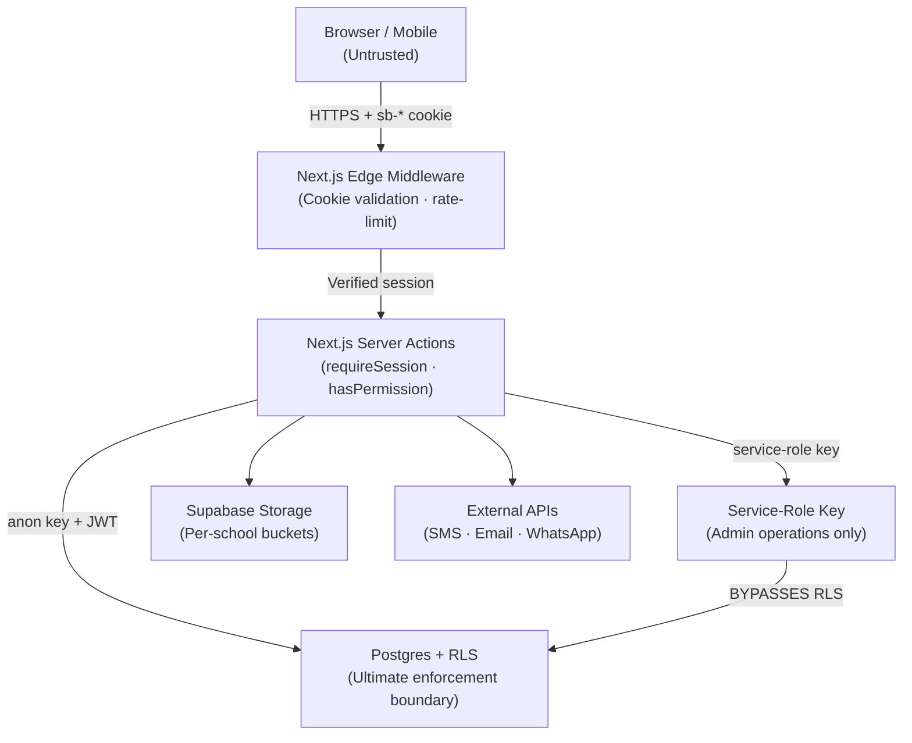
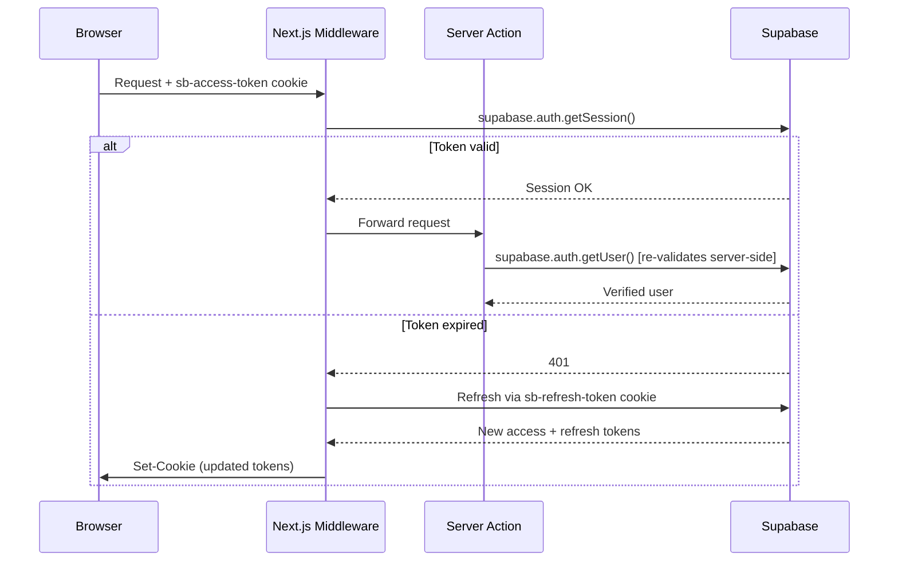

# 21 · Security Architecture — Madrasati ERP

> **Scope:** This document is the authoritative security reference for the Madrasati multi-tenant school ERP. It covers authentication, authorization, data protection, secrets management, audit trails, PII handling for minors, rate limiting, HTTP hardening, and disaster recovery. All table, column, and file references are real — check them against the corresponding migration or source file before changing any policy.

---

## Table of Contents

1. [Threat Model & Trust Boundaries](#1-threat-model--trust-boundaries)
2. [Authentication — JWT & Refresh Tokens](#2-authentication--jwt--refresh-tokens)
3. [Multi-Factor Authentication (MFA)](#3-multi-factor-authentication-mfa)
4. [Row Level Security — The Core Authorization Boundary](#4-row-level-security--the-core-authorization-boundary)
5. [Application-Layer RBAC](#5-application-layer-rbac)
6. [Service-Role Key Handling](#6-service-role-key-handling)
7. [Audit Logs](#7-audit-logs)
8. [Encryption at Rest and in Transit](#8-encryption-at-rest-and-in-transit)
9. [Secrets Management](#9-secrets-management)
10. [PII Handling for Minors (حماية بيانات القاصرين)](#10-pii-handling-for-minors)
11. [OWASP Top-10 Mitigations](#11-owasp-top-10-mitigations)
12. [Rate Limiting](#12-rate-limiting)
13. [HTTP Security Headers & CSP](#13-http-security-headers--csp)
14. [Backups & Disaster Recovery](#14-backups--disaster-recovery)
15. [Incident Response Checklist](#15-incident-response-checklist)
16. [Open Hardening Work Items](#16-open-hardening-work-items)

---

## 1. Threat Model & Trust Boundaries



**Trust zones:**

| Zone | Trust Level | Notes |
|---|---|---|
| Browser / mobile client | Untrusted | All secrets, RLS, and validation live server-side |
| Next.js server (Actions, Route Handlers) | Trusted | Runs in Node.js runtime; has access to env secrets |
| Supabase Postgres with RLS | Enforcing | Policies applied to every query regardless of caller |
| Service-role client (`createAdminClient`) | Privileged | Bypasses RLS — use only in narrow, server-only paths |
| Supabase edge functions | Trusted | Same runtime isolation as Next.js server |

**Primary adversaries:**
- Authenticated users attempting to access another tenant's data (cross-tenant leak).
- Authenticated users escalating privileges within their own tenant.
- Unauthenticated external actors attempting injection, enumeration, or brute-force.
- Insider threats from school staff with legitimate but over-broad access.
- Supply-chain compromise of npm packages or Supabase SDK.

---

## 2. Authentication — JWT & Refresh Tokens

### 2.1 Token Architecture

Madrasati delegates authentication to **Supabase Auth**, which issues standard HS256/RS256 JWTs. The flow for server-rendered requests is:



Key implementation details in `src/lib/supabase/server.ts`:

- `createClient()` uses `@supabase/ssr`'s `createServerClient`, which reads/writes the `sb-access-token` and `sb-refresh-token` cookies via Next.js `cookies()`.
- The `setAll` handler silently swallows errors when called from a Server Component (read-only cookie context); token refresh is handled by middleware instead.
- **`supabase.auth.getUser()` is always called server-side** in `getSessionProfile()` (`src/lib/auth.ts`, line 22). This re-validates the JWT signature against Supabase's JWKS rather than trusting the cookie value at face value. Never rely solely on `getSession()` for authorization decisions.

### 2.2 Session Profile & Per-Request Caching

`getSessionProfile()` is wrapped in React's `cache()` (line 19, `src/lib/auth.ts`), meaning the DB round-trip to `profiles` happens at most once per request regardless of how many layouts and pages call it. The resolved `SessionProfile` carries:

```typescript
type SessionProfile = {
  id: string;          // auth.users.id — UUID
  email: string | null;
  fullName: string | null;
  role: Role;          // from profiles.role
  schoolId: string | null; // profiles.school_id — tenant anchor
  avatarUrl: string | null;
};
```

`schoolId` is the multi-tenancy anchor. Every subsequent permission check passes it into `in_my_school(school_id)` at the Postgres level.

### 2.3 Password Policy

Supabase Auth enforces minimum password strength at the platform level. Additional requirements to configure in the Supabase dashboard:

- Minimum length: **10 characters**.
- Complexity: at least one uppercase, one digit, one symbol.
- `profiles.must_change_password` (boolean, `0001_core_and_rbac.sql` line 163) is set to `true` for provisioned accounts. The application must redirect to a forced password-change screen when this flag is set.
- Password reset uses Supabase's magic-link/OTP email flow; tokens are single-use and expire in 60 minutes.

### 2.4 Cookie Security Attributes

The Supabase SSR client inherits cookie options from the Next.js `cookies()` API. Ensure the following attributes are set either via middleware or `next.config`:

```
HttpOnly; Secure; SameSite=Lax; Path=/
```

`SameSite=Lax` is sufficient for same-site navigation. Do not downgrade to `None` unless cross-origin embedding is explicitly required.

---

## 3. Multi-Factor Authentication (MFA)

Supabase Auth supports **TOTP (RFC 6238)** as a second factor. Activation is per-user via the Supabase dashboard or the client SDK.

### 3.1 Enforcement Strategy

MFA should be **mandatory** for the following roles (مدير النظام، مدير المدرسة، مسؤول مالي):

| Role (`profiles.role`) | MFA Requirement |
|---|---|
| `super_admin` | Required — no exceptions |
| `principal` | Required |
| `finance_officer` | Required |
| `vice_principal` | Strongly recommended |
| `auditor` | Required (read-only but sees all audit data) |
| `registrar` | Recommended |
| All others | Optional; user-initiated |

### 3.2 Implementation Pattern

After `supabase.auth.getUser()` returns a valid user, check the AAL (Authenticator Assurance Level):

```typescript
const { data: { session } } = await supabase.auth.getSession();
if (highPrivilegeRoles.includes(profile.role) && session?.user.aal !== 'aal2') {
  redirect('/mfa-challenge');
}
```

The MFA challenge page calls `supabase.auth.mfa.challengeAndVerify()`. On success Supabase upgrades the session to `aal2` and reissues the JWT with the updated claim.

### 3.3 Recovery Codes

- Generate 8 single-use recovery codes on MFA enrollment.
- Store their hashes (not plaintext) — Supabase handles this internally.
- Display plaintext codes once at enrollment; do not store in application tables.

---

## 4. Row Level Security — The Core Authorization Boundary

RLS is the **primary** and **non-bypassable** authorization mechanism. The application layer (RBAC in TypeScript) is a UI convenience that reduces noise; **Postgres RLS is the enforcement boundary that matters**.

### 4.1 Helper Functions (defined in `0001_core_and_rbac.sql`)

All RLS policies are composed from four `SECURITY DEFINER` functions. Using `SECURITY DEFINER` with explicit `set search_path = public` prevents search-path injection.

| Function | Signature | Purpose |
|---|---|---|
| `current_school_id()` | `→ uuid` | Returns `profiles.school_id` for `auth.uid()` |
| `current_role()` | `→ text` | Returns `profiles.role` for `auth.uid()` |
| `is_super_admin()` | `→ boolean` | `role = 'super_admin'` check |
| `has_perm(perm text)` | `→ boolean` | Joins `role_permissions` to check if the caller's role grants `perm` (or the wildcard `*`) |
| `in_my_school(row_school uuid)` | `→ boolean` | `is_super_admin() OR row_school = current_school_id()` — tenant isolation |

### 4.2 Policy Pattern

All 30+ domain tables in `0005_rls_policies.sql` follow one uniform pattern generated by a `do $$ ... $$` block:

```sql
-- SELECT: caller is in the same school AND has the read permission
create policy students_sel on public.students
  for select to authenticated
  using (in_my_school(school_id) and has_perm('students:read'));

-- INSERT: same check against write permission
create policy students_ins on public.students
  for insert to authenticated
  with check (in_my_school(school_id) and has_perm('students:write'));

-- UPDATE/DELETE: symmetric
```

The two predicates in every policy:

1. **`in_my_school(school_id)`** — prevents any cross-tenant data access, regardless of permission.
2. **`has_perm('resource:action')`** — prevents privilege escalation within a tenant.

Both predicates must be true for a query to succeed. Either alone is insufficient.

### 4.3 Special-Case Policies

**`profiles` table** (`0005_rls_policies.sql`, lines 109–119):
```sql
-- A user can always see their own profile; admins see their school's users.
using (id = auth.uid()
       or public.is_super_admin()
       or (school_id = public.current_school_id() and public.has_perm('users:manage')));
```

**`notifications` table** — strictly user-owned: `using (user_id = auth.uid())`. No cross-user notification leakage is possible.

**`audit_logs` table** — insert is open to any authenticated same-school user (the application appends logs); SELECT requires `audit:read` permission (only `auditor`, `principal`, and `super_admin` hold this).

**Child tables without `school_id`** (`student_guardians`, `curriculum_units/lessons`, `observation_items`, `activity_participants`, `invoice_items`, `installments`) — scoped via an `EXISTS` subquery to the parent's `school_id`. Example:

```sql
create policy sg_all on public.student_guardians for all to authenticated
  using (exists (
    select 1 from public.students s
    where s.id = student_id
      and public.in_my_school(s.school_id)
      and public.has_perm('students:read')
  ));
```

### 4.4 What RLS Does NOT Cover

- **Storage objects** — Supabase Storage has its own RLS-like policies on the `storage.objects` table. Each school's files should be placed under a path prefix keyed by `school_id` (e.g., `{school_id}/logos/...`) and protected by a matching storage policy.
- **Supabase Realtime subscriptions** — Realtime also respects RLS as of Supabase v2, but confirm this is enabled for each publication.
- **Edge functions called with service-role key** — these bypass RLS entirely (see §6).

### 4.5 RLS Testing

Always test RLS policies with a non-admin JWT. Use `SET LOCAL ROLE authenticated; SET LOCAL "request.jwt.claims" = '{"sub":"<user-uuid>"}';` in a transaction to simulate a given user. Verify:

- Cross-tenant query returns 0 rows.
- A user without a permission gets 0 rows / insert denied.
- A `super_admin` can see all schools.

---

## 5. Application-Layer RBAC

`src/lib/rbac.ts` defines the canonical permission matrix mirrored in `role_permissions` table. It serves **UI purposes only** — showing/hiding buttons, navigation items, and form fields. **Never treat a positive `hasPermission()` result as sufficient authorization; the Postgres RLS check is the binding decision.**

```typescript
// Correct usage — UI guard only:
if (hasPermission(profile.role, 'students:delete')) {
  return <DeleteButton />;
}
```

The permission strings are `resource:action` pairs (e.g., `students:write`, `finance:read`). `super_admin` holds the `*` wildcard grant in `role_permissions`, which `has_perm()` in Postgres also recognizes (line 197, `0001_core_and_rbac.sql`).

### 5.1 Permission-to-Role Matrix (condensed)

| Permission | Roles with access |
|---|---|
| `students:delete` | `registrar`, `super_admin` |
| `students:import` | `registrar`, `super_admin` |
| `finance:write` | `finance_officer`, `super_admin` |
| `audit:read` | `auditor`, `principal`, `super_admin` |
| `users:manage` | `principal`, `super_admin` |
| `settings:write` | `principal`, `super_admin` |
| `grades:write` | `teacher`, `super_admin` |
| `behavior:write` | `teacher`, `vice_principal`, `principal`, `super_admin` |

Full matrix: `ROLE_PERMISSIONS` in `src/lib/rbac.ts`, lines 65–107.

---

## 6. Service-Role Key Handling

`createAdminClient()` in `src/lib/supabase/server.ts` (lines 40–47) creates a Supabase client with `SUPABASE_SERVICE_ROLE_KEY`. This key **bypasses all RLS policies** — it is equivalent to a Postgres superuser for data access.

### 6.1 Rules

1. **Never import `createAdminClient` into any file under `src/app/(app)/` that is or could become a Client Component.** The file must stay server-only (`'use server'` or a pure server module with no `'use client'` parent).
2. **Never expose the service-role key in environment variables prefixed `NEXT_PUBLIC_`.**  Only `NEXT_PUBLIC_SUPABASE_URL` and `NEXT_PUBLIC_SUPABASE_ANON_KEY` are safe to expose. `SUPABASE_SERVICE_ROLE_KEY` must remain server-only.
3. **Use it only for:**
   - Bulk student import (CSV processing in a server action or API route).
   - User provisioning / account creation that requires writing to `auth.users`.
   - Background jobs that run outside the context of an authenticated user.
4. **After every admin operation, log to `audit_logs`** with a clear `action` string (e.g., `"bulk_import"`, `"user_provisioned"`), including the `user_id` of the human who triggered the action.
5. Rotate the service-role key immediately if it appears in any log, error message, or client-side bundle. Supabase allows key rotation from the project settings.

### 6.2 Anon Key Exposure

`NEXT_PUBLIC_SUPABASE_ANON_KEY` is safe to expose — it carries no privilege beyond what the `authenticated` and `anon` Postgres roles are granted, and RLS limits those roles to rows they own or are permitted to see.

---

## 7. Audit Logs

### 7.1 Schema

Defined in `0004_admin_finance_audit.sql`, lines 113–125:

```sql
create table if not exists public.audit_logs (
  id         bigint generated always as identity primary key,
  school_id  uuid references public.schools(id) on delete set null,
  user_id    uuid references public.profiles(id) on delete set null,
  user_email text,                   -- denormalized; preserved after user deletion
  action     text not null,          -- e.g. "student.create", "grade.update"
  entity     text,                   -- table or domain object name
  entity_id  text,                   -- PK of the affected row
  meta       jsonb,                  -- diff, import stats, or other context
  created_at timestamptz not null default now()
);
create index audit_school_time_idx on public.audit_logs(school_id, created_at desc);
create index audit_entity_idx      on public.audit_logs(entity, entity_id);
```

`user_email` is denormalized intentionally: if a user's profile is later deleted, the audit record must still identify who performed the action.

`id` uses `bigint generated always as identity` (not UUID) for fast range scans in chronological queries.

### 7.2 Application-Layer Logging

`src/lib/audit.ts` provides `logAudit(action, entity?, entityId?, meta?)`. It resolves the current session profile, then inserts into `audit_logs`. It **never throws** — audit failure is non-blocking to the user operation. This is intentional: a broken audit connection must not block a teacher from saving attendance.

However, the DB-level trigger approach (see §7.3) provides the immutable safety net.

Conventions for the `action` string:

```
{entity}.{verb}       — e.g. student.create, grade.update, behavior.delete
bulk.{operation}      — e.g. bulk.import, bulk.promote
auth.{event}          — e.g. auth.login, auth.logout, auth.mfa_enroll
settings.{field}      — e.g. settings.theme_changed
```

### 7.3 Database-Trigger Audit (Immutable Layer)

For the most sensitive tables (`students`, `grades`, `finance`, `payments`), add a generic trigger that appends to `audit_logs` using `SECURITY DEFINER` so that even a service-role bypass is recorded:

```sql
create or replace function public.audit_trigger_fn()
returns trigger language plpgsql security definer set search_path = public as $$
begin
  insert into public.audit_logs(school_id, user_id, action, entity, entity_id, meta)
  values (
    coalesce(new.school_id, old.school_id),
    auth.uid(),
    tg_op || '.' || tg_table_name,
    tg_table_name,
    coalesce(new.id::text, old.id::text),
    jsonb_build_object('old', to_jsonb(old), 'new', to_jsonb(new))
  );
  return coalesce(new, old);
end; $$;
```

Attach to each sensitive table with `AFTER INSERT OR UPDATE OR DELETE`.

### 7.4 Tamper Resistance

Audit log RLS prevents deletion:

```sql
-- No DELETE policy on audit_logs is defined (0005_rls_policies.sql).
-- Without an explicit DELETE policy, Postgres denies all deletes
-- for the `authenticated` role under RLS.
```

The `auditor` role has `audit:read` only — it can read logs but holds no `audit:write` or delete grant. Even `principal` cannot delete audit rows. Only the service-role key can (database-level) — and doing so should be treated as a security incident.

---

## 8. Encryption at Rest and in Transit

### 8.1 In Transit

- All connections between the browser and Supabase/Next.js use **TLS 1.2+ (enforced TLS 1.3 preferred)**.
- Supabase terminates TLS at the edge; connections from Next.js server to Supabase use TLS over the public internet (connection string `postgres://...sslmode=require`).
- Internal Supabase connections (Postgres → PostgREST → API) are within Supabase's private network and encrypted by the platform.
- SMS/WhatsApp/email delivery via external providers (logged in `message_log`) must use HTTPS endpoints only. Never pass credentials in GET query strings.

### 8.2 At Rest

- Supabase encrypts all data at rest using AES-256 via the cloud provider's disk encryption (AWS KMS or equivalent depending on the region).
- **Application-level encryption** is not currently applied to individual columns. Fields warranting consideration:

  | Table | Column | Sensitivity | Recommendation |
  |---|---|---|---|
  | `students` | `civil_id` | High (national ID) | Encrypt or hash with salt |
  | `students` | `medical_notes` | High (health data) | Encrypt at application layer |
  | `staff` | `civil_id` | High | Encrypt or hash |
  | `payments` | `method` | Medium | Platform encryption sufficient |
  | `message_log` | `payload` | Medium (may contain PII) | Restrict retention period |

  For `civil_id` fields, consider storing a SHA-256 hash for lookup purposes and encrypting the raw value with a per-school key stored in a secrets manager. The `pgcrypto` extension (already enabled in `0001_core_and_rbac.sql`, line 8) provides `pgp_sym_encrypt` / `pgp_sym_decrypt`.

### 8.3 Storage Encryption

Files uploaded to Supabase Storage (logos, student photos, certificates) are stored in S3-compatible object storage with server-side encryption. Access is controlled by Storage RLS policies scoped by `school_id` path prefix.

---

## 9. Secrets Management

### 9.1 Environment Variables

| Variable | Scope | Secret? |
|---|---|---|
| `NEXT_PUBLIC_SUPABASE_URL` | Client + Server | No — safe to expose |
| `NEXT_PUBLIC_SUPABASE_ANON_KEY` | Client + Server | No — safe to expose |
| `SUPABASE_SERVICE_ROLE_KEY` | Server only | **Yes — never expose** |
| `NEXTAUTH_SECRET` (if added) | Server only | Yes |
| SMS/email provider API keys | Server only | Yes |

### 9.2 Vercel / Production

- Store all secret variables in **Vercel Environment Variables** (encrypted at rest, never in `.env` committed to git).
- Use **Environment Variable Groups** to separate production, preview, and development secrets.
- Never log environment variables. Add `SUPABASE_SERVICE_ROLE_KEY` to `.gitignore` patterns for any local `.env.local` check.

### 9.3 Local Development

`.env.local` is gitignored by Next.js by default. Confirm `.gitignore` contains:
```
.env*.local
.env.production
```

Use separate Supabase projects for development and production. Never use the production service-role key in development.

### 9.4 Secret Rotation

| Secret | Rotation trigger | Steps |
|---|---|---|
| `SUPABASE_SERVICE_ROLE_KEY` | Suspected exposure, quarterly | Supabase dashboard → Settings → API → Roll service key; update Vercel env var; redeploy |
| Supabase JWT secret | Suspected JWT forgery | Supabase dashboard → Auth Settings → rotate; all active sessions invalidated |
| External API keys (SMS, etc.) | Exposure or breach | Provider console → revoke + reissue; update Vercel; redeploy |

---

## 10. PII Handling for Minors

Madrasati stores personal data for school students, the majority of whom are minors (قاصرون). This creates obligations under privacy regulations (PDPL — Saudi Personal Data Protection Law, and analogous Gulf-region frameworks).

### 10.1 PII Inventory

| Table | Columns containing PII | Data subject | Minor? |
|---|---|---|---|
| `students` | `name_ar`, `name_en`, `civil_id`, `dob`, `nationality`, `religion`, `medical_notes`, `photo_url`, `address`, `emergency_contact`, `father_name`, `mother_name`, `guardian_name`, `guardian_mobile`, `guardian_email` | Student | Yes |
| `guardians` | `name`, `mobile`, `email`, `occupation` | Parent/Guardian | No |
| `staff` | `name_ar`, `name_en`, `civil_id`, `mobile`, `email`, `qualifications` | Employee | No |
| `profiles` | `email`, `full_name`, `avatar_url` | All users | Partial |
| `behavior_records` | `description`, `action_taken` | Student | Yes |
| `quran_memorization` | `score`, `tajweed_score` | Student | Yes |
| `grades` | `score` | Student | Yes |
| `attendance_records` | `status`, `note` | Student | Yes |
| `message_log` | `recipient`, `payload` | Mixed | Partial |

### 10.2 Controls for Minor PII

1. **Access minimization:** Student PII is accessible only to roles with `students:read`. Parents (`ولي أمر`) see only their own children's records — the parent portal must filter by `student_guardians.guardian_id` matching the authenticated profile's guardian record.

2. **Photo storage:** `students.photo_url` references Supabase Storage. The Storage bucket must use a signed URL with a short expiry (e.g., 1 hour) rather than public URLs. Never store photos in a publicly readable bucket.

3. **`medical_notes` column:** This is special-category health data. Access should be further restricted beyond `students:read` — consider a dedicated `medical:read` permission or encrypting the column. No role other than `principal`, `vice_principal`, and the school nurse (if modeled) should access this field.

4. **Data retention:** Define a retention policy per data class:
   - Active enrollment data: retained for the duration of enrollment + 5 years.
   - Grades and attendance: 7 years (regulatory compliance).
   - Behavior records: 3 years after graduation/withdrawal.
   - Audit logs: 3 years minimum.
   - `message_log` payload: 1 year (contains guardian contact data).

5. **Right to erasure:** When a student is archived (`students.status = 'archived'`), PII fields (`civil_id`, `medical_notes`, `photo_url`, `address`, `emergency_contact`) should be nulled or pseudonymized. Grades and attendance are retained in anonymized form (student ID replaced with a one-way hash).

6. **Guardian consent:** The registration workflow must capture and record guardian consent for data processing. Consider a `consents` table:
   ```sql
   create table public.consents (
     id         uuid primary key default gen_random_uuid(),
     school_id  uuid not null references public.schools(id),
     student_id uuid not null references public.students(id),
     guardian_id uuid not null references public.guardians(id),
     purpose    text not null,   -- 'data_processing' | 'photo_publication' | 'communications'
     granted    boolean not null,
     granted_at timestamptz not null default now(),
     ip_address inet,
     unique (student_id, guardian_id, purpose)
   );
   ```

7. **No data beyond school use:** Student data must not be shared with third parties (analytics platforms, advertising networks). Any external service integration (SMS, email) must receive only the minimum necessary data (phone number or email, not full student profiles).

### 10.3 Staff Civil IDs

`staff.civil_id` is a national identifier. Store it encrypted (AES-256 via `pgcrypto`) and expose it only to HR roles (`users:manage` permission or a dedicated `hr:read` permission to be added).

---

## 11. OWASP Top-10 Mitigations

### A01 — Broken Access Control

**Mitigation:** Postgres RLS is the enforcement layer (§4). All 30+ tables have explicit policies. `requireSession()` in `src/lib/auth.ts` redirects unauthenticated requests before they reach any data. Server Actions validate permissions before mutations.

**Gap to address:** Ensure every new table added to the schema gets an RLS policy before going to production. Add a CI check that queries `pg_class` for tables in the `public` schema that have `relrowsecurity = false`.

### A02 — Cryptographic Failures

**Mitigation:** TLS enforced everywhere (§8.1). Supabase platform encryption at rest (§8.2). Passwords handled by Supabase Auth (bcrypt). No plaintext secrets in code or logs.

**Gap:** `civil_id` columns in `students` and `staff` are stored in plaintext — see §8.2 recommendation for column-level encryption.

### A03 — Injection

**Mitigation:** All queries use the Supabase PostgREST client with parameterized queries. TypeScript types from `src/lib/database.types.ts` enforce column names at compile time. No raw SQL string concatenation in application code. RLS functions use `SECURITY DEFINER` with fixed `search_path` to prevent search-path injection.

**Remaining surface:** `meta jsonb` column in `audit_logs` and `layout jsonb` in `report_templates` accept arbitrary JSON. Validate and sanitize these with Zod schemas before writing.

### A04 — Insecure Design

**Mitigation:** Multi-tenant design with `school_id` on every domain table. Permission matrix defined once (`src/lib/rbac.ts`) and mirrored in DB. Defense in depth: UI layer + server action layer + RLS layer.

### A05 — Security Misconfiguration

**Mitigation:** Service-role key is server-only. Anon key has no privilege beyond RLS-permitted rows. NEXT_PUBLIC_ prefix discipline enforced by convention (§6.2). HTTP security headers via `next.config` (§13).

**Action required:** Disable Supabase's email confirmation bypass in production. Ensure `auth.email_confirm = true` in Supabase project settings.

### A06 — Vulnerable and Outdated Components

**Mitigation:** Use `npm audit` in CI. Pin `@supabase/ssr` and `@supabase/supabase-js` to minor versions and review changelogs on updates. Enable Dependabot or Renovate for automated PR creation on package updates.

### A07 — Identification and Authentication Failures

**Mitigation:** Supabase Auth handles session issuance. `getUser()` re-validates JWT server-side on every request (§2.1). MFA available and mandatory for high-privilege roles (§3). `must_change_password` flag prevents indefinite use of provisioned passwords.

**Gap:** Implement account lockout: after 5 failed login attempts within 10 minutes, temporarily disable the account. Supabase does not do this natively — implement at the middleware layer using a rate-limit counter in Redis or Supabase KV.

### A08 — Software and Data Integrity Failures

**Mitigation:** Zod validation on all form inputs (`react-hook-form` + Zod schemas in `src/features/*/schema.ts`). Server Actions re-validate input independently of client-side validation.

### A09 — Security Logging and Monitoring Failures

**Mitigation:** `audit_logs` table captures all application-intent actions (§7). DB-trigger audit recommended for immutable record (§7.3). `audit_school_time_idx` and `audit_entity_idx` support efficient querying.

**Gap:** Set up alerting on anomalous audit patterns (e.g., more than 100 `students:read` actions in 1 minute from one user, or `students:delete` from an unexpected role).

### A10 — Server-Side Request Forgery (SSRF)

**Mitigation:** The application does not make arbitrary outbound HTTP requests based on user-supplied URLs. Storage uploads go to Supabase Storage directly. If report PDF generation calls an external renderer, validate that the renderer URL is an internal or trusted service, not user-controlled.

---

## 12. Rate Limiting

### 12.1 Supabase Built-in Limits

Supabase Auth enforces rate limits on authentication endpoints:
- `POST /auth/v1/token`: 30 requests / minute per IP.
- `POST /auth/v1/recover` (password reset): 5 requests / minute per email.
- `POST /auth/v1/otp`: 5 requests / minute per email.

These are applied at the Supabase edge and cannot be disabled.

### 12.2 Application-Layer Rate Limiting

For Next.js server actions and API routes, implement rate limiting using `next-rate-limit` or an edge middleware with Upstash Redis:

```typescript
// middleware.ts (sketch)
import { Ratelimit } from '@upstash/ratelimit';
import { Redis } from '@upstash/redis';

const ratelimit = new Ratelimit({
  redis: Redis.fromEnv(),
  limiter: Ratelimit.slidingWindow(60, '1 m'),
});

export async function middleware(req: NextRequest) {
  const ip = req.headers.get('x-forwarded-for') ?? '127.0.0.1';
  const { success } = await ratelimit.limit(ip);
  if (!success) return new NextResponse('Too Many Requests', { status: 429 });
}
```

Apply per-endpoint limits for sensitive operations:

| Endpoint / Action | Limit | Window |
|---|---|---|
| Login | 10 attempts | 15 minutes per IP |
| Password reset request | 3 | 30 minutes per email |
| Bulk student import | 5 uploads | 1 hour per school |
| Grade submission | 200 | 1 minute per user |
| Report generation (PDF) | 10 | 1 minute per user |
| API read endpoints | 300 | 1 minute per user |

### 12.3 Enumeration Protection

- Auth error messages must not distinguish between "user not found" and "wrong password". Supabase's default error messages already comply.
- Student search endpoints (`students:read`) should require at least 2 characters before returning results to prevent full-table enumeration.
- Ministry number (`students.ministry_no`) and civil ID (`students.civil_id`) lookups must require `students:read` permission (enforced by RLS) and should be rate-limited separately.

---

## 13. HTTP Security Headers & CSP

Configure in `next.config.ts` using `headers()`:

```typescript
const securityHeaders = [
  {
    key: 'Strict-Transport-Security',
    value: 'max-age=63072000; includeSubDomains; preload',
  },
  {
    key: 'X-Frame-Options',
    value: 'DENY',
  },
  {
    key: 'X-Content-Type-Options',
    value: 'nosniff',
  },
  {
    key: 'Referrer-Policy',
    value: 'strict-origin-when-cross-origin',
  },
  {
    key: 'Permissions-Policy',
    value: 'camera=(), microphone=(), geolocation=()',
  },
  {
    key: 'Content-Security-Policy',
    value: [
      "default-src 'self'",
      // Supabase API and Auth
      `connect-src 'self' https://*.supabase.co wss://*.supabase.co`,
      // Next.js hot reload (dev only — strip in production)
      process.env.NODE_ENV === 'development' ? "script-src 'self' 'unsafe-eval'" : "script-src 'self'",
      "style-src 'self' 'unsafe-inline'",   // Tailwind requires inline styles
      "img-src 'self' data: blob: https://*.supabase.co",
      "font-src 'self'",
      "frame-ancestors 'none'",
      "base-uri 'self'",
      "form-action 'self'",
      "object-src 'none'",
    ].join('; '),
  },
];

module.exports = {
  async headers() {
    return [{ source: '/(.*)', headers: securityHeaders }];
  },
};
```

### 13.1 CSP Notes

- `'unsafe-inline'` for styles is required by Tailwind CSS and shadcn. Consider migrating to CSS Modules or a nonce-based approach for inline styles if a stricter CSP is needed.
- `'unsafe-eval'` must be removed in production. Next.js 15 does not require it for production builds.
- Supabase Realtime WebSocket connections (`wss://*.supabase.co`) must be in `connect-src`.
- If recharts or other charting libraries use inline SVG styles, add `img-src data:` (already included above).

### 13.2 Arabic / RTL Considerations

The `dir="rtl"` attribute on the `<html>` element does not introduce security implications beyond ensuring CSS logical properties (already used) are correct. Font loading for Arabic typefaces (e.g., Noto Sans Arabic) should come from `self` or a whitelisted CDN added to `font-src`.

---

## 14. Backups & Disaster Recovery

### 14.1 Supabase Automated Backups

Supabase Pro and above includes:
- **Daily automated backups** — retained for 7 days (Pro) or 30 days (Team/Enterprise).
- **Point-in-time recovery (PITR)** — available on Pro and above; allows restore to any second within the retention window.
- Backups are stored in a separate S3 bucket from the primary data, encrypted at rest.

**Action required:** Enable PITR for the production Supabase project. Verify backup status monthly via the Supabase dashboard (Database → Backups).

### 14.2 Backup Strategy

| Type | Frequency | Retention | Storage |
|---|---|---|---|
| Supabase automated (schema + data) | Daily | 30 days | Supabase-managed S3 |
| PITR transaction log | Continuous | 7 days | Supabase-managed |
| Manual pg_dump (pre-migration) | Before each migration | 90 days | Separate S3 bucket or Backblaze |
| Storage bucket snapshot (files) | Weekly | 30 days | Mirrored S3 bucket |

For manual dumps before running a migration:

```bash
pg_dump \
  --dbname="$DATABASE_URL" \
  --format=custom \
  --no-owner \
  --no-acl \
  --file="backup_$(date +%Y%m%d_%H%M%S).dump"
```

### 14.3 Recovery Time & Point Objectives

| Scenario | RTO Target | RPO Target |
|---|---|---|
| Accidental data deletion (single table) | < 2 hours | < 1 day |
| Ransomware / full data loss | < 8 hours | < 1 day |
| Region outage | < 4 hours | < 1 hour (with PITR) |

### 14.4 Disaster Recovery Runbook

1. **Identify the failure scope** (single table, schema, full database, or storage).
2. **For single-table accidental deletion:**
   - Use Supabase dashboard → Backups → restore to a new database branch.
   - Export the affected table from the branch.
   - Import into production with `COPY` or `INSERT ON CONFLICT DO NOTHING`.
3. **For full database restore:**
   - Supabase dashboard → Backups → select the closest clean backup → Restore.
   - Update the `DATABASE_URL` in Vercel if the connection string changes.
   - Re-run any migrations applied after the backup timestamp.
4. **Notify all active schools** (via the emergency contact list) of the outage and expected restore time.
5. **Post-incident:** Add audit log entries documenting the restore event, including the backup timestamp used and data loss window.

### 14.5 Multi-Region Considerations

Supabase projects are single-region. For schools requiring regional data residency (e.g., Gulf data must stay within Gulf), select the appropriate Supabase region at project creation. Cross-region replication is not available on standard plans; negotiate an enterprise plan if multi-region failover is required.

---

## 15. Incident Response Checklist

### Suspected Data Breach

- [ ] Immediately rotate `SUPABASE_SERVICE_ROLE_KEY` and all external API keys.
- [ ] Revoke all active Supabase sessions: Supabase Auth → Users → bulk invalidate, or rotate the JWT secret.
- [ ] Preserve `audit_logs` snapshot before any cleanup operations (export to cold storage).
- [ ] Identify affected `school_id` values and the scope of exposed tables.
- [ ] Notify the affected school's principal and data protection officer within 72 hours (PDPL requirement).
- [ ] If minor PII is confirmed exposed, escalate to regulatory notification.
- [ ] Engage Supabase support for platform-level forensics if the breach originated in infrastructure.

### Suspected JWT Forgery

- [ ] Rotate Supabase JWT secret (Auth Settings → JWT Secret) — invalidates all active sessions.
- [ ] Review `audit_logs` for anomalous `user_id` values or actions from unexpected `school_id`.
- [ ] Check `profiles` table for unexpected rows with elevated roles.

### Insider Threat (Staff Abuse of Access)

- [ ] Query `audit_logs` for the user: `WHERE user_id = '<id>' ORDER BY created_at DESC`.
- [ ] Disable the user's profile immediately: set `profiles.role = 'student'` (zero permissions) and trigger a password reset.
- [ ] If `users:manage` was used to create unauthorized accounts, audit `profiles` for new rows created during the suspect window.

---

## 16. Open Hardening Work Items

The following items represent known gaps to be addressed before production launch. They are tracked here for prioritization:

| Priority | Item | Reference |
|---|---|---|
| Critical | Encrypt `students.civil_id` and `staff.civil_id` at column level | §8.2, §10.3 |
| Critical | Enforce MFA programmatically for `super_admin`, `principal`, `finance_officer`, `auditor` | §3.2 |
| High | Add DB-trigger audit on `students`, `grades`, `payments` tables | §7.3 |
| High | Restrict `students.medical_notes` access beyond `students:read` | §10.2 |
| High | Implement guardian consent table and registration workflow | §10.2 |
| High | Rate-limit login and sensitive mutations via Upstash Redis middleware | §12.2 |
| Medium | Add account lockout after 5 failed logins | §11 A07 |
| Medium | CI check: alert on any `public` schema table missing RLS | §11 A01 |
| Medium | Configure signed-URL expiry for `students.photo_url` in Storage policies | §10.2 |
| Medium | Define and enforce data retention / erasure policy per data class | §10.2 |
| Low | Migrate to nonce-based CSP (remove `'unsafe-inline'` for scripts) | §13.1 |
| Low | Add Supabase Realtime RLS publication confirmation | §4.4 |

---

*Last updated: 2026-06-17. Maintainer: System Architect. Review cycle: quarterly or after any significant schema or infrastructure change.*
